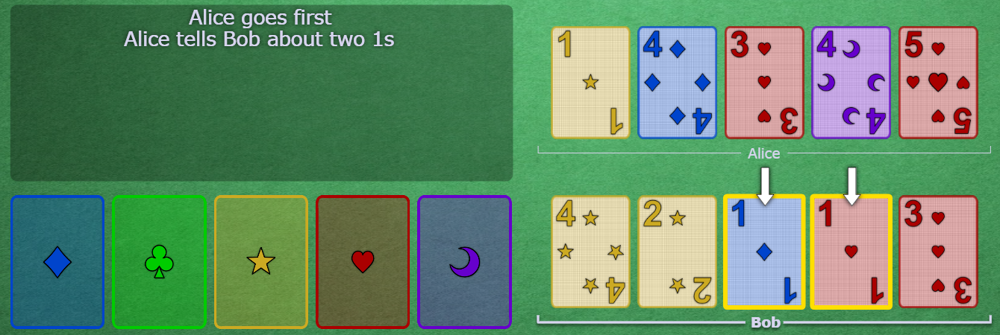
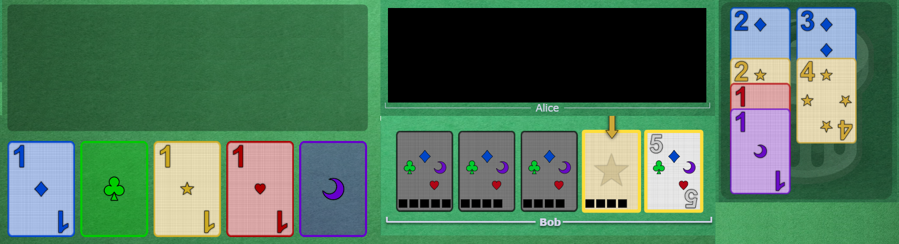
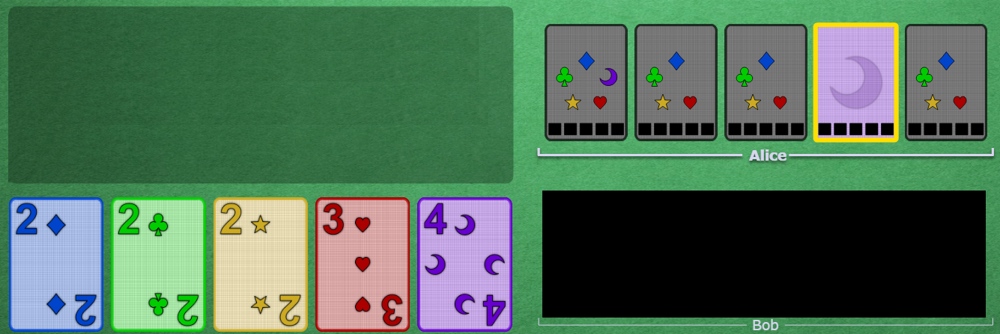
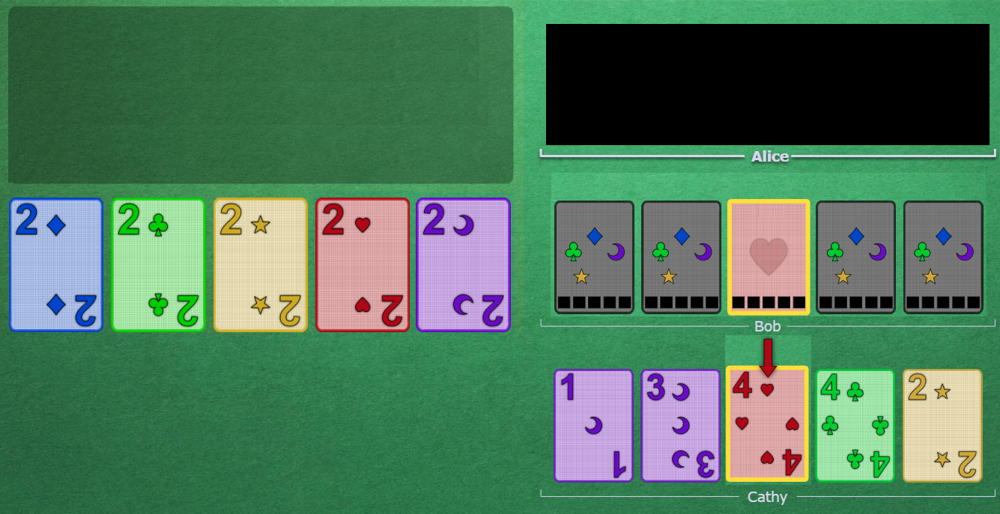
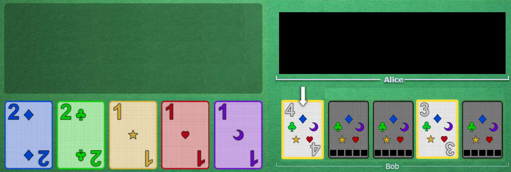
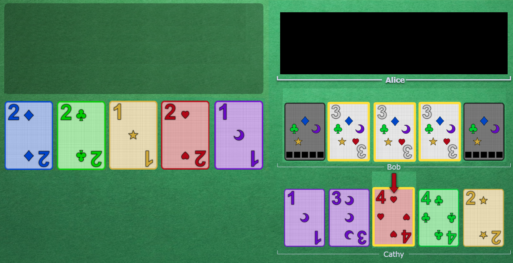
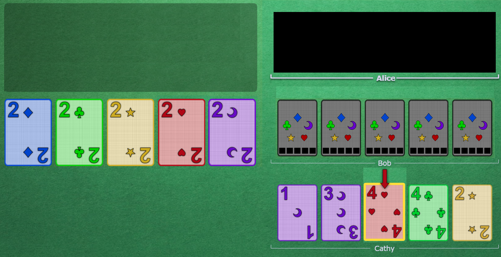

# Beginner's Guide for the Hyphen-ated Group

* Are you looking to start playing Hanabi with the Hyphen-ated group? Fantastic - we are always looking to welcome new players. Take 15 minutes and go over this guide so that you can get up to speed with the basics.
* Alternatively, are you looking to learn some solid fundamental strategies to use to play Hanabi with your own group of friends? Feel free to adopt these strategies.
* Is a 15 minute briefing really necessary? Well, yes and no. If you try to play with our group and don't understand what basic clues mean, it is going to be analogous to a group of people trying to find each other in a dark room by running around with their arms flailing.
* This guide assumes that you are already familiar with the basic rules of Hanabi. If you need to brush up on them, see [this Pastebin written by Tricky](http://pastebin.com/6brGz2J4) or [watch my video explanation](https://www.youtube.com/watch?v=jR9i1qCbHXQ).

 

## Table of Contents

1. [Card Layout](#card-layout)
1. [The Basics](#the-basics)
2. [Play Clues & Save Clues](#play-clues--save-clues)
3. [The Three Main Principles](#the-three-main-principles)
4. [Miscellaneous](#miscellaneous)
5. [Special Moves](#special-moves)
6. [How to Join Games](#how-to-join-games)

 

## Card Layout

In this guide, there will be some screenshots to show off the concepts introduced. Here's an example of a screenshot using the "BGA-style" card layout:

* The five **play stacks** are on the left.
* The **player hands** are on the right.
* Alice is always player 1. (She will always go first.)
* Bob is always player 2. (He will always go second.)
* Cards are drawn and added to the left side to each hand. Thus, Alice's newest card is the blue 1 and Bob's newest card is the red 1.
* Conversely, the oldest card is the right-most card. Alice's oldest card is the blue 5 and Bob's oldest card is the red 5.
* A card's *slot* referes to its position in the hand. In the above screenshot, the blue 1 is on slot 1, the blue 2 is on slot 2, the blue 3 is on slot 3, and so forth. The red 1 is on slot 1, the red 2 is on slot 2, the red 3 is on slot 3, and so forth.

* When a card has one or more clues on it, a yellow border will appear around the card. The blue 1 and the red 1 will now have permanent yellow borders around them (until they are played or discarded).
* The arrows indicate the specific cards that are "touched" by the last clue that was given.

 

## The Basics

### The Chop

* The right-most unclued card is called the "chop" card. (This is a metaphor of a card being "on the chopping block".)
* When a player needs to discard, they should discard their chop card.
* In this way, everyone discards in a predicable way.

* In the above screenshot:
  * Alice's chop card is the red 5 (on slot 5).
  * Bob's chop card is the red 3 (on slot 5).

* In the above screenshot:
  * Alice's chop card is the blue 4 (on slot 4).
  * Bob's chop card is the blue 4 (on slot 2).

 

### Single Card Focus

* In some Hanabi groups, when a bunch of cards are clued, there is no consistent definition of what you should do.
* In our group, we don't want there to be any guesswork - we all agree on a system that specifies **exactly** what a clue means so that everyone is always on the same page.

#### The System

* If two or more cards are touched, then **the clue is only focused on a single card**. (Meaning that it is either a *Play Clue* or a *Save Clue* on the focused card only.)
* **Nothing is implied about the non-focused cards** (beyond that they will be useful at some point later on, which follows from *Good Touch Principle*). 
* So, how do you know which card is focused?
  * The focus is always on the card that did not have any clues on it already. (We refer to this as the "brand new card introduced".)
  * If there are multiple "new" cards, then:
    * If the chop card is a "new" card, then the **focus is on the chop**.
    * Otherwise, the **focus is on the left-most card**.

#### Example 1 - A Basic Clue

* If only one card is touched by a clue, then the clue is (obviously) talking about that one card.
* In the above screenshot, Alice clues blue to Bob.
* Thus, the focus of the clue is blue 1. This is a *Play Clue* on blue 1.

#### Example 2 - Left-most Focus

* In the above screenshot, Alice clues blue to Bob.
* Before this clue, Bob's hand was completely unclued. So, with this clue, **two new cards were introduced** - the blue card on slot 2 and the blue card on slot 4.
* Bob knows that in this situation, the focus of the clue is the left-most of the two new cards. Thus, similar to the last example, this is a *Play Clue* on blue 1.
* From *Good Touch Principle*, Bob can reason that his other blue card on slot 4 is either blue 2, blue 3, blue 4, or blue 5. He will hold on to the card for later.

#### Example 3 - Chop Focus

* In the above screenshot, Alice clues purple to Bob (on the first turn of the game).
* Before this clue, Bob's hand was completely unclued. So, with this clue, **three new cards were introduced** - slot 1, slot 2, and slot 5.
* Before this clue, Bob's chop was slot 5. So, since the clue touched his chop and *Chop Focus* has priority, this must be a *Chop Focus Play Clue* on purple 1. Bob should play the slot 5 card as purple 1.

 

## Play Clues & Save Clues

* A clue can either be:
  * a *Save Clue* (meaning to save the focused card for later)
  * a *Play Clue* (meaning to play the focused card)
* Let's go through each in turn.

 

### Save Clues

* *Save Clues* **can only be given to cards on chop**. You can't give a *Save Clue* otherwise!
* The team **must save** the following cards (and is **only allowed** to save the following cards):
  * All 5's
  * Unique 2's (meaning that only one copy is currently visible)
  * Critical cards (meaning that the other copy is discarded)
* Sometimes, a *Chop Focus* clue could be either a *Save Clue* or a *Play Clue*. When this happens, the receiving player must consider both possibilities and hold on to the card until they know for sure.
* The three kinds of *Save Clues* are listed below.

#### 5 Saves

* Since there is only one copy of each 5, all of the 5's need to be saved so that they won't be discarded.
* In the above screenshot:
  * Alice clues Bob number 5, which touches a single 5 on slot 5.
  * Before this clue, Bob did not have any clued cards in his hand.
  * Since the clue was focused on his chop, Bob knows that this must be a *5 Save* on the 5. It can be any 5 in the game.
* 5's must be saved with a number clue instead of a color clue. (Otherwise, it will look like a *Play Clue*!)

#### 2 Saves

* Even though there are two copies of each 2, we agree that they are so important that we must save them in a manner similar to 5's.
* In the above screenshot:
  * Alice clues Bob number 2, which touches a 2 on slot 3 and slot 5.
  * Before this clue, Bob did not have any clued cards in his hand.
  * Since the clue was focused on his chop, Bob knows that this must be a *2 Save* on the 2. It can be any 2 in the game.
* Similar to 5's, 2's must be saved with a number clue instead of a color clue.
* You can think of the *2 Save* as a last resort to save a 2. Thus, players are not allowed to perform a *2 Save* on a 2 if that same 2 is visible in someone else's hand (because the team does not actually need to save that 2 quite yet - they can *2 Save* it when the other copy reaches the chop).

##### Critical Saves

* For the same reason that 5's need to be saved, critical cards also need to be saved. (Critical cards are defined as cards that have the other copy discarded.)
* Players can choose to save critical cards with either a color clue or a number clue.
* In the above screenshot:
  * The current discard pile is shown to the right of the hands.
  * Alice clues Bob yellow, which touches a card on slot 4.
  * Before this clue, the only clued card in Bob's hand was the 5 on slot 5.
  * This could be a *Play Clue* on the yellow 2. However, since the clue was focused on his chop, this could also be a *Save Clue*.
  * Bob looks through the discard pile and finds that there is a yellow 4 there. Thus, this could be a *Save Clue* on the yellow 4. So, Bob knows that for now, he has to hold on to the card.
  * Bob marks the card as either a yellow 2 or a yellow 4, so that he can keep track of it for later. Then, he discards.

 

### Play Clues

* We are very strict with what we clue - we don't just randomly clue cards in the hand.
* So if a card is touched as the focus of the clue and it is not on chop, then that card must be playable!
* Alternatively, if a chop-focus *Save Clue* is given to a card that does not meet the above saving criteria, then it is not a *Save Clue* at all, and must be a *Play Clue*!

#### Delayed Play Clues

* When you receive a *Play Clue*, it does not necessarily mean that you can play that card immediately. Look around the table for **other already clued cards that might be related** to the card that you got the *Play Clue* on. If there are any, you must wait for them to be played.
* For example, if Alice was clued about a bunch of 1's and then Bob is given a *Play Clue* on an unknown 2, **Bob must wait for Alice to play all of her 1's first** before playing the 2.
* In other words, treat all *Play Clues* as potential *Delayed Play Clues*.

 

### Clue Logic Flowchart

* For reference, this is [a basic logic flowchart](https://raw.githubusercontent.com/Zamiell/hanabi-conventions/master/img/flowcharts/clue_flowchart.png) that describes the general interpretation of a clue.

 

## The Three Main Principles

* So far, we have covered:
  * how to discard (e.g. the chop)
  * how to tell what the focus of a clue is (e.g. *Chop Focus* or left-most)
  * how to tell what a clue means (e.g. a *Play Clue* or a *Save Clue*)
* But that doesn't really tell you much about the *strategy* involved to play the game. How do players find the best move for a certain situation?
* Hanabi is very complicated, so it is impossible to write a guide on how to best solve each individual situation. (And that's a good thing, because the game continues to be interesting to play, even after thousands of games!)
* Luckily, beginners can focus on internalizing just **three main principles**. Nearly all of the special moves and strategies naturally flow from these principles.

### 1 - Good Touch Principle

* When a clue is given, the cards that are "touched" by the clue are highlighted by arrows.
* When cluing cards, we follow *Good Touch Principle* - this means that **we only want to touch cards that will eventually be played**. So, if someone touches a card that is already played on the stacks or a card that is already clued in someone else's hand, then that would be a *Bad Touch*.
* *Good Touch Principle* is a powerful building block for logic and reasoning. If everyone only touches good cards, then players can greatly narrow down the possibilities for all of the clued cards in their hand!

* In the above screenshot:
  * Alice wants to give a *Play Clue* to the yellow 2.
  * Alice has a choice between cluing yellow and cluing number 2.
  * If she clues number 2, it would uniquely touch the yellow 2 on slot 1.
  * If she clues yellow, then it would touch slot 1, slot 2, and slot 3. This clue would violate *Good Touch Principle*, as the yellow 4's would be duplicated in Bob's hand.
  * Thus, the correct clue for Alice to give is number 2.

* In the above screenshot:
  * Alice has an unknown purple card in her hand.
  * Bob's hand is not important, so it is blacked out.
  * Alice can see that the purple stack is played up to purple 4. The only other useful purple card left is the purple 5.
  * Alice also knows that according to *Good Touch Principle*, every clued card will be eventually be played.
  * Thus, by process of elimination, she can reason that the unknown purple card in her hand must be purple 5, and she can immediately play it.

### 2 - Save Principle

* The *Save Clue* section above explains that the team must save certain types of cards.
* But above and beyond this, we also agree that we must "get" all of the playable cards. In order words, **we don't let each other discard playable cards!**
* So, the **full list** of what the team **must not let get discarded** is the following:
  * All 5's
  * Unique 2's (meaning that only one copy is currently visible)
  * Critical cards (meaning that the other copy is discarded)
  * Unique playable cards (meaning that only one copy is currently visible)
* This is called *Save Principle* and **it is the most important principle of them all**. You are allowed to **break any other principle or rule** in order to prevent a card in this list from being discarded! In fact, often times you will have to violate *Good Touch Principle* in order to save a specific card, and this is okay.

### 3 - Minimum Clue Value Principle (and *Tempo Clues*)

* Usually, players only discard when they have nothing to do. But don't take this the wrong way.
* In order to avoid discarding, you are *not allowed* to just clue any card. You are only allowed to give *Save Clues* to the specific cards outlined in the *Save Principle* section. And you are only allowed to give *Play Clues* to actual playable cards.
* Furthermore, you might be tempted to **clue a card again that already has a clue on it** in order to make it play right now. We call this kind of clue a *Tempo Clue*.
* *Tempo Clues* are quite inefficient (as the team is using two clues to get one card). Since *Tempo Clues* are so bad, we say that players are **only allowed to perform *Tempo Clues* in certain special situations** (like when a player is forced to give a clue).
* So, if your only option is between giving a *Tempo Clue* and discarding, then **you must discard**.
* We formally express this concept as *Minimum Clue Value Principle*: **all clues must get at least one brand new card saved or played**. In other words, as a group, we hold ourselves to a high standard, and we don't give inefficient clues.

 

## Miscellaneous

### The Early Game

* We define the *Early Game* as the period of time before someone discards for the first time. When they do, they initiate the *Mid-Game*.
* The general goal of the *Early Game* is to extend it for as long as reasonably possible. Thus, everyone agrees that they **must** "extinguish" all of the available *Play Clues* and *Save Clues* before discarding. (There are no cards in the discard pile yet, but *Save Clues* still need to be given to all of the 5's on chop and all of the 2's on chop that are not present in someone else's hand.)
* In the *Early Game*, you can do a special move called a *5 Stall*; see below.

### The 5 Stall (Cluing Off-Chop 5's)

* Normally, you are only allowed to give a *Save Clue* to a 5 if it is on chop. So if you use number 5 to clue a 5 that is **not** on chop, then it will typically look like a *Play Clue* on that 5 (or some other advanced strategy).
* As a special rule, in the *Early Game*, you **are** allowed to clue number 5 as a *Save Clue* to off-chop 5's. Doing this is just interpreted as a "stall" clue and that you are trying to extend the *Early Game* for a little bit longer.
* However, you are **only** allowed to do this if there is nothing else to do, meaning that all of the "normal" *Play Clues* and *Save Clues* have been extinguished.
* Normally, a *5 Stall* is only done in the *Early Game*. However, you might see someone give a *5 Stall* in the *Mid-Game* if they are in a special situation where they are not allowed to discard.

### Other General Strategy

* In general, the first thing you should do on your turn is to **look at the chop cards of everyone on the team**. Are there any cards on chop that need to be saved (or *Play Clued*)? If so, do you have to do it, or can someone else do it?
  * If no-one else can do it, then you need to give the *Save Clue* (or *Play Clue*), even if you have a card to play.
  * If someone else can do it, would it be better for you to save the card, or for them? If they have a card to play and you do not have a card to play, then it is better teamwork for you to save the card.
* In general, ***Play Clues* should be given over *Save Clues***. There's no need to give a *Save Clue* to someone if you can preoccupy them with playing a card!
* In general, if you have a choice, **color clues should be given over number clues**. Color clues are usually more specific, telling the player the exact identity of the card. (But of course, don't be afraid to use number clues if it helps to "fill in" other cards in the hand.)
* In general, **don't be afraid of discarding**. If you discard something important, it won't be your fault - it is your teammates' responsibility to save any important cards.

 

## Special Moves

* Hanabi is a game of trying to be as efficient as possible, since there is a limited number of clues.
* Most of the time, players will use one clue to get one card played. But is it possible to do better?
* There are two special "moves" that players can do in order to get multiple cards played by only using 1 clue, which is very efficient.

 

### The Prompt

* In the above screenshot:
  * Alice's hand is blacked out because it does not matter.
  * Bob has a clued red card in his hand, but the full identity of the card is still unknown to him. In this situation, he knows he is supposed to just keep the card in his hand and continue to discard unclued cards.
  * Alice clues red to Cathy, which touches a red 4. This must be a *Play Clue* on the red 4.
  * Bob sees that red 4 is currently unplayable, since the red 3 is not played yet. Thus, this clue implies that someone has the red 3.
  * Bob does not see a red 3 clued in anyone else's hand. So, Alice must be promising him that his unknown red card is red 3 and that he can safely play it.
* In this way, clues can deliver messages to an entirely different player than the person who actually received the clue.
* We call this move a *Prompt* because it is "prompting" a player to play a card that they would have otherwise held on to for a while longer.

* If a player is *Prompted* and there are multiple cards in the hand that the *Prompt* could apply to, they should play the left-most.
* In the above screenshot:
  * Bob is *Prompted* for a red 3 in the exact same way as the previous example.
  * Bob has three different cards clued as red in slots 2, 3, and 4.
  * Since all 3 cards are equally likely to be red 3, Bob should choose to play the slot 2 card as red 3 since it is the left-most.

* In the above screenshot:
  * Bob has an unknown 3 in his hand.
  * Alice clues number 4 to Bob, which touches a 4. It must be a *Play Clue* on the 4.
  * There is no 4 that could possibly be playable right now. Thus, this must be a *Self-Prompt*, meaning that Bob's 3 must be either blue 3 or green 3.
  * Bob plays his 3, and it is blue 3. Thus, he knows that the 4 must match and be a blue 4.

* The *Prompt* is a **promise** that the player has the connecting card. **A *Prompt* cannot be a lie!**
* In the above screenshot:
  * Bob has three separate unknown 3's in his hand.
  * Alice clues red to Cathy, which touches the red 4. This is a *Play Clue* on the red 4.
  * Bob must have the red 3, so this is a *Prompt*. Bob plays his left-most 3 from slot 2.
  * However, after playing it, Bob sees that it is not the red 3 - it was the blue 3 (which played successfully). Bob now knows that the next-left-most 3 must be the red 3 (on slot 3).
  * On his next turn, Bob tries to play his slot 3 card as red 3. However, after playing it, Bob sees that it was not the red 3 - it was the green 3 (which played successfully). Bob now knows that his final 3 must be red 3 (on slot 4).
  * On his next turn, Bob plays his slot 4 card, and it is red 3. Bob now knows that Alice did a *Triple Prompt*.

 

### The Finesse

* In the above screenshot:
  * Alice's hand is blacked out because it does not matter.
  * Bob has no clued cards in his hand.
  * Alice clues a red to Cathy, which touches a red 4. This must be a *Play Clue* on the red 4.
  * Bob sees that red 4 is currently unplayable. Thus, assuming Alice is not making a mistake, this clue implies that someone has the red 3...
  * Bob does not see a red 3 clued in anyone else's hand. So, Alice must be promising him that his has the red 3.
  * But where is it? Bob knows that this is the *Finesse* convention, and he is promised that his left-most unclued card is the red 3.
  * Bob blind-plays his slot 1 card, and it is the red 3.
  * Cathy sees the blind-play happen immediately after this red clue, so she knows that she must have the connecting red card, red 4.
  * Cathy plays the red 4.
* Note that ***Prompts* take precedence over *Finesses*!** Players should never blind-play a card if the situation can apply to the clued cards in their hand.
* When a *Finesse* occurs, it causes temporary information desynchronization. (In the above example, if Bob did nothing, Cathy would go on to think that she had the red 3, but she really doesn't have the red 3, which means that information is not synced up throughout the team.)
* For this reason, blind-playing a card into a *Finesse* is very important - by doing so, it resyncronizes all of the information. So, **if a player is *Finessed*, they should usually blind-play the card immediately**, even if they have other important cards to play or some good clue to give.

* We define the *Finesse Position* as the slot that a player's left-most unclued card is in. Notice that a player's *Finesse Position* can move around, and if it does, it is still possible to *Finesse* them.
* In the above screenshot:
  * Alice clues Cathy red, which touches two red cards on slot 1 and slot 2.
  * Cathy assumes that the slot 1 card is red 1.
  * Next, Bob clues Donald blue, which touches a blue 2.
  * Cathy assumes that this is a *Finesse* and that she must have a blue 1.
  * Now, it is Cathy's turn. Blind-playing the blue 1 is more important than playing the red 1.
  * Normally, the *Finesse Position* would be the left-most card. However, since Cathy's slot 1 and slot 2 card are already clued, Cathy's *Finesse Position* card has shifted down to her slot 3. Thus, she must blind-play the blue 1 from slot 3.

 

## How to Join Games

Ok, now that you know the basics of the Hyphen-ated conventions, you can join a game with the Hyphen-ated group.

The group is comprised of around 50 people, some of whom play regularly, and some of whom play rarely, with a good mix of beginners, intermediate players, and experts. But not to worry - the intermediate and expert players are usually willing to do "beginner-level" games with all of the advanced stuff "turned off".

The Hyphen-ated group plays games on the [Hanabi Live](https://hanabi.live) website and use the [Hanabi Discord server](https://discord.gg/FADvkJp) for voice chat. Here is a short list of things that you can do to prepare.

### Preparation

1) Create an account at [Hanabi Live](https://hanabi.live) and login.
2) Hanabi Live is used by many people, not just members of the Hyphen-ated group, so there are always ongoing games. Choose a random ongoing game and spectate it so that you can start to get familiar with the user interface. Alternatively, you could also play a test game with yourself (where you control both of the players). You can do that by using an [incognito window](https://support.google.com/chrome/answer/95464?co=GENIE.Platform%3DDesktop&hl=en) and logging into a separate test account.
3) Create a Discord account and login to the [Hanabi Discord server](https://discord.gg/FADvkJp).
4) Even though you can access the Discord server in a browser, it is not very good, because it does not support a global push-to-talk hotkey. So, download and install the [Discord desktop client](https://discordapp.com/download).
5) Test your microphone to make sure that it works:
    * Click the gear icon for "User Settings" in the bottom-left-hand-corner.
    * Click on "Voice & Video" under "App Settings" in the left-hand menu.
    * Click on the "Output Device" dropdown and set it to be your microphone.
    * Click on the "Let's Check" button under "Mic Test".
    * You should see the bars fill up when you talk. If not, then try changing your "Output Device" or figure out what is wrong with your microphone
6) Enable a push to talk hotkey:
    * Click the gear icon for "User Settings" in the bottom-left-hand-corner.
    * Click on "Voice & Video" under "App Settings" in the left-hand menu.
    * Select the "Push to Talk" checkbox under "Input Mode".
    * Click on the "Shortcut" box and press the button on your keyboard that you want to use to enable push-to-talk. (I use left Ctrl, but you can use any key that you want.)
    * You will have to press this button in order for Discord to transmit your microphone, so make sure to press it whenever you are talking.
    * **Please** use earbuds or a headset to avoid talk-back (e.g. when people's voices come out of your speakers and get re-transmitted through your microphone).
7) By default, the Discord client comes with some annoying sound effects turned on. Disable them:
    * Click the gear icon for "User Settings" in the bottom-left-hand-corner.
    * Click on "Notifications" under "App Settings" in the left-hand menu.
    * Scroll down and turn off the toggle-sliders for "PTT Activate" and "PTT Deactive".

### Joining a Game

The Hyphen-ated group usually has games going every day. You can see if there are any Hyphen-ated members currently playing by looking at the Discord voice channels along the left side of the screen ("Hyphen-ated 1", "Hyphen-ated 2", "Teaching/Beginner Games", etc.).

If all of the voice channels are empty, then there are not any people currently playing. Perform a Discord ping to see if any members of the Hyphen-ated group are around and want to play. You can do this by typing `/here Anyone around for a beginner game with a new player ready and willing to learn?` in the #general text channel.

On the other hand, if there are people currently playing, then the typical thing to do is to join the voice channel with the others, wait for the current game to end, and then hop into the next game after that (depending on how many people stick around).

A few things to note regarding that:
* In the Hyphen-ated group, after every game we play, we do a post-game review so that we can find the best moves for every turn and have everyone learn from their mistakes. So before you can hop into the next game, you will have to wait for both the game to finish **and** the post-game review to finish. We try to keep the post-game reviews short, but if an interesting situation happens or a discussion gets heated, then it might take a while. ;)
* If there are 6 or more players remaining after the post-game review is finished, then we usually split into two separate groups of 3.
* Don't worry - it is not considered rude to join a voice channel and listen in on an ongoing game or post-game review. If someone asks who you are, feel free to introduce yourself. Otherwise, wait until the end of the review to introduce yourself, and then hop into the next game.
* Additionally, make sure to inquire if there are other beginners in the voice channel. If there are beginners, then the group is probably already playing "level-1-conventions-only" or "beginner" games, which is what you want. If not, kindly request that since you are a beginner, the group plays with "level-1-conventions-only". In most cases, intermediate and expert players will be happy to do a few teaching games.
