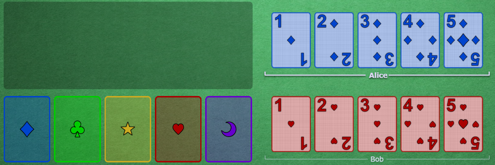
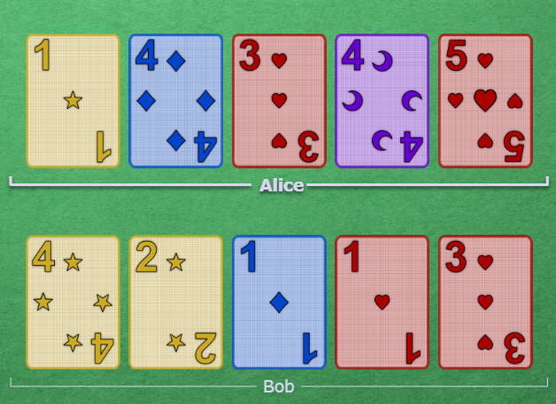
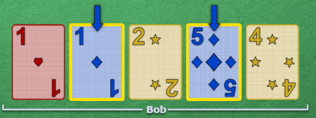
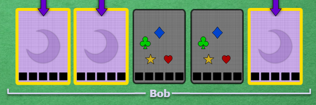
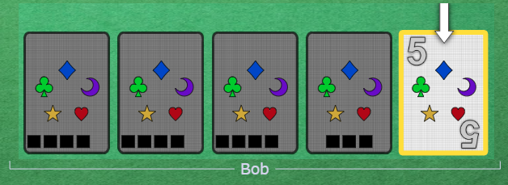
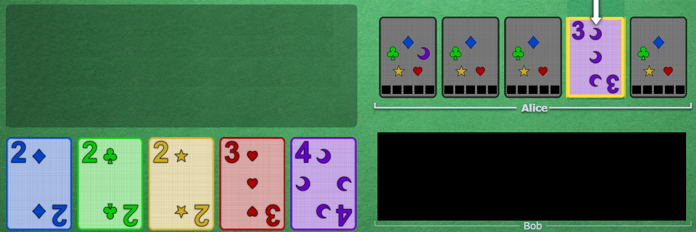
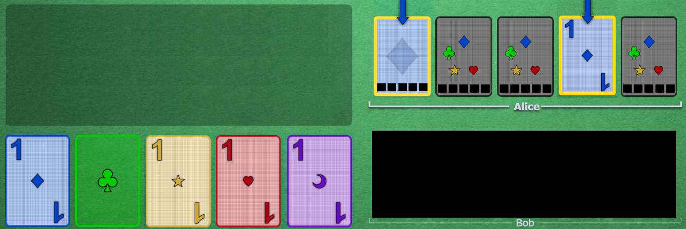
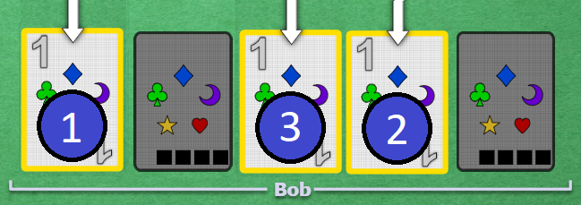
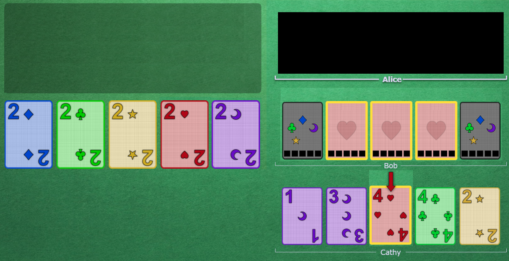
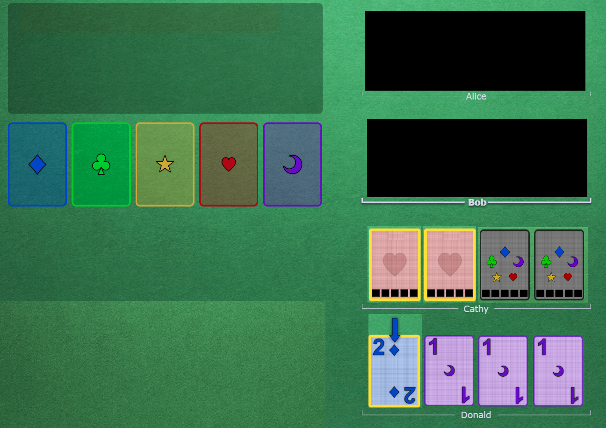

# Beginners Guide for the Hyphen-ated Group

* Are you looking to start playing Hanabi with the Hyphen-ated group? Fantastic - we are always looking to welcome new players. Take 15 minutes and go over this guide so that you can get up to speed with the basics.
* Alternatively, are you looking to learn some solid fundamental strategies to use to play Hanabi with your own group of friends? Feel free to adopt these strategies.
* Is a 15 minute briefing really necessary? Well, yes and no. If you try to play with our group and don't understand what basic clues mean, it is going to be analogous to a group of people trying to find each other in a dark room by running around with their arms flailing.
* This guide assumes that you are already familiar with the basic rules of Hanabi. If you need to brush up on them, see [this Pastebin written by Tricky](http://pastebin.com/6brGz2J4) or [watch my video explanation](https://www.youtube.com/watch?v=jR9i1qCbHXQ).

 

## Table of Contents

1. [Card Layout](#card-layout)
1. [The Basics](#the-basics)
2. [Play Clues & Save Clues](#play-clues--save-clues)
3. [Fix Clues](#fix-clues)
4. [Miscellaneous](#miscellaneous)
5. [Special Moves](#special-moves)

 

## Card Layout

In this guide, there will be some screenshots to show off the concepts introduced. Here's an example of a screenshot using the "BGA-style" card layout:

* The five **play stacks** are on the left.
* The **player hands** are on the right.
* Alice is always player 1. (She will always go first.)
* Bob is always player 2. (He will always go second.)
* Cards are drawn and added to the left side to each hand. Thus, Alice's newest card is the blue 1 and Bob's newest card is the red 1.
* Conversely, the oldest card is the right-most card. Alice's oldest card is the blue 5 and Bob's oldest card is the red 5.
* A card's *slot* referes to its position in the hand. In the above screenshot, the blue 1 is on slot 1, the blue 2 is on slot 2, the blue 3 is on slot 3, and so forth. The red 1 is on slot 1, the red 2 is on slot 2, the red 3 is on slot 3, and so forth.

* When a card has one or more clues on it, a yellow border will appear around the card. The blue 1 and the red 1 will now have permanent yellow borders around them (until they are played or discarded).
* The arrows indicate the specific cards that are "touched" by the last clue that was given.

 

## The Basics

### The Chop

* The right-most unclued card is called the "chop" card. (This is a metaphor of a card being "on the chopping block".)
* When a player needs to discard, they should discard their chop card.
* In this way, everyone discards in a predicable way.

* In the above screenshot:
  * Alice's chop card is the red 5 (on slot 5).
  * Bob's chop card is the red 3 (on slot 5).

* In the above screenshot:
  * Alice's chop card is the blue 4 (on slot 4).
  * Bob's chop card is the blue 4 (on slot 2).

 

### Good Touch Principle

* When a clue is given, the cards that are "touched" by the clue are highlighted by arrows.
* When cluing cards, we follow *Good Touch Principle* - this means that **we only want to touch cards that will eventually be played**. So, if someone touches a card that is already played on the stacks or a card that is already clued in someone else's hand, then that would be a *Bad Touch*.
* *Good Touch Principle* is a powerful building block for logic and reasoning. If everyone only touches good cards, then players can greatly narrow down the possibilities for all of the clued cards in their hand!

* In the above screenshot:
  * Alice wants to give a *Play Clue* to the yellow 2.
  * Alice has a choice between cluing yellow and cluing number 2.
  * If she clues number 2, it would uniquely touch the yellow 2 on slot 1.
  * If she clues yellow, then it would touch slot 1, slot 2, and slot 3. This clue would violate *Good Touch Principle*, as the yellow 4's would be duplicated in Bob's hand.
  * Thus, the correct clue for Alice to give is number 2.

* In the above screenshot:
  * Alice has an unknown purple card in her hand.
  * Bob's hand is not important, so it is blacked out.
  * Alice can see that the purple stack is played up to purple 4. The only other useful purple card left is the purple 5.
  * Alice also knows that according to *Good Touch Principle*, every clued card will be eventually be played.
  * Thus, by process of elimination, she can reason that the unknown purple card in her hand must be purple 5, and she can immediately play it.

 

### Single Card Focus

* In some Hanabi groups, when a bunch of cards are clued, there is no consistent definition of what you should do.
* In our group, we don't want there to be any guesswork - we all agree on a system that specifies **exactly** what a clue means so that everyone is always on the same page.

#### The System

* If two or more cards are touched, then **the clue is only focused on a single card**. (Meaning that it is either a *Play Clue* or a *Save Clue* on the focused card only.)
* **Nothing is implied about the non-focused cards** (beyond that they will be useful at some point later on, which follows from *Good Touch Principle*). 
* So, how do you know which card is focused?
  * The focus is always on the card that did not have any clues on it already. (We refer to this as the "brand new card introduced".)
  * If there are multiple "new" cards, then:
    * If the chop card is a "new" card, then the **focus is on the chop**.
    * Otherwise, the **focus is on the left-most card**.

#### Examples

* If only one card is touched by a clue, then the clue is (obviously) talking about that one card.
* In the above screenshot, Alice clues blue to Bob.
* Thus, the focus of the clue is blue 1. This is a *Play Clue* on blue 1.

* In the above screenshot, Alice clues blue to Bob.
* Before this clue, Bob's hand was completely unclued. So, with this clue, **two new cards were introduced** - the blue card on slot 2 and the blue card on slot 4.
* Bob knows that in this situation, the focus of the clue is the left-most of the two new cards. Thus, similar to the last example, this is a *Play Clue* on blue 1.
* From *Good Touch Principle*, Bob can reason that his other blue card on slot 4 is either blue 2, blue 3, blue 4, or blue 5. He will hold on to the card for later.

* In the above screenshot, Alice clues purple to Bob (on the first turn of the game).
* Before this clue, Bob's hand was completely unclued. So, with this clue, **three new cards were introduced** - slot 1, slot 2, and slot 5.
* Before this clue, Bob's chop was slot 5. So, since the clue touched his chop and *Chop Focus* has priority, this must be a *Chop Focus Play Clue* on purple 1. Bob should play the slot 5 card as purple 1.

 

## Play Clues & Save Clues

* A clue can either be:
  * a *Save Clue* (meaning to save the focused card for later)
  * a *Play Clue* (meaning to play the focused card)
* Let's go through each in turn.

 

### Save Clues

* *Save Clues* **can only be given to cards on chop**. You can't give a *Save Clue* otherwise!
* The team **must save** the following cards:
  * All 5's
  * Unique 2's
  * Critical cards (meaning that the other copy is discarded)
* Sometimes, a *Chop Focus* clue could be either a *Save Clue* or a *Play Clue*. When this happens, the *Save Clue* interpretation always takes priority - the receiving player would have to treat it like a potential *Save Clue*, and hang on to the card for the time being.
* The three kinds of *Save Clues* are listed below.

#### 5 Saves

* Since there is only one copy of each 5, all of the 5's need to be saved so that they won't be discarded.
* In the above screenshot:
  * Alice clues Bob number 5, which touches a single 5 on slot 5.
  * Before this clue, Bob did not have any clued cards in his hand.
  * Since the clue was focused on his chop, Bob knows that this must be a *5 Save* on the 5. It can be any 5 in the game.
* 5's must be saved with a number clue instead of a color clue. (Otherwise, it will look like a *Play Clue*!)

#### 2 Saves

* Even though there are two copies of each 2, we agree that they are so important that we must save them in a manner similar to 5's.
* In the above screenshot:
  * Alice clues Bob number 2, which touches a 2 on slot 3 and slot 5.
  * Before this clue, Bob did not have any clued cards in his hand.
  * Since the clue was focused on his chop, Bob knows that this must be a *2 Save* on the 2. It can be any 2 in the game.
* Similar to 5's, 2's must be saved with a number clue instead of a color clue.
* You can think of the *2 Save* as a last resort to save a 2. Thus, players are not allowed to perform a *2 Save* on a 2 if that same 2 is visible in someone else's hand (because the team does not actually need to save that 2 quite yet - they can *2 Save* it when the other copy reaches the chop).

##### Critical Saves

* For the same reason that 5's need to be saved, critical cards also need to be saved. (Critical cards are defined as cards that have the other copy discarded.)
* Players can choose to save critical cards with either a color clue or a number clue.
* In the above screenshot:
  * The current discard pile is shown to the right of the hands.
  * Alice clues Bob yellow, which touches a card on slot 4.
  * Before this clue, the only clued card in Bob's hand was the 5 on slot 5.
  * This could be a *Play Clue* on the yellow 2. However, since the clue was focused on his chop, this could also be a *Save Clue*.
  * Bob looks through the discard pile and finds that there is a yellow 4 there. Thus, this could be a *Save Clue* on the yellow 4. *Save Clues* take precedence over *Play Clues*, so Bob knows that for now, he has to hold on to the card.
  * Bob marks the card as either a yellow 2 or a yellow 4, so that he can keep track of it for later. Then, he discards.

 

### Play Clues

* We are very strict with what we clue - we don't just randomly clue cards in the hand.
* So if a card is touched as the focus of the clue and it is not on chop, then that card must be playable!
* Alternatively, if a chop-focus *Save Clue* is given to a card that does not meet the above saving criteria, then it is not a *Save Clue* at all, and must be a *Play Clue*!

#### Delayed Play Clues

* When you receive a *Play Clue*, it does not necessarily mean that you can play that card immediately. Look around the table for **other already clued cards that might be related** to the card that you got the *Play Clue* on. If there are any, you must wait for them to be played.
* For example, if Alice was clued about a bunch of 1's and then Bob is given a *Play Clue* on an unknown 2, **Bob must wait for Alice to play all of her 1's first** before playing the 2.
* In other words, treat all *Play Clues* as potential *Delayed Play Clues*.

### Clue Logic Flowchart

* For reference, this is [a basic logic flowchart](../flowcharts/clue_flowchart.png) that describes the general interpretation of a clue.

 

## Fix Clues

* 99% of clues are either *Save Clues* or *Play Clues*. The remaining 1% are *Fix Clues*, which are attempting to "fix" an impending misplay.
* *Fix Clues* are often needed when a duplicate card is touched. Cards are not normally duplicated (which follows from *Good Touch Principle*), but sometimes someone makes a mistake, or a sequence of particular cards makes duplicating necessary. Duplicate cards will lead to misplays, so it is the team's responsibility to fix the problem and intervene before this happens.

* In the above screenshot:
  * Before the clue was given, Alice had an unknown purple card in her hand.
  * From *Good Touch Principle*, Alice concluded that her card must be purple 5, and had planned to play it as soon as possible.
  * Bob clues number 3 to Alice, which "fills in" the purple card and reveals that it is purple 3.
  * Since Alice was just about to play this card, Alice knows that this was a *Fix Clue* and that she can now safely discard the purple 3.

* **A clue cannot be a *Play Clue* and a *Fix Clue* at the same time.** If you receive a *Fix Clue* and it touches other ancillary cards, none of them are necessarily playable; the primary point of the clue is to fix the impending misplay.
* In the above screenshot:
  * Before the clue was given, Alice has an unknown 1 in her hand.
  * From *Good Touch Principle*, Alice concluded that her 1 must be green 1, and had planned to play it as soon as possible.
  * Bob clues blue to Alice, which "fills in" the 1 and reveals that it is blue 1. The blue clue also touches a blue card on slot 1.
  * In this situation, Alice might be tempted to think that this is a *Play Clue* on a blue 2 in slot 1, especially considering that the slot 1 card was the only brand new card introduced in the clue (and that the focus of a clue should always be on the brand new card introduced).
  * However, the fact that the blue clue "fixed" an impending misplay means that Bob may have had no choice but to clue blue, and he may not necessarily be trying to give a *Play Clue*.
  * Alice marks the blue card as either blue 2, blue 3, blue 4, or blue 5, and discards the blue 1.
* Usually a *Fix Clue* will "fill in" the card to explicitly make it known that the card is unplayable or duplicated. However, it is also possible to perform a *Fix Clue* just by cluing the card again. For example:
  * Alice clues Bob number 1 and it touches three 1's.
  * Bob successfully plays two 1's.
  * Before Bob can play the 3rd 1, Alice clues Bob number 1 again, and all the clue does is re-touch the remaining 1.
  * Now it is Bob's turn. Since he was going to play the 1 already without Alice doing anything, the clue must have some other meaning. Thus, it is a *Fix Clue*: the remaining 1 is bad, and Bob can safely discard it.
* Note that in general, giving a *Fix Clue* should wait until the card is actually in danger of being misplayed (like in the previous example). If a duplicated card is not in danger of being misplayed anytime soon, then players should defer giving the *Fix Clue* until later. This way, it gives the player a chance to figure out the duplication on their own, which can happen from time to time.

 

## Miscellaneous

### Playing Multiple 1's

* If one or more 1's in your hand are clued, **you should assume that they are all playable**. (This only applies to 1's, and follows from *Good Touch Principle*.)
* We agree that playing 1's at the beginning of the game is a special case - you should always **play the 1's in your starting hand from oldest to newest**. (This is a special case because normally, *Play Clues* mean to play the left-most card.)
* However, freshly drawn 1's should always be played before any 1's that were present in the starting hand. (This applies even if one of the clued 1s was on chop.)

* In the above screenshot, Alice clues 1's to Bob, which touches three 1s on slot 2, slot 3, and slot 4.
* From *Good Touch Principle*, Bob knows that he can now play all 3 of these cards.
* Bob should play the slot 4 card first, and then the slot 3 card, and then the slot 2 card.
* Now imagine:
  * Bob plays the slot 4 card. (He then draws a card, and all of the other cards in his hand slide over.)
  * Alice clues 1's to Bob, which touches a brand new card on slot 1 and re-touches the ones on slot 3 and slot 4.

* Bob knows that fresh 1's have priority, so he plays the slot 1 card next. After that, he should play the slot 4 card, and then the slot 3 card (e.g. resuming the play order from before).

### The Early Game

* We define the *Early Game* as the period of time before someone discards for the first time. When they do, they initiate the *Mid-Game*.
* The general goal of the *Early Game* is to extend it for as long as reasonably possible. Thus, everyone agrees that they MUST "extinguish" all of the available *Play Clues* and *Save Clues* before discarding. (There are no cards in the discard pile yet, but *Save Clues* still need to be given to all of the 5's on chop and all of the 2's on chop that are not present in someone else's hand.)
* In the *Early Game*, you can do a special move called a *5 Stall*; see below.

### The 5 Stall (Cluing Off-Chop 5's)

* Normally, you are only allowed to give a *Save Clue* to a 5 if it is on chop. So if you use number 5 to clue a 5 that is NOT on chop, then it will typically look like a *Play Clue* on that 5 (or some other advanced strategy).
* As a special rule, in the *Early Game*, you ARE allowed to clue number 5 as a *Save Clue* to off-chop 5's. Doing this is just interpreted as a "stall" clue and that you are trying to extend the *Early Game* for a little bit longer.
* However, you are ONLY allowed to do this if there is nothing else to do, meaning that all of the "normal" *Play Clues* and *Save Clues* have been extinguished.
* Normally, a *5 Stall* is only done in the *Early Game*. However, you might see someone give a *5 Stall* in the *Mid-Game* if they are in a special situation where they are not allowed to discard.

### When to Discard

* In general (not just in the *Early Game*), discarding is a last resort. If you have known playable cards in your hand, you are expected to play them before discarding. Furthermore, if there are good clues to give, you are expected to give them before discarding.
* Thus, if there are more urgent things at hand, you can defer saving important cards on the next person's chop if you see they have playable cards or even a good *Play Clue* to give.

### Tempo Clues and Minimum Clue Value Principle

* In the previous section, we said that discarding is a "last resort". But don't take this the wrong way.
* In order to avoid discarding, you are *not allowed* to just clue any card. You are only allowed to give *Save Clues* to the specific cards outlined in the *Save Clue* section. And you are only allowed to give *Play Clues* on actual playable cards.
* Furthermore, you might be tempted to **clue a card again that already has a clue on it** in order to make it play right now. We call this kind of clue a *Tempo Clue*.
* *Tempo Clues* are quite inefficient (as the team is using two clues to get one card). Since *Tempo Clues* as so terrible, we say that players are **only allowed to perform *Tempo Clues* in certain special situations**, like when they a player is forced to give a clue.
* So, if nothing special is going on, and you have a choice between giving a *Tempo Clue* and discarding, then you must discard.
* We formally express this concept as *Minimum Clue Value Principle*: **all clues must get at least one brand new card saved or played**. In other words, as a group, we hold ourselves to a high standard, and we don't give inefficient clues.

### Other General Strategy

* Now that you know all of the "rules" and "systems", what about the basic stratgy? How should you decide what to do on your turn?
* What makes Hanabi so interesting is that there is never a one-size-fits-all prescription for a situation, so you always have to think everything through. With that said, you should know some basic tips.
* In general, ***Play Clues* should be given over *Save Clues***. There's no need to give a *Save Clue* to someone if you can preoccupy them with playing a card!
* In general, if you have a choice, **color clues should be given over number clues**. Color clues are usually more specific, telling the player the exact identity of the card. (But of course, don't be afraid to use number clues if it helps to "fill in" other cards in the hand.)
* In general, the first thing you should do on your turn is to **look at the chop cards of everyone on the team**. Are there any cards on chop that need to be saved (or *Play Clued*)? If so, do you have to do it, or can someone else do it?
  * If no-one else can do it, then you need to give the *Save Clue* (or *Play Clue*), even if you have a card to play.
  * If someone else can do it, would it be better for you to save the card, or for them? If they have a card to play and you do not have a card to play, then it is better teamwork for you to save the card.
* In general, **don't be afraid of discarding**. If you discard something important, it won't be your fault - it is your teammates' responsibility to save any important cards.

 

## Special Moves

* Hanabi is a game of trying to be as efficient as possible, since there is a limited number of clues.
* Most of the time, players will use one clue to get one card played. But is it possible to do better?
* There are two special "moves" that players can do in order to get multiple cards played by only using 1 clue, which is very efficient.

 

### The Prompt

* In the above screenshot:
  * Alice's hand is blacked out because it does not matter.
  * Bob has a clued red card in his hand, but the full identity of the card is still unknown to him. In this situation, he knows he is supposed to just keep the card in his hand and continue to discard unclued cards.
  * Alice clues red to Cathy, which touches a red 4. This must be a *Play Clue* on the red 4.
  * Bob sees that red 4 is currently unplayable, since the red 3 is not played yet. Thus, this clue implies that someone has the red 3.
  * Bob does not see a red 3 clued in anyone else's hand. So, Alice must be promising him that his unknown red card is red 3 and that he can safely play it.
* In this way, clues can deliver messages to an entirely different player than the person who actually received the clue.
* We call this move a *Prompt* because it is "prompting" a player to play a card that they would have otherwise held on to for a while longer.

* If a player is *Prompted* and there are multiple cards in the hand that the *Prompt* could apply to, they should play the left-most.
* In the above screenshot:
  * Bob is *Prompted* for a red 3 in the exact same way as the previous example.
  * Bob has three different cards clued as red in slots 2, 3, and 4.
  * Since all 3 cards are equally likely to be red 3, Bob should choose to play the slot 2 card as red 3 since it is the left-most.

* In the above screenshot:
  * Bob has an unknown 3 in his hand.
  * Alice clues number 4 to Bob, which touches a 4. It must be a *Play Clue* on the 4.
  * There is no 4 that could possibly be playable right now. Thus, this must be a *Self-Prompt*, meaning that Bob's 3 must be either blue 3 or green 3.
  * Bob plays his 3, and it is blue 3. Thus, he knows that the 4 must match and be a blue 4.

* The *Prompt* is a **promise** that the player has the connecting card. **A *Prompt* cannot be a lie!**
* In the above screenshot:
  * Bob has three separate unknown 3's in his hand.
  * Alice clues red to Cathy, which touches the red 4. This is a *Play Clue* on the red 4.
  * Bob must have the red 3, so this is a *Prompt*. Bob plays his left-most 3 from slot 2.
  * However, after playing it, Bob sees that it is not the red 3 - it was the blue 3 (which played successfully). Bob now knows that the next-left-most 3 must be the red 3 (on slot 3).
  * On his next turn, Bob tries to play his slot 3 card as red 3. However, after playing it, Bob sees that it was not the red 3 - it was the green 3 (which played successfully). Bob now knows that his final 3 must be red 3 (on slot 4).
  * On his next turn, Bob plays his slot 4 card, and it is red 3. Bob now knows that Alice did a *Triple Prompt*.

 

### The Finesse

* In the above screenshot:
  * Alice's hand is blacked out because it does not matter.
  * Bob has no clued cards in his hand.
  * Alice clues a red to Cathy, which touches a red 4. This must be a *Play Clue* on the red 4.
  * Bob sees that red 4 is currently unplayable. Thus, assuming Alice is not making a mistake, this clue implies that someone has the red 3...
  * Bob does not see a red 3 clued in anyone else's hand. So, Alice must be promising him that his has the red 3.
  * But where is it? Bob knows that this is the *Finesse* convention, and he is promised that his left-most unclued card is the red 3.
  * Bob blind-plays his slot 1 card, and it is the red 3.
  * Cathy sees the blind-play happen immediately after this red clue, so she knows that she must have the connecting red card, red 4.
  * Cathy plays the red 4.
* Note that ***Prompts* take precedence over *Finesses*!** Players should never blind-play a card if the situation can apply to the clued cards in their hand.
* When a *Finesse* occurs, it causes temporary information desynchronization. (In the above example, if Bob did nothing, Cathy would go on to think that she had the red 3, but she really doesn't have the red 3, which means that information is not synced up throughout the team.)
* For this reason, blind-playing a card into a *Finesse* is very important - by doing so, it resyncronizes all of the information. So, **if a player is *Finessed*, they should usually blind-play the card immediately**, even if they have other important cards to play or some good clue to give.

* We define the *Finesse Position* as the slot that a player's left-most unclued card is in. Notice that a player's *Finesse Position* can move around, and if it does, it is still possible to *Finesse* them.
* In the above screenshot:
  * Alice clues Cathy red, which touches two red cards on slot 1 and slot 2.
  * Cathy assumes that the slot 1 card is red 1.
  * Next, Bob clues Donald blue, which touches a blue 2.
  * Cathy assumes that this is a *Finesse* and that she must have a blue 1.
  * Now, it is Cathy's turn. Blind-playing the blue 1 is more important than playing the red 1.
  * Normally, the *Finesse Position* would be the left-most card. However, since Cathy's slot 1 and slot 2 card are already clued, Cathy's *Finesse Position* card has shifted down to her slot 3. Thus, she must blind-play the blue 1 from slot 3.
