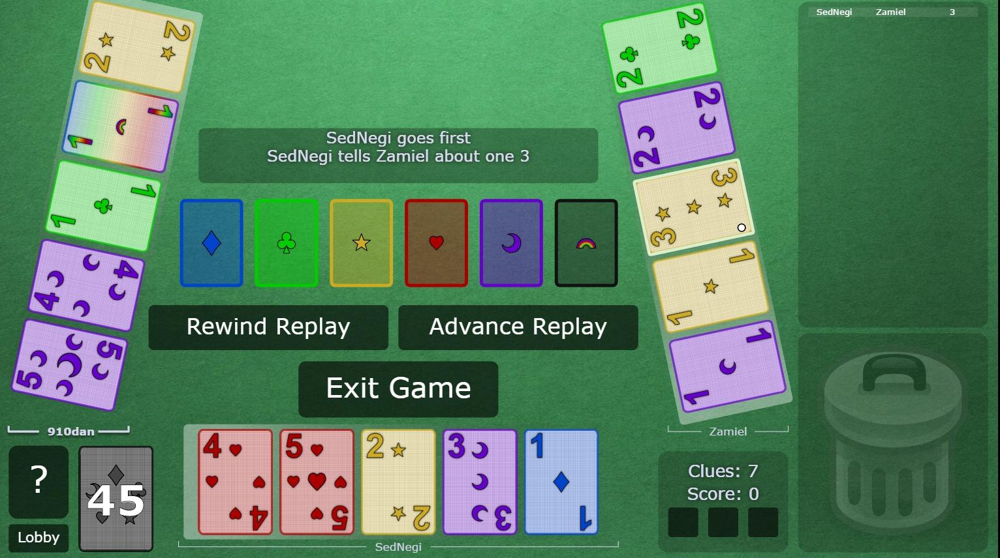

    

# Hanabi Strategies & Conventions

For the *Hyphen-ated group*. Written and maintained by Zamiel.

All document updates are listed in the `#announcements` channel on the [Hanabi Discord server](https://discord.gg/FADvkJp). (You can also see the [commit history](https://github.com/Zamiell/hanabi-conventions/commits/master) of this repository.)

 

## Introduction & Purpose

Hanabi is a fantastic cooperative card game of logic and reasoning. Our group, started by Hyphen-ated, gets online games going regularly. Everything doesn't always go perfectly, but we strive to constantly improve. Naturally, we have also built up a set of conventions that we all agree upon at the beginning of the game so that it is easier to understand what everyone else is doing. As the list of conventions got longer, we wanted to make sure that everything was completely documented in an official capacity.

The purpose of this document is:

1. To explain the *First Principles* to brand-new players playing with our group.

    Briefing a beginner on every possible strategy would quickly become overwhelming. It is much easier to just describe some guiding principles that everyone agrees upon. Once these are known, a beginner should be able to use logic and reason to derive (most of) the resulting strategy that their teammate is intending.

2. To serve as **a reference** for intermediate and expert players of our group.

    Based on the guiding principles, we have come up with many different strategies. It is helpful to give specific names to each strategy to aid in both discussion and comprehension. If you know the general way we play but don't know about a specific kind of move, then you can look it up in this document.

If you have found your way here from the Internet and are not a part of our group already, then welcome! You can use this document to cherry-pick strategies for your own group, or even adopt the whole convention framework if you want. We enjoy talking to other Hanabi players, so make sure to say hi in the [Hanabi Discord server](https://discord.gg/FADvkJp) as well. (Discord is a voice and text chat application that you can run in a browser.)

Note that our group generally only plays games with 3 to 5 players, since 2-player games can be quite boring. Thus, this document doesn't really apply to 2-player games; separate conventions are probably necessary for optimized play in that game type.

 

## Table of Contents

This document is split up into different sections so that you can better digest it. As a new player, you should probably **not** read the entire document at once. Rather, it might be better to only read Level 0 and Level 1 sections. The other sections can be just used as a reference as you continue to naturally improve at the game.

1. [Quick Links](#quick-links)
2. [Level 0 - First Principles](#level-0---first-principles)
3. [Examples](#examples)
4. [Level 1 - Beginner Strategies](#level-1---beginner-strategies)
5. [Level 2 - Intermediate Strategies](#level-2---intermediate-strategies)
6. [Level 2 - General Principles](#level-2---general-principles)
7. [Level 3 - Advanced Strategies](#level-3---advanced-strategies)
8. [Level 4 - Expert Strategies](#level-4---expert-strategies)
9. [Level 3 - Variant-Specific Strategies](#level-3---variant-specific-strategies)
10. [Level 3 - Rarely Used Advanced Strategies](#level-3---rarely-used-advanced-strategies)
11. [Level 4 - Rarely Used Expert Strategies](#level-4---rarely-used-expert-strategies)
12. [Non-Formalized Proposals](#non-formalized-proposals)
13. [Convention Attribution](#convention-attribution)

 

## Quick Links

* This document assumes that you are ALREADY familiar with the basic rules of Hanabi. If you need to brush up on them, see [this Pastebin written by Tricky](http://pastebin.com/6brGz2J4).
* The best place to play Hanabi online is at
[Hanabi Live](http://hanabi.live/).
* There are also lots of players who play Hanabi online at [Board Game Arena](http://boardgamearena.com), although the user interface is not very good.
* Find other people to play with and discuss strategy with on the [Hanabi Discord server](https://discord.gg/FADvkJp). (Discord is a voice and text chat application that you can run in a browser.)

 

## Level 0 - First-Principles

While there are some weird strategies that could throw you for a loop if you have never seen them before, mostly everything should follow from these guiding principles. You don't have to memorize all of these all at once; just read them so that you can start to get familiar with them.

### 1. Chop Principle

* The "chop" is the right-most unclued card.
* When a player needs to discard and has no known safe discards, they discard the chop card.

### 2. Good Touch Principle

* A safe discard is defined as:
  * a copy of a card that has already been played
  * a copy of a card that already has a clue on it
* Safe discards should NOT be clued (unless there's an important reason to).
* Players should generally assume that any clued card in their hand will be eventually be played.

### 3. Save Principle

* Cards that meet the following criteria need to be saved:
  * only one copy remains (e.g. 5's or unplayed cards in the discard pile)
  * it is currently playable and not visible elsewhere in players' hands
  * it is a 2 and not visible elsewhere in players' hands
(this is the *2 Saves* convention)
* When a card that needs to be saved is at immediate risk of being discarded, it must be indicated with a save clue.
* A player receiving a clue should give precedence to a *Save Clue* interpretation over a *Play Clue* interpretation.

### 4. Minimum Clue Value Principle

* A given clue must either:
  * indicate sufficient information for one or more previously unclued cards to be played or
  * prevent the possible discard of a card that needs to be saved

### 5. Play Order Principle

* When a *Play Clue* touches multiple cards, if it includes the chop, it's focused on the chop.
* Otherwise it's focused on the newest of the freshly-introduced cards.
* The non-focused cards may or may not be playable.

### 6. Left-Most Playable Principle

* When a player is expected to play a card (or know a card is playable) in a situation not covered by the *Play Order Principle*, the card to be played is the left-most of the various cards that are most likely to be it.

### 7. Information Lock Principle

* What is indicated by a clue is determined by the known information at the time the clue is given. Subsequent clues may build upon that information, but do not override it unless a direct conflict is evident.

### 8. Good Lie Principle

* When a *Play Clue* is given, it's a message that says the card is playable. Sometimes this message can be a lie, in order to usefully manipulate other players.
* Valid lies must not allow for the possibility of any misinformed player to give a conflicting clue or misplay. In simpler terms, this means that good lies almost always reveal themselves on the very next turn.

### 9. High Value Principle

* The highest value clue is expected. If a clue is given, it should be interpreted to be the highest value move available to that player.
* In other words, you can draw many important conclusions from the fact that a player did not do some other (potentially higher-value) move.

### Appendix A: Basic Clue Logic:

Following from these principles, this is [a basic logic flowchart](https://cdn.discordapp.com/attachments/140016142600241152/266467290101317632/Hanabi_Clue_Flowchart.png) that describes the general interpretation of a clue.

 

## Examples

Throughout this document, there will be a mix of both text-based examples and graphical screenshots.

In a text-based example:
* The player who goes first will always be Alice.
* The second player will always be Bob.
* The third player will always be Cathy.
* The forth player will always be Donald.
* The fifth player will always be Emily.

(This is a historial convention created by [Keldon Jones](http://keldon.net/) and follows loosely from [cryptography](https://en.wikipedia.org/wiki/Alice_and_Bob).)

A screenshot will look like the following:

Note that in this user interface, players are holding their hands like they would be if they were playing in real life. For example, in this screenshot, Donald's chop card / right-most card / slot 4 card is the green 5, and Alice's chop card / right-most card / slot 4 card is the yellow 1.

 

## Level 1 - Beginner Strategies

### Single Focus

* When we clue a card, we refer to that card being "touched" by the clue.
* If multiple cards are touched by a clue, only ONE card is the focus of the clue. Nothing is implied about the extra cards (beyond that they will be useful at some point in the game, which follows from *Good Touch Principle*).
* Thus, a clue cannot be both a *Save Clue* and a *Play Clue* at the same time; either it is one or the other.

### Save Clues

* If a player's chop card is clued, even if other new cards are introduced, the focus of the clue is on the chop.
* All clues that touch the chop have to be treated as potential *Save Clues*. Some common types of *Save Clues* are listed below.
* Players will use both color and number clues to perform *Save Clues* - always look to see if there is a card in the discard pile that "matches" the clue you were given to the card on chop.
* From *Save Principle*, if you can determine that the card on your chop does NOT need to be saved, then it must be a chop-focus *Play Clue* instead.

### 5 Saves (On Chop)

* Since there is only one copy of each 5, all of the 5's need to be saved so that they won't be discarded.
* Always save a 5 with a number clue instead of a color clue. Otherwise, it will look like a *Play Clue* (or potentially a *Save Clue* on some other critical card).

### 2 Saves (On Chop)

* Even though there are two copies of each 2, we agree that they are so important that we must save them in a manner similar to 5's.
* Similar to saving 5's, always save a 2 with a number clue instead of a color clue.
* *Save Principle* takes priority over *Good Touch Principle*. This means that you can violate *Good Touch Principle* and duplicate a 2 in the situation where a 2 is on chop and needs to be saved.

### Play Clues

* We are very strict with what we clue - we don't just randomly clue cards in the hand.
* So if a card is touched as the focus of the clue, and it is not on chop, then that card is playable!

### Delayed Play Clues

* When you receive a *Play Clue*, it does NOT necessarily mean that you can play that card immediately. Look around the table for other ALREADY CLUED cards that might be related to the card that you got the *Play Clue* on. If there are any, you must wait for them to be played.
* For example, if Alice was clued about a bunch of 1's and then Bob is then clued about a 2, Bob should WAIT for Alice to play all of her 1's first BEFORE playing the 2.
* In other words, treat all *Play Clues* as potential *Delayed Play Clues*.

### Cluing 1's

* If you need to clue a single 1, it is better to do it with a color clue than a number clue. This is because it allows them to potentially clue other 1's on the table.

### Playing Multiple 1's

* If one or more 1's in your hand are clued, you should assume that they are ALL playable. (This ONLY applies to 1's, and follows from *Good Touch Principle*.)
* We agree that playing 1's at the beginning of the game is a special case - you should always play your 1's from oldest to newest.
* Furthermore, freshly drawn 1's should be played before any 1's that were present in the starting hand.

### The Early Game (Beginner Section)

* The *Early Game* is defined as the period of time before someone discards for the first time. When they do, they initiate the *Mid-Game*.
* The general goal of the *Early Game* is to extend it for as long as reasonably possible. Thus, everyone agrees that they MUST "extinguish" all of the available *Play Clues* and *Save Clues* before discarding. (There are no cards in the discard pile yet, but *Save Clues* still need to be given to all of the 5's on chop and all of the 2's on chop that are not present in someone else's hand.)
* In the *Early Game*, you can do a special move called a *5 Stall*; see below.
* That covers the basics. Some more edge-case specifics that you don't need to know right now are listed in *The Early Game (Intermediate Section)*.

### The 5 Stall (Cluing Off-Chop 5's)

* Normally, you are only allowed to give a *Save Clue* to a 5 if it is on chop. So if you use number 5 to clue a 5 that is NOT on chop, then it will typically look like a *Play Clue* on that 5 (or some other advanced strategy).
* As a special rule, in the *Early Game*, you ARE allowed to clue number 5 as a *Save Clue* to off-chop 5's. Doing this is just interpretted as a "stall" clue and that you are trying to extend the *Early Game* for a little bit longer.
* However, you are ONLY allowed to do this if there is nothing else to do, meaning that all of the "normal" *Play Clues* and *Save Clues* have been extinguished.
* Normally, a *5 Stall* is only done in the *Early Game*. However, you might see someone give a *5 Stall* in the *Mid-Game* if they are in a special situation where they are not allowed to discard.

### When to Discard

* In general (not just in the *Early Game*), discarding is a last resort. If you have known playable cards in your hand, you are expected to play them before discarding. Furthermore, if there are good play clues to give, you are expected to make them before discarding.
* Thus, if there are more urgent things at hand, you can defer saving important cards on someone else's chop if you see they have playable cards or even a good *Play Clue* to give.

### Fix Clues

* Normally, every clue that is given is either a *Save Clue* or a *Play Clue*. One small exception to this is a *Fix Clue,* which is attempting to "fix" an impending misplay. (This is also referred to as a *Stop Clue*.)
* *Fix Clues* are often needed when a duplicate card is touched. (For example, when a red 2 is clued in Player A's hand, and the other red 2 is clued in Player B's hand.) Cards are not normally duplicated (which follows from *Good Touch Principle*), but sometimes someone makes a mistake, or a sequence of particular cards makes duplicating necessary.
* In such a situation, because of *Good Touch Principle*, the players with the duplicate cards will assume the identity of their cards to be something else, and may go on to misplay those cards. Thus, it is the team's responsibility to fix the problem and intervene before this happens.
* **A clue cannot be a *Play Clue* and a *Fix Clue* at the same time.** If you receive a *Fix Clue* and it touches other ancillary cards, none of them are necessarily playable; the primary point of the clue is to fix the impending misplay.
* Usually a *Fix Clue* will "fill in" the card to explicitly make it known that the card is unplayable or duplicated. However, it is also possible to perform a *Fix Clue* just by cluing the card again. For example:
  * Alice clues Bob number 1 and it touches three 1's.
  * Bob successfully plays two 1's.
  * Before Bob can play the 3rd 1, Alice clues Bob number 1 again, and it re-touching the remaining 1.
  * Now it is Bob's turn. Since he was going to play the 1 already without Alice doing anything, the clue must have some other meaning. Thus, it is a *Fix Clue*: the remaining 1 is bad, and Bob can safely discard it.

### Prompts

* Imagine that you have a card in your hand that has a clue on it, but the full identity of the card is currently unknown. In this situation, you are supposed to just keep the card in your hand, and continue to discard unclued cards.
* If someone gives a *Play Clue* to a card that is currently unplayable, and the "in-between" card matches the clued card in your hand, then they could be telling YOU to play the clued card. This is called a *Prompt* because it is "prompting" you to play a card that you would have otherwise held on to.
* For example, in a 3-player game:
  * All the 2's have been played on the stacks.
  * Alice clues a red 4 in Cathy's hand as a *Play Clue*.
  * Bob has a card in his hand with a red clue on it, but no number information.
  * Since Bob can see that the red 4 is supposed to play right now, he must have the red 3. So the unknown red card in his hand must be red 3, and he can safely play it.
* If a player is *Prompted* and there are multiple cards in the hand that the *Prompt* could apply to, they should play the left-most. (This follows from *Left-Most Playable Principle*.) For example, in a 3-player game:
  * Similar to the last example, Bob is *Prompted* for a red 3.
  * Bob has three different cards clued as red in slots 2, 3, and 4.
  * Since all 3 cards are equally likely to be red 3, Bob should choose to play the slot 2 card as red 3 since it is the left-most.
* In multi-color variants, *Prompts* apply to the card with the most positive information. For example, in a 3-player game:
  * Similar to the last example, Bob is *Prompted* for a red 3.
  * In slot 1, Bob has a card with only a red clue on it.
  * In slot 2, Bob has a card with a red clue and a 3 clue on it.
  * Since slot 2 has more positive information, Bob should choose to play slot 2 as red 3.
* The *Chop Move* is a special move that is covered later on. *Chop Moves* touch cards with an "invisible clue". Note that *Prompts* do NOT apply to *Chop Moved* cards. When fulfilling a *Prompt*, players should skip over the *Chop Moved* card and play something else.

### Finesses

* If someone gives a *Play Clue* to a card that is currently unplayable, then they could be telling YOU to play a card. Normally, this would indicate a *Prompt*. But, what if you have no clued cards in your hand or no clued cards that apply to the situation?
* In this situation, you should blindly play your left-most unclued card. Then, the other player will know that the clued card directly matches the blind-play, and will play it. By doing this, the team will have gotten 2 plays with only 1 clue, which is very efficient. This is called a *Finesse*.
* For example, on the first turn of a 3-player game:
  * Alice clues Cathy red, which touches her red 2.
  * Next, it is Bob's turn. Bob sees that Cathy has been signaled that she has the red 1, and she will go on to misplay this card.
  * If Alice is not making a mistake, something must be in Bob's hand to make the red 2 playable. This must be a *Finesse*, so he blindly plays his left-most card and it is the red 1.
  * Next, Cathy plays her red 2.
* **Note that *Prompts* take priority over *Finesses*!** Do not blindly play your left-most card if the situation can apply to any of the clued cards in your hand.
* *Finesse Position* is the position that a player's left-most unclued card is in. Notice that even if a player's *Finesse Position* moves around, it is still possible to *Finesse* them. For example, on the first turn of a 4-player game:
  * Alice clues Cathy red, which touches two red cards on slot 1 and slot 2.
  * Cathy assumes that the slot 1 card is red 1.
  * Next, Bob clues Donald blue, which touches a blue 2.
  * Cathy assumes that this is a *Finesse* and that she must have a blue 1.
  * Now, it is Cathy's turn. Blind-playing the blue 1 is more important than playing the red 1.
  * Normally, the *Finesse Position* would be the left-most card. However, since Cathy's slot 1 and slot 2 card are already clued, Cathy's *Finesse Position* card has shifted down to her slot 3. Thus, she must blind-play the blue 1 from slot 3.

 

## Level 2 - Intermediate Strategies

### The Prompt + Finesse

* In general, remember that players will always assume *Prompts* over *Finesses*. Thus, is it possible to do a clue that *Prompts* a card from a player's hand and THEN gets them to blind-play their *Finesse Position* card on the next turn.
* For example, in a 3-player game:
  * Red 1 is played on the stacks.
  * Bob has a clued red card in his hand on slot 4.
  * Alice clues Cathy reds, touching a red 4.
  * Bob knows he must have both red 2 and red 3, but he only has one clued red card in his hand. So this must be both a *Prompt* on him and a *Finesse* on him at the same time.
  * Since *Prompts* take precedence over *Finesses*, he plays the clued red card first from slot 4 as red 2.
  * On his next turn, he blind-plays slot 2 as red 3. (His *Finesse Position* at the time of the clue was slot 1, but he drew a card, and now the red 3 slid down to slot 2.)

### Reverse Finesses

* In a normal *Finesse*, you would give a clue to a person AFTER the person blindly playing the card. If you give a *Finesse* clue to someone BEFORE the blind-play occurs, it is called a *Reverse Finesse*. This is more complicated than a normal *Finesse* and is harder to see.
* Since *Reverse Finesses* exist as a strategy, before playing ANYTHING that you aren't 100% sure about, you should always check out everyone's *Finesse Position* card (the left-most unclued card). If the card in this slot is PLAYABLE and "matches" the clue that you jsut got, then you should DEFER playing it for at least one go-around and wait to see what happens.
* If the player with the "matching" card blind-plays it, then it means that your clued card is the next card in the chain. You can safely play it on the next turn.
* Or, if the player with the "matching" card does NOT blind-play, then you probably have the other copy. You can safely play it on the next turn.
* For example, on the first turn of a 3-player game:
  * Alice clues Bob red, which touches his red 2.
  * Next, it is Bob's turn. Normally, Bob would think that he had the red 1, and play it immediatley.
  * However, Bob also notices that on Cathy has a red 1 on her slot 1 position. Thus, he has to give a chance for Cathy to prove whether or a *Reverse Finesse* is happening. If Cathy does not blind-play anything, then Bob should have the red 1, and he can play it on his next turn.
  * Bob discards.
  * Cathy blind-plays red 1. Bob now knows that he has the red 2.

### Bluffs

* *Finesses* are quite efficient. So, when you see a playable card in someone's *Finesse Position* slot, you will often want to "get" the card with a *Finesse* (instead of cluing it directly). However, often times, the proper "connecting" card is not on the table.
* In this situation, you can perform an alternate strategy by lying to the next player. By cluing an unrelated, one-away card, the next player will think that it is a *Finesse* and that they have the matching card, so they will blind-play their *Finesse Position* card. This is called a *Bluff*.
* After the card is blind-played, the player who received the clue will realize that something strange has happened - the type of clue did NOT match the card that was blind-played. Thus, the clued card is not currently playable and must be a one-away card.
* For example, on the first turn of a 3-player game:
  * Alice clues Cathy red, which touches her red 2.
  * Next, it is Bob's turn. Bob sees that, with this red clue, Cathy has just been signaled that she has the red 1.
  * From Bob's perspective, this looks like a *Finesse* - if Bob does not blind-play the red 1 right now, Cathy will go on to misplay the red 2 as the red 1.
  * Bob blind-plays his slot 1 card. However, it is not the red 1, it was the blue 1! Now Bob knows that he has been *Bluffed* by Alice.
  * Next, Cathy sees that Bob just blind-played a blue 1 immediately after this red clue, so she knows that she must have a one-away red card - the red 2. Cathy holds on to the red 2 for later and discards.
* Except in rare circumstances, ***Bluffing* is only permissible when you are the person directly before the player who is blind-playing a card**. This is called being in *Bluff Seat*. Do not *Bluff* unless you are in *Bluff Seat*! (This follows from *Good Lie Principle*.)

### Bluffs Through Already Clued Cards

* It is also permissible to *Bluff* "through" cards that are already clued. For example, in a 4-player game:
  * All the 1's are played on the stacks.
  * Bob has nothing clued in his hand.
  * Cathy has a red 3 clued in her hand with just a number 3 (she does not know what color it is).
  * Alice clues Donald red, which touches one red 4.
  * Bob knows that he must have the red 2. If he plays the red 2, then Cathy will play the red 3, and Donald will play the red 4.
  * Bob plays his *Finesse Position* card and it is instead the blue 2.
  * From Donald's perspective, since blue does not match red, he knows that this is a *Bluff*. Normally, he would think he has the one-away red card, but that would be red 3, and Cathy already has that clued. If he had red 3, then the clue would be violating *Good Touch Principle*. Thus, he must have the red 4 instead.
  * From Cathy's perspective, she knows that the red 4 is two-away instead of one-away. *Bluffs* on two-away cards are normally illegal, so her mystery 3 must be exactly red 3, making the red 4 one-away after all.  

### The Early Game (Intermediate Section)

* In order to squeeze as much value out of the conventions as possible, we have some extra rules about the *Early Game* which are listed in this section.
* The *Early Game* is ended when someone discards for the first time. However, note that:
  * Misplaying a card does NOT count as ending the *Early Game*.
  * Discarding known trash does NOT count as ending the *Early Game*.
  * Doing special discards that "transfer" cards to other players does NOT count as ending the *Early Game*.
* In the *Early Game*, you are allowed to *5 Stall* (on off-chop 5's) if there is nothing else to do. However:
  * You are ALSO allowed to *5 Stall* if there is only ONE *Play Clue* remaining and it would touch a card on *Finesse Position*.
  * You are NOT allowed to stall if there happens to be a playable 5. If there is a playable 5, any off-chop 5 clue will be interpreted as a *Play Clue*, a *Delayed Play Clue*, or a *Prompt*.
* In the *Early Game*, players must "extinguish" all of the available clues on the board. Note that:
  * This DOES include cluing off-chop 5's, but it is only mandatory to clue ONE off-chop 5. If one off-chop 5 has already been clued and there is another off-chop 5 clue available, players are allowed (but not required) to clue it.
  * If the only thing left to clue is in the hand of the person who came directly before you, then cluing is optional, and you can choose to either clue it or discard at your discretion. This is because the player who came before you did not see anything for you to do, and is therefore giving you "permission" to discard.

### The Priority Prompt & The Priority Finesse

* When a player has a choice between two playable cards to play, everyone agrees that there should be a specific *Priority* that they should be played in. The agreed *Priority* is as follows:
  1) Blind-plays — demonstrating that a *Finesse* occurred is very important
  2) Cards that lead into someone else's hand — otherwise the team would lose *Tempo*
  3) 5's — playing a 5 gets the team a free clue, which is really good
  4) The lower rank card — smaller stacks are more important to fill up
  5) The left-most card — the left-most one is more likely to be good
* When a player does NOT play the card with *Priority*, it is strange, and they must be trying to send a special message.
* Based on what card they did play, if you have any cards in your hand that match the next "connecting" card, it is a message that you can play it right now, similar to a *Prompt*. (The difference is that instead of initiating the *Prompt* with a clue, they initiated it with the order that they played cards.)
* Alternatively, if you do not have any clued cards in your hand that matches the card that they played, then you you should play your *Finesse Position* card as a *Priority Finesse*.
* Note that *Priority Prompts* and *Priority Finesses* are only a thing when the player has FULL KNOWLEDGE of the two cards that they are prioritizing. For example, players might be trying to potentially play into someone else's hand, with only a chance that they have a matching card.
* For example, this IS a *Priority Finesse*:
  * Alice has a known playable red 1 and a known playable blue 2 in her hand.
  * Alice plays blue 2.
  * Bob comes next. Bob does not see any red 2's. He does not see any blue 3's either. Thus, Alice was supposed to play the red 1 first, since red 1 is a lower rank than blue 2. Alice is NOT play the card with *Priority*.
  * This means that Bob must have blue 3. Bob does not have any clued cards in his hand, so he blind-plays his *Finesse Position* card.
* For example, this is NOT a *Priority Finesse*:
  * Alice has a known playable red 1 and a known playable blue 2 in her hand.
  * Alice plays blue 2.
  * Bob comes next. Bob does not see any red 2's. Bob does see blue 3 on the chop of Cathy. Thus, Alice played the blue 2 to give Cathy something to do.
  * Bob clues blues to Cathy as a chop-focus *Play Clue*.
* Similar to a normal *Prompt*, if a *Priority Prompt* could apply to two or more clued cards, then you should play the left-most one.
* Similar to a normal *Prompt*, if a *Priority Prompt* made you play the left-most card and it was not the matching card, then you should continuing playing clued cards until you find the matching card.
* Finally, note that the "left-most" *Priority* is contextual and does not always apply. For example, it is common for players to play a right-most card that was originally clued with a *Save Clue*, since that card was explicitly saved and that the other cards in the hand of the same rank could potentially be duplicates.

### A Priority Flowchart (For Choosing Between 2+ Playable Cards)

*Priority* can sometimes be confusing. [Here is a handy flowchart](https://raw.githubusercontent.com/Zamiell/hanabi-conventions/master/img/priority_flowchart.png) that shows, in general, which card should be played when there is a choice between two cards.

### The Load Clue

* Players will generally play cards without *Priority* if they see the next card in someone else's *Finesse Position*, because this will get the card for "free" as a *Priority Finesse*.
* Less commonly, players will see the next card in someone else's hand, but it will not be in *Finesse Position*. In these cases, it might still be good to play the card without *Priority*, just so that the player with the next card will have something to do on their turn.
* However, if they do play the card without *Priority*, it will cause an impending misplay because the target person will think the card is actually on their *Finesse Position*. Thus, doing this FORCES someone to give a clue to the card directly in order to stop the misplay.
* This clue is similar to a *Fix Clue*, since it fixes an impending misplay. But we specifically call this kind of clue a *Load Clue* to differentiate it from a *Fix Clue* that fixes 
a lie or mistake. It is a *Load Clue* because it is loading the player up with something to do on their turn.
* If you receive a *Load Clue*, you should suspect that you might have something valuable on your chop, as this would be an excellent reason to commit the team to giving the *Load Clue* in the first place.

### The Trash Chop Move

* In the middle of a game, if all of the 1's have been played already, and someone clues a 1, it is quite strange - from *Good Touch Principle*, players are not supposed to touch cards that have already been played. In this situation, the 1 is considered "trash".
* Thus, the clue must have some deeper meaning, and we agree that it means that the cards to the right of the trash are important. The point of the clue was to give the player a known-safe discard.
* However, not only does it give a known-safe discard, but it also *Chop Moves* ALL of the cards to the right of the trash. This means that the player should consider the cards to be touched with an "invisible" clue, and never discard them for the rest of the game.
* Most of the time, the *Trash Chop Move* is done to *Chop Move* a single card (meaning that the clued 1 was one-away from chop). However, you can also use the *Trash Chop Move* to *Chop Move* multiple cards. For example, in a 3-player game:
  * All of the 1's have been played on the stacks.
  * Bob has a completely unclued hand.
  * Alice clues 1's to Bob, which touches a 1 in his slot 1.
  * Bob *Chop Moves* his slot 2, his slot 3, and his slot 4.
  * Bob discards the 1.
  * Bob's chop is now his slot 1.
* Once a card has been chop moved and is no longer in danger of being discarded, it is treated as an already-clued card with regards to new clues given to that hand. For example, in a 3-player game:
  * All of the 1's have been played on the stacks.
  * Bob has a completely unclued hand.
  * Alice clues 1's to Bob, which touches a 1 in his slot 3.
  * Bob *Chop Moves* his slot 4.
  * Bob discards the 1.
  * Bob's chop is now his slot 3.
  * Cathy clues blues to Bob, which touches his slot 1 (the card he just drew) and his slot 4 (the card that was just chop moved).
  * Bob knows that the focus of the clue is always on the brand-new card introduced, so this is NOT chop-focus, and the focus of the clue is on slot 1.
  * Thus, Bob will play blue 2 from slot 1 on his next turn.
* This move is most commonly done with a number 1 clue because it is likely that in the middle of a game, all of the 1's will be already played. But it could also be done with a number two 2 clue if all the 2's are already played / accounted for. Or, it could be done with a red clue if all of the red cards are already played / accounted for. And so forth.
* Strategy wise, the *Trash Chop Move* is used for two main reasons:
  1) Some cards (e.g. a one-away 3) are quite useful to the team, but illegal to touch directly (as touching them directly with a clue would imply that they are playable right now). If the game is going well, then it can be useful to "waste" a clue in order to have the card saved permanently.
  2) Sometimes there are multiple critical cards in a row on chop and it falls to one player to save all of them. In this situation, a multiple-card *Chop Move* could be the only way to do it.
* Note that you are NOT allowed to *Chop Move* a card that you can just clue directly with a *Save Clue* (unless there are multiple critical cards in a row on chop and you have no other choice). This should be obvious, as having some positive information is always better than having the card be a complete mystery.
* If a *Trash Chop Move* touches MULTIPLE trash cards, then it only *Chop Moves* the cards to the right of the right-most trash card. For example, in a 3-player game:
  * All the 1's are played on the stacks.
  * Bob has a completely unclued hand.
  * Alice clues 1's to Bob, which touches a 1 in slot 2 and a 1 in slot 4.
  * Bob ONLY *Chop Moves* his slot 5 card.

### Chop Moves & Prompts

* There are many different kinds of *Chop Moves*. The most common is the *Trash Chop Move*, but there are others, which are covered later.
* *Chop Moves* interact with *Prompts* & *Finesses* in a potentially confusing way. *Chop Moved* cards should NOT be played into *Prompts*, even though they are imagined to have an "invisible" clue on them. For example:
  * All the 1's are played on the stacks.
  * Bob has no cards clued in his hand, but he is *Chop Moved* for a mystery card on his slot 5.
  * Alice clues Cathy red, which touches a red 3.
  * Bob knows that he is promised the red 2. If this is a *Finesse*, then he has the red 2 on his *Finesse Position* (slot 1).
  * However, Bob is also *Chop Moved* for a card. Bob knows that *Chop Moved* cards have an "invisible" clue around them, and Bob also knows that *Prompts* are said to take precedence over *Finesses*.
  * So should he play his slot 1 as a *Finesse* or his slot 5 as a *Prompt*? In this situation, Bob knows that *Prompts* do not apply to *Chop Moved* cards, so Bob should play his slot 1.

### The 5's Chop Move

* See the *Trash Chop Move* section above for an explanation on what a *Chop Move* is.
* Normally, we are only allowed to save 5's on chop (unless it is the *Early Game* and there is nothing else to do).
* So, in the *Mid-Game*, if a 5 is clued that is not on chop, it will normally look like a *Play Clue* on that 5.
* However, if the 5 is **one-away** from chop, then we agree that it has a special meaning, and that the clue is NOT a *Play Clue* at all.
* Instead, it is understood that the clue is a *5's Chop Move*, and the player should *Chop Move* their chop in a manner similar to the *Trash Chop Move*.
* Note that the *5's Chop Move* is different than the *Trash Chop Move* in that you can only chop move ONE card with it. Thus, if you clue a 5 and it is TWO (or more) slots away from the chop, then it is to be assumed to be a *Play Clue* on the 5.
* Similar to the *Trash Chop Move*, if a *5's Chop Move* touches MULTIPLE 5's, then it only *Chop Moves* the cards to the right of the right-most 5. For example, in a 3-player game:
  * All the 1's are played on the stacks.
  * Bob has a completely unclued hand.
  * Alice clues 5's to Bob, which touches a 5 in slot 2 and a 5 in slot 4.
  * Bob ONLY *Chop Moves* his slot 5 card.

### The Scream Discard Chop Move (Deliberately Discarding Instead of Playing)

* The *Chop Move* outlined above is a tool to save multiple cards with one clue. However, sometimes you may not have a clue at all. One way to solve this situation is with a special kind of discard.
* Typically, discarding is a last resort. So, if you have a known playable card in your hand, you can send a powerful signal to your partner by discarding instead. This is called a *Scream Discard*. Since your partner expected you to play the card, it is like screaming at them to let them know that things are very bad.
* The player being "screamed at" should permanently move their chop by one position.
* Furthermore, the player being "screamed at" is not allowed to discard on this turn. They must make some clue. Clues in this situation are treated the same as a *Double Discard Situation* (see *Avoiding Double Discards* below). In short, this means that they are allowed to give "stall" clues, if necessary.
* Players are only allowed to *Scream Discard* for **cards that are playable or critical** (or a needed 2 that isn't seen anywhere else). (This follows from *Save Principle*.)
* Players are NOT allowed to *Scream Discard* for cards that are one-away from being playable.
* Sometimes, a player will discard with a known-playable card in their hand, but they are NOT intending a *Scream Discard* - it is some other special situation:
  1) It is not a *Scream Discard* if the next player HAS to generate a clue for cluing the next player after that. This is called a *Generation Discard*; see below.
  2) It is not a *Scream Discard* when the card that the player did not play was a "blind" card from a *Finesse* AND the blind card could also be in the next person's *Finesse Position*. When this happens, the next player will usually want to blind-play their *Finesse Position* card, since this sequence of events indicates either an *Ambiguous Finesse* or a *Pass Bluff* (which are both covered later on).

### The Generation Discard

* Usually, if someone has a known playable card and they discard instead of playing that card, this would indicate a *Scream Discard Chop Move*.
* However, if playing the card (player 1) would cause the next player to discard (player 2) and the next player after that (player 3) to have a critical and/or playable card "ride" on chop, it is a very bad situation. Thus, the discard is JUST for the purposes of generating a clue so that player 2 can clue player 3.
* The *Generation Discard* is ONLY to be used as a last resort. If player 3 has something else to do (like play a card or give some obvious clue), then player 1 should just play their card and let the card "ride" on chop.

### A Scream Discard Flowchart

[Here is a handy flowchart](https://raw.githubusercontent.com/Zamiell/hanabi-conventions/master/img/scream_discard_flowchart.png) for determining whether something is a *Scream Discard Chop Move* or a *Generation Discard*. (It also covers some more rare types of discards that are covered later on in this document.)

### The Unnecessary Generation Discard

* Sometimes, in order to satisfy *Save Principle*, a player will perform an unnecessary *Generation Discard*, which generates a clue to save a card that they actually already have in their hand.
* This puts the next player in an ambiguous situation: was it really a *Generation Discard*, or could it a *Scream Discard*? In order to cover both situations, they should not *Chop Move*, but they should also not discard on this turn.
* For example, in a 3-player game:
  * Red 3 is played on the stacks. No blue cards are played on the stacks.
  * Alice has a blue 1 in her hand. She knows the exact identity of it, so it is known playable.
  * Alice also has a 4 clued in her hand. She does not know what color it is.
  * There are 0 clues, so if Alice plays the blue 1, Bob will be forced to discard.
  * Alice sees that Cathy has a red 4 on chop, which is playable. If Alice does not have red 4 in her hand, then Cathy could potentially discard the red 4 (after Bob is forced to discard).
  * So, Alice performs a *Generation Discard* to generate a clue so that Bob can clue the get the red 4, if necessary.
  * Bob sees that Alice does indeed already have the red 4 in her hand, so from his perspective, if Alice was performing a *Generation Discard*, it was unnecessary.
  * However, it could also be the case that Bob's chop is unsafe. So, Bob will NOT clue the red 4 on Cathy's chop, but he WILL spend the clue in some other productive fashion. If Bob has nothing productive to do, he must "burn" a clue, similar to what happens when a *Scream Discard* occurs.

### Tempo Clues (Re-cluing a Card)

* *Tempo Clues* are defined as clues that touch no new cards. Their purpose is to get 1 or more cards played that already had a clue.
* Note that *Tempo Clues* do not meet *Minimum Clue Value Principle*. They are inefficient, and in Hanabi you want to be as efficient as possible. Thus, we agree that *Tempo Clues* are only allowed in the following special circumstances:
  1. When the card is "out of order" (meaning that it is impossible for a *Prompt* to get the cards played)
  2. When the card was *Chop Moved* and it is now playable
  3. When the clue giver is "locked"
  4. When the clue giver has been signaled by another player that they have an unsafe discard
  5. When the clue giver is in a *Double Discard* situation (see *Avoiding Double Discards* below)
  6. When the clue receiver is "locked" (see *Fully Clued Hands* below)
  7. When the clue receiver is receiving a tempo clue on a card that unlocks someone else's hand
  8. When there are 8 clues in the bank (a forced clue)
  9. When there are 7 clues in the bank (since discarding would take the team to 8 clues, which is generally bad)
  10. When in the *End-Game* or the team is behind pace (specifically, when score + deck is below the maximum score)
  11. When the game has been going so well that further clue efficiency is no longer required to win the game
  12. When the tempo clue gets 2 or more cards played.
* Since they are so inefficient, *Tempo Clues* that are done outside of these special circumstances are assigned a special meaning. See the *Tempo Clue Chop Moves* section below.
* Sometimes, a *Tempo Clue* can touch multiple cards, which typically means that all of the cards touched are playable. See *The Double Tempo Clue* section below.

### The Tempo Clue Chop Move

* In general, *Tempo Clues* do not follow from *Minimum Clue Value Principle*, which states that a clue must get at least 1 new card played or save at least 1 new card from being discarded.
* Thus, a *Tempo Clue* with no other purpose MUST save at least 1 new card, and the player should *Chop Move* their chop card.
* For example, on the first turn of a 3-player game:
  * Alice clues red to Bob, which touches slot 1 and slot 2.
  * Bob plays red 1 from slot 1. The two red card in his hand could be nearly anything.
  * Cathy clues number 2 to Bob, which does not introduce any new cards, but it does "fill in" his slot 2 card.
  * Bob now knows that he has exactly red 2 on slot 2 and that this was a *Tempo Clue*. Since it does not get any new cards and only get tempo on one card in total, he knows that he should also *Chop Move* his slot 5 card.
* Naturally, *Tempo Clue Chop Moves* do NOT apply in the special situations listed above where natural *Tempo Clues* are allowed.

### The Double Tempo Clue (Re-cluing 2+ Cards)

* Typically, when a *Tempo Clue* is given that touches two or more cards, it means that ALL of the cards touched are playable in order from left to right.
* For example, on the first turn of a 3-player game:
  * Alice clues red to Bob, which touches slot 1, slot 2, and slot 3.
  * Bob plays red 1 from slot 1. The other two red cards in his hand could be nearly anything.
  * Cathy clues red to Bob, which does not introduce any new cards, but it does re-touch slot 2 and slot 3.
  * Bob knows that this is a *Double Tempo* clue. Both must be playable in order, so he has red 2 in slot 2, and red 3 in slot 3.
* Note that the normal "play all the cards" interpretation does not apply in some special situations:
  * when the clue unlocks a player's hand
  * when the clue got 2+ cards played in total (using cards in someone else's hand)
  * when the clue touched a *Chop Moved* card; in this situation, ONLY the *Chop Moved* card is playable
* As another special exception, the "play all the cards" interpretation does not apply when the second card is strictly not playable. In this situation, all players can see that since only one card is getting tempo, the interpretation of the clue should be a *Tempo Clue Chop Move*. For example, in a 3-player game:
  * Red 1 is played on the stacks.
  * Green 4 is in the trash.
  * Bob has:
    * a red 2 on slot 2 with a red clue on it
    * a red 5 on slot 4 with a 5 clue on it
    * a green 4 on slot 5 with no clues on it yet (on chop and critical)
  * Alice clues red to Bob, which re-touches his slot 2 card and "fills in" his red 5.
  * Bob knows that this is a *Tempo Clue*, and plays red 2.
  * In most cases, since two cards were re-touched, they should both be playable. However, Bob knows that the red 5 is strictly not playable right now. Thus, since the clue did not get any new cards and only got tempo on one card in total, he knows that he should also *Chop Move* his slot 5 card.
* Building on the previous example, if the other players can see that the card being *Chop Moved* is useless (or not very good), it implies a *Finesse* on the touched cards that are not strictly playable right now. For example, in a 3-player game:
  * Red 1 and blue 1 are played on the stacks.
  * Bob has:
    * a red 2 on slot 2 with a red clue on it
    * a red 5 on slot 4 with a 5 clue on it
    * a blue 1 on slot 5 with no clues on it yet (on chop)
  * Alice clues red to Bob, which re-touches his slot 2 card and "fills in" his red 5.
  * Bob knows that this is a *Tempo Clue*, and plays red 2.
  * Cathy sees that if this was a *Tempo Clue Chop Move*, it would be saving the blue 1, which is useless. Thus, for both the red 2 and the red 5 to be playable, Cathy must have both the red 3 and the red 4 on *Finesse Position*.
  * Cathy blind-plays red 3.

### Avoiding Double Discards

* If the player before you just discarded a card (say the red 4), and you don't see that card in anyone else's hand, there is a possibility that you could have that same card on your chop. In this example, if you discarded, both red 4's could be lost and your team would not be able to get a perfect score. This is called *Double Discarding*.
* Since *Double Discarding* can "lose" the game, you should make any decent clue if you can to avoid it. Even a low-value clue might be better than discarding. After a go-around, you can safely discard, as your team would have had time to give you a *Save Clue* if necessary.
* When a player is in a *Double Discard* situation, everyone understands that they might be giving a "stall" clue. However, there are limits - they are not allowed to just clue anything they want. The following are the specific stall clues that they are allowed to give:
  1) Tempo clues
  2) 5 Stalls (cluing off-chop 5's)
  3) 2 Saves on 2's that are present in another player's hand
  4) Filling in extra info on "mystery" cards that are still not playable
  5) Re-cluing 5's to a player (a "hard burn")
* From a strategy perspective, because players are strongly deincentivized to *Double Discard*, you do not need to be worried about the same card being on two different chops simultaneously.
* Generally speaking, a weird or low-value clue can communicate an advanced strategy like a *Finesse*. However, always pay attention to see the situation that the clue-giver is in. From their perspective, are they giving the clue to avoid a *Double Discard*? If so, then you should not read too closely into their clue.
* From *High Value Principle*, you can know that a player in a *Double Discard* situation is NOT giving a "bad" clue if there is some other better clue available for them to give. Thus, players in *Double Discard* situations are still often able to give tricky-looking *Finesses*.

### Fully Clued Hands (Locked Hands)

* Generally speaking, it is a bad situation when someone's hand gets fully clued. This is also known as being "locked", and it should be avoided if possible. However, sometimes it cannot be helped, like if the player draws three 5's in a row.
* A person with a fully clued hand may give a low value clue because they are not sure that they can play anything (and they can't discard because their hand is fully clued). Similar to a *Double Discard* situation, do NOT read too closely into any clues given during this state.
* If the team is out of clues and someone's hand is fully clued, then you HAVE to discard to generate a clue for them. Similarly, if there is only 1 clue left, you cannot steal it from them.
* When a player is in a *Locked Hand* situation, everyone understands that they might be giving a "stall" clue. However, there are limits - they are not allowed to just clue anything they want. The following are the specific stall clues that they are allowed to give. First, they can do the same "stall" clues that players in a *Double Discard* situation can do:
  1) Tempo clues
  2) 5 Stalls (cluing off-chop 5's)
  3) 2 Saves on 2's that are present in another player's hand
  4) Filling in extra info on "mystery" cards that are still not playable
  5) Re-cluing 5's to a player (a "hard burn")
* They can also:
  6) Save any card on chop (referred to as a *Locked Hand Save*)
* Players with a *Locked Hand* MUST follow general clue priority. For example:
  * A locked player cannot save an off-chop 5 if there is a normal *Play Clue* or *Save Clue* to give. (If they do, it will look like a *Play Clue* on the 5.)
  * A locked player cannot perform a *Locked Hand Save* if there is a *Tempo Clue* to give. (If they do, it will look like a *Play Clue* on the clued chop card.)

### The Anxiety Play (Forcing a Locked Player to Play)

* Sometimes, someone with a locked hand has a playable card, but they do not know that they can play it yet. Re-cluing the card would signal this, but that would waste a clue and not be very efficient.
* A better way to signal this information is to deliberately leave them at 0 clues. By convention, this means that one of their cards is actually playable. If there is more than one option, then they should know that the left-most is the one that they should play. (This follows from *Left-Most Playable Principle*.)
* This is called an *Anxiety Play* because you are putting the locked player in a "do or die" situation.

### Clues Given While at 8 Clues

* At the beginning of the game, you start with 8 clues. This section only applies to situations where you climb to 8 clues in the middle of the game.
* Generally speaking, a weird or low-value clue can communicate an advanced strategy like a *Finesse*. However, when there are 8 clues in the bank, it is not possible to discard - the game forces you to play a card or make a clue. But, if you don't know if any of the cards in your hand are playable, you HAVE to give a clue.
* For this reason, do NOT read too closely into any clues given during this state - it might just be a "stall" clue because the player had no other choice.
* When a player is in an *8 Clue* situation, everyone understands that they might be giving a "stall" clue. However, there are limits. The following are the specific stall clues that they are allowed to give. First, they can do the same "stall" clues that players in a *Double Discard* situation can do:
  1) Tempo clues
  2) 5 Stalls (cluing off-chop 5's)
  3) 2 Saves on 2's that are present in another player's hand
  4) Filling in extra info on "mystery" cards that are still not playable
  5) Re-cluing 5's to a player (a "hard burn")
* They can also give clues allowed in *Locked Hand* situations:
  6) Saving any card on chop (similar to a *Locked Hand Save*, but in this context referred to as a *8 Clue Save*)
* And finally, they can give clues not allowed in either situation:
  7) Saving ANY card off chop, unless it was just drawn (referred to as a *8 Clue Save*)
* Similar to being locked, players who are at 8 clues MUST follow general clue priority. For example:
  * A player at 8 clues cannot save an off-chop 5 if there is a normal *Play Clue* or *Save Clue* to give. (If they do, it will look like a *Play Clue* on the 5.)
  * A player at 8 clues cannot perform a *8 Clue Save* if there is a *Tempo Clue* to give. (If they do, it will look like a *Play Clue* on the clued card.)

 

## Level 2 - General Principles

This section is unique in that it contains things that are separate from actual moves and strategies. We refer to them in post-game reviews when thinking about the game.

### Stomping on a Finesse

* This is when a player clues a card directly that was going to be blind-played from a *Finesse*. Typically, this is a mistake, and it means that the player who gave the clue was not paying attention and failed to see that a *Finesse* happened at all.

### Lines

* During your turn, part of figuring out the best move involves looking into the future to see what the next person will do. If they discard, will it be okay? Is there some obvious clue that they will do? And so on.
* As you get better at Hanabi, you will need to do this prediction not just for the next person, but for an entire go-around of the table. And as you really get good at Hanabi, you will need to do this for as far in the future as you can reasonable predict. (Sometimes, this means 15 moves or more in the future.)
* Similar to chess, initiating a move in which you can predict the next sequence of moves is called initiating a "line".
* In post-game reviews, we will often compare and hypothetically "play through" two different lines to see which one is better.

### Bluff Seat and the Pang of Guilt

* As mentioned in the section on *Bluffs*, you are in *Bluff Seat* for a certain player if you are immediately before them.
* Before cluing a card directly, you should first consider if it is on *Finesse Position*. If it is, and you clue it directly, you may be "stealing" someone's *Finesse* or *Bluff*.
* Thus, in this situation, it may be better to discard and let the player in *Bluff Seat* get the card. If you do decide to clue the card directly, you should always feel a *Pang of Guilt*.

### Discard Modulation

* Often times, either you or the player who comes after you can perform a clue. And the clue would have the same result if done by either player. So who should do it?
* One way to decide is to look at the next player's chop. Is their chop high-value, low-value, or useless? If it is high-value, then you should discard and let them give the clue. If it is low-value or useless, then you should give the clue and let them discard.
* "Stealing" clues in this way is called *Discard Modulation*. If other players are discarding to let you give all of the clues, you probably have a high-value chop.

### One-Away

* In general, 3's are pretty high value, and 4's are pretty low value.
* But combined with this, cards that are one-away are pretty high value, and cards that are two-away (or more) are pretty low value.
* Thus, in some situations, a one-away 4 may be more valuable than a two-away 3.
* According to our conventions, it is illegal to clue a one-away card directly without it being some kind of special move like a *Finesse* or *Bluff*. However, sometimes we still want to "save" these cards. Thus, they are prime targets for indirect saves like the *Trash Chop Move* or the *5's Chop Move*.
* However, in most cases, *Chop Moving* the valuable card just won't be possible. So in general, you should try to construct lines that protect high-value cards from being discarded for as long as possible.

### The All 4's Test

* According to *Save Principle*, the team must not let any critical and/or playable cards be discarded. So part of constructing a line is figuring out whether this might happen.
* When considering a line, it is not safe to assume that a player will clue anything in your hand. You should perform the *All 4's Test*: what would everyone do if I have all useless 4's in my hand? If a critical and/or playable card would get discarded, then the line has failed the test, and it is probably a bad idea.

### Schrodinger's Cat Principle

* Often times when you are given a clue, the card could be two or more things.
  * For example, in a no-variant game, a red *Play Clue* might indicate a red 2 or a red 3 depending on whether or not red 2 will blind-play from someone else's hand.
  * For example, in a rainbow-game, a red *Play Clue* card might indicate either a red 1 or a *Delayed Play Clue* on a rainbow 2 through another player's yet-to-be-played rainbow 1.
* After getting a clue, you should immediately mark all of the possibilities down on the card as a note.
* For all of your subsequent turns, you have to treat that card like it is **all of the possibilities** at the same time. This is a lot like the *Schrodinger's Cat* quantum physics analogy, which states a cat is both alive and dead at the same time, and you won't know until you actually open the box and look. Similarly, treat the unknown card as all the possibilities, and you won't actually know until the card is played.

### Occam's Razor

* Sometimes, clues can have multiple interpretations. For some moves, we make it a point to explicitly define the priority in order to avoid confusion. For example, we say that *Prompts* take precendence over *Finesses*.
* For other situations, there is no explicitly defined priority. For example, a clue could mean either a *Self-Finesse* or a *Self-Prompt* + *Finesse*. In these cases, *Occam's Razor* applies, meaning that you can slice away all the more complicated interpretations and simply assume the least-complex one. In this case, a single *Finesse* is less complicated than a *Finesse* + *Prompt*, so the former interpretation would be assumed.
* It is important to not confuse *Occam's Razor* with *Schrodinger's Cat Principle* - you almost always have to allow for *Prompts*, *Reverse Finesses*, and so forth. But when you are not waiting on any information from other player's actions, then *Occam's Razor* does apply.

### Team Distribution Principle

* In general, it is better for useful cards to be distributed **evenly** throughout the team. This is especially important in 5-player games.
* Thus, if one of your teammates has 3 of 4 cards clued, it may be better for THEM to be the one giving the clues, and you to be the one discarding - even if their chop is known trash.
* There are multiple reasons for this. First, you don't want them to get a *Locked Hand*, which is generally bad. Second, if they continue to draw playable cards, the game may end before they get a chance to play them all.

### End-Game Threshold

* Towards the end of the game, the strategy of the team will change. In most games, you stop becoming conerned with efficiency and become more concerned with tempo - every card needs to play **right now** before the game ends!
* Thus, since clues can mean different things depending on whether you are in the *Mid-Game* or the *End-Game*, you need to be able to keep track of when the *End-Game* has arrived.
* A value called *Pace* is used to determine *End-Game* status. *Pace* is calculated by the following formula: `current score + cards in deck + number of players - maximum score`
  * On [Hanabi Live](https://hanabi.live), the user interface will calculate this for you on the right side of the screen. (You may have to enable the "Show efficiency statistics" setting for it to appear.)
* Pace is essentially the maximum amount of discards that can happen while still having a chance to get the maximum score.
* If pace is **less than the number of players**, the *End-Game* has arrived.
  * On [Hanabi Live](https://hanabi.live), pace will turn yellow when this occurs.
* If pace is **less than the number of players / 2**, you should be very careful with discarding. It might still be the best thing to do, but if there are enough clues in the bank, it is usually better to *Burn* a clue (meaning to deliberately waste a clue).
* If pace is 0, no more discards can happen in order to get the maximum score.
* If pace is below 0, it is impossible to get the maximum score.

 

## Level 3 - Advanced Strategies

### The Double/Triple/Quadruple Prompt

* Sometimes, someone can give a *Prompt* that is prompting TWO (or more) cards with one clue, which is pretty efficient.
* For example, in a 3-player game:
  * A red 1 is played on the stacks.
  * Alice clues Cathy red, which touches a red 4.
  * Bob has two clued red cards in his hand. Since the red 4 is playable right now, he knows that his two red cards must be a red 2 and a red 3 (in order from left-to-right).
  * Bob plays both of them.

### The Double/Triple/Quadruple Finesse

* Typically, *Finesses* are performed by cluing a one-away card. However, it is possible to get two different people to blind-play their cards in a row if you give a clue to a card that is two-away from being playable. This is very efficient, as it is a 3-for-1 clue.
* For example, in a 4-player game:
  * A red 1 is played on the stacks.
  * Alice clues Donald red, which touches a red 4.
  * Bob plays red 2 from his *Finesse Position*.
  * Cathy plays red 3 from her *Finesse Position*.
  * Donald plays red 4.
* Similarly, it is possible to get a single person to blind-play 2 cards in a row. In this situation, since they see that the blind cards are not in anyone else's hands, they will blind-play two turns in a row, playing from left to right.
* For example, on the first turn of a 3-player game:
  * Alice clues red to Cathy, touching a red 3.
  * Bob blind-plays red 1 from slot 1.
  * Cathy would normally think that she has red 2, which would match the red 1 that was just played. However, she sees that when the clue happened, there was a red 2 next to the red 1.
  * Thus, Cathy discards, giving Bob the chance to blind the play the red 2. If he does not blind-play it, then it was a normal *Finesse* and she has red 2. If he does blind-play it, then it was a *Double Finesse* and she has red 3.
  * On his next turn, Bob blind-plays red 2 from slot 2. Cathy now knows she has the red 3.

### The Ambiguous Finesse

* Sometimes, the person who is supposed to blind-play a card into a *Finesse* is ambiguous. For example, in a 4-player game:
  * Nothing is played on the stacks.
  * Alice clues Donald about a red 2 as a *Play clue*.
  * Both Bob AND Cathy have red 1 on their *Finesse Position*.
  * Bob will think that it is a *Reverse Finesse* directed at Cathy, and he will discard.
  * Next, Cathy thinks that Bob made a mistake and "missed" the *Finesse*. Cathy discards.
* Here, Cathy is actually the one making the mistake. It follows from *High-Value Principle* that you should never assume that your teammates are making a mistake. If Bob is discarding, then it means that Cathy also has the exact same copy of the card, and Cathy should immediately blind-play.
* From Cathy's perspective, it is also possible that Bob is performing a special move called a *Pass Bluff* (which is covered later on in the document).

### The Positional Discard (Indicating a Play with a Discard)

* On the final go-around of the game, if you have no clues left and no cards to play, you can transmit information based on which card you discard.
* Thus, you can discard the slot in your hand that matches the slot in someone else's hand that they are supposed to play.

### The Sarcastic Discard

* Occasionally, through a mistake (or complicated situation), the same card will be clued in two different people's hands. Generally, this is to be avoided, but sometimes it happens. Handling this can be tricky.
* Generally, the FIRST person who fully realizes that they have the duplicate card should discard it (as opposed to playing it or holding on to it). This is called a *Sarcastic Discard*, and it communicates to the other player that they 100% have the discarded card.
* For example, in a 3-player game:
  * On the stacks, red 2 is played.
  * Alice has one red 3 clued in his hand with just number 3.
  * Alice clues number 3 to Bob, which touches one 3. (This is a mistake, because it might be violating *Good Touch Principle*.)
  * Bob knows that the only playable 3 is red 3. He also knows that Alice has a clued red 3 already in her hand. Thus, he knows that he has the red 3 and that Alice made a mistake.
  * Bob performs a *Sarcastic Discard* to pass the red 3 back to Alice.
* The *Sarcastic Discard* is similar to the *Prompt*, except that it is initiated by a discard instead of a clue.
* However, unlike a *Prompt*, if there are multiple cards that a *Sarcastic Discard* could apply to, then it does NOT promise that it is the left-most card. It only promises that they have the card somewhere. For example:
  * Alice *Sarcastic Discards* a red 3.
  * Bob has two cards clued with number 3 in his hand. He doesn't have any color information on either 3.
  * Bob can be certain that one of the two 3's is red 3, but he does not know which one it is yet.

### The Sarcastic Finesse

* Imagine that in a 3-player game:
  * Nothing is played on the stacks.
  * Alice has an already-clued 2 in her hand. She has no idea what color 2 it is.
  * Alice performs a *Finesse* by giving a red color *Play Clue* to a red 2 in Cathy's hand.
  * Bob blind-plays red 1 from his *Finesse Position*.
  * Normally, Cathy would think that she has the next red card, which is red 2, and play it.
  * However, what if Alice actually has the red 2? In this situation, Cathy is expected to perform a *Sarcastic Discard*.
* Doing a *Finesse* that potentially duplicates a card in this way is called a *Sarcastic Finesse*. Normally, potentially duplicating a card is bad - it violates *Good Touch Principle* and could lead to a clue being wasted. However, potentially duplicating a card with the *Sarcastic Finesse* is not bad because:
  * In the best case, you get a "true" *Finesse* (a 2-for-1 or better).
  * In the worst case, you get a 1-for-1 and full knowledge on a clued card in your own hand that was previously a mystery.
* Normally, if a *Sarcastic Discard* could apply to multiple cards in your hand, you assume it is the left-most card. However, in the case of a *Sarcastic Discard* initiated from a *Sarcastic Finesse*, it does NOT promise the order, because they HAD to put something on the fishing line that you sent out, so to speak.

### The Gentleman's Discard

* The *Sarcastic Discard* is very similar to the *Prompt*, because it gets someone to play a card that already had a clue on it. It is also possible to intentionally discard a known card in order to get someone to blind-play a card, similar to a *Finesse*. 
* When this occurs, it is called a *Gentleman Discard* to signify that the card played was completely blind as opposed to having a clue on it already.
* For example, on the first turn of a 3-player game:
  * Alice clues number 1 to Cathy, touching one 1.
  * Bob clues reds to Cathy, filling in the already-touched 1 as red 1, as well as touching a new card, which must be red 2.
  * Cathy discards the known red 1 as a *Gentleman's Discard*.
  * Alice blind-plays her *Finesse Position* card as red 1.

### The Certain Finesse / The Certain Discard

* Imagine that in a 3-player game:
  * Red 2 is played on the stacks.
  * Alice has an already-clued red card in her hand. It has a negative 4 clue on it, so from *Good Touch Principle* Alice knows that it is either red 3 or red 5.
  * Alice performs a *Reverse Finesse* by giving a red color *Play Clue* to a red 4 in Bob's hand.
  * Bob discards.
  * Cathy knows that she is promised the red 3 in her *Finesse Position*.
* This is an example of a *Certain Finesse* - it is similar to the *Sarcastic Finesse* above, but the "blind" card was potentially duplicated instead of the clued card.
* In this situation, if Alice really has the red 3, Cathy is allowed to blind-discard their *Finesse Position* card. This is called a *Certain Discard*, because Cathy can be certain that it is exactly red 3.
* A separate way to explain this convention is that everyone agrees that performing a *Layered Finesse* on a card that could potentially be in your own hand is illegal. So, everyone can be certain that they can safely blind discard a card to pass it back to someone who potentially duplicated. (*Layered Finesses* are an advanced type of *Finesse* that is explained later on.)
* Note that players are ONLY allowed to do a *Certain Discard* if they know they have not been *Bluffed*. (This means that *Certain Finesses* cannot be performed from *Bluff Seat*.)
* Much like a *Sarcastic Discard* from a *Sarcastic Finesse*, if someone performs a *Certain Discard*, it does NOT promise the order, because they HAD to put something on the fishing line that you sent out, so to speak.

### The Early Fix Clue Chop Move

* As noted in the *Fix Clues* section, a *Fix Clue* is required before a misplay occurs on duplicated cards. But usually, the misplay will not occur until late in the game, because there is always some other extra card (that is not currently playable) that it could be.
* Thus, if other urgent things are at hand, you can usually defer giving some *Fix Clue* for a long time and hope that through ancillary information and the context of the game, the player will "naturally" figure out that the card is duplicated.
* So if a *Fix Clue* is given early to you, it can be strange. You were happily discarding, and now all of a sudden you are being fixed on a card that was just sitting in your hand and was not in danger of being misplayed.
* This usually means that your chop suddenly became important, so the *Fix Clue* was given early to give you a good discard and keep you occupied. Thus, you should permanently chop move one card.

### The Order Chop Move & The Skipped Order Chop Move

* Normally, at the beginning of the game, players are expected to play their 1's from right to left.
* If a player skips over their right-most 1, and there is nothing else special going on, it means that the next person should *Chop Move* one card.
* If a player skips over TWO of their right-most 1's, the message skips over the next player, and the player after that should *Chop Move* one card. (And a skip of three 1's means that the player three seats away should *Chop Move*.)
* For example, in a 3-player game:
  * It is the first turn of the game.
  * Alice clues Bob number 1, which touches three 1's. They are in slots 1, 2, and 3.
  * Bob is expected to play slot 3 (which is the oldest 1). If he plays slot 3, nothing special happens.
  * If Bob plays slot 2, he is performing an *Order Chop Move*, and Cathy should chop move one card (her slot 5).
  * If Bob plays slot 1, he is performing a *Skipped Order Chop Move*, and Alice should chop move one card (her slot 5).
* There are some common special situations that do NOT imply an *Order Chop Move*:
  * The 1 that was played was newly drawn and did NOT exist in the opening hand. (Fresh 1's always have priority.)
  * The 1 that was played was originally *Finessed* from a clue that happened BEFORE the number 1 clue.
  * The 1 that was played had some unique positive or negative color information on it and could potentially lead into someone else's hand.
  * The 1 that was skipped over is known to be bad from contextual information. (See *The Stale 1's Clue* section.)

### Trash Order Chop Move

* Sometimes, a player will have two known trash cards in their hand (and these cards are explicitly known trash, meaning that everyone on the team can equally see that they are known trash).
* In this situation, the player is expected to discard the newest (left-most) trash card.
* Thus, if a player skips over their newest trash card and instead discards the second newest trash card, they must be trying to communicate something extra.
* This means that the next player should *Chop Move* (in a manner similar to a *Order Chop Move*).
* Note that a player is not necessarily trying to perform a *Trash Order Chop Move* if the two trash cards have different kinds of clues on them. For example, by discarding specific trash cards, it can communicate that the player "sees" all of the non-trash possibilities of that card.

### Double Order Chop Move & Double Trash Order Chop Move (for 3-Player Games)

* This convention only applies to 3-player games.
* In the *Order Chop Move* and the *Skipped Order Chop Move*, players can play 1's in a certain order to *Chop Move* a specific player of their choosing.
* In a 4 or 5-player game, skipping over three 1's would *Chop Move* the player three seats away.
* However, in a 3-player game, this would be nonsensical, since there are only 3 players in total.
* Thus, in a 3-player game, skipping over three 1's should *Double Chop Move* the very next player.
* This convention also applies to trash, meaning that it is possible to *Double Trash Order Chop Move*.
* In the rare case where four things are skipped over, it should skip over the next player and *Double Chop Move* the player after that.

### The Misplay Chop Move

* Sometimes, a desirable card is on the next person's chop and it is not directly cluable. In this situation, players can cleverly use the various kinds of chop moves in order to save the card (e.g. *Trash Chop Move*, *5's Chop Move*, *Tempo Clue Chop Move*, and so forth).
* However, none of these chop moves may be available to perform. In such a situation, you can revert to the final type of chop move - the *Misplay Chop Move*. This is done by intentionally touching a card in the next person's hand that signifies that it is currently playable. The next person will misplay, and then they will know that every card to the right of the misplayed card is valuable and is now permanently chop moved.

### The 3 Bluff

* Typically, the player who receives a clue that causes a *Bluff* blind-play knows that the card that was clued is one away from being playable.
* Our group plays with an artificial *3 Bluffs* convention. This means that in addition to being one away from being playable, we agree that the touched card can also be any 3 that will be useful in the future.
* Here are some examples that cover the four most common *3 Bluff* situations:
    * **Color mismatch (valid):**
      * On the first turn of the game, Alice clues Cathy reds, which touches a red 3.
      * Bob blind-plays blue 1.
      * Cathy knows that it is either a red 2 (if it was a normal *Bluff*) or a red 3 (if it was a *3 Bluff*).
    * **Number 3 with suit mismatch (valid):**
      * On the first turn of the game, Alice clues Cathy number 3, which touches a red 3.
      * Bob blind-plays Blue 1.
      * Cathy knows that it was a *3 Bluff*, because a played 1 does not "match" number 3.
      * Beyond that, Cathy knows nothing about the card, besides that it is a 3 (since it has a number 3 clue on it).
    * **Color match (NOT valid; looks like a Double Finesse):**
      * On the first turn of the game, Alice clues Cathy reds, which touches a red 3.
      * Bob blind-plays red 1.
      * Cathy sees that Bob does not have red 2, so since red matches red, Cathy assumes that she has the red 2.
      * Cathy misplays red 3 as Red 2.
      * Alternatively, if Cathy saw that Bob had both red 1 and red 2 on *Finesse Position* at the time the clue was given, she would know that she has the red 2 OR the red 3. Subsequently, Bob is promised a red 2, since if he does not blind-play a card, Cathy will go on to misplay the red 3 as red 2.
    * **Number 3 with suit match (valid):**
      * On the first turn of the game, Alice clues Cathy number 3, which touches a red 3.
      * Bob blind-plays red 1.
      * Cathy knows that it was a *3 Bluff*, because a played 1 does not "match" number 3.
      * Beyond that, Cathy knows nothing about the card, besides that it is a 3 (since it has a number 3 clue on it).
      * Even though red 1 and red 3 are the same suit, Bob is not promised a red 2, because if he does nothing, Cathy will not go on to misplay the red 3.
* The priority of *3 Bluffs* can be confusing. There are two main ways that you can tell whether something is a *3 Bluff* or not. You can ask:
  1) Does the clue "match" the blind-play? If it matches, then it is a *Finesse*. If it doesn't match, then it is a *Bluff*. Red matches red, but red does NOT match blue. 2 matches 3, but 1 does NOT match 3.
  2) Will the person who recieved the clue go on to misplay if nothing else is blind-played? If yes, then it is a *Finesse*. If no, then it is a *Bluff*.

### Discard Elimination & The Elimination Blind-Play

* Normally, your teammates would never let you discard anything important. So when you discard some playable card (or a needed 2) AND your teammates were not busy AND you don't see that card in anyone else's hand, you should write a note on all of your other remaining cards that they could be that card. These are called *Elimination Notes*.
* Thus, when you get a follow-up clue, you will know exactly what card it is.
* In other situations, your teammates will choose to NOT to give any follow-up clues. After a few more discards, you should know exactly what card it is and be able to blind-play it.

### The Elimination Riding Deduction

* If there are only 2 cards left in your hand with *Elimination Notes* on them AND the players before you let your chop card ride AND the players before you weren't busy, then the playable card cannot be on your chop.
* This means you can "jump ahead" and immediately blind-play the newest of the 2 cards with the note.
* For example, in a 3-player game:
  * Red 1 has been played on the red stack.
  * Alice discards red 2.
  * Alice knows that her teammates would not have let the only copy of red 2 be discarded, so she must have the OTHER copy of red 2 in her hand.
  * Alice has no cards clued in her hand, so she writes *Elimination Notes* on slots 2, 3, 4, and 5.
  * Alice receives no clues on the next go-around of the table. She discards, and now has *Elimination Notes* on slots 3, 4, and 5.
  * Alice receives no clues on the next go-around of the table. She discards, and now has *Elimination Notes* on slots 4, and 5.
  * Alice receives no clues on the next go-around of the table. Her teammates would not let the other copy of red 2 be discarded, so it must be on slot 4. Alice blind-plays red 2 from slot 4.

### The Elimination Self-Chop Move

* Sometimes, you will have narrowed down your *Elimiation Notes* to one specific card. Thus, even though the card has no positive clues on it, you know the exact identity of the card.
* If the card in question is on your chop AND the card is not yet playable AND you need to discard, you should obviously not discard the important elimination card. You should instead self-chop move and discard the next thing.

### Play Elimination

* When you discard something important, that triggers the writing of *Elimination Notes* on your own hand. This is *Discard Elimination* and is described above. But there are other ways that *Elimimation Notes* are triggered.
* When another player plays a clued card in their hand that they should not have known was playable yet, it implies that they saw the other possibilities in someone else's hand. Thus, this should trigger you to write *Elimination Notes* on your hand. This is called **Play Elimination**.

### Double Discard Elimination

* When a player who is in a *Double Discard* situation discards anyway with an obvious clue to give (such as an off-chop 5), it implies that they SEE the other copy of the card, and were not double discarding at all.
* Thus, when this occurs, you should write *Elimination Notes* on your entire hand for that card.

### The Early 5's Chop Move & The 5 Pull

* In the *Early Game*, players are only allowed to clue an off-chop 5 if there is nothing left to do. (Or, as a special exception, if there is only one *Play Clue* to give to a card that happens to be on *Finesse Position*.)
* Thus, if someone clues a 5 and there IS something else to do, they are performing a special move.
* If the 5 is one-away from chop, then they are performing an *Early 5's Chop Move*. This functions in the same way a normal *5's Chop Move* does (except it was done in the *Early Game*, which isn't normally possible).
* If the 5 is two or more away from chop, then they are performing a *5 Pull*. A *5 Pull* causes the player to blind-play the card to the right of the 5. For the player receiving the clue, it is understood that the 5 is not actually related to the blind-play. This is why it is called a *Pull* instead of a *Finesse* or a *Bluff*.
* *5 Pulls* are typically done to 5's that are in slot 1. But, for example, you can also clue a 5 in slot 2 in order to get a blind-play on slot 3.
* Even though they involve playing a blind card, a *5 Pull* should be treated as a *Delayed Play Clue*. This means that the blind card could play through any existing touched cards.
* *5 Pulls* also take precedence over *Finesses* and *Bluffs*. For example:
  * It is the *Early Game*.
  * On the stacks, red 3 is played.
  * A red 5 is clued with number 5 on slot 1. (There are other *Play Clues* to give, so this is NOT an off-chop 5's stall clue.)
  * Normally, this would imply a *Finesse* on a red 4.
  * However, since *5 Pulls* override *Finesses*, as long as there is a playable card to the right of the 5, then NO-ONE is promised the red 4.
* Normal *Play Clues* and *Delayed Play Clues* take priority over *5 Pulls* (as long as they don't cause any blind cards to play) and *Early 5's Chop Moves*. For example:
  * It is the *Early Game*.
  * On the stacks, red 4 is played.
  * A blue 1 is available to clue in Bob's hand.
  * Instead, Alice clues an off-chop 5 in Cathy's hand (as number 5).
  * This is to be interpreted as a *Play Clue* on the red 5 (as opposed to a *5 Pull* on some other card).
* When a player is *Finessed* or *Bluffed*, they are allowed to defer playing the blind card in order to do a *Finesse* or *Bluff* of their own. However, if they could be *Bluffed*, you are NOT allowed to perform a *5 Pull*. (Players are still allowed to defer playing into a *Finesse* in order to do a *5 Pull*.)

### The 5 Pull Prompt & The 5 Pull Finesse

* *5 Pulls* are also allowed to initiate a *Prompt* or *Finesse*.
* However, *5 Pulls* are NOT allowed to initiate a *Reverse Finesse*.
* With that said, players DO have to respect that forward *5 Pull Finesses* could be layered/clandestine.

### The 5 Pull Promise (Followup Play Clue After a 5 Pull)

* Normally, *5 Pulls* have to be treated as *Delayed Play Clues*. This means that sometimes, it can take a long time for the pulled card to blind-play.
* From the perspective of the person who is *5 Pulled*, if a follow up *Play Clue* is given to a currently unplayable card, then they can disregard the *Delayed Play Clue* interpretation - the *5 Pulled* player is **promised** the card that makes the unplayable card playable.
* For example, in a 4-player game:
  * Alice two clued 1's in her hand - yellow 1 and purple 1.
  * Bob does a *5 Pull* on Donald. Donald knows that the *5 Pulled* card could be either yellow 2 or purple 2 (if it is a *Delayed Play Clue*).
  * Cathy clues Alice about a yellow 3. Now, Donald knows that he is **promised** the yellow 2 as his *5 Pulled* card (and he no longer has to wait for the purple 1 to come down before blind-playing).

### The Weak Prompt

* If a teammate performs a *Prompt* on you, and you have multiple cards in your hand that match the connecting card, normally you would be promised that the left-most (newest) is playable.
* However, if the card that initiated the prompt was ON CHOP when it was touched AND it was in danger of being discarded, the left-most rule no longer applies, since your teammate had to take drastic measures to prevent the discard of that card.
* So instead, you are promised that you have the connecting card somewhere in your hand, but it could be any of the cards, and not strictly the left-most.

### The Wrong Prompt (Mistake)

* A common mistake in Hanabi is to attempt to perform a *Finesse* when there is a "matching" card in that player's hand. Since *Prompts* take precedence over *Finesses*, the player will always play their matching clued cards first.
* When a card is *Prompted* and it misplays, everyone can read into this mistake - it was almost certainly a *Wrong Prompt*, meaning that the player who gave the clue probably intended for the *Finesse Position* card to play instead.
* Thus, if there is nothing else special about the situation, the player who misplayed should go on to play their *Finesse Position* card on the next turn.

### Critical Discards after a Chop Move (Mistake)

* If a player chop moves, and then the next time they discard, they discard a critical card, then obviously some kind of mistake occurred.
* The best explanation is that the chop move was never intended in the first place.
* Thus, when this happens, the player should "undo" the chop move.

### Duplication Responsibility

* Usually, if a 2 needs to be saved, it is not the responsibility of a player with already-clued 2's in his hand, because they could potentially violate *Good Touch Principle* by cluing it, so they should defer and let someone else on the team do it. (The same general concept also applies to cluing playable cards on chop, for example.)
* However, if all players have a clued 2 in their hand, then someone has to take a risk of violating *Good Touch Principle* in order to satisfy *Save Principle*. Who should do it?
* In this situation, the player who has the least number of matching clued cards should take responsibility. If 2+ players are tied, then the player with the more specific type of clue on their card(s) should take responsibility.
* If 2+ players have the exact same number of clued cards and type of clued cards, then either player should save the card.
* Example 1:
  * In a 3 player game, Alice has a blue 2 on chop that needs to be saved.
  * Bob has 2 unknown 2's.
  * Cathy has 1 unknown 2.
  * Bob should let Cathy perform the save, since 1 matching card is less than 2 matching cards.
* Example 2:
  * In a 3 player game, Alice has a blue 2 on chop that needs to be saved.
  * Bob has 2 unknown 2's.
  * Cathy has 2 unknown 2's.
  * The responsibility is shared, so Bob should perform the clue if Cathy has a good discard, or he can discard and let Cathy do it.
* Example 3:
  * In a 3 player game, Alice has a blue 2 on chop that needs to be saved.
  * Bob has 2 unknown blue cards.
  * Cathy has 1 unknown 2's.
  * Bob should let Cathy perform the save, since 1 matching card is less than 2 matching cards.
* Example 4:
  * In a 3 player game, Alice has a blue 2 on chop that needs to be saved.
  * Bob has 2 unknown blue cards. No blue cards have been played yet, so from Bob's perspective, each blue card has a 1/5 chance of being the blue 2.
  * Cathy has 2 unknown 2's. No 2's have been played yet, so from Cathy's perspective, each 2 has a 1/5 chance of being the blue 2.
  * The responsibility is shared, so Bob should perform the clue if Cathy has a good discard, or he can discard and let Cathy do it.
* Example 5:
  * In a 3 player game, Alice has a blue 2 on chop that needs to be saved.
  * Bob has 2 unknown blue cards. No blue cards have been played yet, so from Bob's perspective, each blue card has a 1/5 chance of being the blue 2.
  * Cathy has 2 unknown 2's. One 2 has been played already, so from Cathy's perspective, each 2 has a 1/4 chance of being the blue 2.
  * Thus, it is Cathy's responsibility to save the blue 2.

### Context Clues & The Stale 1's Clue

* Based on the *First Principles*, we have conventions that define what a clue means. But combined with this, we are always expected to look at the context of the game.
* For example, sometimes players will receive a clue that just feels strange. If this good clue could have been given a bunch of turns ago, why is it only being given now? Were the other players not paying close enough attention, and are only getting around to cluing this card now?
* In these types of situations, from *High Value Principle*, you can assume that the team is not making any mistakes, which means that the meaning of the clue should be altered from the "textbook" definition. We call these types of clues *Context Clues* because they rely on contextual reading of the game state.
* The most common *Context Clue* is given to "stale" 1's towards the beginning of the game. For example, in a 3-player game:
  * After a few ordinary clues happen, Alice discards, which ends the *Early Game* and initiates the *Mid-Game*. By doing this, she implies that there is nothing to do (because players are mandated to "extinguish" all of the available *Play Clues* and *Save Clues* in the *Early Game*).
  * Bob then immediately clues Cathy about two 1's.
  * Normally, from *Good Touch Principle*, Cathy would assume that both of the 1's were "good" and play both.
  * However, Cathy also knows that if both of these 1's were good, then Alice was required to clue them before discarding.
  * Thus, Cathy can reason that one of the 1's are bad. Furthermore, by convention, she knows that the oldest (right-most) 1 is bad, because that would be the one that she would ordinarily play first.
  * So, Cathy should skip over the oldest (right-most) 1, and play the other 1. Cathy should also treat the other 1 as known-trash.
* The *Stale 1's Clue* is specific example of a more general concept called *Focus Inversion*, which is covered later.

### Focus Inversion

* Sometimes, a *Play Clue* is given that both touches the chop card and one or more other card. The normal interpretation of this is to treat it as a chop-focus *Play Clue*, and play the chop. However, sometimes a player can know that the chop is not actually playable. This can be determined through:
  * explicit information - negative clues present on the card
  * implicit information - historical / contextual information about the card derived from moves that teammates performed earlier on in the game
* When this occurs, the clue is meant to be a *Play Clue* on the left-most card INSTEAD of the chop card.
* Just like a "normal" *Play Clue* that touches multiple new cards, the chop card (and other other new cards introduced) are not necessarily playable right now.
* In the following screenshot, nmego has a negative 1 clue on his chop so he should play his slot 1 card immediately. The chop card can be either yellow 2, yellow 3, yellow 4, but not yellow 5 (since Zamiel has it).

### Burning (End-Game Stalling) & Same-Suit Principle

* In the *End-Game*, often times there are still a lot of cards yet to be played. Thus, you need to be very careful when discarding, since by drawing a card you can make the game end before everyone has a chance to play all of the cards.
* If there are enough of clues available, you can choose to stall, by giving a low-value (or even a completely useless) clue. This is referred to as *Burning* a clue.
* The best way to give a useless clue is to reclue cards which are already known to be playable.
* Give a *Burn Clue* if:
  * There is a possibility that the game can be completed without anyone discarding from now on.
  * You have two or more useful cards in your hand, and you want to follow *Team Distribution Principle*.
* Do not give a *Burn Clue* if:
  * The end-game has not started yet (see the *End-Game Threshold*).
  * You know that someone else will have to discard in the future.
  * There is only one more useful card in the deck and all of the useful cards in your hand are of the same suit as that card. This is known as *Same-Suit Principle*. For example:
    * You have two cards clued in your hand that you know to be yellow 3 and yellow 5.
    * The only useful cards left in the deck are two yellow 2's.
    * Here, there is no reason for you to stall, since the yellow 3 will NOT be played sooner if you stall.

### The Distribution Clue

* In the *End-Game*, it can sometimes be useful to clue a card that has already been clued in someone else's hand. This violates *Good Touch Principle*, but being in the *End-Game* changes the strategy.
* When a player has many playable cards, there is the risk that they will not be able to play all cards before the end of the game. Thus, it makes sense to spend a clue in order to relieve them from some of the card-playing burden. This distribute the plays more evenly throughout the team and is called a *Distribution Clue*, in order to better satisfy *Team Distribution Principle*.

 

## Level 4 - Expert Strategies

### The Occupied Play Clue & The Occupied Finesse (OPC / O.P.C.)

* If a clue could be given by multiple players, who should give the clue? Usually, it makes the most sense for the players with playable cards to play those cards, and the players with nothing to do to give the clue.
* If someone gives a clue with a playable card in their hand and forces the next person to have nothing to do, this is bad teamwork - unless there was a reason!
* When this occurs, even if the clue looks like an ordinary *Save Clue*, it MUST be a *Play Clue*, since the player who was doing it was occupied.
* Furthermore, if an *Occupied Play Clue* is given to a card that is not directly playable right now, it must be an *Occupied Finesse*!

### The Hidden Finesse

* Sometimes, you want to *Finesse* someone with a clued card already in their hand. However, if you try to *Finesse* them, they will assume it is a *Prompt* and will misplay their already clued card, so it doesn't work out.
* However, what if the clued card actually is playable? That means you can still do the *Finesse* - they will play the prompted card, see that it wasn't the card you had intended, and then blind-play their 2nd newest card on the next turn. This is called a *Hidden Finesse* because the *Finesse* was temporarily hidden by the presence of another playable clued card.
* For example, in a 3-player game:
    * Red 1 and rainbow 2 are played on the stacks.
    * Alice clues red to Cathy, which touches her red 3.
    * Bob has a rainbow 3 clued as red in her hand and he has no idea what it is.
    * Bob sees that Alice's clue must be a *Prompt*, so he plays his red card as red 2. He is suprised to see that it is actually rainbow 3.
    * Bob knows that he really must have the red 2, and it must have been on *Finesse Position* when Alice originally gave the clue. Since he just drew a card after he played the rainbow 3, he now knows that the red 2 is on his slot 2 (the second-newest card).
    * On Bob's next turn, he blind-plays his the red 2 from slot 2.
    * In this example, the red 2 was "hidden" by the rainbow 3.

### The Layered Finesse

* Since we don't allow lying outside of *Bluff Seat*, it is possible to perform a *Finesse* on a card that is not in *Finesse Position*, as long as all of the cards leading to it are playable. Essentially, the intended *Finesse* blind-play target is layered behind other playable cards.
* For example, at the beginning of the game, this is a 4-for-1 clue with full tempo:

### The Clandestine Finesse

* Since we are allowed to lie in *Bluff Seat*, doing a *Layered Finesse* in *Bluff Seat* can be problematic, since it will typically only get one card played (instead of a big layered chain of cards).
* A form of *Layered Finesse* that gets around this restriction is called the *Clandestine Finesse*, because it is similar to a *Hidden Finesse*. When this move is performed, the player who is blind-playing cards knows to keep playing because they see that if they do nothing, the next player will go on to misplay.
* In the following example, in Zealousy's hand, green 2 and green 3 are already touched with a green clue. Thus, a number 3 clue to Zealousy will get both the red 2 and the purple 2, because if Hyphen-ated does not continue to play the purple 3, Zealousy will think he has red 3 and misplay it.

### The Stacked Finesse

* If a player has been *Finessed*, then their *Finesse Position* moves right one slot, exactly like if the blind card was clued. (This is a similar concept to how the chop moves left one slot when a player is *Chop Moved*.)
* If ANOTHER *Finesse* is performed on the person who has already been *Finessed*, it is stacking a 2nd *Finesse* on top of the first, and they are expected to blind-play the new *Finesse Position* card.
* However, because of the possibility of *Layered Finesses*, players should always blind-play their cards in order from left to right (and not jump ahead).
* In rare cases, players can determine that a *Layered Finesse* was impossible (due to negative clues or some other piece of context). In this situation, if the play order of the cards does not matter, players should always "jump ahead" and play the second card to demonstrate to the team that they "got" both *Finesses*.

### The Layered Gentleman's Discard

* One great reason to want to do a *Gentleman's Discard* is if the card you are discarding is also behind playable cards. This is similar to a *Layered Finesse*, only it was initiated by a discard instead of a clue.
* For example, on the first turn of a 3-player game:
  * Alice clues number 1 to Cathy, touching one 1.
  * Bob clues reds to Cathy, filling in the already-touched 1 as red 1, as well as touching a new card, which must be red 2.
  * Cathy discards the known red 1 as a *Gentleman's Discard*.
  * Alice blind-plays her *Finesse Position* card as red 1, but it is green 1.
  * Alice knows that she is promised the red 1, so she will blind-play her slot 2 on her next turn.

### The Top Hat Clue

* Since the *Layered Gentleman's Discard* is so efficient, clever players that see the opportunity to perform one will almost always want to do so.
* Thus, it follows that in rare cases, when a teammate gives you a play clue on some card, they DON'T intend for you to play it. They intend for you to see the opportunity for a *Layered Gentleman's Discard*, and then immediately discard the card.
* This kind of clue is called a *Top Hat Clue* because you are giving them an opportunity to be a gentleman.
* Note that you should not mistake a *Top Hat Clue* for a clue that initiates a *Layered Finesse*. You are only allowed to discard the card if you can determine its exact identity.

### The Trash Push

* Normally, when a useless card is clued, it signifies a *Trash Chop Move*. However, what if the useless card is actually the card on chop? Then it wouldn't be chop moving anything.
* From *Good Touch Principle*, we know that it is pointless to spend a clue to touch useless cards on someone's chop, because if we just do nothing, the useless card will get automatically discarded.
* Subsequently, if this is done deliberately, it must have a meaning. By doing this, it means that we want to "push" the card that is next to the useless card onto the table.
* For example, in a 3-player game where all of the 1's are played already:
  * Bob has no clued cards in his hand. His chop is his slot 5.
  * Alice clues Bob number 1, which only touches his slot 5 card.
  * Bob blind-plays his slot 4 card, and it is a playable red 2.
* Sometimes, a *Trash Push* is the only way to get a card played that is sitting between two other annoying cards.

### The Trash Bluff

* Normally, when a useless card is clued, it signifies a *Trash Chop Move* or a *Trash Push*. However, for both of these strategies to work, it is assumed that the recipient of the clue will know that the card that was touched is useless.
* What if the recipient of the clue does NOT know that the card that was clued is useless? They will go on to misplay that card, mistaking it for a "normal" *Play Clue*.
* When you see this occur, it works like a *Bluff*; you must blind-play your *Finesse Position* card, or the player who received the clue will go on to misplay.
* *Trash Bluffs* are a good tool to get a card played that is sitting behind other annoying cards.
* For example, in a 3-player game where all of the 1's are played already EXCEPT for red 1:
  * Cathy has no clued cards in her hand.
  * Alice clues Cathy number 1, which only touches her newest (slot 1) card. This card is a green 1, so Cathy will assume that it is a red 1.
  * Bob blind-plays his *Finesse Position* card, and it is a playable red 1.
* Just like normal *Bluffs*, *Trash Bluffs* can only be done while in *Bluff Seat*.
* If multiple cards are clued that cause a *Trash Bluff*, it means that ALL of the cards are trash. However, the focus of the clue should be the first thing discarded, which allows for the possibility of your teammates to give a follow-up *Fix Clue*.

### The Trash Finesse (Strong Form)

* It is possible to perform a *Trash Bluff* outside of *Bluff Seat* if there is only one possibility for the useless card to be. When this is done, it promises that someone has that specific card, so it is a *Trash Finesse* rather than a *Trash Bluff*.
* It is also possible to *Double Trash Finesse*. By touching a useless 2 with TWO 2's remaining, it means that you see BOTH the 2's, so this can cause two people to blind-play their *Finesse Position* card (or one person to blind-play twice). Note that a *Double Trash Finesse* cannot be done in *Bluff Seat*, or it will look like a normal *Trash Bluff*.

### The Trash Finesse (Weak Form)

* After deciding on the target of a clue, players carefully choose between using a color clue and a number clue in order to avoid violating *Good Touch Principle* with the ancillary cards that will be touched (since every clued card is treated as a card that will eventually be played). Sometimes, when both a color clue AND a number would violate *Good Touch Principle*, players are forced to pick between the lesser of two evils.
* However, sometimes you can see that it IS possible to use a color or number clue to uniquely touch a clue target without "picking up" extra bad cards. So, when extra bad cards are deliberately touched in this way, it promises that the other players have the exact "missing" cards that the trash cards would look like.

### A Trash Flowchart

There are a lot of different moves that involve cluing trash. [Here is a handy flowchart](https://raw.githubusercontent.com/Zamiell/hanabi-conventions/master/img/cluing_trash_flowchart.png) for determining the difference between the different types of special moves that touch trash.

### The Certain Discard Duplication Promise

* As the recipient of a *Finesse*, you are promised a card that you have to blind-play. However, as long as it is not a *Certain Finesse*, you HAVE to account for the possibility of a *Layered Finesse*. This means that you can never blind-discard the promised card to perform a *Gentleman's Discard*, for example.
* After the *Finesse* has occurred, but before the promised card has been blind-played, there is a window where a teammate might find strategic value in duplicating the promised card in someone else's hand.
* Unless the duplication was a last-resort, if the teammate duplicates the blind card, it PROMISES that the duplicated card is on *Finesse Position* (and there is NO *Layered Finesse*), which allows the recipient of the *Finesse* to blind-discard that card, similar to a *Certain Discard*.
* Finally, from the perspective of the person receiving the clue, if they end up playing the duplicated card first, then they should know that the focus of the original clue was on the other, non-duplicated card, and they can play it immediately afterwards. (Otherwise, the original clue would be fairly low-value.)
* Note that as long as the duplication clue touches two or more cards, the *Certain Discard Duplication Promise* interpretation takes priority over the *Dupe Ejection* interpretation. (*Ejection* is covered later on.)
* Examples:
  * Game #6817, turn 15
  * Game #6799, turn 5

### The Out-of-Order Finesse

* Sometimes, a *Finesse* is invoked by giving a color clue to two or more cards where the next card in the sequence is clued, but it is NOT the focus of the clue.
* When this happens, the *Finesse* will still work: a player will blind-play a matching card. However, a *Fix Clue* must then be given to the person who originally received the clue, or they will go on to misplay.
* Normally, after receiving a *Fix Clue*, a player would normally "stop" and not assume anything else about his hand. However, this is a special situation: when the original *Finesse* was given, it was a message that the focus of the clue was playable. *Information Lock Principle* applies, and it means that the original focus of the clue is also playable.
* For example, in a 3-player game:
  * At the beginning of the game, Alice goes first.
  * Bob has a red 3 and a red 2 (on slots 1 and 2 respectively).
  * Cathy has a red 1 on slot 1 (in *Finesse Position*).
  * Alice clues Bob reds (as an *Out-of-Order Reverse Finesse*). The focus of the clue is the red 3 on slot 1.
  * Bob sees the red 1 on Cathy's *Finesse Position*, so he has to respect that it could be *Reverse Finesse*. Bob discards.
  * Cathy blind-plays red 1.
  * Alice must now give a *Fix Clue* to Bob, or else red 3 will be misplayed as red 2.
  * Alice clues number 2 to Bob.
  * Bob plays red 2.
  * Bob knows that his other red card MUST be red 3, since it was originally clued as playable and it caused a *Reverse Finesse*.

### Finesses with a Lie Component

* *Good Lie Principle* states all that lies must resolve immediately. However, some players will ocassionally perform *Finesses* that violate this principle. We would say that such *Finesses* have a *Lie Component*.
* Typically, when players lie out of *Bluff Seat*, the game quickly falls apart; subsequent clues will have different meanings to different players and everyone will become "desyncronized". This typically leads to a loss.
* With that said, it is sometimes possible to construct SAFE lines that contain a *Lie Component*. There is usually deep levels of nuance involved in these lines, so this kind of thing is only recommended for advanced and expert players.
* The previously mentioned *Out-of-Order Finesse* is an specific example of a *Finesse* with a *Lie Component*. One key attribute of the *Out-of-Order Finesse* is that the player who receives the *Fix Clue* knows that ALL of the related cards are playable, or it would not have been worth the risk (and the confusion) to perform a line with a *Lie Component* in the first place.
* This concept can be generalized to all *Finesses* that have a *Lie Component*. After a player receives a *Fix Clue* in such a situation, they should assume that the *Finesse* is "still on". So, depending on the situation, they should either know that the initial card that was clued is playable (like in an *Out-of-Order Finesse*) or continue to blind-play cards to the right of the card that got the *Fix Clue* (if more blind cards need to be played to fulfill the initial *Finesse*).

### Rank Priority Prompts/Finesses in Dual-Color Variants

* When you get a play clue on a card that could be multiple suits, you must take the average of all of the ranks and treat the card as having that rank for the purposes of performing a *Rank Priority Finesse*.
* For example, in a 3-player *Wild & Crazy* game:
  * The green 1 and rainbow 2 are played on the stacks.
  * Alice receives a yellow *Play Clue* on slot 1.
  * This means that the card could be a green 2, orange 1, or rainbow 3.
  * Thus, the average rank is: (2 + 1 + 3) / 3 = 2
  * Alice also knows that she can play a white 2 on slot 4.
  * Since 2 is equal to 2, Alice is expected to play the left-most card first, and she should play the slot 1 yellow card.
  * If the average rank of the yellow card ended up being higher than 2.0, then Alice would have to play the white 2 first from slot 4, or else it would initiate a *Rank Priority Finessse*.

### The Priority Bluff & The Priority Layered Finesse

* If is possible to lie to the next player and imply a *Priority Finesse* when they have an unrelated card on *Finesse Position*.
* After the unrelated card is played, since the person who lied was in *Bluff Seat*, no further cards should be promised.
* If an unrelated card was played and the person who lied was not in *Bluff Seat*, it implies a *Priority Layered Finesse*.

 

## Level 3 - Variant-Specific Strategies

### Black 2 & Black 5 Saves

* This convention applies to the *Black Suit (one of each)* and *Wild & Crazy* variants.
* Players should save black 2's and black 5's with a number clue instead of a color clue. (This helps narrow down what card is being clued.)
* There are four exceptions to this:
  * if the black clue touched two or more brand new black cards OR critical Rainbow cards
  * if the black clue was required to avoid violating *Good Touch Principle*
  * if the black clue "filled in" an ancillary card
  * if the black clue gave important negative information to one or more cards in the hand (which mostly applies to the *Wild & Crazy* variant)
* Subsequently, if a black clue is used to touch a black 2 or a black 5 (and the above exceptions are not applicable), then it implies a *Finesse*.

### Black 3 & Black 4 Saves

* This convention applies to the *Black Suit (one of each)* and *Wild & Crazy* variants.
* Players should save black 3's and black 4's with a color clue instead of a number clue. (This helps narrow down what card is being clued.)
* There is one exception to this:
  * if the number clue also touched another critical card
* Subsequently, if a number clue is used to touch a black 3 or a black 4 (and the above exception is not applicable), then it implies a *Finesse*.

### Black 4 Bluffs

* This convention applies to the *Black Suit (one of each)* and *Wild & Crazy* variants.
* Building on the *3 Bluffs* convention, we also agree that is possible for a card that initiates a *Bluff* to be a copy of black 4.

### The Free Choice Finesse

* This convention applies to any variant with a *Rainbow* suit or a dual-color suit.
* When performing a *Prompt* by touching a sole rainbow card, the player doing the clue may have a free choice between multiple colors. In other words, there may exist multiple colors that will ONLY touch the rainbow card.
* If a player has a free choice to choose the color that matches the intended *Prompt* target but instead deliberately chooses a different color, this signals that it is actually a *Finesse* instead of a *Prompt*.
* For example, on the first turn of a 3-player game:
  * Alice clues Bob reds, which touches a red 1 in slot 1 and a red 3 in slot 2.
  * Bob plays red 1 from slot 1. He draws a rainbow 1, which is now in his slot 1.
  * Cathy discards.
  * Alice notices that Bob has a rainbow 1 in *Finesse Position*. And Cathy has a rainbow 2 in her hand.
  * Since *Prompts* take precedence over *Finesses*, if Cathy clues the rainbow 2 with red, then Bob will misplay the red 3 as rainbow 1. This is a problem.
  * However, Cathy has no red cards, no blue cards, and no other rainbow cards in her hand. Thus, if Alice wants to clue the rainbow 2 with a color, Alice has a free choice between cluing red and cluing blue.
  * Alice clues blue to Cathy, which only touches the rainbow 2.
  * Bob knows that since Alice had a free choice and did not color-match with red, he should play his slot 1 instead of his slot 2.

### The Free Choice Bluff

* This convention applies to any variant with a *Rainbow* suit or a dual-color suit.
* It is possible to use the *Free Choice* convention to communicate to a teammate that you want a *Finesse* instead of a *Prompt* in order to get them to play an unrelated playable card from their *Finesse Position*.
* Like a normal *Bluff*, after a *Free Choice Bluff*, the person who blind-played does not necessarily have the "matching" card in their hand.

### The Suboptimal Color Bluff

* This convention applies to any variant with a *Rainbow* suit or a dual-color suit.
* Often, when giving a color clue to a Rainbow or dual-color card, you want to pick a color that will "fill-in" ancillary cards in the hand as to give the maximum amount of information.
* If a suboptimal color is chosen that does not fill in ancillary cards, it follows from *High Value Principle* that there must be a reason, so you should blind-play your *Finesse Position* card.
* This move is contextual in that you don't want to make it appear as if the clued card is currently unplayable. Thus, it is best performed as a *Reverse Bluff* or a *Long-Distance Bluff*.

### White Compromise

* This convention applies to any variant with a white (colorless) suit.
* When you clue a white 5 that is one away from chop, it would normally look like a *5's Chop Move*.
* However, if white 4 is currently played, all 5 clues that could be *5's Chop Moves* are treated instead *Play Clues* on white 5.

### The Negative Prompt

* This convention applies to the *Dual-color Suits* variant.
* In this variant, since negative color information conveys just as much information as positive color information, you should include that when deciding which card to play into a *Prompt*.
* For example:
  * Imagine that you have a red card in slot 1 and a red card in slot 2.
  * You are then *Prompted* for a Burgundy 2. (Burgundy is composed of red and black.)
  * Normally, you would play slot 1, since *Prompts* promise the left-most card.
  * However, if the slot 1 card has no negative clues, and the slot 2 card has a negative yellow clue, then this is a *Negative Prompt* and you should play slot 2 instead of slot 1.

### Crazy 3 Saves & Crazy 4 Saves

* This convention applies to the *Wild & Crazy* variant.
* In this variant, it is possible to violate *Good Touch Principle* by cluing black to save a black 3 or a black 4, because there can be other useless rainbow cards in the hand.
* Thus, for the *Wild & Crazy* variant, a second exception to the *Black 3 and Black 4 Saves* convention is added:
  * if the number clue was required to avoid violating *Good Touch Principle*
* *Crazy 3 Saves* & *Crazy 4 Saves* do NOT apply to 5-player games; see the "Wild & Crazy 5-Player Alterations" section below.

### Wild & Crazy 5-Player Alterations

* These conventions only apply to the *Wild & Crazy* variant with 5 players.
* Nearly all of the conventional "rules" are closely followed in 5-player games, regardless of the variant. And the same goes for 4-player games in the *Wild & Crazy* variant.
* However, 5-player *Wild & Crazy* is extremely difficult. Thus, we have slightly altered some conventions to be more "aggressive" in this game type:
  1) No *Crazy 3 Saves* and no *Crazy 4 Saves* – you must duplicate a rainbow card if you want to save a black 3 or black 4
  2) No Locked Hand Saves – locked players must perform a "hard burn" if they have no normal *Play Clues* or *Save Clues* or off-chop 5's to clue
  3) Ending the *Early Game* – players may choose to not "extinguish" all of the available clues, especially if the last remaining clue is a 1-for-1
* Besides these specific alterations, you should also account for the fact that the team will play more risky in general – more aggressive discards, more letting cards "ride" on chop, and so forth.

### Acid Trip Conventions

* These conventions apply to the *Acid Trip* variant.
* Number clues mean the same thing as normal.
* All color clues have a special meaning:
  * Blue means play slot 1.
  * Green means play slot 2.
  * Yellow means play slot 3.
  * Red means play slot 4.
  * Purple means play slot 5 (in 2 and 3-player games).
  * Purple means that the next two players should play their *Finesse Position* card (in 4 and 5-player games).
  * Orange means chop move.
* All color *Play Clues* have to be treated as potential *Delayed Play Clues*, *Prompts*, and *Reverse Finesses*.

### Rainbow 1oE Saves

* This convention applies to the *Rainbow Suit (one of each)* variant.
* Players should save rainbow cards with a number clue.
* There are two exceptions to this:
  * if the color clue also touched another critical card
  * if the color is a stack that is completely played already

 

## Level 3 - Rarely Used Advanced Strategies

### Hard Bluffs

* Sometimes, it can be ambiguous as to whether a player blind-played a card into a *Bluff* or a *Finesse* + *Prompt*. In this situation, *Occam's Razor* applies, so players should always opt with the former (simpler) interpretation. When such a *Bluff* occurs, it is called a *Hard Bluff* to disambiguate from situations where *Bluffs* happen with no ambiguity.
* For example, this is a *Finesse* + *Prompt* and NOT a *Hard Bluff*:
  * Only red 1 is played on the stacks. No cards are in the discard pile.
  * Cathy has a 3 clued in her hand (with no color information on it).
  * Alice clues Cathy about a brand new 4.
  * Bob blind-plays red 2.
  * In a normal Bluff, a "one-away" card is clued. However, Cathy sees that the highest stack is the red stack, so the 4 in her hand must be "2-away".
  * Thus, Cathy does NOT read it as a *Bluff*; she is promised red 3 and red 4, so she plays the unknown 3 as red 3.
* For example, this IS a *Hard Bluff*:
  * Red 1 AND blue 2 are played on the stacks. No cards are in the discard pile.
  * Cathy has a 3 clued in her hand (with no color information on it).
  * Alice clues Cathy about a brand new 4.
  * Bob blind-plays red 2.
  * This could be a normal *Bluff* if the 4 in her hand is blue 4, since blue 4 is currently "one-away". Thus, Cathy DOES NOT assume that her 4 is red 4, and subsequently, does DOES NOT assume that her unknown 3 is a red 3. However, it could ALSO be the case that the 4 is a red 4 (if the 3 in her hand happens to be red 3).
  * Thus, Cathy marks down both possibilities for later and does not play anything right now.

### 2 Saves (Off Chop on the First Turn)

* On the first turn of the game, it is not possible to discard. If there is absolutely nothing else to do, it is permissible in this situation to use a number 2 clue to save a 2 that is NOT on chop, but only if the other players can see that you had no other choice.
* This situation typically only happens in 3-player games.

### Double Tempo Clue Inversion (Immediate Double Clue)

* If you are clued the exact same thing twice before it gets to be your turn, it means that you can play ALL of the cards that the clue applies to, but in the opposite order than normal (right-to-left, since you would normally play cards from left-to-right).
  * If one of the cards includes the chop card, it means to play all of the cards from 2nd oldest to newest, and then the chop last.
* If you are re-clued about a bunch of cards after you have already taken a turn, see the *Double Tempo Clue* section.

### Spillover Chop Move

* If an *Order Chop Move* or a *Trash Order Chop Move* is performed, but the player who is supposed to *Chop Move* already has every single card in their hand clued, then this is very strange.
* In this situation, the *Chop Move* should "skip" over that person and *Chop Move* the next person after that.

### The Elimination Riding Deduction Bluff

* Typically, when a player has two cards with *Elimination Notes* and the "true" copy of the card is on chop, you must clue it to let them know.
* However, if the other card is also playable, you can "lie" to them and not clue anything.
* Next, the player should perform an *Elimination Riding Deduction*, and play the unrelated card.
* After that, there will be only one card left with an *Elimination Note*, so they will go on to play the "true" card on their next turn.

### The Elimination Finesse

* Normally, if a player is *Finessed*, they are supposed to play their *Finesse Position* card. However, if the player has two or more *Elimination Notes* in their hand for the specific *Finessed* card, then they know that it cannot be on *Finesse Position*.
* In this situation, the player is expected to play the OLDEST of the cards with the *Elimination Notes* on them.
* For example, in a 3-player game:
  * Blue 2 is played on the stacks.
  * Alice has a completely unclued hand.
  * Alice discards a blue 3. She writes *Elimination Notes* for the other blue 3 on slots 2, 3, 4, and 5.
  * Bob clues Cathy blue, which touches a blue 4.
  * Cathy discards.
  * Alice knows that this is some sort of *Reverse Finesse*, as it is calling for the blue 3. However, the blue 3 cannot be in her *Finesse Position* (slot 1), as she knows from the *Elimination Notes* that it must be either on slot 2, 3, 4, or 5. So it must instead be a *Reverse Elimination Finesse*.
  * The *Elimination Finesse* promises that it is her oldest card, so she plays slot 5 as blue 3.
* *Elimination Finesses* apply to ALL types of situations with *Elimination Notes* (including *Discard Elimination Notes*, *Play Elimination Notes*, and *Double Discard Elimination Notes*). Subsequently, you can more specifically describe an *Elimination Finesse* as a *Discard Elimination Finesse*, a *Play Elimination Finesse*, or a *Double Discard Elimination Finesse*.
* Note that normal *Finesses* take priority over *Self-Elimiation Finesses*. For example:
  * On the stacks, blue 2 and green 2 are played.
  * Alice has *Elimination Notes* on slot 3 and slot 4 for red 3.
  * Someone clues a number 4 in Alice's slot 1 as a *Self-Finesse*.
  * Alice must assume that it is a normal *Self-Finesse* and play blue 3 from slot 2. (If it was an *Elimiation Self-Finesse*, she would play red 3 from slot 4.)

### The Chop Transfer

* Sometimes, cards are accidently chop moved through a mistake or through a complicated situation. In these kinds of situations, it is pointless to waste a clue to "undo" the chop move; you can just continue to allow them to discard normally. That is, until they get something good on chop.
* Only then will the team bother cluing the chop directly to convey that it is useless. And then, the player receiving the clue will know that the card they were about to discard is important, and permanently chop move that card, and discard the now known useless card.
* Thus, this is nearly the same thing as a *Early Fix Clue Chop Move*, but when the *Fix Clue* is given to a card that was already chop moved (and had no positive clues on it already).

### The Scream Blind-Play (Blind-Playing Chop)

* The *Scream Discard* is a powerful last-resort move that "screams" at the next player, telling them that their chop is unsafe. This is useful because you can do it even when the team is currently at 0 clues. However, you can only perform this move if you have a known playable card in your hand. In some situations, you will need to "scream" at the next player even when you do not have a known playable card.
* If you can't give a clue, as a last resort you can send a signal to your teammate by blind-playing a card. You don't want to accidentally blind-play a critical card, so the safest card to blind-play is your chop.
* By doing this, it "screams" at the next player, accomplishing the same thing as a Scream Discard, namely:
  * they should chop move a card
  * if there are 1 or more clues in the bank, they are not allowed to discard on their next turn
* If you see someone blind-play their chop and it works, your first thought may be that it could be a *Scream Blind-Play*. However, it could also be a *Negative Blind-Play*, so it is important to not confuse these two strategies.
* Note that a *Stop Blind-Play* (listed below) is almost exactly the same as this move, but it has a completely different interpretation. Whether or not a move is a *Scream Blind-Play* or a *Stop Blind-Play* is entirely dependent on the context of the situation.

### The Stop Blind-Play (Blind-Playing Chop)

* Sometimes, due to a mistake or a complicated situation, you can see that the next player after you is going to misplay a critical card. Additionally, there may be no "fix" clue that you can give that will remedy the situation, or perhaps you are currently at 0 clues.
* If you can't give a clue, as a last resort you can send a signal to your teammate by blind-playing a card. You don't want to accidentally blind-play a critical card, so the safest card to blind-play is your chop.
* By doing this, it sends an emergency signal to the next player, warning them to STOP whatever it is they were about to do.
* If you see someone blind-play their chop and it works, your first thought may be that it could be a *Stop Blind-Play*. However, it could also be a *Negative Blind-Play*, so it is important to not confuse these two strategies.
* Note that a *Scream Blind-Play* (listed above) is almost exactly the same as this move, but it has a completely different interpretation. Whether or not a move is a *Scream Blind-Play* or a *Stop Blind-Play* is entirely dependent on the context of the situation.

### The Whisper Discard Chop Move

* Occasionally, a player will have known trash in their hand. They are always expected to discard the known trash first before discarding their right-most unclued card.
* Thus, if a player instead discards their right-most unclued card instead of known trash, it must be a signal that something is wrong, exactly like a *Scream Discard*. This is more subtle than a *Scream Discard* though, so it is called a Whisper Discard.
* *Whisper Discards* are to be treated identically to *Scream Discards*. In short, this means that they 1) cause a *Chop Move* and 2) force a clue to be given on the next turn.

### The Echo Scream Discard Chop Move

* A *Scream Discard Chop Move* is done only as a last resort. So, if the next player has an unimportant card on chop, then the move is usually a *Generation Discard* and does not chop move anyone.
* However, what if a *Scream Discard* is done and the next player has either:
  * a known playable card
  * a known safe trash discard
* Since *Scream Discards* are only done as a last resort, the clue must have some other meaning. So, it *Chop Moves* both the next player AND the player after that. This is called an *Echo Scream Discard*, because it "bounces" off the next player and travels to the next player after that as a "double scream".
* Similar to a normal *Scream Discard*, all of the players who are *Chop Moved* are not allowed to discard on their next turn.
* In the unlikely scenario where TWO people in a row have known plays / known safe discards, then the *Echo Scream Discard* will bounce off of two people and perform THREE *Chop Moves* in total. (And three people in a row cause four chop moves, and so forth.)
* An *Echo Whisper Discard* works in the same way.

### Stop Discard

* Normally, when someone discards with a known play and the next person already has something to do, it is an *Echo Scream Discard*.
* However, it could also be the case that the next person after that does not have a playable/critical card on chop. Or, alternatively, it could be the case that EVERYONE has something to do on their turn. Thus, discarding is normally considered a mistake.
* If the player who is discarding is not making a mistake, then they are communicating that the very next player with a "known play" should STOP what they are doing, because the card is not actually playable.
* This is very similar to a *Stop Blind-Play*, but since the player has a known play, there is no reason to use up one of the strikes when the same message can be communicated in a safer way.
* If there is a card that could potentially be playable on on chop, then the *Echo Scream Discard* interpretation takes priority over the *Stop Discard* interpretation.

### The Double Half Bluff

* Sometimes, you see that two players in a row have cards on their newest slot that are playable. However, they are unrelated, so you can't get them both played with a double finesse. This is where the *Double Half Bluff* comes in - it is very similar to a *Double Finesse*. In this situation, by performing a clue that looks like a *Double Finesse*, you can get the first card played like a normal *Finesse* and the 2nd card like a *Bluff*.
* For example, on the first turn of a 4-player game:
  * Alice clues Donald red, which touches a red 3.
  * Bob goes next and assumes that it is a *Double Self-Finesse* - he has the red 1 and red 2 in the two newest slots. Thus, he blind-plays his left-most and it is red 1.
  * Cathy goes next. Cathy sees that Donald does NOT have red 2 in his next newest slot, so she must have the red 2. Cathy blind-plays her left-most card. However, it is NOT the red 2, but the blue 1.
  * Bob now knows he does not have the red 2 anymore, since Cathy blind-played.
  * Cathy now knows that since two blind-plays happened in a row, she does NOT have the red 2.
  * At first, Donald thought that the red card in his hand was red 1 (as a *Play Clue*).
  * After Alice blind-played, Donald thought that the red card in his hand was red 2 (as a *Finesse*).
  * After Bob blind-played, Donald knows that he must have the red 3 (as a *Double Half Bluff*).
* Normally, you are only allowed to *Bluff* while in *Bluff Seat*. But *Double Half Bluffs* do not violate *Good Lie Principle*, so we allow them.

### The Double Bluff

* Similar to a *Double Half Bluff*, it is also possible to get 2 cards played in a row that are completely unrelated.
* For example, in a 4-player game:
  * Red 2 is currently played on the stacks.
  * Alice clues a red 5 in Donald's hand with a yellow color *Play Clue*.
  * Since red 5 is playable right now, Bob thinks he has the red 3 and the red 4. Bob blind-plays his *Finesse Position* card, but it is actually a blue 1.
  * Cathy sees that Bob blind-played because of the red clue. However, since the red 5 is a two-away card instead of one-away card, it must mean that it is a *Double Bluff* instead of a single *Bluff*. Cathy blind-plays her *Finesse Position* card and it is yellow 1.
  * At first, Donald thought that the red card in his hand was red 3 (as a *Play Clue*).
  * After Alice blind-played, Donald thought that the red card in his hand was red 4 (as a *Bluff*).
  * After Bob blind-played, Donald knows that he must have the red 5 (as a *Double Bluff*).
caused 2 blind-plays.
* Normally, you are only allowed to *Bluff* while in *Bluff Seat*. But *Double Bluffs* do not violate *Good Lie Principle*, so we allow them.

### The Triple Bluff / The Triple Two-Thirds Bluff

* Following from the *Double Bluff* convention, it is possible to perform a *Triple Bluff*. For example, on the first turn of the game:

* In this screenshot, if Zealousy blind-played a red 2 from newest AND the focus of the initial clue was red 4, then it would be a *Triple Two-Thirds Bluff* instead of a *Triple Bluff*.

### The No-Information Double Finesse & The No-Information Double Bluff

* Sometimes, cards are re-clued in order to initiate a *Finesse* or a *Bluff*. Most times, the clue will "fill in" or give extra information to the existing card.
* Other times, the clue will give no information (e.g. re-cluing number 3 to an already known 3). In this situation, if it was merely a *Bluff*, it would be pretty low value.
* Thus, by convention it MUST "get" at least 2 new cards (as opposed to a single *Bluff* that only gets 1 brand new card).
* For example, in a 3-player game:
  * Nothing is played on the stacks.
  * Alice clues 3's to Cathy, which touches one 3, the red 3.
  * Bob blind-plays blue 1. At this point, everyone knows that Alice has performed a *3 Bluff*, and from Cathy's perspective, her 3 can be any 3 at all.
  * Cathy discards.
  * Alice clues 3's to Cathy, which re-touches the red 3 (and gives no additional information to it).
  * Bob blind-plays red 1. If this was a *3 Bluff*, then no-one would be promised the red 2. However, since no new information was given, it must be a *No-Information Double Finesse*. Bob sees that Cathy does not have the red 2, so he must have the red 2, and can blind-play it on his next turn.
* Usually, a "no-information" clue conveys a *Double Finesse*. But you can also use it to perform a *Double Bluff* (or a *Double Half Bluff*). For example, in a 3-player game:
  * Nothing is played on the stacks.
  * Alice clues 3's to Cathy, which touches one 3, the red 3.
  * Bob blind-plays blue 1. At this point, everyone knows that Alice has performed a *3 Bluff*, and from Cathy's perspective, her 3 can be any 3 at all.
  * Cathy discards.
  * Alice clues 3's to Cathy, which re-touches the red 3 (and gives no additional information to it).
  * Bob blind-plays green 1. If this was a *3 Bluff*, then no-one would be promised the green 2. However, since no new information was given, it must be a *No-Information Double Finesse*.
  * Cathy sees that Bob does not have the green 2, so she must have the green 2, so she blind-plays her *Finesse Position* card, and it is yellow 1 instead of green 2.
  * Since two cards were blind-played (that did not match), everyone now knows that the *No-Information* clue was a *Double Bluff* instead of a *Double Finesse*. From Cathy's perspective, her 3 can (still) be any 3 at all.

### The Bad Touch Double Finesse & The Bad Touch Double Bluff (For 3's)

* Normally, a *3 Bluff* takes priority over a *Double Finesse*. This means that if someone clues a blue 3 using the number 3, and then a blue 1 blind-plays on the very next turn, no-one is promised the blue 2.
* However, if BOTH blue 3's were touched with the number 3 clue, then that would violate *Good Touch Principle*, and this would be considered a "bad touch".
* If someone is violating *Good Touch Principle*, they must have a very good reason, so the clue must be a *Double Finesse* instead of a *3 Bluff*. In the above example, the next player should blind-play the blue 2 from their *Finesse Position*.
* After that, the player who recieved the clue can safely discard the focused 3.
* In the same way, it is also possible to *Bad Touch Double Bluff* (or *Bad Touch Double Half Bluff*) in order to get unrelated cards played from *Finesse Position*.

### The Sacrifice Discard

* It is generally undesirable for a player to have a "fully locked" hand, but sometimes it happens. And sometimes, one card in the locked hand is useful in the future, but not critical (meaning there is another copy of the card in someone else's hand or still in the deck).
* Normally, you are never supposed to discard cards that have clues on them, as if you do, it implies a *Sarcastic Discard* or a *Gentleman's Discard*. However, in this situation, the player who is locked can choose to "sacrifice" one of the cards in their hand that is non-critical. And in this situation, it does NOT imply a *Sarcastic Discard* or a *Gentleman's Discard*.

 

## Level 4 - Rarely Used Expert Strategies

### The Elimination Bluff / The Elimination Layered Finesse

* It is possible to lie to a player who has *Elimination Notes* on their hand and pretend like you are performing an *Elimination Finesse* on them, causing them to play their oldest card as per the convention. This can cause an unrelated playable card to play.
* If the player who performed the clue was in *Bluff Seat*, then it is to be treated like a *Bluff*, and thus they will not know where the actual *Elimination Card* is. (However, in most cases, at this point there will only be one remaining card with an *Elimination Note* on it, so it won't matter.)
* If the player who performed the clue was not in *Bluff Seat*, then the blind-playing person is expected to keep playing until they find the intended card. This is similar to how a *Layered Finesse* works, but it is inverted such that they play cards from oldest to newest.

### The Patch Finesse

* If a player performs a *Layered Finesse* through a card that is one-away from being playable, it is possible to see that an impending misplay will occur.
* This is a signal to you that you need to "patch" the problem, so you have the matching card in your *Finesse Position* to make the one-away card actually playable.
* In general, you must give preference to a patch interpretation. However, it is illegal to perform a *Patch Finesse* where the person blind-playing the patching card comes after the person blind-playing into the *Layered Finesse*. Another way of saying that is that the *Patch Component* of the *Patch Finesse* cannot be in reverse.

### The Patch Gentleman's Discard

* Similar to a *Patch Finesse*, a *Gentleman's Discard* can also contain a *Patch Component*.

### The Reverse Bluff / The Out-of-Position Bluff (bad)

* Similar to a *Reverse Finesse*, it is possible to perform a *Reverse Bluff*. However, according to *Good Lie Principle*, you are only allowed to lie to the player who comes immediately after you, so this is illegal.
  * Why this policy? It is not possible to play with both *Layered Finesses* and *Reverse Bluffs* at the same time, and *Layered Finesses* are much better.
* However, you CAN break the *Bluff Seat* rule if either of the following is true:
  1) the next player is at 0 clues (and won't blind-play anything)
  2) the next player has negative information on their entire hand (so that they know they do not have the correct card)
* Essentially, if either of these is true, then the player being passed over cannot actually act on their state of misinformation.
* Since valid *Reverse Bluffs* are so rare, it is important to remember that a valid *Reverse Bluff* is distinct from a *Layered Finesse*, and that blind-playing should stop after the first blind-play. (This is a common mistake.)

### The Good Touch Bluff

* Care has to be taken so that a *Bluff* does not look like a *Finesse*. For example, in a 4-player game:
  * Red 2 and blue 2 are played on the stacks.
  * Alice clues Cathy number 4, which touches a red 4.
  * Bob blind-plays a blue 3 from his *Finesse Position*.
  * Since 3 matches 4, Cathy knows she has the blue 4, and goes on to misplay red 4 as blue 4.
  * Thus, Alice should not have given this clue.
* However, what if in the same example, Donald ALREADY has a blue 4 clued in his hand. Now, Cathy will know that she does NOT have the blue 4, because then Alice's clue would have violated *Good Touch Principle*. Cathy will instead know that the 4 is some OTHER one-away 4.
* Furthermore, Donald can see that the above occured and will know that he definately has the blue 4 clued in his hand (if he did not know already).

### The Disease Bluff & The Heal Clue & The Double-Copy Bluff & The Pestilent (Double) Bluff

* In the *Good Touch Bluff*, a *Bluff* is given that looks like a *Finesse*. However, what if something that looks like a *Good Touch Bluff* is done, but the "matching" card is not yet clued?
* For example, on the first turn of a 4-player game:
  * Alice goes first.
  * Bob has a red 1 on slot 1 and a blue 2 on slot 2.
  * Alice clues Bob number 2, which touches the blue 2 on slot 2.
  * Bob doesn't see any other 1's on *Finesse Position*. Thus, the number 2 clue must be a *Self-Finesse*, so he blind-plays red 1.
  * Cathy comes next. From her perspective, Bob should currently think that his slot 2 card is red 2 (instead of blue 2). If nothing else happens, Bob will go on to misplay that card.
* From Cathy's perspective, there are 5 possible situations:

#### 1) A *Disease Bluff*

* Say that Cathy sees the red 2 in Donald's hand and she can uniquely clue it. If she does, Donald will go on to immediately play it.
* This would "heal" the problem, as Bob would not think that he has red 2 anymore. Thus, this clue is called a *Heal Clue*.
* The original *Bluff* is called a *Disease Bluff*, since it requires healing.
* The *Disease Bluff* interpretation is the highest priority interpretation!

#### 2) A *Double-Copy Bluff* (with Cathy seeing one uncluable copy)

* Say that Cathy sees the red 2 in Donald's hand, but she cannot uniquely clue it due to other blocking cards.
* This cannot be a *Disease Bluff*, since Alice would not put Bob and Cathy in this bad situation if a clean *Heal Clue* was not available.
* Cathy should instead conclude that she has the other copy of red 2 somewhere in her own hand. If she does, Bob will NOT go on to misplay the blue 2 because he will see both copies.

#### 3) A *Pestilent (Double) Bluff* (with Cathy seeing zero copies):

* Say that Cathy does not see the red 2 anywhere.
* From *High Value Principle*, Cathy can conclude that Alice does not intend for Cathy to do a *Fix Clue*, as that would be inefficient.
* Instead, Cathy can blind-play her *Finesse Position* card as red 2. This is similar to a *Disease Bluff*, but instead of wasting a clue to heal the problem, the problem is healed by a blind-play.
* Note that Cathy could be blind-playing red 2, but could also be blind-playing ANY playable card. Whatever card it is, it will still heal the problem, since Bob can see that the blind-play was related to the clue he received.
* This is similar to a *Double Bluff*, but is different because the move was not initiated by a card that was 2-away from being playable.
* Note that in this situation, it could be possible for Cathy to have both red 2's in her hand and not necessarily have anything playable on *Finesse Position*. But by convention, the clue giver is intending her to play her *Finesse Position* card.

### The Rank Choice Bluff & The Rank Choice Finesse

* *Reverse Finesses* take precedence over *Bluffs*. This means that you cannot use cards to *Bluff* that have "matching" cards in the *Finesse Position* of other players, since the player you want to *Bluff* will pause to give a chance for the matching cards to play first.
* However, in some rare situations, when initiating a *Reverse Finesse*, you have a free choice between a color clue and a rank clue, meaning that both rank and color will ONLY touch the one target card.
* By convention, if you use rank instead of color, you communicate that you really want a *Bluff* to happen, and that they should NOT wait for other matching cards to play first. This is called a *Rank Choice Bluff*.
* After communicating that you want a *Rank Choice Bluff* to happen, the next person will blind-play their *Finesse Position* card. But if that card matches the clued card, then it was actually a *Rank Choice Finesse* instead of a *Rank Choice Bluff*. A *Rank Choice Finesse* may be preferable to a (more ordinary) *Ambiguous Finesse*, which will resolve more slowly.
* Examples:
  * Game #8129, turn 4 (cluing Hyakinthus' yellow 3)

### The Surreptitious Self-Finesse

* *Clandestine Finesses* are when a color or rank clue "matches" the card from a blind-play, but the clue receiver must wait for ADDITIONAL matching playable cards to blind-play. Another way of saying this is that *Clandestine Finesses* have a *Misplay Component*; if the blind-player does not continue to blind-play cards, then the clue receiver will go on to misplay the "matching" card.
* A similar situation can also happen when a rank clue "matches" the card from a blind-play, but the clue receiver sees NON-MATCHING rank cards in the blind-player's hand that are currently playable.
* If the clue receiver waits for these non-matching cards to blind-play, and they DO blind-play, then it means that the original clue had a *Self-Finesse* component to it. This is called a *Surreptitious Self-Finesse* in order to disambiguate it from a more ordinary *Clandestine Finesse*.
* *Surreptitious Self-Finesses* have a *Misplay Component* in almost the exact same way that *Clandestine Finesses* do, but they just involve non-matching rank cards.
* Generally speaking, this means that when a RANK clue initiates a *Finesse*, the clue receiver must always allow for the possibility that subsequent non-matching rank cards in the blind-player's hand (that are of a LOWER rank than the clue) can possibly be caught up in the *Finesse*.
* For example, in a 3-player game:
  * Red 1 is played on the stacks.
  * Alice clues number 3 to Cathy, which touches one 3.
  * Bob blind-plays red 2.
  * Cathy knows that red 2 "matches" number 3, so by convention she should probably have red 3.
  * However, Cathy also sees that before Bob blind-played the red 2, he had a blue 1 in the slot right after it.
  * Thus, it is possible for Cathy's 3 to actually be blue 3. If it is, Bob will blind-play the blue 1 and Cathy will know that she has blue 2 on her *Finesse Position*.
  * So, Cathy discards (instead of potentially playing the red 3 on this turn) to allow for the possibility of a *Surreptitious Self-Finesse*.

### The Continuation Clue (Touching Both Inside and Outside a Layer)

* Sometimes, a person who is blind-playing cards into a *Layered Finesse* receives another clue that touches cards BOTH inside the layer and outside the layer.
* By default, the player should assume that it is another normal *Play Clue* or *Save Clue* on a card outside of the layer, and CONTINUE to blind-play cards. This follows from *Information Lock Principle*. *Play Clues* given in this manner are called *Continuation Clues*.
* Because *Continuation Clues* are the default interpretation, it can be difficult to give a *Fix Clue*, since a *Fix Clue* must ONLY touch cards inside of the layer.

### The Just-In-Time Fix Clue (To Fix a Layered Finesse with a Lie Component) (JIT / J.I.T.)

* When performing a *Layered Finesse* with a *Lie Component*, if the plan is to give a *Fix Clue* to the *Finesse Target* card (the "final" card that is to be blind-played), then it is important to wait until the LAST moment to give the *Fix Clue*. This is because after recieving the *Fix Clue*, the player will not play any more blind cards.
* Thus, you should first wait for all of the "good" blind cards to play, and THEN give the *Fix Clue* to the *Finesse Target*, so that it comes "just in time" before the misplay.
* Alternatively, if the plan is to give a *Fix Clue* to some OTHER card than the *Finesse Target* (e.g. a number 5 clue to a 5 in the middle of the hand), then the *Fix Clue* does not necessarily have to be just in time. It can be done early, and the player will know that they have to continue blind-playing cards until they find the *Finesse Target*.

### The Hesitation Blind-Play

* Sometimes, a player will get a *Play Clue* on a card. And then, instead of playing it, they will discard their chop instead. This would normally indicate a *Scream Discard*. However, sometimes the next player will know from the context of the game that their chop has to be safe.
* In such a situation, the only reason that the player would discard is that they are allowing for the possibility of a *Reverse Finesse*, and that the next player has a playable card on *Finesse Position* slot that "matches" the card that they got the *Play Clue* on. Thus, the next player may be able to just immediately blind-play their *Finesse Position* card as a *Hesitation Blind-Play*.
* However, doing this is not always safe, so players have to carefully evalulate what exact cards that they could be playing:
  * For example, if they played the other copy of the clued card (that caused the *Hesitation*), then that would cause a duplication and violate *Good Touch Principle*.
  * Another problem is if the blind-play causes the original clue to look like a *Double Finesse* with a "self" component. For example, if a number 4 clue causes a *Hesitation Blind-Play* of a red 2, the clue reciever might misplay their *Finesse Position* card as a red 3.

### The Pass Bluff

* It is possible for a *Hesitation Blind-Play* to occur without anyone intending it to happen. However, if a player intentionally tries to make a *Hesitation Blind-Play* occur, it is called a *Pass Bluff*.
* In other words, after a *Finesse* occurs that is directed at you, you will know that your *Finesse Position* card is playable. If the next immediate player also has an unrelated playable card on their *Finesse Position*, you can pretend like the *Finesse* wasn't directed at you. This will cause them to think that the *Finesse* was directed at them, and you will get the unrelated card played for free.
* After the unrelated card is played, the next player should NOT continue to blind play cards (as a *Layered Finesse*) because:
  * You "passing" player fulfills the real *Finesse* on their next turn.
  * The "passing" player was in *Bluff Seat*.
* *Pass Bluffs* rely on contextual information in order to work, so the circumstances in which you can do them are narrow.

### The Double/Triple Pass Bluff

* After a player performs a *Pass Bluff*, when it becomes their turn again, if they see an unrelated playable card on the *Second Finesse Position* of the next player, they can perform yet another *Pass Bluff*, implying that the first *Pass Bluff* was not a *Pass Bluff* at all and instead simply a *Layered Finesse* or *Clandestine Finesse*.
* Then, after the unrelated card is played, the player who initiated the *Double Pass Bluff* can go ahead and play into the real *Finesse*.
* Alternatively, if there continue to be playable cards, they can keep *Pass Bluffing*.

### The Hesitation Chop Move (From a Misplay)

* Remember that as a special exception, *Scream Discards* do NOT apply when a player has a "blind" card to play in their hand AND the blind card can exist in your hand.
* Thus, when this occurs, you will usually want to blind-play your *Finesse Position* card, since this sequence of events indicates either an *Ambiguous Finesse* or a *Pass Bluff*.
* When you blind-play a card in this situation and it misplays, it means that the unusual discard really was a *Scream Discard* after all, so you should treat it like a normal *Scream Discard* and permanently chop move.
* This is called a *Hesitation Chop Move* for short, since it was triggered by a (failed) *Hesitation Blind-Play*.

### The Rebellious Discard

* Part of the *Scream Discard* convention states that after a *Scream Discard*, the next player CANNOT discard. Thus, a player in this situation must completely waste a clue if there is nothing productive to do.
* However, in some situations, the player who has been screamed at sees that if they give a clue, the next player will be left at 0 clues and will be forced to discard a critical card.
* Thus, in this situation, the player should chop move as normal and then discard their new chop, which will functionally act as a second *Scream Discard*. This second *Scream Discard* is called a *Rebellious Discard*, because they are not doing what they are told.

### The Trash Push Prompt & The Trash Push Finesse

* If you see that a player *Trash Pushes* an unplayable one-away card, it is a signal to you that you have the connecting card.

### The Suboptimal Color Prompt & The Suboptimal Color Finesse

* When saving a critical card, players will generally choose either color or number in order to best satisfy *Good Touch Principle*. Or, in situations where either color or number will satisfy *Good Touch Principle*, they will choose the clue that touches the maximum amount of useful ancillary cards (in order to get a "2 for 1" or "3 for 1" instead of a "1 for 1").
* When a player does NOT do this, it very strange. From *High Value Principle*, it implies it is a *Play Clue* instead of a *Save Clue*, so it is either a *Prompt* or a *Finesse* on the critical card being saved.

### The Suboptimal Trash Bluff Chop Move

* The *Trash Bluff* is often done as a last resort - there was no other way to touch the next person's *Finesse Position* card without violating *Good Touch Principle*.
* However, sometimes there IS a way to "cleanly" touch the next person's *Finesse Position* card, but the positive/negative information on the rest of the hand would be useless. In these types of situations, the *Trash Bluff* is used to stall out the discard of a potentially useful card in the clue receiver's hand.
* And other times, there IS a way to "cleanly" touch the next person's *Finesse Position* card, and it would be a "free" touch on a useful ancillary card. Or, the positive/negative information on the rest of the hand would be very useful - it would "fill in" a mystery card, or make a mystery card playable.
* In this third situation, if a *Trash Bluff* is STILL used, then it follows from *High Value Principle* that it should *Chop Move* the clue receiver in addition to getting the blind-play. (It should only chop move one card.)
* *Suboptimal Trash Bluff Chop Moves* are tricky in that they have information asymmetry: the person who blind-plays will NOT know that the card is chop moved, while everyone else will. All players will have to keep this in mind until the chop move has been demonstrated.
* An alternate form of the *Suboptimal Trash Bluff Chop Move* exists where the suboptimality is NOT in the clue receivers hand but in someone else's hand. For example, in a 4-player game:
  * Blue 1 and red 4 are played on the stacks.
  * It is Alice's turn. Bob has blue 2 in his *Finesse Position*. It is possible for Alice to *Finesse* blue 2 by cluing blue 3 in Cathy's hand. This would be a 2-for-1 clue.
  * Instead, Alice clues reds to Donald, which touches a red 1. This is a *Trash Bluff* because it makes Bob think he has red 5, but he instead blind-plays blue 2. This is a 1-for-1 clue.
  * Donald knows that since Alice did a 1-for-1 instead of a 2-for-1, he should chop move.
  * Cathy does not know that Donald will chop move until he demonstrates it or until the blue 3 in her hand is directly clued.

### Ejection

* *Ejection* refers to a move like a *Finesse*, but instead of playing your *Finesse Position* card, you instead play your *Second Finesse Position* card. (For example, if your hand is completely unclued, your *Second Finesse Position* is slot 2.)
* Certain types of "wasted" clues signal an *Ejection*.

#### Dupe Ejection

* If someone clues a card as a "one for one", and that card is already clued in someone else's hand, this is usually a *Distribution Clue*, which is sometimes done in the *End-Game*.
* However, if this type of move is done before the *End-Game*, it must have some other purpose - it should signal an *Ejection* on the very next player.

#### Known Trash Ejection

* Often times, a player can have one or more cards that are known duplicates / trash. They will discard them it without being told anything further.
* If a clue is given that ONLY touches cards that are already known trash, then it must have some other purpose - it should signal an *Ejection* on the very next player.

#### Double Play Ejection

* If a player knows that a card in their hand is playable, and then they recieve ANOTHER clue on that card, it is usually a *Stop Clue*, which means that the card is actually bad and they should discard it instead of playing it.
* However, if this happens on a good card, the other players can see that the clue must have some other purpose - it should signal an *Ejection* on the very next player.

#### Unknown Trash Ejection

* In general, *Bluffs* work because the person who received the clue knows that they have a "one-away" card of that color.
* If none of the stacks are finished and someone clues a trash card, it might look like a *Trash Bluff*. But, if the *Finesse Position* card is played, then the person will think that the card is actually a useful 1-away card (instead of trash).
* Since that would be a lie, the clue must have some other purpose - it should signal an *Ejection* on the very next player.
* Since the *Second Finesse Position* card was played instead of the *Finesse Position* card, then the player who received the clue will know that the card is trash.

### The Dump Truck

* When someone blind-plays their chop, there is usually an emergency happening and it was either a *Scream Blind-Play* or a *Stop Blind-Play*.
* However, if someone blind-plays their chop and there was no emergency, it must be something else.
* This means that one player has a fully playable hand from left to right. Like a dump truck, they are expected to unload everything onto the table.
* Most times, all cards in the hand will be unclued. But if not, the player is still expected to play everything from left to right in order.
* In the middle of the game, it is relatively safe to blind-play your chop card, since it is known to not be a critical/playable card.
* In the beginning of the game, it may not be safe to blind-play your chop card. In this situation, you may see that multiple players have the opportunity to initiate the *Dump Truck*. Normally, it is best to let the player immediately before the blind-player do it. If they have an unsafe chop, then the 2nd player before the blind-player should do it, and so forth.

### The Dupe Bluff

* This is where you perform a *Bluff* such that the card that is blind-played is already touched in someone else's hand AND the player who has the other copy has full knowledge of the card.
* You wouldn't normally do this since it is only a 1-for-1 instead of a 2-for-1. However, it can be useful if you want to touch a card that you wouldn't otherwise be able to, like a one-away card. Alternatively, you may strongly want to give ancillary information to some other card.

### The Negative Blind-Play

* Given enough negative clues on a card (and potentially some ancillary information based on the history of the game), it is possible to narrow down the identity of an unclued card in your hand to possibilities that only include playable cards that are not already touched in someone else's hand.
* In this situation, you are expected to blind-play the card.

### The Speed-up Clue

* The *Layered Finesse* convention (and its derivatives) are very efficient (in terms of "X for 1"). However, sometimes it can be very slow (low tempo), as players will have to allow for all possible *Reverse Finesses* before playing anything. This is generally not a problem in 3-player games, but tempo is important in 5-player games.
* Normally, when the *Finesse Target* (the card that is to be blind-played) is clued directly, it is a mistake due to someone not paying close enough attention. We refer to this as *Stomping on a Finesse*.
* However, if high tempo is needed, a player can consider intentionally *Stomping* on a *Layered Finesse* in order to "speed up" the play of a specific card that leads into other players hands.
* One complicating factor of the *Speed-up Clue* is how to differentiate it from a more-ordinary *Fix Clue*. In other words, after the clued card is played, on their next turn, should the player go back and blind-play the other cards? If it was a *Speed-up Clue*, they should. If it was a *Fix Clue*, they should not.
* The key lies in the context of the clue:
  * Would another player have tried to blind-play something before the potential *Fix Clue* was given? If yes, then it is not a *Fix Clue*, and it is a *Speed-up Clue*.
  * Was it possible to take an equivalent line where a *Fix Clue* would not be needed? (In terms of the same number of clues, and no risk of discarding critical/playable cards.) If yes, it is not a *Speed-up Clue*.

### The Layered Jump

* If a player who is blind-playing into a *Layered Finesse* skips over a card, they are performing a *Layered Jump*. This player has deduced that the card they are skipping over is duplicated (or otherwise bad).
* The card skipped over in this way will be the next thing discarded, as it is now considered known trash.
* If a *Layered Jump* skips over a card that cannot be in your own hand, then you can determine that it must be a mistake. In this situation, the skipped-over card must be clued directly to re-signify that it is good.

### The Misplay Trash Push

* When a card is clued and the next person misplays that card, it is usually the *Misplay Chop Move* - they had no other options and had to protect an important card on chop.
* However, when a card ON CHOP is clued and the next person misplays that card, it cannot be the *Misplay Chop Move* - it must be something else.
* Normally, when trash is clued on chop, it is a *Trash Push*. So they should go on to blind-play the card that was touching the trash on their next turn.

 

## Non-Formalized Proposals

These are moves that are proposed by certain members of the group. However, they have not yet reached a consensus that they are good enough to play with by default.

n/a

 

## Convention Attribution

| Convention Name | Inventor
| --- | ---
| 2 Saves | Hyphen-ated & Duneaught
| Chop-Focus | Zamiel & Hyphen-ated
| The Layered Finesse | Antizoubilamaka
| The Clandestine Finesse | Antizoubilamaka
| The Patch Finesse | Zamiel & Libster
| The 3 Bluff | Hyphen-ated
| The Double Bluff | Hyphen-ated
| The Double Half Bluff | Hyphen-ated
| The Triple Bluff | Zamiel
| The Triple Two-Thirds Bluff | Zamiel
| Playing 1's from Right to Left | Duneaught
| The 9 First Principles | Duneaught
| The Gentleman's Discard | Duneaught
| The Layered Gentleman's Discard | Duneaught
| The Tempo Clue Chop Move | Zamiel
| Discard Elimination & The Elimination Blind-Play | Aridolomo (with revisions from Hyphen-ated & Duneaught)
| Immediate Double Clue | Duneaught
| The Elimination Finesse | Zamiel & Ahming
| The Elimination Riding Deduction | Duneaught
| The Free Choice Finesse | Hyphen-ated
| The Trash Push | Duneaught
| The Trash Bluff | Duneaught
| The Trash Finesse | Duneaught
| The Double Trash Finesse | Duneaught
| The Trash Push Finesse | Duneaught
| The Hesitation Blind-Play | Zamiel
| The Priority Prompt & The Priority Finesse | Libster & Zamiel
| The Priority Bluff & The Priority Layered Finesse | Zamiel
| The Dupe Bluff | Duneaught
| The Certain Finesse | Zamiel
| The Negative Prompt | Zamiel & Libster
| The Weak Prompt | Hyphen-ated
| Crazy 3 Saves & Crazy 4 Saves | Libster
| The Scream Discard Chop Move | 910dan & Zamiel
| The Early Fix Clue Chop Move | Zamiel
| The Critical 4 Bluff | Libster
| The Chop Transfer | Duneaught
| The Whisper Discard Chop Move | Zamiel
| The Good Touch Bluff | Postmans
| The Negative Blind-Play | Ahming
| The Elimination Bluff | Zamiel
| The Elimination Layered Finesse | Zamiel
| The Rebellious Discard | Zamiel
| Focus Inversion | Zamiel
| Modified Black 3 & Black 4 Saves | Florrat
| The Early Game | Libster & Florrat
| The Double Tempo Clue | Hyphen-ated & Zamiel
| Hard Bluffs | Florrat
| White Compromise | Postmans
| Acid Trip Conventions | Zamiel & Florrat
| The Double/Triple Pass Bluff | Zamiel
| The Out-of-Order Finesse | Zamiel
| The Speed-up Clue | Libster
| General Principles | Zamiel & Florrat
| The Misplay Trash Push | Zamiel
| The Disease Bluff & The Heal Clue | Zamiel
| The Double-Copy Bluff | Zamiel
| The Pestilent (Double) Bluff | Zamiel
| The Distribution Clue | Libster
| The Elimination Riding Deduction Bluff | Duneaught
| Self-Elimination Finesse Priority | 910dan
| Multiple-card Trash Bluff | Zamiel & Antizoubilamaka
| Play Elimination | Zamiel
| Double Discard Elimination | Zamiel
| The No-Information Double Finesse & The No-Information Double Bluff | Zamiel
| The Layered Jump | Libster
| The Free Choice Bluff | Zamiel
| The Suboptimal Color Prompt & The Suboptimal Color Finesse | Zamiel
| The Suboptimal Color Bluff | Zamiel
| The Continuation Clue | Libster
| The Just-In-Time Fix Clue | Zamiel
| The Occupied Play Clue & The Occupied Finesse | Zamiel
| The Echo Scream Discard | Florrat & Zamiel
| The Bad Touch Double Finesse | Sankala
| The Bad Touch Double Bluff & The Bad Touch Double Half Bluff | Sankala
| The Dump Truck | Ahming
| The Stop Discard | Zamiel
| Ejection | Razvogor & Zamiel & Sankala
| Order Chop Move | Zamiel
| Skipped Order Chop Move | Zamiel & Libster
| Trash Order Chop Move | Zamiel & Libster
| Wild & Crazy Black 4 Bluffs | Zamiel & Libster
| Duplication Responsibility | Zamiel
| Certain Discard Duplication Promise | Zamiel & Libster
| Suboptimal Trash Bluff Chop Move | Libster
| Surreptitious Self-Finesse | Sankala
| Rainbow 1oE Saves | Florrat & Libster
| Early 5 Chop Move | Libster
| The 5 Pull | Libster
| The 5 Pull Promise | Libster
| Rank Choice Bluff & Rank Choice Finesse | Zamiel
