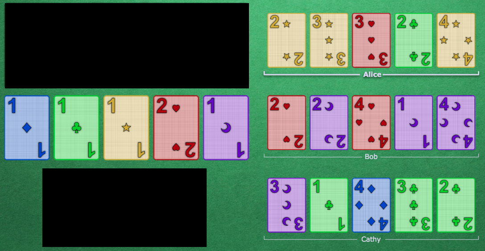
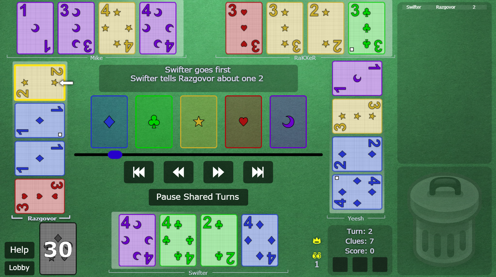

# Strategy Reference for the Hyphen-ated Group

Our group has come up with many different strategies. It is helpful to give specific names to each strategy to aid in both discussion and comprehension. If you know the general way we play but don't know about a specific kind of move, then you can look it up in this document.

If you are a new player, do not bother reading this document. It is much better to simply read the [introductory document](Beginner.md) and then start playing games with the group. This document can be used as a reference as you continue to naturally improve at the game.

Note that convention updates for the group are listed in the `#announcements` channel on the [Hanabi Discord server](https://discord.gg/FADvkJp). (You can also review the [commit history](https://github.com/Zamiell/hanabi-conventions/commits/master) of this repository.)

 

## Table of Contents

1. [First Principles](#first-principles)
2. [Examples](#examples)
3. [Level 1 - Beginner Strategies](#level-1---beginner-strategies)
4. [Level 2 - Intermediate Strategies](#level-2---intermediate-strategies)
5. [Level 2 - General Principles](#level-2---general-principles)
6. [Level 2 - Common Mistakes & Illegal Moves](#level-2---common-mistakes--illegal-moves)
7. [Level 3 - Advanced Strategies](#level-3---advanced-strategies)
8. [Level 4 - Expert Strategies](#level-4---expert-strategies)
9. [Level 5 - Rarely Used Strategies](#level-5---rarely-used-strategies)
    * [Save Clues & Non-Emergency Chop Moves](#level-5---rarely-used-strategies-save-clues--non-emergency-chop-moves)
    * [Finesses & Bluffs](#level-5---rarely-used-strategies-finesses--bluffs)
    * [Pushes & Pulls](#level-5---rarely-used-strategies-pushes--pulls)
    * [Emergency Moves](#level-5---rarely-used-strategies-emergency-moves)
    * [Ejection](#level-5---rarely-used-strategies-ejection)
    * [Discharge](#level-5---rarely-used-strategies-discharge)
    * [Miscellaneous](#level-5---rarely-used-strategies-miscellaneous)
10. [Variant-Specific Strategies](#variant-specific-strategies)
11. [Convention Attribution](#convention-attribution)

 

## First Principles

In general, we want all of our strategies to flow from some basic principles. That way, new players can just learn the first principles, and then use logic and reasoning to find out the resulting strategy that their teammate is intending. However, there are a few wrinkles with this:

1) Some of our strategies are arbitrary and do not flow from the first principles. So take the phrase "First Principles" with a grain of salt.
2) Since the principles are a little abstract, they are more useful as a reference than as an actual guide on how to play Hanabi with our group - this is what the [introductory document](Beginner.md) is for.

 

### 1. Chop Principle

* The "chop" is the right-most (oldest) unclued card.
* When a player needs to discard and has no known safe discards, they should discard the chop card.

### 2. Minimum Clue Value Principle

* A given clue must either:
  * indicate sufficient information for **one or more previously unclued** cards to be played (as a *Play Clue*)
  * prevent the possible discard of **one or more previously unclued** cards that need to be saved (as a *Save Clue*)

### 3. Save Principle

* Cards that meet the following criteria must not be discarded:
  * only one copy remains (e.g. 5's or unplayed cards in the discard pile)
  * it is a 2 and not visible elsewhere in players' hands
  * it is currently playable and not visible elsewhere in players' hands
* When a card that needs to be saved is at immediate risk of being discarded, it must be indicated with a *Save Clue* (or a *Play Clue* if it happens to be playable).
* If a player receives a clue that could be either a *Save Clue* or a *Play Clue*, they **must** consider both possibilities. Specifically, this means that the player must hold on to the card until they know for sure.

### 4. Good Touch Principle

* A safe discard is defined as:
  * a copy of a card that has already been played
  * a copy of a card that is in someone's hand and has been clued
* Safe discards should **not** be clued (unless there's an important reason to).
* Players should generally assume that any clued card in their hand will eventually be played.

### 5. Play Order Principle

* When a *Play Clue* touches multiple cards, if it includes the chop, it's focused on the chop. (This is referred to as the *Chop-Focus* convention.)
* Otherwise, the clue is focused on the newest (e.g. left-most) of the freshly-introduced cards.
* The non-focused cards may or may not be playable.

### 6. Left-Most Playable Principle

* When a player is expected to play a card (or know a card is playable) in a situation not covered by the *Play Order Principle*, the card to be played is the left-most of the various cards that are most likely to be it.

### 7. Information Lock Principle

* What is indicated by a clue is determined by the known information at the time the clue is given. Subsequent clues may build upon that information, but do not override it unless a direct conflict is evident.

### 8. Good Lie Principle

* When a *Play Clue* is given, it's a message that says the card is playable. Sometimes this message can be a lie, in order to usefully manipulate other players.
* Valid lies must not allow for the possibility of any misinformed player to give a conflicting clue or misplay. In simpler terms, this means that good lies almost always reveal themselves on the very next turn.

### 9. High Value Principle

* The highest value clue is expected. If a clue is given, it should be interpreted to be the highest value move available to that player.
* In other words, you can draw many important conclusions from the fact that a player did not do some other (potentially higher-value) move.

 

## Examples

Throughout this document, there will be a mix of both text-based examples and graphical screenshots.

In a text-based example:
* The player who goes first will always be Alice.
* The second player will always be Bob.
* The third player will always be Cathy.
* The forth player will always be Donald.
* The fifth player will always be Emily.

(This is a historical convention created by [Keldon Jones](http://keldon.net/) and follows loosely from [cryptography](https://en.wikipedia.org/wiki/Alice_and_Bob).)

A screenshot will look like the following:

Note that in this user interface, players are **not** holding their hands like they would be if they were playing in real life. Every player's hand is presented in an identical way. The left-most card (slot 1) is the newest card in the hand. The right-most card (slot 4 / chop) is the oldest card in the hand.

 

## Level 1 - Beginner Strategies

* Level 1 strategies can be learned with no games of Hanabi played. You can either learn them before you play your first game or after you play a few games to learn the basic mechanics.

### Chop

* As outlined in the [beginner guide](Beginner.md), when players have to discard, they typically discard their right-most unclued card.
* A player's chop card is formally defined as **the next unclued card that they would discard if they had nothing to do**.
* If a player has a clued card that is known useless, then they will typically discard the useless card **instead** of discarding their chop. (But the useless card does **not** count as the chop - their chop remains the right-most unclued card.)

### Play Clues & Delayed Play Clues & The Definition of Playable

* As outlined in the [beginner guide](Beginner.md), we treat all *Play Clues* as potential *Delayed Play Clues*:
  * If the card will successfully play on the stacks **right now**, then it was *Play Clue*.
  * If the card will successfully play on the stacks after other people have played cards of the same suit, then it was a *Delayed Play Clue* that was *through* other cards.
* But since we treat all *Play Clues* as *Delayed Play Clues*, this distinction is pretty much irrelevent. In this document, we use the phrase *Play Clue* to mean **either** a *Play Clue* or a *Delayed Play Clue*.
* Additionally, when we say that a card is *playable*, we do **not** mean that the card can play on the stacks right this instant. If a card is *playable*, then we mean that it would be legal to give the card a *Delayed Play Clue*. In other words, a *playable* card will eventually play on the stack because all of the preceding cards, if any, are present and accounted for.

### Save Clues

* As outlined in the [beginner guide](Beginner.md), you are **only** allowed to give a *Save Clue* to a card that is on chop.
* Furthermore, you are **not** allowed to give a *Save Clue* to just any card you want. You are **only** allowed to give a *Save Clue* on these specific cards:
  1) 5's (with a *5 Save* clue, e.g. number 5)
  2) 2's (with a *2 Save* clue, e.g. number 2)
  3) Critical cards (with either color or number)
* Additionally, everyone in the group also agrees to never let anyone discard a (unique) playable card. However, a clue to a unique playable card would be defined as a *Play Clue*, not a *Save Clue*.

### The Prompt

* The *Prompt* is a move covered in the [beginner guide](Beginner.md). It is when you get a player to play a clued card that was previously unknown.

### The Finesse

* The *Finesse* is a move covered in the [beginner guide](Beginner.md). It is when you get a player to blind-play a card to fulfill a promise that a certain card is playable right now.
* *Finesses* must be on "matching" cards. (For example, the red 1 leads directly into the red 2, so they are considered to be a "matching" pair of cards.)

### Finesse Position

* As covered in the [beginner guide](Beginner.md), a player's *Finesse Position* refers to the slot that their **left-most unclued card** is in.

 

## Level 2 - Intermediate Strategies

* Level 2 strategies should only be learned if you have played with the group a few times and have got the basics down. (5-10 games of experience or more.)
* This level contains the moves that compose our "core" repertoire. While these moves may not be used in every single game, the complexity level of all of them is fairly low, so start to get familiar with them.

### 2 Saves

* As explained in the [beginner's guide](Beginner.md), *2 Saves* must be given with a number 2 clue.
  * The exception to this rule is when the other copy of the 2 is in the discard pile. Then you can do a "normal" *Save Clue* on the 2 with a color clue.
* Players are **not allowed** to perform a *2 Save* on a 2 if the other copy of the 2 is visible in someone else's hand.
  * The exception to this rule is when the same 2 is on two people's chops at the same time. In that situation, players are allowed to *2 Save* whichever one they want. And if it is the *Early Game*, then players **must** choose to save one of them before initiating the *Mid-Game*.

### Fix Clues

* Nearly every clue that is given is either a *Save Clue* or *Play Clue*. One small exception to this is a *Fix Clue*, which is an attempt to "fix" an impending misplay.
* *Fix Clues* are often needed when a duplicate card is touched. Cards are not normally duplicated (which follows from *Good Touch Principle*), but sometimes someone makes a mistake, or a sequence of particular cards makes duplicating necessary. Duplicate cards will lead to misplays, so it is the team's responsibility to fix the problem and intervene before this happens.

* In the above screenshot:
  * Before the clue was given, Alice had an unknown purple card in her hand.
  * From *Good Touch Principle*, Alice concluded that her card must be purple 5, and had planned to play it as soon as possible.
  * Bob clues number 3 to Alice, which "fills in" the purple card and reveals that it is purple 3.
  * Since Alice was just about to play this card, Alice knows that this was a *Fix Clue* and that she can now safely discard the purple 3.

* **A clue cannot be a *Play Clue* and a *Fix Clue* at the same time.** If you receive a *Fix Clue* and it touches other ancillary cards, none of them are necessarily playable; the primary point of the clue is to fix the impending misplay.
* In the above screenshot:
  * Before the clue was given, Alice has an unknown 1 in her hand.
  * From *Good Touch Principle*, Alice concluded that her 1 must be green 1, and had planned to play it as soon as possible.
  * Bob clues blue to Alice, which "fills in" the 1 and reveals that it is blue 1. The blue clue also touches a blue card on slot 1.
  * In this situation, Alice might be tempted to think that this is a *Play Clue* on a blue 2 in slot 1, especially considering that the slot 1 card was the only brand new card introduced in the clue (and that the focus of a clue should always be on the brand new card introduced).
  * However, the fact that the blue clue "fixed" an impending misplay means that Bob may have had no choice but to clue blue, and he may not necessarily be trying to give a *Play Clue*.
  * Alice marks the blue card as either blue 2, blue 3, blue 4, or blue 5, and discards the blue 1.

### Fix Clues (That Give No Additional Information)

* Usually a *Fix Clue* will "fill in" the card to explicitly make it known that the card is unplayable or duplicated. However, it is also possible to perform a *Fix Clue* just by cluing the card again. For example:
  * Alice clues Bob number 1 and it touches three 1's.
  * Bob successfully plays two 1's.
  * Before Bob can play the 3rd 1, Alice clues Bob number 1 again, and all the clue does is re-touch the remaining 1.
  * Now it is Bob's turn. Since he was going to play the 1 already without Alice doing anything, the clue must have some other meaning. Thus, it is a *Fix Clue*: the remaining 1 is bad, and Bob can safely discard it.
* Note that in general, giving a *Fix Clue* should wait until the card is actually in danger of being misplayed (like in the previous example). If a duplicated card is not in danger of being misplayed anytime soon, then players should defer giving the *Fix Clue* until later. This way, it gives the player a chance to figure out the duplication on their own, which can happen from time to time.

### Playing Multiple 1's - Play Order Inversion in the Starting Hand (Part 1)

* If one or more 1's in your hand are clued, **you should assume that they are all playable**. (This only applies to 1's, and follows from *Good Touch Principle*.)
* We agree that playing 1's at the beginning of the game is a special case - you should always **play the 1's in your starting hand from oldest to newest**. (This is a special case because normally, *Play Clues* mean to play the left-most card.)

* In the above screenshot, on the first turn of the game, Alice clues number 1 to Bob, which touches three 1s on slot 2, slot 3, and slot 4.
* From *Good Touch Principle*, Bob knows that he can now play all 3 of these cards.
* Bob should play the slot 4 card first, and then the slot 3 card, and then the slot 2 card.

### Playing Multiple 1's - The Fresh 1's Rule (Part 2)

* If two (or more) 1's are clued in someone's hand, and one of the 1's was in the starting hand, and one of the 1's was not, then the "fresh" card is probably more important. (Otherwise, the clue might have been given earlier.)
* Thus, freshly drawn 1's should always be played before any 1's that were present in the starting hand.
* Continuing on the example in the previous section, imagine that:
  * Bob plays the slot 4 card. (He then draws a card, and all of the other cards in his hand slide over.)
  * Alice clues 1's to Bob, which touches a brand new card on slot 1 and re-touches the ones on slot 3 and slot 4.

* Bob knows that fresh 1's have precedence, so he plays the slot 1 card next. After that, he should play the slot 4 card, and then the slot 3 card (e.g. resuming the play order from before).

### Playing Multiple 1's - The Chop Focus Exception (Part 3)

* As an important exception, to the *Fresh 1's Rule*, *Chop-Focus* **overrides** the *Fresh 1's Rule*.
* For example, in a 3-player game:
  * No cards are played on the stacks.
  * Alice discards a red 4.
  * Bob discards.
  * Cathy clues number 1 to Alice, touching four 1's on slots 1, 2, 3, and 5.
  * Alice knows that the correct order to play all of the 1's in is 5, 1, 3, 2:
    * Alice knows that normally, you are supposed to play freshly-drawn 1's before 1's that were present in your starting hand. However, *Chop-Focus* overrides this rule, so she knows that the slot 5 card (her chop) should play first.
    * After that, she uses the *Fresh 1's Rule*, and knows to play the 1 in slot 1 next.
    * After that, she will play the rest of the 1's from oldest to newest (since they were in her starting hand), so she will play slot 3 and then slot 2.

### The Prompt + Finesse

* In general, remember that players will always assume *Prompts* over *Finesses*. Thus, is it possible to do a clue that *Prompts* a card from a player's hand **and then** gets them to blind-play their *Finesse Position* card on the next turn.
* For example, in a 3-player game:
  * Red 1 is played on the stacks.
  * Bob has a clued red card in his hand on slot 4.
  * Alice clues Cathy red, which touches a red 4.
  * Bob knows he must have both red 2 and red 3, but he only has one clued red card in his hand. So this must be both a *Prompt* on him and a *Finesse* on him at the same time.
  * Since *Prompts* take precedence over *Finesses*, he plays the clued red card first from slot 4 as red 2.
  * On his next turn, he blind-plays slot 2 as red 3. (His *Finesse Position* at the time of the clue was slot 1, but he drew a card, and now the red 3 slid down to slot 2.)

### The Reverse Finesse

* In a normal *Finesse*, you would give a clue to a player who comes after the player blind-playing a card. If you give a *Finesse* clue to someone who gets to have a turn **before** the blind-play occurs, it is called a *Reverse Finesse*. This is more complicated than a normal *Finesse* and is harder to see.
* Because *Reverse Finesses* exist as a strategy, before playing any cards, players should always check out everyone's *Finesse Position*. If a card in someone's *Finesse Position* is playable and "matches" the clue, then **they need to defer playing the clued card** for at least one go-around and wait to see what happens.
* If the player with the "matching" card blind-plays it, then it means that the clued card is the next card in the chain. For example, in a 3-player game:
  * It is the first turn and nothing is played on the stacks.
  * Alice clues Bob red, which touches his red 2.
  * Next, it is Bob's turn. Normally, Bob would think that he had the red 1, and play it immediately.
  * However, Bob also notices that on Cathy has a red 1 on her slot 1 position. Thus, he has to give a chance for Cathy to prove whether or not a *Reverse Finesse* is happening. If Cathy does not blind-play anything, then Bob should have the red 1, and he can play it on his next turn.
  * Bob discards.
  * Cathy blind-plays red 1. Bob now knows that he has the red 2.
* If the player with the "matching card" **does not** blind-play, then the clued card is probably the other copy, and can be played on the next turn. For example, in a 3-player game:
  * The setup is the same as the last example. Bob is clued red, so he suspects a *Reverse Finesse* is occurring and discards.
  * Cathy discards.
  * Now Bob knows that the red card in his hand is actually the red 1.

### The Self-Finesse

* It is also possible to perform a *Finesse* on a player by giving **them** a clue.
* For example, in a 3-player game:
  * All of the 1's are played on the stacks.
  * Alice clues number 3 to Cathy, touching one 3 on slot 2.
  * Bob discards.
  * Cathy knows that this was a *Play Clue* on the 3, but there are no 3's that are directly playable. Thus, someone must have the matching 2. Since Bob discarded, Cathy must be the one who has the matching 2.
  * Thus, Cathy plays her *Finesse Position* card as **any** 2. It is red 2 and successfully plays.
  * Cathy now knows that her 3 must match the 2, so she marks her 3 as red 3.
* Note that *Self-Finesses* can be difficult to perform because the player receiving the clue will **only** consider the possibility of a *Self-Finesse* **if there are no other possibilities** for the clue. For example:
  * If the clue looks like it *could* just be a normal/direct *Play Clue* on a card, then the clue receiver will not blind-play anything - they will just play the card that was clued.
  * If the clue looks like it *could* be a *Prompt*, then the clue receiver will not play anything and assume that it is a *Prompt*. (At least, until the other player has had a chance to play the *Prompted* card.)
  * If the clue looks like it *could* be a *Reverse Finesse*, then the clue receiver will not play anything and assume that it is a *Reverse Finesse*. (At least, until the other player has had a chance to blind-play the card.)

### Bluffs

* *Finesses* are quite efficient. So, when you see a playable card in someone's *Finesse Position* slot, you will often want to "get" the card with a *Finesse* (instead of cluing it directly). However, often times, the proper "connecting" card is not on the table.
* In this situation, you can perform an alternate strategy by lying to the next player. By cluing an unrelated, one-away from playable card, the next player will think that it is a *Finesse* and that they have the matching card. Then, they will blind-play their *Finesse Position* card. This is called a *Bluff*.
* After the card is blind-played, the player who received the clue will realize that something strange has happened - the type of clue **did not match** the card that was blind-played. Thus, the clued card is not currently playable and must be a one-away from playable card.
* For example, in a 3-player game:
  * All the 2's are played on the stacks.
  * Alice clues Cathy red, which touches a red 4 as a *Play Clue*.
  * Next, it is Bob's turn. Bob sees that, with this red clue, Cathy has just been signaled that she has the red 3.
  * From Bob's perspective, this looks like a *Finesse* - if Bob does not blind-play the red 3 right now, Cathy will go on to misplay the red 4 as the red 3.
  * Bob blind-plays his slot 1 card. However, it is not the red 3, it was the blue 3! Now Bob knows that he has been *Bluffed* by Alice.
  * Next, Cathy sees that Bob just blind-played a blue 3 immediately after this red clue, so she knows that she must have a one-away from playable red card - the red 4. Cathy holds on to the red 4 for later and discards.
* Except in rare circumstances, ***Bluffing* is only permissible when you are the person directly before the player who is blind-playing a card**. This is called being in *Bluff Seat*. Do not *Bluff* unless you are in *Bluff Seat*! (This follows from *Good Lie Principle*.)

### The Early Game (Intermediate Section)

* The *Early Game* is introduced in the [beginner's document](Beginner.md). In short:
  * The *Early Game* is defined as the period of time before the first discard happens.
  * Players **must** "extinguish" all of the available *Play Clues* and *Save Clues* on the board before ending the *Early Game*.
* As an intermediate player, you should note that:
  * Misplaying a card **does not count** as ending the *Early Game*.
  * Discarding known trash **does not count** as ending the *Early Game*.
  * Doing special discards that "transfer" cards to other players **does not count** as ending the *Early Game*.
* In order to squeeze as much value out of the conventions as possible, we have some extra rules about "extinguishing" every possible clue:
  * Extinguishing every clue **does** include *5 Stalling*, but it is only mandatory for the team to collectively perform one *5 Stall*. If one *5 Stall* clue has already been given and there is another *5 Stall* clue available, players are allowed (but not required) to clue it.
  * Extinguishing every clue **does not** include cluing something in the hand of the player who came directly before. This is because the player who came before did not see anything for the next player to do, and is therefore giving them "permission" to discard. In this situation, cluing is optional; players can choose to either clue the previous hand or discard at their discretion.
  * Extinguishing every clue **does not** include cluing cards that will be almost certainly be *Order Chop Moved* by an upcoming player who already has two or more 1's clued in their hand. (*Order Chop Moves* are an advanced move that is covered later.)

### 5 Stalls (Intermediate Section)

* As mentioned in the [beginner document](Beginner.md), *5 Stalls* are when a player clues an off-chop 5 purely because they want (or need) to give a stall clue.
* *5 Stalls* are usually performed in the *Early Game*. Less commonly, they can also be performed in the *Mid-Game* if a player happens to be in a special "stalling" situation where they are not allowed to discard.
* Regardless of whether they are done in the *Early Game* or the *Mid-Game*, *5 Stalls* are only allowed if there is nothing else "normal" to do (like playing a card, giving a normal *Play Clue*, or giving a normal *Save Clue*).
  * However, as an exception, players are also allowed to *5 Stall* if there is **only one** *Play Clue* remaining and it would touch a card on *Finesse Position*. (We refer to this as the *Finesse Position Exception*.)
  * The *Finesse Position Exception* also applies if the same card is in multiple *Finesse Positions* and there is nothing else to do.
  * The *Finesse Position Exception* applies for **all** situations in which players are allowed to *5 Stall*.
* *5 Stalls* **cannot** be given if there are any playable 5's. In this situation, a number 5 clue would just look like a *Play Clue* on the 5.
* *5 Stalls* **must** be given to the 5 that is closest to chop. For example, in a 3-player game:
  * It is the *Early Game*. The only thing left for Alice to do is to clue an off-chop 5.
  * Bob has two playable 1's on slots 1 and 2. He has a 5 on slot 4. Bob's 5 is therefore one-away from chop.
  * Cathy has nothing clued in her hand. She has a 5 on slot 3. Cathy's 5 is therefore two-away from chop.
  * Alice must clue number 5 to Bob as a *5 Stall* since his 5 is closer to chop (even though Bob has two playable cards).
* Some additional rules for *5 Stalls* are found in the section on [the *Early Game*](#the-early-game-intermediate-section).

### The Chop Move

* Normally, players discard their oldest (right-most) unclued card. However, sometimes a player can know that an unclued card is very important.
* A *Chop Move* is a special kind of move that indicates to a player that the unclued card that is currently on their chop is very important.
* After the *Chop Move*, the player considers the card on their chop to be touched with an "invisible" clue. Thus, their chop will "move" to the next right-most unclued card.
* A *Chop Move* is permanent, meaning that a *Chop Moved* card should not be discarded for the remainder of the game.
* Several kinds of *Chop Moves* are listed below.

### The Trash Chop Move

* See the *Chop Move* section above for an explanation on what a *Chop Move* is.
* In the middle of a game, if all of the 1's have been played already, and someone clues a 1, this is quite strange. (From *Good Touch Principle*, players are not supposed to touch cards that have already been played.) In this situation, the 1 is considered "trash".
* The clue must have some deeper meaning. We agree that it means that the cards to the right of the trash are important. The point of the clue was to give the player a safe discard.
* However, in addition to giving a safe discard, it should also *Chop Move* **all** of the cards to the right of the trash.
* For example, in a 3-player game:
  * All of the 1's are played.
  * Bob has a completely unclued hand.
  * Alice clues 1's to Bob, which touches a 1 in his slot 4.
  * Bob *Chop Moves* his slot 5.
  * Bob discards the 1.
  * Bob's chop is now his slot 4.
* Most of the time, the *Trash Chop Move* is done for a single card (meaning that the trash card that was clued was one-away from chop). However, you can also use the *Trash Chop Move* to *Chop Move* multiple cards. For example, in a 3-player game:
  * All of the 1's have been played on the stacks.
  * Bob has a completely unclued hand.
  * Alice clues 1's to Bob, which touches a 1 in his slot 1.
  * Bob *Chop Moves* his slot 2, his slot 3, his slot 4, and his slot 5 (a quadruple *Chop Move*).
  * Bob discards the 1.
  * Bob's chop is now his slot 1.
* This move is most commonly done with a number 1 clue because it is likely that in the middle of a game, all of the 1's will be already played. But it could also be done with a number two 2 clue if all the 2's are already played / accounted for. Or, it could be done with a red clue if all of the red cards are already played / accounted for. And so forth.
* Strategy wise, the *Trash Chop Move* is used for two main reasons:
  1) Sometimes there are multiple critical cards in a row on chop and it falls to one player to save all of them. In this situation, a multiple-card *Chop Move* could be the only way to do it.
  2) Some cards (e.g. a one-away from playable 3) are quite useful to the team, but "illegal" to touch directly (as touching them directly with a clue would imply that they are playable right now). If the game is going well, then it can be useful to "waste" a clue in order to have the card saved permanently.
* Note that you are **not** allowed to *Trash Chop Move* a card that you can just clue directly with a *Save Clue* (unless there are multiple critical cards in a row on chop and you have no other choice). This is because having some positive information is always better than having the card be a mystery.
* If a *Trash Chop Move* touches **multiple** trash cards, then it only *Chop Moves* the cards to the right of the right-most trash card. For example, in a 3-player game:
  * All the 1's are played on the stacks.
  * Bob has a completely unclued hand.
  * Alice clues 1's to Bob, which touches a 1 in slot 2 and a 1 in slot 4.
  * Bob **only** *Chop Moves* his slot 5 card.

### Chop Moves & New Clues

* See the *Chop Move* section above for an explanation on what a *Chop Move* is.
* Once a card has been *Chop Moved* and is no longer in danger of being discarded, it is treated as an already-clued card with regards to new clues given to that hand. For example, in a 3-player game:
  * All of the 1's have been played on the stacks.
  * Bob has a completely unclued hand.
  * Alice clues 1's to Bob, which touches a 1 in his slot 4.
  * Bob *Chop Moves* his slot 5.
  * Bob discards the 1.
  * Bob's chop is now his slot 4.
  * Cathy clues blue to Bob, which touches his slot 1 (the card he just drew) and his slot 5 (the card that was just *Chop Moved*).
  * Bob knows that the focus of the clue is always on the brand-new card introduced, so this is **not** chop-focus, and the focus of the clue is on slot 1.
  * Thus, Bob will play blue 2 from slot 1 on his next turn.

### Chop Moves & Prompts

* See the *Chop Move* section above for an explanation on what a *Chop Move* is.
* *Chop Moves* interact with *Prompts* & *Finesses* in a potentially confusing way. *Chop Moved* cards should **not** be played into *Prompts*, even though they are imagined to have an "invisible" clue on them. For example:
  * All the 1's are played on the stacks.
  * Bob has no cards clued in his hand, but he is *Chop Moved* for a mystery card on his slot 5.
  * Alice clues Cathy red, which touches a red 3.
  * Bob knows that he is promised the red 2. If this is a *Finesse*, then he has the red 2 on his *Finesse Position* (slot 1).
  * However, Bob is also *Chop Moved* for a card. Bob knows that *Chop Moved* cards have an "invisible" clue around them, and Bob also knows that *Prompts* are said to take precedence over *Finesses*.
  * So should he play his slot 1 as a *Finesse* or his slot 5 as a *Prompt*? In this situation, Bob knows that *Prompts* do not apply to *Chop Moved* cards, so Bob should play his slot 1.

### The 5's Chop Move

* See the *Chop Move* section above for an explanation on what a *Chop Move* is.
* Normally, we are only allowed to save 5's on chop (unless it is done with a *5 Stall* clue, which can happen in the *Early Game* and other "stalling" situations).
* So, if a number 5 clue is performed on a 5 that is not on chop, and it is **not** a stalling situation, then it will normally look like a *Play Clue* on that 5.
* However, if the 5 is **one-away** from chop (or, if two or more 5's are clued and the right-most 5 is one-away from chop), then we agree that it has a special meaning, and that the clue is **not** a *Play Clue* at all.
* Instead, it is understood that the clue is a *5's Chop Move*, and the player should *Chop Move* in a manner similar to the *Trash Chop Move*.
* Note that the *5's Chop Move* is different than the *Trash Chop Move* in that you can only chop move **one** card with it. Thus, if you clue a 5 and it is **two** (or more) slots away from the chop, then it is to be assumed to be a *Play Clue* on the 5.
* Similar to the *Trash Chop Move*, if a *5's Chop Move* touches **multiple** 5's, then it only *Chop Moves* the cards to the right of the right-most 5. For example, in a 3-player game:
  * All the 1's are played on the stacks.
  * Bob has a completely unclued hand.
  * Alice clues 5's to Bob, which touches a 5 in slot 2 and a 5 in slot 4.
  * Bob **only** *Chop Moves* his slot 5 card.

### The Scream Discard Chop Move (Deliberately Discarding Instead of Playing)

* See the *Chop Move* section above for an explanation on what a *Chop Move* is.
* The *Chop Move* outlined above is a tool to save multiple cards with one clue. However, sometimes you may not have a clue at all. One way to solve this situation is with a special kind of discard.
* Typically, discarding is a last resort. So, if you have a known playable card in your hand, you can send a powerful message to your teammate by discarding instead. This is called a *Scream Discard*. Since your teammate expected you to play the card, it is like screaming at them to let them know that things are very bad.
* The player being "screamed at" should permanently move their chop by one position.
* Furthermore, the player being "screamed at" is not allowed to discard on this turn. Instead, they must give a clue. If there are no normal *Play Clues* or *Save Clues* to give, then they are allowed to give "stall" clues, like a *5 Stall*. If there are no *5 Stalls* to give, they can even just "fill-in" some information on an already-clued card (and doing this should not cause a *Finesse*).
* Players are only allowed to *Scream Discard* for **cards that are playable or critical** (or a needed 2 that isn't seen anywhere else). (This follows from *Save Principle*.)
* Players are **not** allowed to *Scream Discard* for cards that are one-away from being playable.
* Players are **not** allowed to *Scream Discard* if there was some other, less dangerous way to save the card. It is a "last resort" move.
* Sometimes, a player will discard with a known-playable card in their hand, but they are **not** intending a *Scream Discard* - it is some other special situation:
  1) It is not a *Scream Discard* if the next player **has** to generate a clue for cluing the next player after that. This is called a *Generation Discard*; see below.
  2) It is not a *Scream Discard* when the card that the player did not play was a "blind" card from a *Finesse* **and** the blind card could also be in the next player's *Finesse Position*. When this happens, the next player will usually want to blind-play their *Finesse Position* card, since this sequence of events indicates either an *Ambiguous Finesse* or a *Pass Bluff* (which are both covered later on).

### The Generation Discard

* Usually, if someone has a known playable card and they discard instead of playing that card, this would indicate a *Scream Discard Chop Move*.
* However, if playing the card (player 1) would cause the next player to discard (player 2) and the next player after that (player 3) to have a critical and/or playable card "ride" on chop, it is a very bad situation. Thus, the discard is **just** for the purposes of generating a clue so that player 2 can clue player 3.
* The *Generation Discard* is **only** to be used as a last resort. If player 3 has something else to do (like play a card or give some obvious clue), then player 1 should just play their card and let the card "ride" on chop.

### A Scream Discard Flowchart

[Here is a handy flowchart](https://raw.githubusercontent.com/Zamiell/hanabi-conventions/master/img/flowcharts/scream_discard_flowchart.png) for determining whether something is a *Scream Discard Chop Move* or a *Generation Discard*. (It also mentions a more advanced move called an *Echo Scream Discard Chop Move*, but you can safely ignore that for now.)

### The Tempo Clue (Re-cluing a Card to Play)

* *Tempo Clues* are defined as clues that "get" no new cards. Their purpose is to get 1 or more cards played that **already** had a clue on them.
* Note that *Tempo Clues* do **not** meet *Minimum Clue Value Principle*, so we do not generally perform them. However, in the following special circumstances, *Tempo Clues* have enough value to justify giving them:
  1. When it gets 2 or more clued cards to play
  2. When the clued card is "out of order" (meaning that it is impossible for a *Prompt* to get the card played)
  3. When the clued card was *Chop Moved* and it is now playable
  4. When playing the clued card would "unlock" someone's hand (see the section on *Locked Hands* later on)
  5. When the clue giver is in a situation that requires them to stall (e.g. the player is *Locked*, etc.)
* When a *Tempo Clue* touches multiple cards, the focus is on the left-most card.
  * The exception is if one of the cards was previously *Chop Moved*. In that case, the focus is on the left-most *Chop Moved* card.
* If a *Tempo Clue* touches multiple cards, it typically means that all the touched cards are playable. See the *Double Tempo Clue* section below.
* Since they are so inefficient, *Tempo Clues* done outside of the special circumstances listed above are assigned a special meaning. See the *Tempo Clue Chop Moves* section below.

### The Double Tempo Clue (Re-cluing 2+ Cards to Play)

* Typically, when a *Tempo Clue* is given that touches two or more cards, it means that **all** of the cards touched are playable in order from left to right.
* For example, in a 3-player game:
  * It is the first turn and nothing is played on the stacks.
  * Alice clues red to Bob, which touches slot 1, slot 2, and slot 3.
  * Bob plays red 1 from slot 1. The other two red cards in his hand could be nearly anything.
  * Cathy clues red to Bob, which does not introduce any new cards, but it does re-touch slot 2 and slot 3.
  * Bob knows that this is a *Double Tempo* clue. Both must be playable in order, so he must have red 2 in slot 2, and red 3 in slot 3.
* Note that the normal "play all the cards" interpretation does not apply in some special situations:
  * when the clue unlocks a player's hand
  * when the clue got 2+ cards played in total (using cards in someone else's hand)
  * when the clue touched a *Chop Moved* card; in this situation, **only** the *Chop Moved* card is playable

### The Tempo Clue Chop Move

* See the *Chop Move* section above for an explanation on what a *Chop Move* is.
* In general, *Tempo Clues* do not follow from *Minimum Clue Value Principle*, which states that a clue must get at least 1 new card played or save at least 1 new card from being discarded.
* Thus, a *Tempo Clue* with no other purpose **must** save at least 1 new card, and the player should *Chop Move* their chop card.
* For example, in a 3-player game:
  * It is the first turn and nothing is played on the stacks.
  * Alice clues red to Bob, which touches two cards on slot 1 and slot 2.
  * Bob plays red 1 from slot 1. The red card in slot 2 could be red 2, red 3, red 4, or red 5.
  * Cathy clues number 2 to Bob, which does not introduce any new cards, but it does "fill in" his slot 2 card.
  * Bob now knows that he has exactly red 2 on slot 2 and that this was a *Tempo Clue*. Since it does not get any new cards and only get tempo on one card in total, he knows that he should also *Chop Move* his slot 5 card.
* Naturally, *Tempo Clue Chop Moves* **do not** apply in the special situations listed above where natural *Tempo Clues* are allowed.
* Normally, when two cards are retouched with a clue, it is a *Double Tempo Clue* and the player should play both cards. However, this interpretation does not apply if the second card is strictly not playable. In this situation, all players can see that since only one card is getting tempo, the interpretation of the clue should be a *Tempo Clue Chop Move*.
* For example, in a 3-player game:
  * Red 1 is played on the stacks.
  * Green 4 is in the trash.
  * Bob has:
    * a green 4 on slot 3 with no clues on it yet (on chop and critical)
    * a red 2 on slot 4 with a 2 clue on it
    * a red 5 on slot 5 with a 5 clue on it
  * Alice clues red to Bob, which re-touches his slot 4 card and his slot 5 card, "filling" both of them in.
  * Bob knows that this is a *Tempo Clue*, and plays red 2.
  * In most cases, since two cards were re-touched, they should both be playable. However, Bob knows that the red 5 is strictly not playable right now. Thus, since the clue did not get any new cards and only got tempo on one card in total, he knows that he should also *Chop Move* his slot 3 card.

### Double Discard Situations

* Often times in Hanabi, two players will discard in a row. However, in rare cases, this can cause a perfect score to be lost.
* For example, in a 3-player game:
  * Alice has nothing to do. Alice discards her chop and it is a red 4.
  * Bob has nothing to do. Bob also has a completely unclued hand. Bob discards his chop and it is the other copy of the red 4.
  * Since both copies of the red 4 are discarded, it is no longer possible to get a perfect score. (The maximum score now is 23 instead of 25.)
  * Normally, someone on the team would give a *Save Clue* to Bob's red 4 before it could get discarded. But since Bob's turn was immediately after Alice's turn, no-one on the team had time to save it.
* In the above example, on Bob's turn, since Bob *could* have the red 4 on his chop, we would say that Bob is in a *Double Discard Situation* for the red 4.
* More formally, a *Double Discard Situation* is defined as when the previous player discards or misplays an unplayed card **and** the current player could be discarding the other copy of that card.
* Players agree to **never** discard in a *Double Discard Situation* if it has the potential to lower the maximum score. Instead, they must give some clue. If there are no normal *Play Clues* or *Save Clues* to give, then they are allowed to give "stall" clues, like a *5 Stall*. If there are no *5 Stalls* to give, they can even just "fill-in" some information on an already-clued card (and doing this should not cause a *Finesse*).
* Let's revisit the above example to show what Bob should have done:
  * Alice has nothing to do. Alice discards her chop and it is a red 4.
  * Bob has nothing to do (meaning that there are no normal *Play Clues* or *Save Clues* to give). Bob also has a completely unclued hand.
  * Bob's chop is his slot 5 card. Since Bob does not see the red 4 in anyone else's hand and Bob's slot 5 card has no positive or negative clues on it, it is possible that Bob's slot 5 card could be the red 4. Thus, Bob knows that he is currently in a *Double Discard Situation* for the red 4.
  * Since there are no normal *Play Clues* or *Save Clues* available, Bob looks around to see if he can give a *5 Stall*. Bob sees that Cathy has a red 5 on her slot 1, so he clues number 5 to Cathy as a *5 Stall*.
  * Cathy knows that since Bob was in a *Double Discard Situation* for the red 4, she should not read too closely into his clues. This number 5 clue must just be a *5 Stall* (as opposed to a *Play Clue* on the 5).

 

## Level 2 - General Principles

While the other sections in this document contain lists of special "moves", this section only contains general principles. We refer to them in post-game reviews and when thinking about the game.

### Trash

* *Trash* cards are defined as cards that have already been played. Thus, they are useless to the team.
* Players should generally avoid "touching" trash cards with a clue, as doing so would violate *Good Touch Principle*.
  * Rarely, it can be useful to deliberately clue a trash card and violate *Good Touch Principle* in order to perform a special move. Several such moves are covered later on in this document.
* In the case where a suit is partially "dead", the unneeded cards are also considered trash. For example, if both copies of the red 3 have been discarded, then the red 4 and the red 5 are both considered trash.

### Efficiency

* A big part of Hanabi is of trying to be as efficient as possible. This means that players will generally try to "get" as many cards with one clue as possible.
* If you use one clue to get one card, we refer to that as a 1-for-1 clue. For example:
  * On the first turn of the game, Alice clues Bob number 1, touching one 1 as a 1-for-1.
* If you use one clue to get two cards, we refer to that as a 2-for-1 clue. For example:
  * On the first turn of the game, Alice clues Bob number 1, touching two 1's as a 2-for-1. (Bob will play both.)
* 3-for-1 clues are even better than 2-for-1 clues, and so forth. It is even possible to perform a 9-for-1 clue with advanced techniques.
* If a clue touches two cards but only one of them will play right now, it **still counts** as a 2-for-1. This is because we assume that all touched cards will eventually play from *Good Touch Principle*. For example:
  * On the first turn of the game, Alice clues Bob red, touching a red 1 on slot 1 and a red 5 on slot 2 as a 2-for-1. (Bob will only play the red 1 and save the other red card for later.)
* On Hanabi Live, the current efficiency is shown on the right side of the screen. Efficiency is calculated by the following formula:
  * `(number of cards played + number of unplayed cards with one or more clues "on" them) / number of clues given`
* **If efficiency is low, players should probably not perform 1-for-1 clues!** Instead, it is better to discard and try to let someone perform a *Finesse*.

### Tempo

* *Tempo* is a term used to describe the speed at which cards are played. (This is similar to how it is used in other games such as chess.)
* Hanabi can be thought of a race to get all the cards played before the time runs out. This means that even if the team is being extremely efficient, they can still lose the game if they are not playing their cards fast enough. Thus, players have to **strike a balance between efficiency and tempo**.
* At the beginning of the game, there is a lot of time left, so players will generally prefer clues that get a lot of efficiency over clues that get a lot of tempo.
* At the end of the game, there is almost no time left, so players stop caring about efficiency and start caring only about tempo.
* On Hanabi Live, "Pace" is shown at the right side of the screen, which is a measure of how many more discards can occur. Starting pace is calculated by the following formula:
  * `current score + cards in deck + number of players - maximum score`
* Even at the beginning of the game, players might prefer a clue that gets tempo over a more efficient clue if it will prevent the discard of some other useful card. It all depends on the context of the game!

### Misplay Cost Principle

* On a turn where a player misplays and accumulates a strike for the team, they could have discarded instead and generated a clue.
* So, if you can spend one clue to stop one misplay, the value comes out even.
* Thus, since there are only 2 strikes allowed and accumulating strikes limits flexibility, it is almost always worth it to spend one clue to stop one strike.
* If it would require two clues to stop an impending misplay, then as long as the strike would not lose the game, it is usually best to let the player misplay the card and get a strike.

### Stomping on a Finesse

* This is when a player clues a card directly that was going to be blind-played from a *Finesse*. Typically, this is a mistake, and it means that the player who gave the clue was not paying attention and failed to see that a *Finesse* happened at all.

### Lines

* During your turn, part of figuring out the best move involves looking into the future to see what the next player will do. If they discard, will it be okay? Is there some obvious clue that they will do? And so on.
* As you get better at Hanabi, you will need to do this prediction not just for the next player, but for an entire go-around of the table. And as you really get good at Hanabi, you will need to do this for as far in the future as you can reasonable predict. (Sometimes, this means 15 moves or more in the future.)
* Similar to chess, initiating a move in which you can predict the next sequence of moves is called initiating a "line".
* In post-game reviews, we will often compare and hypothetically "play through" two different lines to see which one is better.

### Discard Modulation

* Often times, either you or the player who comes after you can perform a clue. And the clue would have the same result if done by either player. So who should do it?
* One way to decide is to look at the next player's chop. Is their chop high-value, low-value, or useless? If it is high-value, then you should discard and let them give the clue. If it is low-value or useless, then you should give the clue and let them discard.
* "Stealing" clues in this way is called *Discard Modulation*. If other players are discarding to let you give all of the clues, you probably have a high-value chop.
* For example, in a 3-player game:
  * All the 1's are played on the stacks except for the red 1.
  * It is the *Early Game*.
  * Alice plays the red 1 from her hand. (It was clued earlier with a *Play Clue*.)
  * Bob sees that from Alice's perspective, there is nothing in Cathy's hand to clue.
  * Cathy has a red 3 on chop. This is a one-away-from-playable card that is valuable to the team. However, it would be illegal to clue the card directly with a *Play Clue* or a *Save Clue*.
  * Alice has a red 5 on chop. According to the *Early Game* rules, someone must clue the 5 before ending the *Early Game*. However, Bob knows that as an exception, it is not required to clue the person who came immediately before you. When Alice played the red 1 and did not see anything for Bob to do, Alice was giving permission to Bob to discard.
  * Bob decides to discard instead of saving the 5 in Alice's hand.
  * Cathy clues number 5 to Alice as a *5 Save*.
  * Bob has smartly prevented the discard of the red 3, at least for a little while. This kind of strategy is called *Discard Modulation*.
* For example, in a 3-player game (a similar situation):
  * All the 1's are played on the stacks except for the red 1.
  * It is the *Early Game*.
  * Alice plays the red 1 from her hand. (It was clued earlier with a *Play Clue*.)
  * Bob sees that from Alice's perspective, there is nothing in Cathy's hand to clue.
  * Cathy has a red 1 on chop. This is a trash card.
  * Alice has a red 5 on chop. According to the *Early Game* rules, someone must clue the 5 before ending the *Early Game*. However, Bob knows that as an exception, it is not required to clue the person who came immediately before you. When Alice played the red 1 and did not see anything for Bob to do, Alice was giving permission to Bob to discard.
  * Bob decides to ignore the exception and save the 5 in Alice's hand anyway.
  * Cathy discards the red 1.
  * Bob has smartly orchestrated a line in which a useless card was discarded. This kind of strategy is called *Discard Modulation*.

### One-Away From Playable

* In general, 3's are pretty high value, and 4's are pretty low value.
* But combined with this, cards that are one-away from playable are pretty high value, and cards that are two-away (or more) are pretty low value.
* Thus, in some situations, a one-away 4 may be more valuable than a two-away 3.
* According to our conventions, it is illegal to clue a one-away from playable card as the focus of the clue without it being some kind of special move like a *Finesse* or *Bluff*. However, sometimes we still want to "save" these cards. Thus, they are prime targets for indirect saves like the *Trash Chop Move* or the *5's Chop Move*.
* However, in most cases, *Chop Moving* the valuable card just won't be possible. So in general, you should try to construct lines that protect high-value cards from being discarded for as long as possible.

### The All 4's Test

* According to *Save Principle*, the team must not let any critical and/or playable cards be discarded. So part of constructing a line is figuring out whether this might happen.
* When considering a line, it is not safe to assume that a player will clue anything in your hand. You should perform the *All 4's Test*: what would everyone do if I have all useless 4's in my hand? If a critical and/or playable card would get discarded, then the line has failed the test, and it is probably a bad idea.

### Schrödinger's Cat Principle

* Often times when you are given a clue, the card could be two or more things. For example:
  * In a no-variant game, a red *Play Clue* might indicate a red 2 or a red 3 depending on whether or not red 2 will blind-play from someone else's hand.
  * In a rainbow-game, a red clue might indicate either a *Play Clue* on a red 1 or a *Delayed Play Clue* on a rainbow 2 through another player's yet-to-be-played rainbow 1.
* After getting a clue, you should immediately mark all of the possibilities down on the card as a note.
* For all of your subsequent turns, you have to treat that card like it is **all of the possibilities** at the same time. This is a lot like the *Schrödinger's Cat* quantum physics analogy, which states a cat is both alive and dead at the same time, and you won't know until you actually open the box and look. Similarly, treat the unknown card as all the possibilities, and you won't actually know until the card is played.
* The implications of *Schrödinger's Cat Principle* is that players must be very careful - before playing a card, they will often have to wait for everyone else to have a turn to allow for the possibility of a *Prompt*, *Reverse Finesse*, and so forth.

### Clue Interpretation & Occam's Razor

* When a clue could have multiple interpretations, usually *Schrödinger's Cat Principle* is involved - players must wait a round and see what their teammates do in order to find out the true meaning of the clue. But what if a clue could have multiple interpretations and a player does **not** have to wait for information from anyone else?
* In this situation, players should use *Occam's Razor* - always assume the simplest possible interpretation.
  * First, assume a direct *Play Clue* or a *Delayed Play Clue*.
  * If that is impossible, assume a *Prompt*.
  * If that is impossible, assume a *Finesse*.
  * If that is impossible, assume a *Bluff*.
* Similarly, players should also use *Occam's Razor* to tell the difference between the various kinds of *Finesses* and *Bluffs* and special moves - they should always prefer the "move" that gets the least amount of blind-cards played. (A move that only gets a single blind card played is simpler than a move that gets two blind cards, and so forth.)

### Team Distribution Principle

* In general, it is better for useful cards to be distributed **evenly** throughout the team. This is especially important in 5-player games.
* Thus, if one of your teammates has 3 out of 4 cards clued, it may be better for **them** to be the one giving the clues, and you to be the one discarding - even if their chop is known trash.
* There are multiple reasons for this. First, you don't want them to get a *Locked Hand*, which is generally bad. Second, if they continue to draw playable cards, the game may end before they get a chance to play them all.

### Bluff Seat and the Pang of Guilt

* As mentioned in the section on *Bluffs*, you are in *Bluff Seat* for a certain player if you are immediately before them.
* Before cluing a card directly, you should first consider if it is on *Finesse Position*. If it is, and you clue it directly, you may be "stealing" someone's *Finesse* or *Bluff*.
* Thus, in this situation, it may be better to discard and let the player in *Bluff Seat* get the card. If you do decide to clue the card directly, you should always feel a *Pang of Guilt*.

### End-Game Threshold (End Game)

* Towards the end of the game, the strategy of the team will change. In most games, you stop becoming concerned with efficiency and become more concerned with tempo - every card needs to play **right now** before the game ends!
* Thus, since clues can mean different things depending on whether you are in the *Mid-Game* or the *End-Game*, you need to be able to keep track of when the *End-Game* has arrived.
* A value called *Pace* is used to determine *End-Game* status. *Pace* is calculated by the following formula: `current score + cards in deck + number of players - maximum score`
  * On [Hanabi Live](https://hanabi.live), the user interface will calculate this for you on the right side of the screen.
* Pace is essentially the maximum amount of discards that can happen while still having a chance to get the maximum score.
* If pace is **less than the number of players**, the *End-Game* has arrived.
  * On [Hanabi Live](https://hanabi.live), pace will turn yellow when this occurs.
* If pace is **less than the number of players / 2**, you should be very careful with discarding. It might still be the best thing to do, but if there are enough clues in the bank, it is usually better to *Burn* a clue (meaning to deliberately waste a clue).
* If pace is 0, no more discards can happen in order to get the maximum score.
* If pace is below 0, it is impossible to get the maximum score.

### The Pace +1 Rule

* Players can use *Pace* to determine if it is safe to discard. In general, a group can discard down to pace 0 and still get a perfect score.
* However, as a rule, if pace is +1 and one of the players on your team **does not** have any playable cards, then you cannot discard - **you must let them perform the final discard**.
* If both you and another player do not have any playable cards, then you can do the final discard - the team won't be able to get a perfect score anyway. But if you you **could** have an unknown useful/playable card in your hand, then you should be very careful about discarding, because it could ruin a perfect score.

### Burning (End-Game Stalling)

* In the *End-Game*, often times there are still a lot of cards yet to be played. Thus, you need to be very careful when discarding, since by drawing a card you can make the game end before everyone has a chance to play all of the cards.
* If there are enough of clues available, you can choose to stall, by giving a low-value (or even a completely useless) clue. This is referred to as *Burning* a clue.
* The best way to give a useless clue is to re-clue cards which are already known to be playable.
* Give a *Burn Clue* if:
  * There is a possibility that the game can be completed without anyone discarding from now on.
  * You have two or more useful cards in your hand, and you want to follow *Team Distribution Principle*.
* Do not give a *Burn Clue* if:
  * The end-game has not started yet (see the *End-Game Threshold*).
  * You know that someone else will have to discard in the future.

### Recognizing *Finesses* on Other Players (Part 1)

* Sometimes, a player will give a clue that looks like it could be either a *Finesse* or a *Bluff*. Between these two moves, which should have precedence?
* For example, in a 4-player game:
  * All of the 1's are played on the stacks.
  * Cathy has a blue 2 on her *Finesse Position*.
  * Alice clues blues to Donald, highlighting a blue 3 as a *Play Clue*.
  * Now, it is Bob's turn.
* What to think **depends** on whether you are Bob or whether you are someone else on the team.
* First, let's consider the case of Bob, the very next player. Bob should **always assume a *Finesse* over a *Bluff***. From his perspective:
  * Bob knows that if this is a *Finesse*, then Cathy will blind-play the blue 2, and then Donald will know that he has the blue 3. If this is the case, Bob should not do anything special.
  * Bob also knows that if this is a *Bluff*, then Bob should blind-play his *Finesse Position* card immediately.
  * Bob knows that if there is any way that this could be a *Finesse* (the truth), he should **assume that the truth is being told**. Thus, Bob knows that it must be a *Finesse* on Cathy and should not blind-play anything.

### Telling the Difference Between a Finesse and a Bluff (Part 2)

* With the previous section in mind, let's switch examples and assume that Alice did a clue and then Bob blind-played a card.
* So secondly, we can consider the case of Bob **after** he has blind-played a card, which also extends to the rest of the team. How does everyone know whether Alice did a *Finesse* or a *Bluff* on Bob?
* The way to find out is to look at **whether the card that blind-played "matches" the clue that was given**. If the clue matches, then it is a *Finesse*. If the clue did not match, then it is a *Bluff*.
* If it is ambiguous whether or not the card matches, then the team should **always assume a *Bluff* over a *Finesse***. (Note that this is the opposite of the precedence in part 1!)
* Example 1 (color match):
  * Blue 1 is played on the stacks.
  * Alice clues Cathy about a blue card.
  * Bob blind-plays a blue 2.
  * This must be a *Finesse*, because **blue matches blue**. So Cathy should think that she has the blue 3.
  * This is a textbook *Finesse*; you can't get any more basic than this.
* Example 2 (color mismatch):
  * Blue 1 is played on the stacks.
  * Alice clues Cathy about a blue card.
  * Bob blind-plays a red 1.
  * This must be a *Bluff*, because **red does not match blue**. So Cathy should think that she has the one-away from playable blue card, blue 3.
  * This is a textbook *Bluff*; you can't get any more basic than this.
* Example 3 (color match with rainbow):
  * This is a game with a rainbow suit. (The other examples in this section assume a "No Variant" game.)
  * Rainbow 1 is played on the stacks.
  * Alice clues Cathy about a blue card.
  * Bob blind-plays a rainbow 2.
  * This must be a *Finesse*, because **blue matches blue** (rainbow cards match every color). So Cathy should think that she has the rainbow 3.
* Example 4 (rank match):
  * Blue 2 is played on the stacks.
  * Alice clues Cathy about a 4.
  * Bob blind-plays the blue 3.
  * This must be a *Finesse*, because **3 matches 4**. So Cathy should think that she has the blue 4.
* Example 5 (rank mismatch):
  * Blue 2 is played on the stacks.
  * Alice clues Cathy about a 4.
  * Bob blind-plays the red 1.
  * This must be a *Bluff*, because **1 does not match 4**. So Cathy should think that she has the one-away from playable 4, the blue 4.
  * The point of example 5 is to show that because a 2 happens to be played on the stacks, the blue 4 is a one-away-from-playable card and therefore becomes a legal *Bluff* target.
* Example 6 (rank mismatch where a *Bluff* is impossible):
  * This is a 4-player game.
  * Nothing is played on the stacks.
  * Alice clues Donald about a 4.
  * Bob blind-plays the red 1.
  * Cathy discards.
  * This **cannot** be a *Bluff*, because there are no one-away from playable 4's. So even though 1 does not match 4, this must be a *Finesse*, because Alice is not allowed to perform a *Bluff* with any card that she wants.
  * Donald does not see any other red cards in Bob's hand. So Donald should think that he has the red 4, because that would match the blind-play of a red 1. Subsequently, Donald must have red 2 on his *Finesse Position* and red 3 on his *Second Finesse Position*.

### Urgency Principle (How to Tell If Someone Is Finessed)

* Normally, when a *Finesse* or *Bluff* occurs, someone blind-plays right away. This is extremely important, because it resynchronizes the information amongst the team. So, as a group, we always agree to blind-play our cards are soon as reasonably possible. This is called *The Urgency Principle*.
* Thus, if you see that a player does **not** blind-play into the *Finesse* or *Bluff*, then you know that the *Finesse* must be **on you**.
* However, there are some important exceptions:
  1) Players are allowed to **defer** playing into a *Finesse* or *Bluff* if they are doing a *Finesse* or *Bluff* of their own (and no-one else on the team could have done it).
  2) Players are allowed to **defer** playing into a *Finesse* or *Bluff* if they are doing something really important, like saving a 5 on chop, giving a *Play Clue* to a card that is about to be discarded, or something along those lines.
* So, if any of the above two conditions apply, then you have to **wait** and give the player yet another turn to demonstrate whether or not they will blind-play.

### Guide Principle

* Part of Hanabi involves making sure that if you perform an action, someone else on the team won't discard anything important (*Save Principle*). Additionally, part of Hanabi involves accounting for all the possibilities (*Schrödinger's Cat Principle*).
* Combined, these two principles usually result in players taking the most conservative possible approach, even if a certain action would have a very low risk of losing the game.
* One exception to the above rules is when Bob does not know whether or not a *Finesse* or *Bluff* is occurring. For example, in a 3-player game:
  * No cards are played on the stacks.
  * Alice clues red to Cathy, touching a red 2 as a *Play Clue*.
  * Bob does not see any red 1's in anyone else's hand. Thus, Bob knows that Alice intends for him to blind-play a card.
  * From Bob's perspective, it can be either a *Finesse* (on exactly red 1) or a *Bluff* (on the 1 of any of the other suits).
  * Cathy also has a critical 5 in chop.
  * If this is a *Finesse*, then Bob will blind-play the red 1, and Cathy will play the red 2. If this is the case, Cathy will never be at risk of discarding the 5 and losing the game.
  * If this is a *Bluff*, then Bob will blind-play some other 1, and Cathy will have nothing to do. If this is the case, then Cathy could discard and the team could lose the game.
  * Should Bob risk blind-playing or should he save the 5?
* In this example, it follows from *Save Principle* that Bob should "play it safe" and give a *5 Save* to the 5 and *then* try to blind-play the red 1 on the next turn.
* However, Bob also knows from *Good Lie Principle*, lies have to resolve immediately. If Bob saved the 5, and then blind-played on the next turn, and it turned out to be a *Bluff*, then the lie would not have resolved immediately. Thus, from *Good Lie Principle*, Bob can assume that this is a *Finesse*.
* Stated in a different way, Bob has to trust that Alice is successfully "guiding" the rest of the team with the line that she has chosen. This means that Bob is going to play exactly red 1 into the red 2. Alternatively, it could also be the case that it is a *Bluff*, but Cathy will not discard, and will clue some card in Bob's hand. Either way, the 5 will be safe. This is called *Guide Principle*.

### Context

* If you are reading this section, you are presumably an intermediate Hanabi player who has the fundamentals down. So, now is a good time to clear up a potential misconception that you may have about the Hyphen-ated conventions (and this reference document more generally).
* Up until now, you may have the impression that the group has a lot of conventions, and that if you just memorize all of the conventions, you will become a really good Hanabi player. Or, you may have the impression that the conventions are like laws and that you must always follow them. Neither of these things are true.
* *Context* is defined as all of the meta-information about the game state. In intermediate and expert games, when determining what a clue means, players must **always** take into account the full context of the game. This means that figuring out what a clue means is never truly as easy as following one of the flowcharts from the reference document.
* When writing the reference document, it would be distracting to constantly write the word "probably" and to constantly write "this may not apply in all situations" all over the place. For advanced players, this is obvious - Hanabi is complicated enough such that every convention is meant to be broken if the particular situation demands it.
* Thus, players need to read the reference document with **a grain of salt**, especially when it says the word "always". Even though the reference document outlines the "correct" thing to do in a lot of situations, these are not hard and fast rules. Rather, they are intended to show the "default" or "common" case. Memorizing the default cases is really helpful, for intermediate and advanced players alike. But players have to always remember to keep their brain fully engaged on the particular situation.

 

## Level 2 - Common Mistakes & Illegal Moves

### What to Do After a Strike

* When a card is misplayed and goes to the discard pile, the team accumulates a *strike* (which is also referred to as a *bomb*).
* If three strikes are accumulated, the team will get a score of 0. This is to be **avoided at all costs** and players should play relatively conservatively when the team is at two strikes. (One exception is when players are explicitly going for a perfect score in a really tough variant, but this is less common.)
* Building on this concept, it can also be **very bad** to get **two strikes in a row**. For example, say that Alice performs a bad clue and Bob misplays, causing a strike. And then Cathy "still believes" the original clue (thinking that Bob was the one who made the mistake instead of Alice), and Cathy goes on to misplay, causing yet another strike.
* So, in general, we want to **isolate one mistake to one strike**. Why? Since Hanabi is so difficult, mistakes are common, and we don't want to push the team to the precipice of failure after one tiny mistake. That kind of thing is not very good for the overall win-rate.
* This means that when a strike happens, **the state of information should "reset"** back to what it was before the mistake happened, at least most of the time.
* For example, if Alice clues red to Cathy, and Bob misplays a card, then Cathy should **not** go on to play any of her red cards, and Cathy should **not** make any assumptions about what her red cards could be. Obviously, some kind of mistake happened, and Cathy should sit and wait patiently for further instructions.

### The Wrong Prompt (Mistake)

* A common mistake in Hanabi is to attempt to perform a *Finesse* when there is a "matching" card in that player's hand. Since *Prompts* take precedence over *Finesses*, the player will always play their matching clued cards first.
* When a card is *Prompted* and it misplays, everyone can read into this mistake - it was almost certainly a *Wrong Prompt*, meaning that the player who gave the clue probably intended for the *Finesse Position* card to play instead.
* Thus, if there is nothing else special about the situation, the player who misplayed should go on to play their *Finesse Position* card on the next turn.

### Critical Discards after a Chop Move (Mistake)

* If a player *Chop Moves* a card, and then the next time they discard, they discard a critical card, then obviously some kind of mistake occurred.
* The best explanation is that the *Chop Move* was never intended in the first place.
* Thus, when this happens, the player should "undo" the *Chop Move*.

### Undoing a Chop Move (Mistake)

* Often times a player can misinterpret a clue as a *Chop Move* when it really had some other meaning. If this happens, after they discard their new *Chop*, everyone else on the team will know that an accidental *Chop Move* has occurred.
* Later on in the game, sometimes a player in this situation can retroactively realize that they have made a mistake by *Chop Moving* earlier on. They might be tempted to shift their chop back to where it is supposed to be.
* However, unless they discard a critical card (see the above section), players should generally **not ever undo a *Chop Move***, because they could be discarding a now-critical card that was not critical at the time of the original mistake. Everyone else on the team did not bother to clue the now-critical card, because they thought it was safely *Chop Moved*.

### Bluff Prompts / Prompt Bluffs (Illegal)

* It is illegal to trick players into thinking that they are *Prompted*. *Prompts* **must** be the truth.
* For example, in a 4-player game:
  * Red 1 and blue 1 are played on the stacks.
  * Bob has a clued 2 in his hand and does not know its true identity.
  * Alice clues red to Donald, touching a red 3 as a *Play Clue*.
  * Bob knows that this must be a *Prompt*, so his 2 must be red 2. He plays it, and it is instead the blue 2.
  * Cathy is slightly surprised that Bob played the blue 2, but he must have been able to figure it out somehow.
  * Furthermore, Cathy knows that Alice's clue to Donald must be a *Finesse*, so Cathy must have the red 2 on her *Finesse Position*. She plays it, and it is instead the blue 5 and misplays.
  * This was Alice's fault, because *Bluffs* are only allowed if they can be revealed immediately from a blind-play.

### Self-Bluffs with Color Clues (Illegal)

* It is possible (and fairly common) to perform a *Self-Bluff* on a player with a rank clue.
* For example, in a 3-player game:
  * Red 2 is played on the stacks.
  * Alice clues number 4 to Bob, which touches one brand new 4 as a *Play Clue*.
  * Bob knows that this is probably red 4, but he does not see any red 3's. Thus, Bob knows he must have the red 3, and blind-plays his *Finesse Position* card. It is blue 1.
  * Bob now knows that he was *Bluffed* and that the 4 in his hand is exactly red 4.
* *Self-Bluffs* on players with color clues are nonsensical, so players should not have to entertain that possibility. 
* For example, in a 3-player game:
  * Red 2 is played on the stacks.
  * Alice clues red to Bob, touching one brand new red card  as a *Play Clue*.
  * Bob has a negative 3 clue on his red card, so he knows it cannot be red 3.
  * Bob does not see any red cards in other player's hands.
  * Bob cannot have the red 3 in his *Finesse Position*, because that card has negative red.
  * Bob now needs to figure out what the clue means. When going through all of the possibilities, he can safely put aside the possibility of a *Self-Bluff with Color* / a *Known Self-Bluff*, because we agree that they are illegal. The clue must have some other meaning and Bob will defer to whatever the next-most-likely thing is.

 

## Level 3 - Advanced Strategies

* Level 3 strategies should only be learned if you have played with the group for a week or longer. (25+ games of experience or more.)
* This level covers specific kinds of moves that are pretty useful and happen fairly often, but are a little bit more complicated. 

### Allowable Stall Clues

* In certain special situations, everyone understands that a player might be giving a "stall" clue. However, there are limits - they are not allowed to just clue anything they want. These are the specific clues that they are allowed to give along with the precedence of each clue:

| Precedence | Type of Clue | Early Game (Severity 1) | Double Discard (Severity 2) | Locked Hand (Severity 3) | 8 Clues (Severity 4)
| ---------- | ------------ | ----------------------- | --------------------------- | ------------------------ | --------------------
| 1          | Normal *Play Clues* or *Save Clues*                                                   | ✔ | ✔ | ✔ | ✔
| 2          | *5 Stall* (cluing off-chop 5's)                                                       | ✔ | ✔ | ✔ | ✔
| 3          | *Tempo Clue* (re-cluing a card to make it play)                                       | ❌ | ✔ | ✔ | ✔
| 4          | *Locked Hand Save* (saving any card on chop)                                          | ❌ | ❌ | ✔ | ✔
| 5          | *8 Clue Save* (saving any non-fresh card)                                             | ❌ | ❌ | ❌ | ✔
| 6          | Filling in extra info on clued cards                                                  | ❌ | ✔ | ✔ | ✔
| 7          | *Hard Burn* (re-cluing an unplayable card that gives no new information, usually a 5) | ❌ | ✔ | ✔ | ✔

* For example, if a player could perform a *5 Stall* (precedence 2), then they are not allowed to perform a *Tempo Clue* (precedence 3). Or, if a player could perform a *Tempo Clue* (precedence 3), they are not allowed to *Hard Burn* (precedence 7), and so forth.
  * However, remember that the *Finesse Position Exception* applies to *5 Stalls*. (This is covered in the "5 Stall" section above.)
* What is the point of having a complicated table with defined priorities? Well, normally, players in stalling situations are not able to give tricky-looking *Finesses*, because everyone else on the team will think that they are giving a stall clue. However, if it can be seen that there is a better clue available for them to give, then everyone can know that they are **not** giving a stall clue. Thus, because of this precedence table, players in stalling situations are still often able to make *Finesses* happen.
* Obviously, stall clues are not allowed when the player has a known playable card in their hand.

### Locked Hands & The Locked Hand Save (L.H.S. / LHS) (Severity 3 Stalling)

* Generally speaking, it is a bad situation when someone's hand gets fully clued. This is also known as being *Locked*, and it should be avoided if possible. However, sometimes it cannot be helped, like when a player draws three 5's in a row.
* A player with a *Locked Hand* may give a low-value clue because they are not sure that they can play anything (and they can't discard because their hand is fully clued). Similar to a *Double Discard* situation, players should not read too closely into any clues given during this state.
* If the team is out of clues and someone's hand is fully clued, then you **have** to discard to generate a clue for them. Similarly, if there is only 1 clue left, you cannot steal it from them.
* Players with a *Locked Hand* gain the special ability to save any card on chop. This is called a *Locked Hand Save* if it saves a card that would otherwise not be legal to save (like some one-away from playable card that is not in the discard pile yet). However, players can only do *Locked Hand Saves* if there are no higher precedence clues available. See the "Allowable Stall Clues" section above.
* A *Locked Hand Save* can be performed with either a color clue or a number clue.

### The Anxiety Play (Forcing a Locked Player to Play)

* Sometimes, someone with a *Locked Hand* has a playable card, but they do not know that they can play it yet. Re-cluing the card would signal this, but that would waste a clue and not be very efficient.
* A better way to signal this information is to deliberately leave them at 0 clues. By convention, this means that one of their cards is actually playable. The player should play the card in their hand that is most likely to be playable. If there is more than one option, then they should know that the left-most is playable. (This follows from *Left-Most Playable Principle*.)
* This is called an *Anxiety Play* because you are putting the *Locked* player in a "do or die" situation.

### Clues Given While at 8 Clues & The 8 Clue Save (Severity 4 Stalling)

* At the beginning of the game, you start with 8 clues. This section only applies to situations where you climb to 8 clues in the middle of the game.
* A player who has a turn with 8 clues in the bank may give a low-value clue because they are not sure that they can play anything (and they can't discard because the game does not allow you to discard while at 8 clues). Similar to a *Double Discard* or a *Locked Hand* situation, players should not read too closely into any clues given during this state.
* Players at 8 clues gain the special ability to save any card that they want, on **or** off chop, as long as the card is not freshly drawn. This is called an *8 Clue Save*. However, similar to a *Locked Hand Save*, they can only do this if there are no higher precedence clues available. See the "Allowable Stall Clues" section above.

### The Priority Prompt & The Priority Finesse

* Typically, players will only have one card to play at a time. In this case, unless there is some really good clue to give, there are no decisions to be made - they just play their one playable card.
* What if a player has two or more playable cards to play? Which card should they play first?
* If one of the cards is not completely known yet (e.g. a playable 2 of unknown color), then the player might want to play that card first in order to find out exactly what it is. In general, **nothing special is triggered by players playing an unknown card.**
* On the other hand, something special **can** be triggered if a player plays a fully-known card, because they knew exactly what they were doing. Our group agrees that **playable cards should be played in a specific order**. We refer to this as *Priority*. The agreed *Priority* is as follows:

| Priority | Category of card                                                   | Reason
| -------- | ------------------------------------------------------------------ | ------
| 1        | Blind-plays                                                        | Demonstrating that a *Finesse* or *Bluff* occurred is very important.
| 2        | Cards that lead into clued cards in someone else's hand            | Otherwise, the team would lose *Tempo*.
| 3        | Cards that lead into the player's own hand                         | It is bad for a suit to be "held up" on one player.
| 4        | 5's                                                                | Playing a 5 gets the team a free clue.
| 5        | The lower rank card                                                | The smaller stacks are more important to fill up.
| 6        | The left-most card                                                 | The left-most card is more likely to be good.

* If someone plays a fully-known card and the card does **not** have *Priority*, then the player must be trying to send a special message.
* Based on what card they did play, if you have any clued cards in your hand that match the next "connecting" card, it is a message that you can play it right now as a *Priority Prompt*. (This is similar to a normal *Prompt*, except instead of initiating the *Prompt* with a clue, they initiated it with the order that they played cards.)
* Alternatively, if you do not have any clued cards in your hand that matches the card that they played, then you you should play your *Finesse Position* card as a *Priority Finesse*.
* For example, in a 3-player game:
  * Alice has a known playable red 1 and a known playable blue 2 in her hand.
  * Alice plays blue 2.
  * Bob comes next. Bob does not see any red 2's. He does not see any blue 3's either. Thus, Alice was supposed to play the red 1 first, since red 1 is a lower rank than blue 2. Alice **did not** play the card with *Priority*.
  * This means that Bob must have blue 3. Bob does not have any clued cards in his hand, so he blind-plays his *Finesse Position* card.
* Similar to a normal *Prompt*, if a *Priority Prompt* could apply to two or more clued cards, then you should play the left-most one.
* Similar to a normal *Prompt*, if a *Priority Prompt* made you play the left-most card and it was not the matching card, then you should continuing playing clued cards until you find the matching card.

### The 4's Priority Exception

* If a player has a known playable 5 and a known playable 4 that leads into their own hand, then according to the above *Priority* table, the known playable 4 would have *Priority*. However, this doesn't make much sense, since the 5 has to be played no matter what, playing the 5 gives the team a clue back, the 4 could be played by someone else, and so on.
* Thus, if a player has a known playable 5 and a known playable 4 that leads into their own hand, then the 5 is said to have *Priority*.

### The Priority Bluff 

* Similar to a normal *Bluff*, it is also possible for players to perform a *Priority Bluff*.
* For example, in a 3-player game:
  * Alice has a known playable red 1 and a known playable blue 2 in her hand.
  * Alice plays blue 2.
  * Bob comes next. Bob does not see any red 2's. He does not see any blue 3's either. Thus, Alice was supposed to play the red 1 first, since red 1 is a lower rank than blue 2. Alice **did not** play the card with *Priority*.
  * This means that Bob must have blue 3. Bob does not have any clued cards in his hand, so he blind-plays his *Finesse Position* card. It is **not** the blue 3 and is instead the green 1. Bob now knows that he was *Bluffed* and that no-one has the blue 3.

### A Priority Flowchart (For Choosing Between 2+ Playable Cards)

*Priority* can be confusing. [Here is a flowchart](https://raw.githubusercontent.com/Zamiell/hanabi-conventions/master/img/flowcharts/priority_flowchart.png) that shows, in general, which card should be played when there is a choice between two cards.

[Here is another flowchart](https://raw.githubusercontent.com/Zamiell/hanabi-conventions/master/img/flowcharts/priority_unknown_flowchart.png) that shows how *Priority* works when one or more of the cards is unknown.

### Priority Exceptions

Priority does not always apply. Some common exceptions are listed below.

1) *Priority* is generally "turned off" in the *End-Game*. (But *Priority* can still work if a player plays a card that would be terrible for the team otherwise.)

2) Normally, blind-playing cards has *Priority* over everything else. However, in some advanced cases, the blind-play does not need to be demonstrated to the team - everyone already has full knowledge of what is going on. In this case, players are supposed to treat the cards as clued for the purposes of finding the *Priority*. (The *Gentleman's Discards* is the main move that this applies to, which is a special move that is covered later.)

3) Normally, cards that are the same rank should be played from left-to-right. However, in certain situations, players can know that some **other** card is **more important** than the left-most card. If a player plays a "more important" card, it should never trigger a "right-to-left" style *Priority Finesse*. For example, in a 3-player game:

* In the *Early Game*, Alice clues number 2 to Bob, touching three 2's on slot 3, slot 4, and slot 5 (his chop). (This is the *2 Save* convention.)
* Later on in the game, all of the 1's are now played on the stacks.
* Bob has not received any other clues since then - all of his 2's are known playable, but he has no idea what color they are.
* Normally, Bob knows that he is supposed to play his 2's from left-to-right. However, he also knows that his 2 on slot 5 is the most important card out of all of them - it was the focus of the original *2 Save* by Alice.
* Thus, Bob plays his 2 on slot 5 first. After that, he plays the 2's from left-to-right like normal.

### The Double Prompt / Triple Prompt / etc.

* Sometimes, someone can give a *Prompt* that is prompting **two** (or more) cards with one clue, which is pretty efficient.
* For example, in a 3-player game:
  * A red 1 is played on the stacks.
  * Alice clues Cathy red, which touches a red 4. This must be a *Play Clue*, because the red 4 is not on chop.
  * Bob has two clued red cards in his hand. Since Alice has indicated that the red 4 must be playable right now, he knows that his two red cards must be a red 2 and a red 3 (in order from left-to-right).
  * Bob plays the left-most card as the red 2. On Bob's next turn, he plays the other red card as the red 3.

### The Double Finesse / Triple Finesse / etc.

* Typically, *Finesses* are performed by cluing a one-away from playable card. However, it is possible to get two different people to blind-play their cards in a row if you give a clue to a card that is two-away from being playable. This is very efficient, as it is a 3-for-1 clue.
* For example, in a 4-player game:
  * A red 1 is played on the stacks.
  * Alice clues Donald red, which touches a red 4.
  * Bob plays red 2 from his *Finesse Position*.
  * Cathy plays red 3 from her *Finesse Position*.
  * Donald plays red 4.
* Similarly, it is possible to get a single player to blind-play 2 cards in a row. In this situation, since they see that the blind cards are not in anyone else's hands, they will blind-play two turns in a row, playing from left to right.
* For example, in a 3-player game:
  * It is the first turn and nothing is played on the stacks.
  * Alice clues red to Cathy, touching a red 3.
  * Bob blind-plays red 1 from slot 1.
  * Cathy would normally think that she has red 2, which would match the red 1 that was just played. However, she sees that when the clue happened, there was a red 2 next to the red 1.
  * Thus, Cathy discards, giving Bob a chance to blind the play the red 2. If he does not blind-play it, then it was a normal *Finesse* and she has red 2. If he does blind-play it, then it was a *Double Finesse* and she has red 3.
  * On his next turn, Bob blind-plays red 2 from slot 2. Cathy now knows that she has the red 3.

### Prompts in Multi-Color Variants

* In multi-color variants, *Prompts* apply to the card with the most positive information.
* For example, in a 3-player rainbow game:
  * Red 2 is played on the stacks.
  * Alice clues red to Cathy, touching a red 4 as a *Play Clue*. This is a *Prompt* on Bob for a red 3.
  * In slot 1, Bob has a card with only a red clue on it. (Thus, it can be any red card or any rainbow card.)
  * In slot 2, Bob has a card with a red clue and a 3 clue on it. (Thus, it can be red 3 or rainbow 3.)
  * Since slot 2 has more positive information, Bob should choose to play slot 2 as red 3 (instead of slot 1, the left-most card).
* Players are **not** supposed to use information from negative clues.
* For example, in a 3-player rainbow game:
  * Red 2 is played on the stacks.
  * Alice clues red to Cathy, touching a red 4 as a *Play Clue*. This is a *Prompt* on Bob for a red 3.
  * In slot 1, Bob has a card with a positive red clue on it. (Thus, it can be any red card or any rainbow card.)
  * In slot 2, Bob has a card with a positive red clue on it and a negative green clue on it. (Thus, it can be any red card.)
  * Even though slot 2 is technically more likely to be the red 3, Bob knows that players are not supposed to use negative information for determining which card to play into a *Prompt*. Thus, Bob plays the red 3 from slot 1.

### Bluffs Through Already-Clued Cards

* It is also permissible to *Bluff* "through" cards that are already clued. This is better than a normal *Bluff* because in addition to getting the blind-play, it also gives information to the player with the in-between card.
* For example, in a 4-player game:
  * All the 1's are played on the stacks.
  * Bob has nothing clued in his hand.
  * Cathy has a red 3 clued in her hand with just a number 3 (she does not know what color it is).
  * Alice clues Donald red, which touches one red 4.
  * Bob knows that he must have the red 2. If he plays the red 2, then Cathy will play the red 3, and Donald will play the red 4.
  * Bob plays his *Finesse Position* card and it is instead the blue 2.
  * From Donald's perspective, since blue does not match red, he knows that this is a *Bluff*. Normally, he would think he has the one-away from playable red card, but that would be red 3, and Cathy already has that clued. If he had red 3, then the clue would be violating *Good Touch Principle*. Thus, he must have the red 4 instead.
  * From Cathy's perspective, she knows that the red 4 is two-away instead of one-away. *Bluffs* on two-away cards are normally illegal, so her mystery 3 must be exactly red 3, making the red 4 one-away after all.
* Sometimes, the player who has the in-between card might have more than one "matching" clued card. In this situation, the player is promised that they have the in-between card, but they are not promised the position - it can be any of the matching clued cards.

### The Ambiguous Finesse

* Sometimes, the player that is supposed to blind-play a card into a *Finesse* is ambiguous. For example, in a 4-player game:
  * Nothing is played on the stacks.
  * Alice clues Donald about a red 2 as a *Play Clue*.
  * Both Bob **and** Cathy have red 1 on their *Finesse Position*.
  * Bob will think that it is a *Reverse Finesse* directed at Cathy, and he will discard.
  * Next, Cathy thinks that Bob made a mistake and "missed" the *Finesse*. Cathy discards.
* Here, Cathy is actually the one making the mistake. It follows from *High-Value Principle* that you should never assume that your teammates are making a mistake. If Bob is discarding, then it means that Cathy also has the exact same copy of the card, and Cathy should immediately blind-play.
* From Cathy's perspective, it is also possible that Bob is performing a special move called a *Pass Bluff* (which is covered later on in the document).

### The Ambiguous Finesse Pass-Back

* When an *Ambiguous Finesse* occurs, one person will hesitate, not playing into the *Finesse*. Once that happens, it is usually clear that someone else on the team also has the matching card. Next, the other person should **immediately blind-play**, resolving the *Ambiguous Finesse* as fast as possible.
* However, in some specific situations, the next person **cannot** blind-play the card, or else a misplay would occur. In these situations, the second person has to **also** hesitate, "passing" the blind-play back to the first person again.
* For example, in a 4-player game:
  * Blue 1 is played on the stacks.
  * Alice clues blue to Donald, touching a blue 4 as a *Play Clue*.
  * Bob sees that Cathy has the blue 2 on her *Finesse Position*. From his position, this must be a *Double Finesse*, with Cathy blind-playing the blue 2, and Bob blind-playing the blue 3 from his own *Finesse Position*. Bob discards.
  * Cathy sees that Bob has the blue 2 on his *Finesse Position* and the blue 3 on his *Second Finesse Position*.
  * Cathy also knows that the only reason that Bob would discard is if Cathy **also** had the blue 2 on her *Finesse Position*. Thus, Bob expects her to blind-play on this turn, and this is an *Ambiguous Finesse*.
  * Normally, Cathy would blind-play the blue 2 herself. However, in this situation, if she blind-plays the blue 2, then Bob would go on to misplay the other blue 2, thinking that it is blue 3.
  * Thus, Cathy must pretend like the *Finesse* is not on her all, and force Bob to be the one to blind-play first. Cathy discards her chop card, passing the *Finesse* back to Bob.
  * Donald and Alice discard.
  * Bob knows that Cathy was supposed to blind-play the blue 2, but she didn't. He must also have the blue 2. Furthermore, he must also have the blue 3, as that would be an excellent reason for Cathy to pass the *Finesse* back to him. Bob will now blind-play blue 2 and blue 3.
* As a side note, you may be wondering why, in the above example, Cathy does not blind-discard her blue 2 from her *Finesse Position* instead of discarding her chop. This is because it is possible that Cathy does **not** have the blue 2 on her *Finesse Position* and instead has some other unrelated playable card as a *Layered Finesse*. Thus, Cathy must play it safe and discard her chop. (The *Layered Finesse* is a move covered in a later section.)

### The Positional Discard (Indicating a Play with a Discard)

* Near the end of the game, if you have no clues left and no cards to play, you can transmit information based on which card you discard.
* Thus, you can discard the slot in your hand that matches the slot in someone else's hand that they are supposed to play.
* Usually, players will only do this if they can see all of the remaining useful cards. Since they see everything, they know that they cannot be discarding anything important.

### The Positional Misplay (Indicating a Play with a Misplay)

* On the final round of the game, if a player has no cards in their hand to play, a *Positional Discard* from **any** slot will work, because it is globally known that every card is visible.
* However, sometimes *Positional Discards* are done before the final round while there are still some cards left in the deck. In this situation, if a player discarded their chop card as a *Positional Discard*, this would not work, because discarding chop is the normal action that the rest of the team is expecting.
* Thus, in order to more strongly communicate the "play this slot" message, they can instead misplay their chop card. Since the rest of the team can see that the card misplayed for "no reason", they can deduce that it was a *Positional Misplay*.

### The Double Positional Misplay (Indicating Two Plays with a Misplay)

* Normally, the *Positional Misplay* is only used as a last-resort when a *Positional Discard* would not work. But what if a player does a *Positional Misplay* when a normal *Positional Discard* would have gotten the job done?
* *Positional Discards* and *Positional Misplays* promise that only one card in the specified slot is playable. So, if there are **two** people with a play on the same slot, then it will be ambiguous, because each of them will think that the other person is supposed to play.
* Thus, a *Positional Misplay* that is unnecessary transforms into a *Double Positional Misplay*, indicating to the team that **two** cards on that exact slot are playable.

### The Hidden Finesse

* Sometimes, you want to *Finesse* someone with a clued card already in their hand. However, if you try to *Finesse* them, they will assume it is a *Prompt* and will misplay their clued card, so it doesn't work out.
* However, what if the clued card actually is playable? That means you can still do the *Finesse* - they will play the *Prompted* card, see that it wasn't the card you had intended, and then blind-play their 2nd newest card on the next turn. This is called a *Hidden Finesse* because the *Finesse* was temporarily hidden by the presence of clued card.
* For example, in a 3-player game:
    * Red 1 and rainbow 2 are played on the stacks.
    * Alice clues red to Cathy, which touches her red 3.
    * Bob has a rainbow 3 clued as red in his hand and he has no idea what it is.
    * Bob sees that Alice's clue must be a *Prompt*, so he plays his red card as red 2. He is surprised to see that it is actually rainbow 3.
    * Bob knows that he really must have the red 2, and it must have been on *Finesse Position* when Alice originally gave the clue. Since he just drew a card after he played the rainbow 3, he now knows that the red 2 is on his slot 2 (the second-newest card).
    * On Bob's next turn, he blind-plays his the red 2 from slot 2.
    * In this example, the red 2 was "hidden" by the rainbow 3.

### The Layered Finesse

* Normally, if a red card is clued and someone blind-plays a blue card, it would be some kind of *Bluff*. However, we only allow players to perform a *Bluff* on the very next player. (This is referred to as sitting in *Bluff Seat*.)
* It follows from this that if an unrelated card is blind-played, and it cannot be a *Bluff*, then it must be a special kind of *Finesse*.
* Normally, a *Finesse* promises the exact copy of the card on *Finesse Position*. However, as long as all of the cards leading to the card are playable, you can still promise the exact copy of the card. We do **not** consider this to be a "lie", since the blind-playing player does indeed have the true copy of the card.
* We call this a *Layered Finesse* because the intended *Finesse* blind-play target is "layered" behind other playable cards.

* For example, in the above screenshot:
  * It is the first turn of the game and nothing is played on the stacks.
  * Alice clues green to Bob, touching a green 2 as a *Play Clue*.
  * Normally, Bob would think that he has the green 1. However, he also sees that this could be a *Reverse Layered Finesse* on Cathy. Thus, Bob cannot play anything right now - he must wait and see what Cathy does.
  * Bob clues yellow to Alice, touching a yellow 1 as a *Play Clue*.
  * Cathy knows that this is a *Reverse Finesse* and that she has the green 1. Cathy blind-plays her *Finesse Position* card and it is a blue 1.
  * Alice plays the yellow 1.
  * Bob knows that Alice must have been trying to blind-play a green 1. Thus, he must have the green 2, and Alice did indeed perfrom a *Layered Finesse*. Bob clues number 5 to Cathy as a *5 Save*.
  * Cathy was surprised that she played the blue 1. Could this be a *Bluff*? No, because Alice is not in *Bluff Seat* for Cathy, meaning that Alice is **not** allowed to bluff Cathy. Thus, this must be a *Layered Finesse* and Cathy must really have the green 1. Cathy plays her *Second Finesse Position* and it is the green 1.

### The Load Clue

* Players will generally play cards without *Priority* if they see the next card in someone else's *Finesse Position*, because this will get the card for "free" as a *Priority Finesse*.
* Less commonly, players will see the next card in someone else's hand, but it will not be in *Finesse Position*. In these cases, it might still be good to play the card without *Priority*, just so that the player with the next card will have something to do on their turn.
* However, if they do play the card without *Priority*, it will cause an impending misplay because the target player will think the card is actually on their *Finesse Position*. Thus, doing this **forces** someone to give a clue to the card directly in order to stop the misplay.
* This clue is similar to a *Fix Clue*, since it fixes an impending misplay. But we specifically call this kind of clue a *Load Clue* to differentiate it from a *Fix Clue* that fixes a lie or mistake. It is a *Load Clue* because it is loading the player up with something to do on their turn.
* If you receive a *Load Clue*, you should suspect that you might have something valuable on your chop, as this would be an excellent reason to commit the team to giving the *Load Clue* in the first place.
* If a player has a choice between playing one card that leads nowhere and playing one card that commits the team to giving a *Load Clue*, then they are not obligated to choose one or the other - they can choose whichever one is best for the situation.
* When a player receives a *Load Clue*, they are to interpret it as a normal *Play Clue* instead of a *Fix Clue*. For example, in a 3-player game:
  * Blue 1 and red 1 are played on the stacks.
  * Alice has a choice between playing a known blue 2 and a known red 2. The blue 2 has *Priority* because it is the left-most card.
  * Alice plays the red 2.
  * Bob sees that Cathy has the red 3, but it is on her chop instead of on her *Finesse Position*. Thus, Bob must now give a *Load Clue* to stop the impending misplay.
  * Cathy's hand is, from newest to oldest: yellow 4, yellow 3, yellow 4, blue 1, red 3.
  * Bob clues number 3 to Cathy.
  * Cathy is surprised - she was about to play her *Finesse Position* card as red 3, but she now knows that it can't be a red 3.
  * If this was a *Fix Clue*, Cathy might be inclined to play the card that was closest to her slot 1 (which would be the 3 on slot 2).
  * However, Cathy knows that *Load Clues* are to be interpreted as normal *Play Clues* instead of *Fix Clues*, so she interprets this as a normal *Chop-Focus Play Clue* and plays red 3 from slot 5.

### The Priority Finesse (Special Case)

* To review, if a player has two playable cards, and both of them are fully-known, then they always have the ability to trigger a *Priority Finesse*.
* If a player has two playable cards, and only one of them is fully-known, a *Priority Finesse* will never be triggered if they play the unknown card.
* But what if a player plays a fully-known card over an unknown card? They **can still** trigger a *Priority Finesse*, but **only** if every single possibility for the unknown card would have *Priority* over the card that was played.
* For example, in a 3-player game:
  * Red 2 is played on the stacks. The 1's are played on all of the other stacks.
  * Alice has a globally-known red 3. (She was given a *Play Clue* on it earlier.)
  * Alice has a 2 of unknown color. (She was given a *Save Clue* on it earlier, but it is now playable since all of the 1's are down.)
  * Alice's 2 could be either blue 2, green 2, yellow 2, or purple 2.
  * The rest of the team does not have any clued cards in their hands.
  * Alice knows that **all** of the possibilities for the 2 would have *Priority* over the red 3, since all of them are lower rank.
  * Alice plays the red 3 anyway, which triggers a *Priority Finesse* on the red 4.

### The Trust Finesse (A Situational Priority Finesse)

* According to the *Priority* rules, if an unknown card is played, no *Priority Finesse* can be triggered.
* However, even if this is the case, if playing one of the cards over the other would be really dumb, it should still trigger a *Finesse*.
* This type of move is called a *Trust Finesse* to distinguish it from the case where the card is globally known.
* It is also possible to perform a *Trust Prompt*, a *Trust Bluff*, and so forth.
* For example, in a 3-player game:
  * All the 1's are played on the stacks.
  * Alice has two playable cards in her hand:
    * One of the cards has a red clue on it. Since it was originally clued as a *Play Clue*, it is globally known that Alice knows that this is exactly red 2.
    * One of the cards has a number 2 clue on it. Since it was originally clued with a *Save Clue*, it can be any non-red 2. But it is playable because all of the 1's are already played.
  * Bob has a clued and globally known red 3 in his hand.
  * Alice knows that she is expected to play her red 2 into Bob's red 3, because that would be good teamwork.
  * Unknown from the rest of the team, Alice knows from the context of the game that her 2 must be exactly blue 2.
  * Bob has blue 3 on his *Finesse Position*.
  * Alice plays the globally unknown 2 to cause a *Trust Finesse*.

### The Paused Priority Finesse

* For the purposes of *Priority*, blind-playing a card is the most important thing to do. When players are supposed to be blind-playing a card, they are usually **not** allowed to perform a *Priority Finesse* - they must stick to playing the blind card.
* One exception to this is if a player is in the middle of unraveling the layer of a *Layered Finesse*. Since they have already blind-played their first card in the layer, they have demonstrated that the *Finesse* was on them, and now everyone on the team knows that the rest of the cards inside of the layer are "gotten" for sure.
* Thus, in this situation, a player can "pause" finishing up the *Layered Finesse* and play some other clued card to perform a *Paused Priority Finesse*.

### The Sarcastic Discard

* Occasionally, through a mistake (or complicated situation), the same card will be clued in two different people's hands. Generally, this is to be avoided, but sometimes it happens. Handling this can be tricky.
* Generally, the **first** player who fully realizes that they have the duplicate card should discard it (as opposed to playing it or holding on to it). This is called a *Sarcastic Discard*, and it communicates to the other player that they 100% have the discarded card.
* For example, in a 3-player game:
  * On the stacks, red 2 is played.
  * Alice has one red 3 clued in his hand with just number 3.
  * Alice clues number 3 to Bob, which touches one 3. (This is a mistake, because it might be violating *Good Touch Principle*.)
  * Bob knows that the only playable 3 is red 3. He also knows that Alice has a clued red 3 already in her hand. Thus, he knows that he has the red 3 and that Alice made a mistake.
  * Bob performs a *Sarcastic Discard* to pass the red 3 back to Alice.
* The *Sarcastic Discard* is similar to the *Prompt*, except that it is initiated by a discard instead of a clue.
* However, unlike a *Prompt*, if there are multiple cards that a *Sarcastic Discard* could apply to, then it does **not** promise that it is the left-most card. It only promises that they have the card somewhere. For example:
  * Alice *Sarcastic Discards* a red 3.
  * Bob has two cards clued with number 3 in his hand. He doesn't have any color information on either 3.
  * Bob can be certain that one of the two 3's is red 3, but he does not know which one it is yet.

### The Sarcastic Finesse

* Imagine that in a 3-player game:
  * Nothing is played on the stacks.
  * Alice has an already-clued 2 in her hand. She has no idea what color 2 it is.
  * Alice performs a *Finesse* by giving a red color *Play Clue* to a red 2 in Cathy's hand.
  * Bob blind-plays red 1 from his *Finesse Position*.
  * Normally, Cathy would think that she has the next red card, which is red 2, and play it.
  * However, what if Alice actually has the red 2? In this situation, Cathy is expected to perform a *Sarcastic Discard*.
* Doing a *Finesse* that potentially duplicates a card in this way is called a *Sarcastic Finesse*. Normally, potentially duplicating a card is bad - it violates *Good Touch Principle* and could lead to a clue being wasted. However, potentially duplicating a card with the *Sarcastic Finesse* is not bad because:
  * In the best case, you get a "true" *Finesse* (a 2-for-1 or better).
  * In the worst case, you get a 1-for-1 and full knowledge on a clued card in your own hand that was previously a mystery.

### The Gentleman's Discard

* The *Sarcastic Discard* is very similar to the *Prompt*, because it gets someone to play a card that already had a clue on it. It is also possible to intentionally discard a known card in order to get someone to blind-play a card, similar to a *Finesse*. 
* When this occurs, it is called a *Gentleman's Discard* to signify that the card played was completely blind as opposed to having a clue on it already.
* For example, in a 3-player game:
  * It is the first turn and nothing is played on the stacks.
  * Alice clues number 1 to Cathy, touching one 1.
  * Bob clues red to Cathy, filling in the already-touched 1 as red 1, as well as touching a new card, which must be red 2.
  * Cathy discards the known red 1 as a *Gentleman's Discard*.
  * Alice blind-plays her *Finesse Position* card as red 1.
* The *Gentleman's Discard* essentially transfers a card to another player on the team. However, often times, doing this will delay things and cost the team *Tempo*. Thus, a *Gentleman's Discard* that slows things down is only good if there is some other side benefit to offset the lost *Tempo* (such as delaying the discard of a valuable card, for example).
* For the purposes of *Priority*, *Gentleman's Discards* do not count as a blind-play. This means that if there is a playable clued card that leads into someone else's hand, then it should have priority over the blind-play from the *Gentleman's Discard*. (This is because the *Gentleman's Discard* is an information-symmetric move and nothing needs to be "proven" to other members of the team.)

### The Double Gentleman's Discard (Illegal)

* Normally, when a player performs a *Gentleman's Discard*, they know the **exact** identity of the card that they are discarding.
* However, sometimes a *Gentleman's Discard* can occur where, from your perspective, the card could have been two different things. Does this mean that the *Gentleman's Discard* "gets" **both** of the cards?
* No, it does not. By convention, even if it looks like the player could not have known the true identity of the card, the *Gentleman's Discard* only gets the specific other matching card. (The reason for this is that it allows players to act upon asymmetric information.)
* For example, in a 3-player game:
  * Red 1 and blue 1 are played on the stacks.
  * Alice clues Bob number 2, which touches a red 2 on slot 1. This is a *Play Clue* on the 2. Thus, this is is a globally known red 2 or blue 2. Alice right-clicks the card and writes a note of "r2, b2".
  * Bob also writes a note of "r2, b2", but then stops to think a little deeper. He notices that Alice has a blue 3 in her hand, so it might have been possible for Cathy to perform a *Finesse* on a hypothetical blue 2 in his hand.
  * Bob rewinds to the beginning of the game and re-plays through all of the turns, watching closely to see if Cathy had an ample opportunity to perform a *Finesse* on a blue 2. Indeed, he finds that Cathy had one or two turns where she could have easily performed a *Reverse Finesse*, but discarded instead.
  * Thus, Bob knows that it must be a red 2, so he updates his "r2, b2" note to "r2".
  * Bob sees that Cathy has a red 2 on her *Finesse Position*, so he performs a *Gentleman's Discard* by discarding the red 2.
  * Cathy blind-plays the red 2 from her *Finesse Position*.
  * Alice gasps in surprise, because Bob could not have possibly known that it was exactly a red 2. This must be a *Double Gentleman's Discard*, calling for both red 2 and blue 2. Alice blind-plays her *Finesse Position* card, hoping to play a blue 2, but instead plays a red 5, losing the game.
  * Alice forgot that *Double Gentleman's Discards* were expressily illegal because of it is possible for players to have asymmetric information about the current game state.
* In extremely rare circumstances, *Double Gentleman's Discard* can be legal. This is covered in the expect section of the document, but can be safely ignored for non-experts.

### The Baton Discard

* Usually, when a *Gentleman's Discard* happens, it is for a playable card. But it is also possible to do a *Gentleman's Discard* to transfer a card to another player that is just completely unplayable at the current time.
* In order to disambiguate this from the more ordinary type of *Gentleman's Discard*, we call this a *Baton Discard*.
* For example, this would be a *Gentleman's Discard* in a 3-player game:
  * Red 2 is played on the stacks.
  * Alice discards a red 3.
  * Bob does not have any clued cards in his hand.
  * Bob looks at Cathy's hand and does not see the red 3. Thus, he knows that he has it.
  * Bob blind-plays his *Finesse Position* card and it is the red 3 and successfully plays.
* For example, this would be a *Baton Discard* in a 3-player game:
  * Red 1 is played on the stacks.
  * Alice discards a red 3.
  * Bob does not have any clued cards in his hand.
  * Bob looks at Cathy's hand and does not see the red 3. Thus, he knows that he has it.
  * Bob marks his *Finesse Position* card as red 3. For now, Bob does not have anything else to do, so he discards his chop card.
* *Baton Discards* are mostly useful for two main reasons:
  1) To better satisfy *Team Distribution Principle*. It makes sense to transfer a card out of a locked / almost locked hand to a player with an "empty" hand or a hand that only has one card clued in it.
  2) You want to protect your own chop. If you discard your chop, the team could be losing some high-value one-away from playable card. But if you transfer a card to someone else, it gives you something "safe" to do.

### The Certain Finesse / The Certain Discard

* Imagine that in a 3-player game:
  * Red 2 is played on the stacks.
  * Alice has an already-clued red card in her hand. It has a negative 4 clue on it, so from *Good Touch Principle* Alice knows that it is either red 3 or red 5.
  * Alice performs a *Reverse Finesse* by giving a red color *Play Clue* to a red 4 in Bob's hand.
  * Bob discards.
  * Cathy knows that she is promised the red 3 in her *Finesse Position*.
* This is an example of a *Certain Finesse* - it is similar to the *Sarcastic Finesse* above, but the "blind" card was potentially duplicated instead of the clued card.
* In this situation, if Alice really has the red 3, Cathy is allowed to blind-discard their *Finesse Position* card. This is called a *Certain Discard*, because Cathy can be certain that it is exactly red 3.
* A separate way to explain this convention is that everyone agrees that performing a *Layered Finesse* on a card that could potentially be clued in your own hand is illegal. So, everyone can be certain that they can safely blind discard a card to pass it back to someone who potentially duplicated. (*Layered Finesses* are an advanced type of *Finesse* that was explained above.)
* Note that players are **only allowed** to do a *Certain Discard* if they know they have not been *Bluffed*. This means that *Certain Finesses* **cannot be performed** from *Bluff Seat*.
* For example, in a 3-player game:
  * Red 2 and blue 3 are played on the stacks. Blue 4 is in the discard pile.
  * Alice has an unknown 3 in her hand that happens to be the red 3.
  * Alice clues number 4 to Cathy, touching a red 4 as a *Play Clue*.
  * Bob knows that Alice could be trying to perform a *Finesse* on a red 3. Normally, he would blind-discard his *Finesse Position* card as a *Certain Discard* in order to pass this card back to Alice.
  * However, Bob **also** knows that you are not allowed to perform a *Certain Discard* from *Bluff Seat*. In other words, there are other possibilities for this move - it could also be a *Bluff* on the blue 4. If he blind-discarded, that could "kill" the blue stack, since the other copy of blue 4 is already discarded.
  * Bob blind-plays his *Finesse Position* card and it is the blue 4. Good thing he did not discard the card!

### The Composition Finesse

* Sometimes, a move can be both a *Sarcastic Finesse* and a *Certain Finesse* at the same time. When this occurs, it is called a *Composition Finesse*.
* For example, in a 3-player game:
  * All of the 2's are played on the stacks.
  * Alice has a card in her hand with a red clue on it. It could be either red 3, red 4, or red 5.
  * Alice clues red to Bob, touching a red 4 as a *Play Clue*.
  * Bob discards.
  * Cathy knows that she has the red 3 on her *Finesse Position* (as a *Certain Finesse*). She can *Certain Discard* it if Alice has the red 3. But Alice does not have the red 3, so Cathy blind-plays the red 3.
  * Alice discards.
  * Bob knows that his red card is a red 4 (as a *Sarcastic Finesse*). He can *Sarcastic Discard* it if Alice has the red 4. But Alice does not have the red 4, so Bob plays the red 4.

### The Order Chop Move & The Skipped Order Chop Move

* Normally, at the beginning of the game, players are expected to play their 1's from right to left.
* If a player skips over their right-most 1, and there is nothing else special going on, it means that the next player should *Chop Move* one card.
* If a player skips over **two** of their right-most 1's, the message skips over the next player, and the player after that should *Chop Move* one card. (And a skip of three 1's means that the player three seats away should *Chop Move*.)
* For example, in a 3-player game:
  * It is the first turn and nothing is played on the stacks.
  * Alice clues Bob number 1, which touches three 1's. They are in slots 1, 2, and 3.
  * Bob is expected to play slot 3 (which is the oldest 1). If he plays slot 3, nothing special happens.
  * If Bob plays slot 2, he is performing an *Order Chop Move*, and Cathy should chop move one card (her slot 5).
  * If Bob plays slot 1, he is performing a *Skipped Order Chop Move*, and Alice should chop move one card (her slot 5).
* There are some common special situations that do **not** imply an *Order Chop Move*:
  * The 1 had priority from the *Fresh 1's Rule*.
  * The 1 that was played was originally *Finessed* from a clue that happened **before** the number 1 clue.
  * The 1 that was played was not **exactly** the same as the other 1's. Any positive or negative information that can be used to distinguish the 1s from each other "turns off" *Order Chop Moves*.
  * The 1 that was skipped over is known to be bad from contextual information. (See *The Stale 1's Clue* section.)

### Double Order Chop Move (for 3-Player Games)

* This convention only applies to 3-player games.
* In the *Order Chop Move* and the *Skipped Order Chop Move*, players can play 1's in a certain order to *Chop Move* a specific player of their choosing.
* In a 4 or 5-player game, skipping over three 1's would *Chop Move* the player three seats away. However, in a 3-player game, this would be nonsensical, since there are only 3 players in total.
* Thus, in a 3-player game, skipping over three 1's should *Double Chop Move* the very next player.
* In the rare case where four things are skipped over, it should skip over the next player and *Double Chop Move* the player after that.

### Trash Order Chop Move

* Sometimes, a player will have two known trash cards in their hand (and these cards are explicitly known trash, meaning that everyone on the team can equally see that they are known trash).
* In this situation, the player is expected to discard the newest (left-most) trash card.
* Thus, if a player skips over their newest trash card and instead discards the second newest trash card, they must be trying to communicate something extra.
* This means that the next player should *Chop Move* (in a manner similar to a *Order Chop Move*).
* Note that a player is not necessarily trying to perform a *Trash Order Chop Move* if the two trash cards have different kinds of clues on them. For example, by discarding specific trash cards, it can communicate that the player "sees" all of the non-trash possibilities of that card.

### The Misplay Chop Move

* Sometimes, a desirable card is on the next player's chop and it is not directly cluable. In this situation, players can cleverly use the various kinds of chop moves in order to save the card (e.g. *Trash Chop Move*, *5's Chop Move*, *Tempo Clue Chop Move*, and so forth).
* However, none of these chop moves may be available to perform. In such a situation, players can *Chop Move* a player by making them intentionally misplay a card. This works in exactly the same way as a *Trash Chop Move*, except that it the trash is not known to the player receiving the clue (and it costs the team a strike).
* For example, in a 3-player game:
  * All of the 2's are played on the stacks.
  * Bob's hand is completely unclued.
  * Alice clues Bob red, touching one card on slot 1 as a *Play Clue*.
  * Bob assumes that it is a red 3 and immediately plays the card. However, it is actually a red 4 and misplays.
  * Bob knows that if Alice is not making a mistake, then she must be trying to communicate something special. Similar to a *Trash Chop Move*, Bob can reason that multiple cards in his hand are important. He marks slot 2, slot 3, slot 4, and slot 5 as being *Chop Moved*.
* The *Misplay Chop Move* is the most costly type of chop move, so it should only be performed in a situation where no other kind of *Chop Move* would work.

### The 3 Bluff

* Typically, the player who receives a clue that causes a *Bluff* blind-play knows that the card that was clued is one-away from being playable.
* Our group plays with an artificial *3 Bluffs* convention. This means that in addition to being one-away from being playable, we agree that the touched card can also be any 3 that will be useful in the future.
* Here are some examples that cover the four most common *3 Bluff* situations:
    * Example 1 - **Color mismatch (valid):**
      * On the first turn of the game, Alice clues Cathy red, which touches a red 3.
      * Bob blind-plays blue 1.
      * Cathy knows that it is either a red 2 (if it was a normal *Bluff*) or a red 3 (if it was a *3 Bluff*). She marks down both of the possibilities for later.
    * Example 2 - **Number 3 with suit mismatch (valid):**
      * On the first turn of the game, Alice clues Cathy number 3, which touches a red 3.
      * Bob blind-plays blue 1.
      * Cathy knows that it was a *3 Bluff*, because a played 1 does not "match" number 3.
      * Beyond that, Cathy knows nothing about the card, besides that it is a 3 (since it has a number 3 clue on it).
    * Example 3 - **Color match (NOT valid; looks like a Double Finesse):**
      * On the first turn of the game, Alice clues Cathy red, which touches a red 3.
      * Bob blind-plays red 1.
      * Cathy sees that Bob does not have red 2. Since red matches red, Cathy assumes that she has the red 2.
      * Cathy misplays red 3 as red 2.
      * Alternatively, if Cathy saw that Bob had both red 1 and red 2 on *Finesse Position* at the time the clue was given, she would know that she has the red 2 **or** the red 3. Subsequently, Bob is promised a red 2, since if he does not blind-play a card, Cathy will go on to misplay the red 3 as red 2.
    * Example 4 - **Number 3 with suit match (valid):**
      * On the first turn of the game, Alice clues Cathy number 3, which touches a red 3.
      * Bob blind-plays red 1.
      * Cathy knows that it was a *3 Bluff*, because a played 1 does not "match" number 3.
      * Beyond that, Cathy knows nothing about the card, besides that it is a 3 (since it has a number 3 clue on it).
      * Even though red 1 and red 3 are the same suit, Bob is not promised a red 2, because if he does nothing, Cathy will not go on to misplay the red 3.
* The priority of *3 Bluffs* can be confusing. If you don't want to memorize the four examples above, you can simply ask the following questions:
  1) Does the clue "match" the blind-play? If it matches, then it is a *Finesse*. If it doesn't match, then it is a *Bluff*. Red matches red, but red does **not** match blue. 2 matches 3, but 1 does **not** match 3.
  2) Will the player who received the clue go on to misplay if nothing else is blind-played? If yes, then it is a *Finesse*. If no, then it is a *Bluff*.

### Discard Elimination & Elimination Notes & The Elimination Blind-Play

* Normally, your teammates would never let you discard anything important. So when you discard some playable card (or a needed 2) **and** that card is not in anyone else's hand, you might think that the team make a mistake.
* From *High Value Principle*, you should never assume your teammates are making a mistake. One excellent reason that they would let you discard an important card is that you have the other copy in your hand. (In order to satisfy *Good Touch Principle*, they had to wait for you to discard it so that they would not duplicate the card.)
* Thus, when you get a follow-up clue, you will know exactly what card it is.
* For example, in a 4-player game:
  * Red 3 is played on the stacks.
  * Alice has a completely unclued hand.
  * Alice discards her chop (slot 5). It is a (playable) red 4.
  * Alice gasps in surprise - she knows that everyone on the team agrees to not let each other discard playable cards (*Save Principle*).
  * Alice knows that the team was not in a dire situation or anything, so the only explanation is that she must have the other copy of the red 4.
  * Alice writes a note of "r4?" on slots 2, 3, 4, and 5. (It can't be on slot 1, since that is the card she just drew.)
  * Bob clues Alice red, which touches a card on slot 1 and slot 2.
  * Normally, Alice would play the left-most card (slot 1) as the red 4. However, because of her notes, she knows that the red 4 must actually be on slot 2.
  * Alice successfully plays red 4 from slot 2. Since the red 5 is the only good red card left, Alice can assume that her other red card is red 5 (from *Good Touch Principle*), and she can play it on the next turn.
* In this example, the "r4?" notes that Alice writes are called *Elimination Notes*. *Elimination Notes* are notes that represent the possible slots for a specific card.
* In the last example, the team clued the red 4 directly. But in other situations, the team will **not** clue anything. This means that the player with the *Elimimation Notes* can eliminate the notes one by one. Eventually, when all of the *Elimination Notes* are eliminated except for one card, then the player can blind-play the card as an *Elimination Blind-Play*.
* For example, in a 4-player game:
  * Red 3 is played on the stacks.
  * Alice has a completely unclued hand.
  * Alice discards her chop (slot 5). It is a (playable) red 4.
  * Alice knows that the team was not in a dire situation or anything, so the only explanation is that she must have the other copy of the red 4.
  * Alice writes "r4?" *Elimination Notes* on slots 2, 3, 4, and 5. (It can't be on slot 1, since that is the card she just drew.)
  * Bob clues Alice blue, which touches slots 1, 2, 3, and 4. (This is a *Play Clue* on slot 1.)
  * Alice erases her *Elimination Notes* from slots 2, 3, and 4.
  * The only card left with an *Elimination Note* is slot 5.
  * Alice can now blind-play the red 4 when it gets to her turn as an *Elimination Blind-Play*.
* Note that players should not always make *Elimination Notes* when they discard a playable card. In some cases, games can be extremely busy, leaving no reasonable way to get the playable card. Players must just their best judgement and account for this.

### The Elimination Play Clue

* A clue that touches multiple cards only has one focus. As you probably know by now, if the chop card was not touched, then the focus is the left-most card.
* However, this rule does not apply if a clue singles out a playable card from *Elimination*. In this case, the card is only focused on the *Elimination* card, and any other cards touched are not necessarily playable right now.
* For example, in a 3-player game:
  * Red 1 and blue 1 are played on the stacks.
  * Alice has both red 2's in her hand on slot 3 and slot 5. (Alice's chop is her slot 5.)
  * Alice discards her chop, and it is revealed to be the red 2.
  * Alice is surprised, and writes *Discard Elimination Notes* for red 2 on slots 2, 3, 4, and 5.
  * Bob gives a number 2 clue to Alice that touches a card in slot 1 and slot 4.
  * Normally, Alice would treat this as a *Play Clue* on the 2 in her slot 1. However, she now knows that her slot 4 card is exactly red 2 (and that she can play it right now).
  * Thus, Alice knows that the point of the clue was only to get the red 2. The 2 in her slot 1 can be any 2 in the game and is not necessarily playable right now.

### The Elimination Riding Deduction

* If there are only two cards left in your hand with *Elimination Notes* on them **and** the players before you let your chop card ride **and** the players before you were not busy, then the playable card cannot be on your chop.
* This means you can "jump ahead" and immediately blind-play the newest of the two cards with the note.
* For example, in a 3-player game:
  * Red 1 has been played on the red stack.
  * Alice has a completely unclued hand.
  * Alice discards her chop (slot 5). It is a (playable) red 2.
  * Alice knows that the team was not busy, so she must have the other copy of red 2.
  * Alice writes *Elimination Notes* on slots 2, 3, 4, and 5.
  * Alice receives no clues on the next go-around of the table. She discards, and now has *Elimination Notes* on slots 3, 4, and 5.
  * Alice receives no clues on the next go-around of the table. She discards, and now has *Elimination Notes* on slots 4 and 5.
  * Alice receives no clues on the next go-around of the table. Her teammates would not let the other copy of red 2 be discarded, so it must be on slot 4. Alice blind-plays red 2 from slot 4.

### The Elimination Riding Deduction Bluff

* Typically, when a player has two cards with *Elimination Notes* and the "true" copy of the card is on chop, you must clue it to let them know.
* However, if the other card is also playable, you can "lie" to them and not clue anything.
* Next, the player should perform an *Elimination Riding Deduction*, and play the unrelated card.
* After that, there will be only one card left with an *Elimination Note*, so they will go on to play the "true" card on their next turn.

### The Elimination Self-Chop Move

* Sometimes, you will have narrowed down your *Elimination Notes* to one specific card. Thus, even though the card has no positive clues on it, you know the exact identity of the card.
* If the card in question is on your chop **and** the card is not yet playable **and** you need to discard, you should obviously not discard the important elimination card. You should instead self-chop move and discard the next thing.

### The Elimination Finesse

* Normally, if a player is *Finessed*, they are supposed to play their *Finesse Position* card. However, if the player has two or more *Elimination Notes* in their hand for the specific *Finessed* card, then they know that it cannot be on *Finesse Position*.
* In this situation, the player is expected to play the **oldest** of the cards with the *Elimination Notes* on them (not counting *Chop Moved* cards, if any).
* For example, in a 3-player game:
  * Blue 2 is played on the stacks.
  * Alice has a completely unclued hand.
  * Alice discards a blue 3. Blue 3 was playable, and nothing urgent is currently happening, so she writes *Elimination Notes* on her hand for the other blue 3 on slots 2, 3, 4, and 5.
  * Bob clues Cathy blue, which touches a blue 4 as a *Play Clue*.
  * Cathy discards.
  * Alice knows that this is some sort of *Reverse Finesse*, as it is calling for the blue 3. However, the blue 3 cannot be in her *Finesse Position* (slot 1), as she knows from the *Elimination Notes* that it must be either on slot 2, 3, 4, or 5. So it must instead be a *Reverse Elimination Finesse*.
  * The *Elimination Finesse* promises that it is her oldest card, so she plays slot 5 as blue 3.
* As mentioned above, *Chop Moved* cards should be skipped over when finding the *Elimination Finesse* target. If there are two or more cards with *Elimination Notes* on them and they are all *Chop Moved*, then the oldest *Chop Moved* card should be played.
* *Elimination Finesses* apply to **all** types of situations with *Elimination Notes* (including *Discard Elimination Notes*, *Play Elimination Notes*, and *Double Discard Elimination Notes*). Subsequently, you can more specifically describe an *Elimination Finesse* as a *Discard Elimination Finesse*, a *Play Elimination Finesse*, or a *Double Discard Elimination Finesse*.
* Note that normal *Finesses* take priority over *Self-Elimination Finesses*. For example:
  * On the stacks, blue 2 and green 2 are played.
  * Alice has *Elimination Notes* on slot 3 and slot 4 for red 3.
  * Someone clues a number 4 in Alice's slot 1 as a *Self-Finesse*.
  * Alice must assume that it is a normal *Self-Finesse* and play blue 3 from slot 2. (If it was an *Elimination Self-Finesse*, she would play red 3 from slot 4.)

### Play Elimination

* When you discard something important, that triggers the writing of *Elimination Notes* on your own hand. This is *Discard Elimination* and is described above. But there are other ways that *Elimination Notes* are triggered.
* When another player plays a clued card in their hand that they should not have known was playable yet, it implies that they saw the other possibilities in someone else's hand. Thus, this should trigger you to write *Elimination Notes* on your hand. (Specifically, *Play Elimination* notes, as opposed to *Discard Elimination Notes*.)

### Double Discard Elimination

* When a player who is in a *Double Discard* situation discards anyway with an obvious clue to give (such as an off-chop 5), it implies that they **see** the other copy of the card, and were not *Double Discarding* at all.
* Thus, when this occurs, you should write *Elimination Notes* on your entire hand for that card.

### The Early 5's Chop Move

* In the *Early Game*, players are only allowed to clue an off-chop 5 if there is nothing left to do. (Or, as a special exception, if there is only one *Play Clue* to give to a card that happens to be on *Finesse Position*.)
* Thus, if someone clues a 5 and there **is** something else to do, they are performing a special move.
* If the 5 is one-away from chop, then they are performing an *Early 5's Chop Move*. This functions in the exact same way a normal *5's Chop Move* does (except it was done in the *Early Game*, which is not normally possible).

### The 5 Pull

* This convention only applies in the *Early Game*.
* In the *Early Game*, players are only allowed to clue an off-chop 5 if there is nothing left to do. (Or, as a special exception, if there is only one *Play Clue* to give to a card that happens to be on *Finesse Position*.)
* Thus, if someone clues a 5 and there **is** something else to do, they are performing a special move.
* If the 5 is two or more away from chop, then they are performing a *5 Pull*. A *5 Pull* causes the player to blind-play the card to the right of the 5. For the player receiving the clue, it is understood that the 5 is not actually related to the blind-play. This is why it is called a *Pull* instead of a *Finesse* or a *Bluff*.
* *5 Pulls* are typically done to 5's that are in slot 1. But, for example, you can also clue a 5 in slot 2 in order to get a blind-play on slot 3.
* Even though they involve playing a blind card, a *5 Pull* should be treated as a *Delayed Play Clue*. This means that the blind card could play through any existing touched cards.
* *5 Pulls* also take precedence over *Finesses* and *Bluffs*. For example:
  * It is the *Early Game*.
  * Red 3 is played on the stacks.
  * Alice clues Cathy number 5, touching a red 5 on slot 1. (There are other *Play Clues* for Alice to give, so this is **not** a *5 Stall*.)
  * Normally, Bob would think that this is a *Finesse* and that he should blind-play his *Finesse Position* card as the red 4.
  * However, *5 Pulls* take precedence over *Finesses*. Bob can see that there is a playable blue 1 to the right of the 5, so no-one is promised the red 4.
* Since *5 Pulls* take precedence over *Finesses*, it is even possible to *5 Pull* a 4 without promising that the 5 is the matching suit.
* Normal *Play Clues* and *Delayed Play Clues* take priority over *Early 5's Chop Moves* and *5 Pulls* (as long as they don't cause any blind cards to play). For example:
  * It is the *Early Game*.
  * On the stacks, red 4 is played.
  * A blue 1 is available to clue in Bob's hand.
  * Instead, Alice clues an off-chop 5 in Cathy's hand (as number 5).
  * This is to be interpreted as a *Play Clue* on the red 5 (as opposed to a *5 Pull* on some other card).
* When a player is *Finessed* or *Bluffed*, they are allowed to defer playing the blind card in order to do a *Finesse* or *Bluff* of their own. However, if they could be *Bluffed*, they are **not** allowed to initiate a *5 Pull*. (Players are still allowed to defer playing into a *Finesse* in order to initiate a *5 Pull*.)
* In the rare case where a *5 Pull* is performed in a 3-player game by touching two 5's in slot 1 and slot 3, then the *5 Pulled* card is slot 2.
* For expert players, we define a specific [interaction between *5's Chop Moves* / *5 Pulls* and *2 Saves*](#2-saves-advanced-section-interaction-with-5s-chop-moves--5-pulls).

### A Flowchart for Cluing 5's in the Early Game

* Differentiating between a *5 Stall* and a *5 Pull* can sometimes be confusing. [Here is a handy flowchart](https://raw.githubusercontent.com/Zamiell/hanabi-conventions/master/img/flowcharts/early_game_5_flowchart.png) that steps you through how you can tell the difference.

### The 5 Pull Prompt & The 5 Pull Finesse

* *5 Pulls* are also allowed to initiate a *Prompt* or *Finesse*.
* However, *5 Pulls* are **not** allowed to initiate a *Reverse Finesse*.
* With that said, players **do** have to respect that forward *5 Pull Finesses* could be *Layered* or *Clandestine*. ("Clandestine" is terminology is covered later on.)
* For example, in a 3-player game:
  * It is the first turn of the game and nothing is played on the stacks.
  * Cathy's hand is as follows, from newest to oldest: blue 4, blue 4, blue 5, red 2, blue 2
  * Alice clues number 5 to Cathy, touching the blue 5 on slot 3.
  * Bob knows that since the team is the *Early Game*, Alice's clue might be a *5 Stall*. However, Bob also knows that you are only allowed to perform a *5 Stall* if there are no normal *Save Clues* or *Play Clues* to give. Bob sees that Cathy has a blue 2 on chop that could have been saved with a *2 Save*. Thus, Bob knows that Alice's clue cannot not be a *5 Stall*, which makes it a *5 Pull* instead (since it is two-or-more-away from the chop).
  * Bob knows that if this was a *5 Pull*, it would be pulling the red 2. If Bob does nothing, Cathy might go on to misplay the red 2 as some playable 1.
  * Thus, this must be a *5 Pull Finesse*, so Bob blind-plays his *Finesse Position*. It is red 1 and it successfully plays.
  * From Cathy's perspective, she initially concluded that Alice's number 5 clue was just a *5 Stall*. However, Bob blind-played his *Finesse Position* card, and Cathy knows that Bob would not do that if the move was a *5 Stall*. This must be a *5 Pull Finesse*, so Cathy blind-plays her slot 4 card. It is red 2 and it successfully plays.

### The 5 Pull Promise (A Follow-up Play Clue After a 5 Pull)

* Normally, *5 Pulls* have to be treated as *Delayed Play Clues*. This means that sometimes, it can take a long time for the pulled card to blind-play.
* From the perspective of the player who is *5 Pulled*, if a follow up *Play Clue* is given to a currently unplayable card, then they can disregard the *Delayed Play Clue* interpretation - the *5 Pulled* player is **promised** the card that makes the unplayable card playable.
* For example, in a 4-player game:
  * Alice has two clued 1's in her hand - red 1 and blue 1.
  * Bob does a *5 Pull* on Donald. Donald knows that the *5 Pulled* card could be either red 2 or blue 2 (if it is a *Delayed Play Clue*).
  * Cathy clues Alice about a red 3. Now, Donald knows that he is **promised** the red 2 as his *5 Pulled* card (and he no longer has to wait for the blue 1 to come down before blind-playing).

### Finesses While 5 Pulled

* Sometimes, a *5 Pulled* player may not play their pulled card right away. Maybe they have to wait for existing cards to play first, or maybe they want to capitalize on a *Finesse* while it is still available.
* Any *Finesse* that a *5 Pulled* player performs is to be treated as a *Certain Finesse*.
* Any *Certain Discard* that is performed in response to a *Finesse* that a *5 Pulled* player did applies to the *5 Pulled* card.

### The 5 Pull Skip

* If a player is already *Finessed*, it is possible to *Finesse* them again and get them to play their *Second Finesse Position* card.
* Similarly, if a *5 Pull* is performed, and the card immediately to the right of a 5 is already clued or already "gotten", then the *5 Pull* skips over that card and gets the next card after that.

### Duplication Responsibility

* Usually, if a 2 needs to be saved, it is not the responsibility of a player with already-clued 2's in his hand, because they could potentially violate *Good Touch Principle* by cluing it, so they should defer and let someone else on the team do it. (The same general concept also applies to cluing playable cards on chop, for example.)
* However, if all players have a clued 2 in their hand, then someone has to take a risk of violating *Good Touch Principle* in order to satisfy *Save Principle*. Who should do it?
* In this situation, the player who has the least number of matching clued cards should take responsibility. If 2+ players are tied, then the player with the less specific type of clue on their card(s) should take responsibility.
* If 2+ players have the exact same number of clued cards and type of clued cards, then either player should save the card.
* Example 1:
  * In a 3 player game, Alice has a blue 2 on chop that needs to be saved.
  * Bob has 2 unknown 2's.
  * Cathy has 1 unknown 2.
  * Bob should let Cathy perform the save, since 1 matching card is less than 2 matching cards.
* Example 2:
  * In a 3 player game, Alice has a blue 2 on chop that needs to be saved.
  * Bob has 2 unknown 2's.
  * Cathy has 2 unknown 2's.
  * The responsibility is shared, so Bob should perform the clue if Cathy has a good discard, or he can discard and let Cathy do it.
* Example 3:
  * In a 3 player game, Alice has a blue 2 on chop that needs to be saved.
  * Bob has 2 unknown blue cards.
  * Cathy has 1 unknown 2's.
  * Bob should let Cathy perform the save, since 1 matching card is less than 2 matching cards.
* Example 4:
  * In a 3 player game, Alice has a blue 2 on chop that needs to be saved.
  * Bob has 2 unknown blue cards. No blue cards have been played yet, so from Bob's perspective, each blue card has a 1/5 chance of being the blue 2.
  * Cathy has 2 unknown 2's. No 2's have been played yet, so from Cathy's perspective, each 2 has a 1/5 chance of being the blue 2.
  * The responsibility is shared, so Bob should perform the clue if Cathy has a good discard, or he can discard and let Cathy do it.
* Example 5:
  * In a 3 player game, Alice has a blue 2 on chop that needs to be saved.
  * Bob has 2 unknown blue cards. No blue cards have been played yet, so from Bob's perspective, each blue card has a 1/5 chance of being the blue 2.
  * Cathy has 2 unknown 2's. One 2 has been played already, so from Cathy's perspective, each 2 has a 1/4 chance of being the blue 2.
  * Thus, it is Bob's responsibility to save the blue 2.

### Blind-Playing Chop Moved Cards

* Often times, cards are *Chop Moved* towards the beginning of the game. Normally, once the time comes, the *Chop Moved* card will be clued directly in order to get it to play.
* However, other times, the *Chop Moved* card will sit there and will never be clued.  As the game progresses towards the end, the player with the *Chop Moved* card will learn more and more information about it. For example, they might accumulate a lot of negative clues on the card. Or, they might deduce that it is probably not any of the cards that are already played (which drastically reduces the possibilities towards the end of the game).
* A clever player who accumulates enough information about a *Chop Moved* card may determine that all of the possibilities for the card are playable. In this situation, they do not have to wait for their teammates to clue the card directly - they can simply blind-play the *Chop Moved* card and it will work, regardless of which exact card it is.
* Blind-playing cards in this manner can be risky! It is fairly common for players to forgo cluing *Chop Moved* cards directly in favor of using the other copy of the card in someone else's hand. (For example, it may be more efficient to use the non-*Chop Moved* copy if it would be a 2-for-1 clue instead of a 1-for-1 clue.) Thus, there is always the chance that blind-playing a *Chop Moved* card in this manner will get a strike for the team (in the case where the other copy was used or in the case where the *Chop Move* was a mistake).
* For this reason, clever players should try to blind-play their *Chop Moved* cards if they have a pretty good chance of being playable, but only if the team has one or more strikes to spare.
* Subsequently, players should **not** clue a now-useless *Chop Moved* card to prevent a future strike. The typical strategy is to just let it be *Chop Moved* for the rest of the game:
  * In the best case scenario, the *Chop Moved* player will naturally figure out that the card is trash and can safely discard it. Or, alternatively, they will keep the card *Chop Moved*, but continue to discard other useless cards from their chop until the end of the game.
  * In the worst case scenario, the *Chop Moved* player will try to blind-play the card and get a strike for the team. But this is not guaranteed, and even if they do, they will only do it if there is a strike to spare.

### Context Clues & The Stale 1's Clue

* Based on the *First Principles*, we have conventions that define what a clue means. But combined with this, we are always expected to look at the context of the game.
* For example, sometimes players will receive a clue that just feels strange. If this good clue could have been given a bunch of turns ago, why is it only being given now? Were the other players not paying close enough attention, and are only getting around to cluing this card now?
* In these types of situations, from *High Value Principle*, you can assume that the team is not making any mistakes, which means that the meaning of the clue should be altered from the "textbook" definition. We call these types of clues *Context Clues* because they rely on contextual reading of the game state.
* The most common *Context Clue* is given to "stale" 1's towards the beginning of the game. For example, in a 3-player game:
  * After a few ordinary clues happen, Alice discards, which ends the *Early Game* and initiates the *Mid-Game*. By doing this, she implies that there is nothing to do (because players are mandated to "extinguish" all of the available *Play Clues* and *Save Clues* in the *Early Game*).
  * Bob then immediately clues Cathy about two 1's.
  * Normally, from *Good Touch Principle*, Cathy would assume that both of the 1's were "good" and play both.
  * However, Cathy also knows that if both of these 1's were good, then Alice was required to clue them before discarding.
  * Thus, Cathy can reason that one of the 1's are bad. Furthermore, by convention, she knows that the oldest (right-most) 1 is bad, because that would be the one that she would ordinarily play first.
  * So, Cathy should skip over the oldest (right-most) 1, and play the other 1. Cathy should also treat the other 1 as known-trash.
* The *Stale 1's Clue* is specific example of a more general concept called *Focus Inversion*, which is covered later.

### Focus Inversion

* Sometimes, a *Play Clue* is given that both touches the chop card and one or more other card. The normal interpretation of this is to treat it as a chop-focus *Play Clue*, and play the chop. However, sometimes a player can know that the chop is not actually playable. This can be determined through:
  * explicit information - negative clues present on the card
  * implicit information - historical / contextual information about the card derived from moves that teammates performed earlier on in the game
* When this occurs, the clue is meant to be a *Play Clue* on the left-most card **instead** of the chop card.
* Just like a "normal" *Play Clue* that touches multiple new cards, the chop card (and other other new cards introduced) are not necessarily playable right now.
* For example, in a 3-player game:
  * Alice clues 1's to Bob, which introduces one card on slot 1.
  * Bob plays the 1 and it is red 1.
  * Cathy clues blue to Bob, which introduces two cards on slot 1 and slot 5.
  * Normally, Bob would think that this is a *Chop-Focus* clue, and play the blue 1 from slot 5.
  * However, his slot 5 card has a negative 1 clue on it (from Alice's number 1 clue), so it explicitly cannot be the blue 1.
  * Thus, this must be *Focus Inversion* and blue 1 must be on slot 1. The blue card on slot 5 can be either blue 2, blue 3, blue 4, or blue 5.
* Note that ***Self-Finesses* always take precedence over *Focus Inversion***.

### The Distribution Clue

* In the *End-Game*, when a player has many playable cards, there is the risk that they will not be able to play all cards before the end of the game.
* Thus, it might make sense to spend a clue to duplicate one of their playable cards in someone else's hand. This would violate *Good Touch Principle*, but it would relieve the player with the loaded hand from some of the card-playing burden.
* Since it distributes plays more evenly throughout the team, this is called a *Distribution Clue*. *Distribution Clues* better satisfy *Team Distribution Principle*.

 

## Level 4 - Expert Strategies

* Level 4 strategies should only be learned if you have played with the group for two to three weeks or longer. (100+ games of experience or more.)
* This level covers moves that are complicated, difficult to see, or require a deeper understanding of how Hanabi works in order to work properly.

### The Occupied Play Clue & The Occupied Finesse (O.P.C. / OPC)

* If a clue could be given by multiple players, who should give the clue? Usually, it makes the most sense for the players with playable cards to play those cards, and the players with nothing to do to give the clue.
* If someone gives a clue with a playable card in their hand and this forces the next player to have nothing to do, this is bad teamwork - unless there was a reason!
* When this occurs, even if the clue looks like an ordinary *Save Clue*, it **must** be a *Play Clue*, since the player who was doing it was *Occupied*.
* Furthermore, if an *Occupied Play Clue* is given to a card that is not directly playable right now, it must be an *Occupied Finesse*!
* Note that the concept of being *Occupied* generalizes to lots of different kind of moves. For example, when an *Cccupied* player clues an off-chop 5, it is certainly not a *5 Stall* - it must be an *Occupied 5 Pull*!

### The Clandestine Finesse

* To the player who receives a clue that initiates a *Layered Finesse*, it is usually obvious what is going on. For example, in a 4-player game:
  * Alice clues Donald about one blue card.
  * Bob discards.
  * Cathy blind-plays a green 1.
  * Donald clearly knows that this is a *Layered Finesse* on Cathy, and she will continue to play cards until she finds the blue card that matches the one in his hand.
* In other words, most *Layered Finesses* cause unrelated cards to blind-play that do not match the type of clue given.
* With that said, it is also possible to perform a *Layered Finesse* for unrelated cards that **do** match the type of the clue given. When this happens, it is hidden from the receiver of the clue, so we call it a *Clandestine Finesse* to disambiguate it from a (more obvious) *Layered Finesse*.

* For example, in the above screenshot:
  * Alice clues number 3 to Cathy, which touches the purple 3 on slot 1 and the green 3 on slot 4. Thus, the purple 3 is the focus of the clue. This must be a *Play Clue* on the purple 3.
  * Bob knows that the purple 3 is currently unplayable, so it must be a *Finesse*. He blind-plays his *Finesse Position* as purple 2, but it is a red 2 instead and successfully plays.
  * Normally, Cathy would think that she has the red 3 on her slot 1, because the card that was blind-played matches the clue. (Number 2 matches number 3.)
  * However, Cathy also sees that Bob had a purple 2 on his *Second Finesse Position* at the time of the clue. So there is a possibility that this was a *Clandestine Finesse* instead of a normal *Finesse*. Thus, Cathy has to give Bob a chance to blind-play the purple 2. If he does not, then Cathy does indeed have the red 3. Cathy discards.
  * Alice also discards.
  * Bob was surprised that he played the red 2, but now knows that it was a *Clandestine Finesse* instead of a normal *Finesse*. He blind-plays his slot 2 and it is the purple 2 and successfully plays. (Bob knows that if he did not do this, then Cathy would go on to misplay purple 3 as red 3.)
  * Cathy plays purple 3.
* Since we are allowed to lie in *Bluff Seat*, doing a *Layered Finesse* in *Bluff Seat* typically won't work. Instead of getting a big layered chain of cards, it will be interpreted as a *Bluff*, and only one card will be played. However, note that a *Clandestine Finesses* can get around this restriction, because it induces a potential misplay. The blind-playing player **must** continue to blind-play cards, or else the player receiving the clue will assume that the *Finesse* is "over" and will play the clued card.

### The Stacked Finesse

* If a player has been *Finessed*, then their *Finesse Position* moves right one slot, exactly like if the blind card was clued. (This is a similar concept to how the chop moves left one slot when a player is *Chop Moved*.)
* If **another** *Finesse* is performed on the player who has already been *Finessed*, it is stacking a 2nd *Finesse* on top of the first, and they are expected to blind-play the new *Finesse Position* card.
* However, because of the possibility of *Layered Finesses*, players should always blind-play their cards in order from left to right (and not jump ahead).
* In rare cases, players can determine that a *Layered Finesse* was impossible (due to negative clues or some other piece of context). In this situation, if the play order of the cards does not matter, players should always "jump ahead" and play the second card to demonstrate to the team that they "got" both *Finesses*.

### The Layered Gentleman's Discard

* One great reason to want to do a *Gentleman's Discard* is if the card you are discarding is also behind playable cards. This is similar to a *Layered Finesse*, only it was initiated by a discard instead of a clue.
* For example, in a 3-player game:
  * It is the first turn and nothing is played on the stacks.
  * Alice clues number 1 to Cathy, touching one 1.
  * Bob clues red to Cathy, filling in the already-touched 1 as red 1, as well as touching a new card, which must be red 2.
  * Cathy discards the known red 1 as a *Gentleman's Discard*.
  * Alice blind-plays her *Finesse Position* card as red 1, but it is green 1.
  * Alice knows that she is promised the red 1, so she will blind-play her slot 2 on her next turn.

### The Trash Push

* Normally, when a useless card is clued, it signifies a *Trash Chop Move*. However, what if the useless card is actually the card on chop? Then it wouldn't be *Chop Moving* anything.
* From *Good Touch Principle*, we know that it is pointless to spend a clue to touch a useless card on someone's chop, because if we just do nothing, the useless card will get automatically discarded.
* Subsequently, if this is done deliberately, it must have a meaning. By doing this, it means that we want to "push" the card that is next to the useless card onto the table.
* For example, in a 3-player game:
  * All of the 1's are played on the stacks.
  * Bob has no clued cards in his hand. His chop is his slot 5.
  * Alice clues Bob number 1, which only touches his slot 5 card.
  * Bob blind-plays his slot 4 card, and it is a playable red 2.
* Sometimes, a *Trash Push* is the only way to get a card played that is sitting between two other annoying cards.
* Similar to a *Bluff*, *Trash Pushes* must be immediately playable and should generally be demonstrated immediately. (This is unlike other similar moves like the *5 Pull*, which may have to wait a while.)

### The Trash Bluff

* Normally, when a useless card is clued, it signifies a *Trash Chop Move* or a *Trash Push*. However, for both of these strategies to work, it is assumed that the recipient of the clue will know that the card that was touched is useless.
* What if the recipient of the clue does **not** know that the card that was clued is useless? They will go on to misplay that card, mistaking it for a "normal" *Play Clue*.
* When you see this occur, it works like a *Bluff*; you must blind-play your *Finesse Position* card, or the player who received the clue will go on to misplay.
* *Trash Bluffs* are a good tool to get a card played that is sitting behind other annoying cards.
* For example, in a 3-player game:
  * On the stacks, all of the 1's are played **except** for red 1.
  * Cathy has no clued cards in her hand.
  * Alice clues Cathy number 1, which only touches her newest (slot 1) card. This card is a blue 1, but Cathy will assume that it is a red 1.
  * Bob blind-plays his *Finesse Position* card, and it is a playable blue 2.
  * Cathy now knows that her 1 must not be red 1, or else Bob would not have blind-played anything. The 1 must be some other trash card.
* Just like normal *Bluffs*, *Trash Bluffs* can only be done while in *Bluff Seat*.
* An important stipulation of the *Trash Bluff* is that by convention, *Trash Bluffs* **must only touch one card**, if at all possible.
  * If a player breaks this rule and intentionally touches multiple cards when they could have touched exactly one card, then they are trying to communicate something extra - an *Unneccessay Trash Chop Move* or a *Trash Double Bluff*. (These moves are covered in more detail later on.)
* In the case where multiple cards are clued as part of a *Trash Bluff*, **all** of the touched cards are considered to be trash. However, the focus of the clue should be the first thing discarded, which allows for the possibility of your teammates to give a follow-up *Fix Clue*.

### The Trash Finesse (Strong Form)

* In a *Finesse*, we would say that the clue "matches" the blind-play. For example, a blue clue on a blue 2 matches a blind-play of blue 1. Or, a number 2 clue on blue 2 matches a blind-play of blue 1.
* In a *Bluff*, we would say that the clue does not "match" the blind-play. For example, a blue clue on a blue 2 does not match a blind-play of a red 1. Or, a number 2 clue on a blue 2 does not match the blind-play of a red 2.
* In the *Trash Bluff* example above, a blue 1 is used to *Trash Bluff* a blue 2. Similar to a *Bluff*, we would say this number 1 clue does not match the blind-play of a blue 2.
* What if the *Trash Bluff* instead got a red 1 to blind-play? In this context, the red 1 would actually "match" the number 1 clue. Another way of saying this is that by cluing the trash 1 with a number 1 clue, the clue giver is saying that they **see** a matching 1 that is good.
* Thus, it is possible to perform a a *Trash Bluff* outside of *Bluff Seat* if the "matching" card is on someone's *Finesse Position*. When this is done, it promises that someone has that specific card, so we call it a *Trash Finesse* rather than a *Trash Bluff*.
* For example, in a 4-player game:
  * All the 1's are played on the stacks except for red 1.
  * Alice clues number 1 to Donald, which touches a blue 1. To Donald, this will look like it is a red 1.
  * At first glance, Bob might think this is a *Trash Bluff*, causing him to blind-play his *Finesse Position* card as either red 1 or some other currently-playable card.
  * However, Bob also sees that Cathy has a red 1 on her *Finesse Position*. Thus, Alice's clue was a *Trash Finesse* instead of a *Trash Bluff*, since it is promises a playable 1.
  * Thus, Bob discards.
  * Cathy blind-plays her *Finesse Position* card and it is red 1.
  * Donald discards his known-trash 1.
* *Double Trash Finesses* are explicitly disallowed. Thus, it is possible to perform a *Trash Finesse* in a situation like this:
  * All the 1's are played on the stacks except for red 1 and blue 1.
  * Alice clues number 1 to Donald, which touches two green 1's on slot 1 and 2. To Donald, this will look like it is both the red 1 and the blue 1.
  * Like in the previous example, Bob sees that Cathy has a red 1 on her *Finesse Position*.
  * At first glance, Bob might think that Alice is promising both red 1 and blue 1, which would mean that he would need to blind-play the blue 1.
  * However, a *Trash Finesse* only promises at least one matching card, and since he sees that Cathy has a matching card, then that is good enough. Thus, Bob discards.
  * Cathy blind-plays her *Finesse Position* card and it is red 1.
  * Donald knows that the focus of the clue (slot 1) is certainly trash, since that caused Cathy to blind-play.
  * Furthermore, Donald knows that his slot 2 card is also trash, because all the cards touched in a *Trash Bluff* or *Trash Finesse* are guaranteed to be trash.

### A Trash Flowchart

There are a lot of different moves that involve cluing trash. [Here is a handy flowchart](https://raw.githubusercontent.com/Zamiell/hanabi-conventions/master/img/flowcharts/cluing_trash_flowchart.png) for determining the difference between the different types of special moves that touch trash. (The flowchart contains some strategies that have not been covered yet, but the three most important moves to understand are the *Trash Chop Move*, the *Trash Finesse/Bluff*, and the *Trash Push*.)

### The Out-of-Order Finesse (Triple O / OOO / O.O.O.)

* Sometimes, a *Finesse* is initiated by giving a color clue to two or more cards where the next card in the sequence is clued, but it is **not** the focus of the clue.
* When this happens, the *Finesse* will still work: a player will blind-play a matching card. However, a *Fix Clue* must then be given to the player who originally received the clue, or they will go on to misplay.
* Normally, after receiving a *Fix Clue*, a player would normally "stop" and not assume anything else about his hand. However, this is a special situation: when the original *Finesse* was given, it was a message that the focus of the clue was playable. *Information Lock Principle* applies, and it means that the original focus of the clue is also playable.
* For example, in a 3-player game:
  * At the beginning of the game, Alice goes first.
  * Bob has a red 3 and a red 2 (on slots 1 and 2 respectively).
  * Cathy has a red 1 on slot 1 (in *Finesse Position*).
  * Alice clues Bob red (as an *Out-of-Order Reverse Finesse*). The focus of the clue is the red 3 on slot 1.
  * Bob sees the red 1 on Cathy's *Finesse Position*, so he has to respect that it could be *Reverse Finesse*. Bob discards.
  * Cathy blind-plays red 1.
  * Alice must now give a *Fix Clue* to Bob, or else red 3 will be misplayed as red 2.
  * Alice clues number 2 to Bob.
  * Bob plays red 2.
  * Bob knows that his other red card **must** be red 3, since it was originally clued as playable and it caused a *Reverse Finesse*.

### Finesses with a Lie Component

* *Good Lie Principle* states all that lies must resolve immediately. However, some players will occasionally perform *Finesses* that violate this principle. We would say that such *Finesses* have a *Lie Component*.
* Typically, when players lie out of *Bluff Seat*, the game quickly falls apart; subsequent clues will have different meanings to different players and everyone will become "desynchronized". This typically leads to a loss.
* With that said, it is sometimes possible to construct **safe** lines that contain a *Lie Component*. There is usually deep levels of nuance involved in these lines, so this kind of thing is only recommended for advanced and expert players.
* The previously mentioned *Out-of-Order Finesse* is an specific example of a *Finesse* with a *Lie Component*. One key attribute of the *Out-of-Order Finesse* is that the player who receives the *Fix Clue* knows that **all** of the related cards are playable, or it would not have been worth the risk (and the confusion) to perform a line with a *Lie Component* in the first place.
* This concept can be generalized to all *Finesses* that have a *Lie Component*. After a player receives a *Fix Clue* in such a situation, they should assume that the *Finesse* is "still on". So, depending on the situation, they should either know that the initial card that was clued is playable (like in an *Out-of-Order Finesse*) or continue to blind-play cards to fulfill the initial *Finesse* (if the card clued with a *Fix Clue* seems to be unrelated).
* Importantly, *Finesses* with a *Lie Component* are **only** allowed if there is not an alternative line that would "get" the same amount of cards without any lies. Thus, if you are looking to do a *Finesse* with a *Lie Component*, make sure you carefully consider the efficiency of all of the possible alternatives.

 

## Level 5 - Rarely Used Strategies

* The rest of the conventions and special moves are clustered into level 5. Level 5 strategies are not necessarily more complicated than level 4 strategies; it is just that since they rarely come up, it would be a waste of time for every player to know about every one.
* Nonetheless, when playing with expert players, we generally play under the assumption that everyone knows about most of the conventions in this section. Since expert players have hundreds (or thousands) of games, they will probably have seen a rare situation before and will instinctively know what to do.
* Unlike the other levels, this section is split up into different subsections based on category. (See the [table of contents](#table-of-contents).)

 

## Level 5 - Rarely Used Strategies (Save Clues & Non-Emergency Chop Moves)

### 2 Saves (Off Chop on the First Turn)

* On the first turn of the game, it is not possible to discard. If there is absolutely nothing else to do, it is permissible in this situation to use a number 2 clue to save a 2 that is **not** on chop, but only if the other players can see that you had no other choice.
* This situation typically only happens in 3-player games.

### 2 Saves (Advanced Section; Interaction With 5's Chop Moves / 5 Pulls)

* Normally, in the *Early Game*, if a player performs a number 5 clue on an off-chop 5 and there are other things to do, this is normally a *5's Chop Move* or a *5 Pull*.
* However, to the person receiving the number 5 clue, what if the only thing left to do is a *2 Save* on someone's chop? Note that *2 Saves* are not required on 2's that are visible in other people's hands. If the person receiving the number 5 clue has the other copy of the 2 in their hand, then the 5 clue would just be a normal *5 Stall*.
* In this situation, the player is expected to mark *Elimination Notes* on their hand for the other copy of the 2. Furthermore, they are not allowed to save the other copy of the 2, so they must give some other clue or discard.
* For example, in a 4-player game:
  * It is the first turn and nothing is played on the stacks.
  * Alice clues number 5 to Bob, touching a 5 on slot 1.
  * From Bob's perspective, he does not see any other *Play Clues* or *Save Clues* that Alice could have given, with the exception of a *2 Save* on a red 2 on Cathy's chop.
  * Thus, Alice's number 5 clue could be either a *5 Pull* or a *5 Stall*, depending on whether or not Bob has the other copy of the red 2 in his hand.
  * Bob knows that in this situation, *5 Stalls* take precedence over *5 Pulls*, so he marks his hand for the other copy of red 2 and discards.

### 2 Saves (Advanced Section; Interaction With Double Chop 2's and 5 Stalls)

* Normally, players are only allowed to perform a *5 Stall* in the *Early Game* (or another valid stalling situation) only if there is no normal *Save Clues* to give.
* However, what if the same 2 is on the chop of two different players?
  * Normally, when two different players have the same 2, no-one is required to give a *Save Clue* to the first one.
  * But when *both* of the 2's are on chop, the team has to choose to save one of them and they can choose whichever player that they want.
* Subsequently, it is **illegal** for someone to perform a *5 Stall* if both copies of the same 2 are both on the chop of two different players. They must instead choose to save one of the 2's.

### Spillover Chop Move

* If an *Order Chop Move* or a *Trash Order Chop Move* is performed, but the player who is supposed to *Chop Move* already has every single card in their hand clued, then this is very strange.
* In this situation, the *Chop Move* should "skip" over that player and *Chop Move* the next person after that.

### The Chop Transfer

* Sometimes, duplicated cards are accidentally *Chop Moved* through a mistake or through a complicated situation. When this happens, it is pointless to use a clue to "undo" the *Chop Move* - the team can just continue to allow the player to discard normally.
* Subsequently, if someone **does** use a clue to undo the *Chop Move*, there must be a good reason. This means that the card they were about to discard is important, so the player should discard the now-known useless card and then permanently *Chop Move* their new chop.

### The Redundant Save Chop Move

* Players that have two or more clued 1's in their hand will often use the *Order Chop Move* to *Chop Move* a 2, a 5, or a critical card on the next player's chop.
* Subsequently, if a player with two or more clued 1's in their hand does not play a 1 and instead gives a *Save Clue* to a 2, a 5, or a critical card on the next player's chop, this is very strange.
* In this situation, if there is nothing else special going on, the player who got clued should *Chop Move* the card next to the one that was explicitly saved.

### The Unnecessary Trash Finesse/Bluff Chop Move

* The *Trash Finesse* or *Trash Bluff* is almost always done as a last resort - there was no way to give a direct *Play Clue* to the player's *Finesse Position* card without violating *Good Touch Principle*.
* However, sometimes there **is** a way to "cleanly" touch the player's *Finesse Position* card. In this situation, doing a *Trash Finesse* or *Trash Bluff* would be unnecessary. But what if a player does it anyway?
* In this situation, the point of the clue must be to give the clue receiver a safe discard. Thus, the clue receiver should *Chop Move* all of the cards to the right of the trash in the exact same way as a *Trash Chop Move*.
* For example, in a 3-player game, this **would not** be an *Unnecessary Trash Finesse Chop Move*:
  * All of the 2's are played on the stacks except for the red 2 and the blue 2.
  * Bob has a red 2 on his *Finesse Position* and another red 2 on his chop. Thus, Alice cannot give a red clue to Bob and Alice cannot give a number 2 clue to Bob, since either clue would violate *Good Touch Principle*.
  * Cathy's hand is completely unclued.
  * Alice clues number 2 to Cathy, touching a green 2 on slot 4. (Green 2 is already played and is therefore trash.)
  * Bob blind-plays red 2 from his *Finesse Position*, knowing that this is a *Trash Finesse* or *Trash Bluff*.
  * Cathy knows that her 2 is trash. She also knows that this was likely the only way that Alice could "get" Bob's *Finesse Position* card.
* For example, in a 3-player game, this **would** be an *Unnecessary Trash Finesse Chop Move*:
  * All of the 2's are played on the stacks except for the red 2.
  * Bob has a red 2 on his *Finesse Position* and no other red cards in his hand. Thus, Alice could give a red clue to Bob in order to "get" the red 2.
  * Cathy's hand is completely unclued.
  * Alice clues number 2 to Cathy, touching a blue 2 on slot 4. (Blue 2 is already played and is therefore trash.)
  * Bob blind-plays red 2 from his *Finesse Position*, knowing that this is a *Trash Finesse* or *Trash Bluff*.
  * Cathy knows that her 2 is trash. However, she also knows that this *Trash Finesse* was unnecessary, as Alice could have just clued red to Bob. Thus, Cathy knows that this is an *Unnecessary Trash Finesse Chop Move*, so she marks her slot 5 card as *Chop Moved*.
* Importantly, *Unnecessary Trash Finesse/Bluff Chop Moves* are tricky in that they have information asymmetry: the player who blind-plays will **not** know that the card is chop moved, while everyone else will. All players will have to keep this in mind until the *Chop Move* has been demonstrated.

### The Unnecessary Trash Finesse/Bluff Chop Move (Alternate Form)

* An alternate form of the *Unnecessary Trash Finesse/Bluff Chop Move* exists where the unnecessary part is **not** in the clue receivers hand but in someone else's hand.
* For example, in a 4-player game:
  * Blue 1 and red 4 are played on the stacks.
  * Alice clues red to Donald, which touches a red 1 on slot 3.
  * Bob blind-plays his *Finesse Position*, knowing that this is a *Trash Finesse* or *Trash Bluff*. It is a blue 2 and successfully plays.
  * Cathy discards.
  * Donald knows that his red card is trash. However, at the time the clue was given, Donald sees that Alice could have actually clued a blue 3 in Cathy's hand to perform a normal *Finesse*. A normal *Finesse* is a 2-for-1 and a *Trash Bluff* is a 1-for-1, so Donald knows that Alice must have had a good reason for this.
  * Donald knows that this must be the alternate form of the *Unnecessary Trash Bluff Chop Move*, so he marks his slot 4 card as *Chop Moved* and discards the red 1.
  * Cathy does not know that Donald is *Chop Moved*. However, she will be able to retroactively figure it out once the blue 3 is clued. Alternatively, she will know once Donald demonstrates the *Chop Move* by discarding his slot 3.

 

## Level 5 - Rarely Used Strategies (Finesses & Bluffs)

### The Selfish Finesse (A Finesse Through Your Own Hand)

* Normally, players with playable cards play their cards and let other people give the *Play Clues*. However, sometimes players with a playable card can perform a *Finesse* through their own hand.
* This is often necessary to "lock in" the *Finesse* before the cards move out of *Finesse Position*. Like any other *Finesse*, players in this situation should just mark the cards for later and wait patiently for the cluer to play their card.
* For example, in a 3-player game:
  * It is the first turn and nothing is played on the stacks.
  * Alice clues red to Bob, touching a red 1 on slot 1 as a *Play Clue*. (This is now a globally-known red 1, since Cathy does not have any red 1's in her hand.)
  * Bob clues red to Cathy, touching a red 3 on slot 1 as a *Play Clue*.
  * Cathy sees that Alice has as red 2 on her *Finesse Position*, so this must be a *Selfish Finesse*. Bob did not want to play the red 1 because then the *Finesse* might go away and he wanted to lock it in. Cathy marks her red card as potentially red 3 and discards.
  * Alice sees that Bob gave a *Play Clue* to a red 3. Bob knows for sure that he has the red 1, so Alice must have the red 2 on her *Finesse Position*. Alice marks her *Finesse Position* card as red 2 and discards.
  * Bob plays red 1.
  * Cathy discards.
  * Alice blind-plays red 2.

### Known Bluffs

* Usually, when a *Bluff* occurs, the blind-playing player has no idea that is a *Bluff* - they assume they are playing a specific card into a true *Finesse*.
* However, in rare situations, a clue will be given that looks like a *Finesse*, but the next player will know for sure that they do not have the "matching" card.
* In these situations, if the next player cannot see a better explanation for the clue, then they should blind-play their *Finesse Position* card as a *Known Bluff*.
* For example:
  * The player might see all of the copies of the card that they are supposed to be blind-playing.
  * The player might have negative information on their entire hand (e.g. negative blue on every card when they are supposed to be blind-playing a blue 2).
  * The player might know that they are blind-playing a 1 into a *3 Bluff* (e.g. a card was clued with number 3 and there are no cards played yet).

### Hard Bluffs

* Sometimes, it can be ambiguous as to whether a player blind-played a card into a *Bluff* or a *Finesse* + *Prompt*. In this situation, *Occam's Razor* applies, so players should always opt with the former (simpler) interpretation. When such a *Bluff* occurs, it is called a *Hard Bluff* to disambiguate from situations where *Bluffs* happen with no ambiguity.
* For example, this is a *Finesse* + *Prompt* and **not** a *Hard Bluff*:
  * Only red 1 is played on the stacks.
  * Cathy has a 3 clued in her hand (with no color information on it).
  * Alice clues Cathy about a brand new 4.
  * Bob blind-plays red 2.
  * In a normal *Bluff*, a one-away from playable card is clued. However, Cathy sees that the highest stack is the red stack, so the 4 in her hand must be two-away.
  * Thus, Cathy does **not** read it as a *Bluff*; she is promised red 3 and red 4, so she plays the unknown 3 as a *Self-Prompt* for the red 3.
* For example, this **is** a *Hard Bluff*:
  * Red 1 and blue 2 are played on the stacks.
  * Cathy has a 3 clued in her hand (with no color information on it).
  * Alice clues Cathy about a brand new 4.
  * Bob blind-plays red 2.
  * This could be a *Bluff* if the 4 in her hand is blue 4, since blue 4 is currently one-away from playable. Thus, Cathy **does not** assume that her 4 is red 4, and subsequently, does **does not** assume that her unknown 3 is a red 3. However, it could **also** be the case that the 4 is a red 4 (if the 3 in her hand happens to be red 3).
  * Thus, Cathy marks down both possibilities for later and does not play anything right now.

### The Hard 3 Bluff

* Players can use a 3 to *3 Bluff* the 1 of the same suit.
* For example, in a 3-player game:
  * Nothing is played on the stacks.
  * Alice clues number 3 to Cathy, touching a red 3 on slot 1 as a *Play Clue*.
  * Bob blind-plays red 1.
  * Bob now knows that it was a *3 Bluff* and that no-one is promised the red 2. This is because even though the red 1 is the same suit as the red 3, *3 Bluffs* take precedence over *Double Finesses* as long as the clue type (number 3) does not match the card that was blind-played (a number 1).

### Stacked Bluffs

* Normally, performing a *Bluff* on a player who is already *Finessed* is illegal. This is because players typically play into *Finesses* in order. So, they will ignore the second clue and play into the first *Finesse*, causing any hypothetical *Bluffs* to not resolve immediately. The logic behind this is that the player has to account for the possibility that the first *Finesse* is a *Layered Finesse*.
* Rarely, a player can know that a *Layered Finesse* is impossible. This could be because they know the identity of every card in their hand (minus their *Finesse Position* card). Or, alternatively, they could have relevent negative information on their entire hand.
* If the player can rule out a *Layered Finesse*, then it is possible to perform a *Stacked Bluff* on them. It is important to note that such a player is "locked in" to the *Bluff* and should almost always immediately play their *Finesse Position* card.

### The Layered Priority Finesse

* Similar to a normal *Layered Finesse*, it is also possible to initiate a *Layered Priority Finesse* as long as the blind-playing player is not the very next person.

### The Bad Touch Layered Finesse (Bluffs that Blind-Play a Duplicated Card)

* If a player performs a *Bluff* that causes a blind-play of a globally-known duplicated card, that is quite strange. Doing this is not very good, as it violates *Good Touch Principle* and does not accomplish very much in general.
* Players agree that this is not a *Bluff* at all, but instead a *Layered Finesse*. The player who blind-played the card should continue to blind-play cards until they find the promised card.
* This section also applies to *Priority Bluffs* that cause the blind-play of a duplicated card.
* For example, in a 3-player game:
  * All of the 2's are played on the stacks.
  * Alice has a globally-known red 3 in her hand. (It is "filled in" with both a red clue and a number 3 clue.)
  * Alice clues blue to Bob, touching a blue 4 as a *Play Clue*.
  * Bob knows that this must be a *Finesse*, so he attempts to blind-play blue 3 from his *Finesse Position*. Instead, he blind-plays red 3.
  * Cathy discards her chop.
  * Alice discards her known red 3 (since it is already played and is now trash).
  * Bob knows that *Bluffs* that duplicate a card like this are supposed to be treated as *Layered Finesses*. Bob blind-plays his *Second Finesse Position* as blue 3 and it successfully plays.

### The Known Priority Bluff

* Players generally perform *Priority Bluffs* by tricking players into thinking they have a specific card. However, it is also possible to perform a *Priority Bluff* that is globally-known to be a *Bluff*. For example:
  * Alice has a three known playable cards: red 1, blue 4, and blue 5.
  * Bob has a known red 2.
  * Alice is expected to play the red 1 into the red 2, so the red 1 has *Priority*.
  * Instead, Alice plays the blue 4.
  * Normally, Bob would think that this is a *Priority Finesse* on the blue 5. However, both he and Alice know that Alice has the blue 5.
  * This must be a *Known Priority Bluff*, so Bob plays his *Finesse Position* card as any other playable card.

### Potential Priority Duplication & The Certain Priority Finesse

* Normally, players can perform any particular type of *Finesse* either by giving a clue or by playing a card without *Priority*. For example, it is possible to both do a *Layered Finesse* (by giving a clue) and a *Layered Priority Finesse* (by playing a card).
* One exception to this rule is the *Certain Finesse*. When a player perform a *Certain Finesse*, it calls for a *Certain Discard*. However, when a player uses *Priority* to promise a card that could potentially be in their own hand, this should **not** induce a *Certain Discard*. The other players in this situation should just ignore the *Priority* and instead discard their chop card. (Doing it this way is much safer because it allow potential *Layered Finesses* as well as some slack for mistakes.)

### The Elimination Bluff / The Elimination Layered Finesse

* It is possible to lie to a player who has *Elimination Notes* on their hand and pretend like you are performing an *Elimination Finesse* on them, causing them to play their oldest card as per the convention. This can cause an unrelated playable card to play.
* If the player who performed the clue was in *Bluff Seat*, then it is to be treated like a *Bluff*, and thus they will not know where the actual *Elimination Card* is. (However, in most cases, at this point there will only be one remaining card with an *Elimination Note* on it, so it won't matter.)
* If the player who performed the clue was not in *Bluff Seat*, then the blind-playing player is expected to keep playing until they find the intended card. This is similar to how a *Layered Finesse* works, but it is inverted such that they play cards from oldest to newest.

### The Double Half Bluff

* Sometimes, you see that two players in a row have playable *Finesse Position* cards. However, they are unrelated, so you can't get them both played with a *Double Finesse*. In this situation, by performing a clue that looks like a *Double Finesse*, you can get the first card played like a normal *Finesse* and the second card like a *Bluff*.
* For example, in a 4-player game:
  * Red 1 is played on the stacks.
  * Alice clues Donald red, which touches a red 4 as a *Play Clue*.
  * Bob goes next and assumes that it is a *Double Self-Finesse* - he has the red 2 and red 3 in his two newest slots. Thus, he blind-plays his left-most and it is red 2, as expected.
  * Cathy goes next. Cathy sees that Bob does **not** have red 3 in his *Second Finesse Position* (and no one else has a red 3 in their *Finesse Position* either). Thus, Cathy must have the red 3. Cathy tries to blind-play red 3 from her *Finesse Position*, but is is blue 1 instead.
  * Bob now knows he does not have the red 3 anymore, since Cathy blind-played.
  * Cathy now knows that since two blind-plays happened in a row, she does **not** have the red 3 and that she was *Bluffed*.
  * At first, Donald thought that the red card in his hand was red 2 (as a *Play Clue*).
  * After Bob blind-played, Donald thought that the red card in his hand was red 3 (as a *Finesse*).
  * After Cathy blind-played, Donald knows that he must have the red 4 (as a *Double Half Bluff*).
* Normally, players are only allowed to perform *Bluffs* while sitting in *Bluff Seat*. The *Double Half Bluff* is one of the few exceptions to the rule. (It is allowed because the lie still resolves "immediately", which satisfies *Good Lie Principle*.)

### The Double Bluff

* Similar to a *Double Half Bluff*, it is also possible to get 2 cards played in a row that are completely unrelated. It is distinct from *Double Half Bluff* because the clued card does *not* match the first card that is blind-played.
* For example, in a 4-player game:
  * Red 1 is currently played on the stacks.
  * Alice clues Donald red, which touches a red 4 as a *Play Clue*.
  * Since red 4 must be playable right now, Bob thinks he has the red 2 and the red 3. Bob blind-plays his *Finesse Position* card, but it is actually a blue 1.
  * Cathy sees that Bob blind-played because of the red clue. However, since the red 4 is a two-away from playable card instead of a one-away from playable card, it must mean that it is a *Double Bluff* instead of a single *Bluff*. Cathy blind-plays her *Finesse Position* card and it is yellow 1.
  * At first, Donald thought that the red card in his hand was red 2 (as a *Play Clue*).
  * After Bob blind-played, Donald thought that the red card in his hand was red 3 (as a *Bluff*).
  * After Cathy blind-played, Donald knows that he must have the red 4 (as a *Double Bluff*).
* Normally, players are only allowed to perform *Bluffs* while sitting in *Bluff Seat*. The *Double Bluff* is one of the few exceptions to the rule. (It is allowed because the lie still resolves "immediately", which satisfies *Good Lie Principle*.)

### The 4 Double Bluff

* In the *3 Bluff* convention, if the target of a clue is a 3, then play stops after only one card is blind-played. (This is an extension of a *Bluff.*)
* In the *4 Double Bluff* convention, if the target of a clue is a 4, then play stops after two cards are blind-played. (This is an extension of a *Double Bluff*.)
* This convention does not apply in any variant with 3 suits.
* For example, in a 5-player game:
  * Nothing is played on the stacks.
  * Alice clues Emily red, which touches a red 4 as a *Play Clue*.
  * Bob tries to blind-play red 1 from his *Finesse Position*, but he instead plays a blue 1.
  * Cathy blind-plays yellow 1 from her *Finesse Position*.
  * Now, it is Donald's turn.
    * At first, Donald thought that the red card in his hand was red 1 (as a *Play Clue*).
    * After Bob blind-played, Donald thought that the red card in his hand was either a red 2 (as a *Bluff*) or a red 3 (as a *Bluff*).
    * After Cathy blind-played, Donald knows that it was a *4's Double Bluff*.
  * If the red 4 was two-away from playable, Donald would know that this was a *Double Bluff*. However, the red 4 is three-away from playable, so in this situation Donald might think that this is a *Triple Bluff* instead.
  * However, Donald knows that everyone agrees to allow a *Double Bluffs* with any 4 in the game, regardless of how far away from playable it is, so this must be a *Double Bluff* instead of a *Triple Bluff*. Thus, Donald does not have to blind-play anything.
  * Emily also knows that it is a *4's Double Bluff* and marks her 4 as any 4 in the game.

### The Hard 4 Double Bluff

* Similar to a *Hard 3 Bluff*, it is also possible to perform a *Hard 4 Double Bluff*.
* For example, in a 4-player game:
  * No cards are played on the stacks.
  * Alice clues number 4 to Donald, touching a red 4 as a *Play Clue*.
  * Bob blind-plays red 1 from his *Finesse Position*.
  * Cathy blind-plays red 2 from her *Finesse Position*.
  * Even though red 1 and red 2 are the same suit as the red 4, the team knows that no-one is promised the red 3.

### The 4 Double Bluff That Looks like a Double Half Bluff

* Because any *Bluff* sequence that gets two cards blind-played can be a 4, this means that players have to account for the fact that a card that initiates a *Double Half Bluff* could also be a 4.
* For example, in a 4-player game:
  * It is the first turn of the game and nothing is played on the stacks.
  * Alice clues red to Donald, touching a red 3 as a *Play Clue*.
  * Bob blind-plays red 1.
  * Cathy blind-plays blue 1.
  * Normally, Donald would know that his red card is exactly a red 3, as a *Double Half Bluff*.
  * However, Donald also knows that any 4 in the game can be used to perform a *Double Bluff*.
  * Thus, Donald marks his red card as either a red 3 (if it was a *Double Half Bluff*) or a red 4 (if it was a *4 Double Bluff*).

### The Triple Bluff

* In some situations, cluing a 5 with color initiates a special move called a *5 Color Ejection*. And in some situations, cluing a 5 with rank initiates a special move called a *5 Pull* or a *5's Chop Move*. However, if players are in a situation where none of these moves would apply, then it is possible to perform a *Triple Bluff* by giving a *Play Clue* to a 5 (with either color or number).
* For example, in a 5-player game:
  * All the 1's are played on the stacks.
  * Emily has a red 5 that has a number 5 clue on it. (It was *5 Saved* in the *Early Game*.)
  * Alice clues red to Emily, "filling in" the red 5 as a *Play Clue*. (This cannot be a *5 Color Ejection*, because that move requires the 5 to be freshly touched.)
  * Bob sees that no-one else has the red 2. Bob blind-plays his *Finesse Position* card as red 2, but it is instead a blue 2.
  * Cathy knows a blue 2 does not match a red 5, so this must be some kind of *Bluff*. However, a red 5 is not a valid *Bluff* target and it is also not a valid *Double Bluff* target. Thus, this must be a *Triple Bluff*. Cathy blind-plays her *Finesse Position* card as any playable card, and it plays as green 2.
  * Donald also knows that this must be a *Triple Bluff* for the same reasons that Cathy does. Donald blind-plays his *Finesse Position* and it plays as a yellow 2.

### The 5's Triple Bluff

* The example in the previous section was a "normal" *Triple Bluff* because the red 5 was three-away-from-playable. However, players also explicitly agree that a *Triple Bluff* target can be **any** 5, even if it is not exactly three-away-from-playable. (This is the extension of the *3 Bluff* convention and the *4's Double Bluff* convention.)
* For example, in a 5-player game:
  * All the 1's are played on the stacks except for red 1.
  * Emily has a red 5 that has a number 5 clue on it. (It was *5 Saved* in the *Early Game*.)
  * Alice clues number 5 to Emily, re-touching the 5 as a *Play Clue*.
  * Bob, Cathy, and Donald blind-play their *Finesse Position* cards.
  * Emily knows that when the number 5 clue was given, the red 5 was four-away from playable, and all of the other 5's were three-away from playable. This means that normally, Emily would mark her 5 as any 5 except for red 5. (This is because cards that are three-away-from-playable are normally used to *Triple Bluff*.)
  * However, since the *5's Triple Bluff* convention exists, Emily knows that any 5 can be used to initiate a *Triple Bluff*. Thus, her 5 can be **any** 5 in the game, including red 5.

### The No-Information Double Finesse & The No-Information Double Bluff

* Sometimes, cards are re-clued in order to initiate a *Finesse* or a *Bluff*. Most times, the clue will "fill in" or give extra information to the existing card.
* Other times, the clue will give no information (e.g. re-cluing number 3 to an already known 3). In this situation, if it was merely a *Bluff*, it would be pretty low value.
* Thus, by convention, a "no information" clue **must** "get" at least 2 new cards (as opposed to a single *Bluff* that only gets 1 brand new card).
* For example, in a 3-player game:
  * Nothing is played on the stacks.
  * Alice clues 3's to Cathy, which touches one 3, the red 3.
  * Bob blind-plays blue 1. At this point, everyone knows that Alice has performed a *3 Bluff*, and from Cathy's perspective, her 3 can be any 3 at all.
  * Cathy discards.
  * Alice clues 3's to Cathy, which re-touches the red 3 (and gives no additional information to it).
  * Bob blind-plays red 1. If this was a *3 Bluff*, then no-one would be promised the red 2. However, since no new information was given, it must be a *No-Information Double Finesse*. Bob sees that Cathy does not have the red 2, so he must have the red 2, and can blind-play it on his next turn.
* Usually, a "no-information" clue conveys a *Double Finesse*. But you can also use it to perform a *Double Bluff* (or a *Double Half Bluff*). For example, in a 3-player game:
  * Nothing is played on the stacks.
  * Alice clues 3's to Cathy, which touches one 3, the red 3.
  * Bob blind-plays blue 1. At this point, everyone knows that Alice has performed a *3 Bluff*, and from Cathy's perspective, her 3 can be any 3 at all.
  * Cathy discards.
  * Alice clues 3's to Cathy, which re-touches the red 3 (and gives no additional information to it).
  * Bob blind-plays green 1. If this was a *3 Bluff*, then no-one would be promised the green 2. However, since no new information was given, it must be a *No-Information Double Finesse*.
  * Cathy sees that Bob does not have the green 2, so she must have the green 2, so she blind-plays her *Finesse Position* card, and it is yellow 1 instead of green 2.
  * Since two cards were blind-played (that did not match), everyone now knows that the *No-Information* clue was a *Double Bluff* instead of a *Double Finesse*. From Cathy's perspective, her 3 can (still) be any 3 at all.
* The "no-information" principle can also be used to perform a *Layered Finesse* on the next player. (The next player will know that it is a *Layered Finesse* instead of a *Bluff* because some other more-useful clue could have been given to initiate the *Bluff*.)

### The Bad Touch Finesse (For 1's)

* In the *Trash Finesse* / *Trash Bluff*, it is possible to clue number 1 to a player in order to get someone to blind-play a card.  After the blind-play, it is understood that all of the 1's are trash.
* However, what if this is done on the first turn of the game, touching two 1's? If nothing is played on the stacks, then the 1 of every single suit is needed. In this situation, both of the 1's that are clued cannot be trash.
* In this situation, the 1's clue only communicates that *Good Touch Principle* was violated and that both of the 1's are the same suit.
* For example, in a 3-player game:
  * It is the first turn and nothing is played on the stacks.
  * Alice clues number 1 to Cathy, touching two red 1's.
  * Bob sees that Alice could have done something else (like do a *5 Save* to a 5 on Cathy's chop).
  * Bob knows that Alice's clue violated *Good Touch Principle*. If the clue is not communicating something extra, then it would be a real lousy clue. Therefore it must be a *Good Touch Finesse*, so Bob blind-plays his *Finesse Position* card, and it is a blue 1.
  * Cathy knows that since this is the first turn of the game, both of her 1's cannot be trash. Similar to a *Stale 1's Clue*, Cathy skips over the older 1 and plays the newest 1. (She would normally play her 1's from right-to-left.) She will then discard the other 1 later.

### The Bad Touch Finesse (For 2's)

* Normally, if number 2 is clued to a chop card, it is considered to be a *Save Clue* (as the *2 Save* convention).
* However, it is possible for players to transform this *Save Clue* interpretation into a *Play Clue* interpretation if they violate *Good Touch Principle* and intentionally duplicate another 2.
* In this situation, the player who received the clue will know that the chop card matches.
  * If two 2's were clued, then the other 2 is obviously the exact same copy as the chop 2. In this situation, the left-most card can be played and the other card discarded as known trash.
  * If three or more 2's were clued, then any of the other cards could be the duplicated 2. In this situation, the chop card should be discarded and then *Elimination Notes* for that card written on the other 2's.
* For example, in a 3-player game:
  * Nothing is played on the stacks.
  * Alice clues number 2 to Cathy, touching a red 2 on slot 3 and a red 2 on slot 5 (her chop).
  * Bob knows that normally, this would be a *2 Save* on the red 2. However, Alice is violating *Good Touch Principle*, so she must be trying to communicate something extra.
  * Bob blind-plays his *Finesse Position* card and it is red 1.
  * Cathy knows that since a clue that looks like a *2 Save* got Bob to blind-play something, then both of the twos must be red 2. Cathy plays the chop 2 (the original focus of the clue) and then discards the other one later.
* The *Bad Touch Finesse* is contextual and does not always apply:
  * If the clue giver was an *Occupied*, then it is an *Occupied Play Clue* and the other 2's are not necessarily duplicated.
  * If the clue giver gave a *2 Save* early and had other *Play Clues* to give instead, the clue could be so bad that it would trigger a *Finesse* and the other 2's are not necessarily duplicated.

### The Bad Touch Bluff (For 2's)

* In the same way as the *Bad Touch Finesse*, it is also possible to *Bad Touch Bluff* in order to get unrelated cards played from *Finesse Position*.
* For example, in a 3-player game:
  * Blue 2 and green 2 are played on the stacks.
  * Alice clues number 2 to Cathy, touching a red 2 on slot 3 and a red 2 on slot 5 (her chop).
  * Bob knows that normally, this would be a *2 Save* on the red 2. However, Alice is violating *Good Touch Principle*, so she must be trying to communicate something extra.
  * Bob blind-plays his *Finesse Position* card and it is blue 3.
  * Cathy knows that since a clue that looked like a *2 Save* got Bob to blind-play something, then a duplication occurred and both of the 2's must be the same. Cathy discards the left-most copy and saves the other one for later.

### The Bad Touch Double Finesse (For 3's)

* Normally, a *3 Bluff* takes priority over a *Double Finesse*. This means that if someone clues a blue 3 using the number 3, and then a blue 1 blind-plays on the very next turn, no-one is promised the blue 2.
* However, if **both** blue 3's were touched with the number 3 clue, then that would violate *Good Touch Principle*, and this would be considered a "bad touch".
* If someone is violating *Good Touch Principle*, they must have a very good reason, so the clue must be a *Double Finesse* instead of a *3 Bluff*. In the above example, the next player should blind-play the blue 2 from their *Finesse Position*.
* After that, the player who received the clue can safely discard the focused 3.
* For example, in a 4-player game:
  * It is the first turn and nothing is played on the stacks.
  * Alice clues number 3 to Donald, touching two red 3's.
  * Bob blind-plays his *Finesse Position* and it is red 1.
  * Cathy knows that normally, this would be a *3 Bluff*. However, since the red 3's are duplicated, this must be a *Bad Touch Double Finesse*, so Cathy blind-plays her *Finesse Position* and it is the red 2.
  * Donald knows that the other 3 in his hand must be the other copy of red 3, or else Cathy would not have blind-played anything, so Donald plays the left-most red 3. The next time that Donald discards, he will discard the known trash red 3. 

### The Bad Touch Double Bluff (For 3's)

* In the same way as the *Bad Touch Double Finesse*, it is also possible to *Bad Touch Double Bluff* (or *Bad Touch Double Half Bluff*) in order to get unrelated cards played from *Finesse Position*.
* For example, in a 4-player game:
  * It is the first turn and nothing is played on the stacks.
  * Alice clues number 3 to Donald, touching two red 3's.
  * Bob blind-plays his *Finesse Position* and it is blue 1.
  * Cathy knows that normally, this would be a *3 Bluff*. However, since the red 3's are duplicated, this must be a *Bad Touch Double Bluff*, so Cathy blind-plays her *Finesse Position* and it is the green 1.
  * Donald knows that he must have a duplicated copy of a 3, or else Cathy would not have blind-played anything. Donald discards the left-most 3.
* Instead of cluing the same 3 in one hand, it is also possible to perform a *Bad Touch Double Finesse/Bluff* by intentionally duplicating a 3 in another player's hand.
* For example, in a 5-player game:
  * All of the 1's are played except for red 1.
  * Emily has a clued red 3 in his hand.
  * Alice clues number 3 to Donald, touching a red 3 (and duplicating it, since Emily already has a copy with a clue on it).
  * Bob blind-plays his *Finesse Position* and it is red 1.
  * Cathy knows that normally, this would be a *3 Bluff*. However, since the red 3 was duplicated, this must be a *Bad Touch Double Finesse*, so Cathy blind-plays her *Finesse Position* and it is the red 2.
  * Donald knows that this cannot be a *3 Bluff*, or else Cathy would not have blind-played anything. Thus, this must be a *Bad Touch Double Finesse*, so Donald discards his red 3 as a *Sarcastic Discard* to pass it back to Emily.
  * Emily plays the red 3.
* More examples of a Pestilent Double Bluff can be found [here](examples/Bad_Touch_Double_Bluff.md).

### The Bad Touch Triple Finesse (For 4's)

* In the same way that it is possible to perform a *Bad Touch Double Finesse* to "get around" a *3 Bluff* interpretation, it is also possible to perform a *Bad Touch Triple Finesse* to "get around" a *4 Double Bluff* interpretation.
* For example, in a 5-player game:
  * It is the first turn of the game and nothing is played on the stacks.
  * Alice clues number 4 to Emily, touching two red 4's.
  * Bob blind-plays red 1.
  * Cathy blind-plays red 2.
  * Donald knows that normally, this would be a *4 Double Bluff* and that no-one should play any more cards. However, since the red 4 was duplicated, this must be a *Bad Touch Triple Finesse*, so Cathy blind-plays her *Finesse Position* and it is the red 3.
  * Emily knows that this cannot be a *4 Double Bluff*, or else Donald would not have blind-played anything. Thus, this must be a *Bad Touch Triple Finesse*, so Emily plays her left-most red 4. The next time that Emily discards, she will discard the known trash red 4. 
* It is also possible to do a *Bad Touch Triple Bluff*, a *Bad Touch Triple One-Third Bluff*, and a *Bad Touch Triple Two-Thirds Bluff*.

### The Trash Double Bluff (Form 1)

* Normally, *Trash Bluffs* are only done as a last resort. When a *Trash Bluff* is performed that is unnecessary, then it is an *Unnecessary Trash Bluff Chop Move*. However, if there are no cards left to *Chop Move*, then this interpretation does not make any sense.
* In this situation, the interpretation should revert to a *Trash Double Bluff*.

### The Trash Double Bluff (Form 2)

* Normally, *Trash Bluffs* are only done as a last resort, meaning that the target card cannot be clued directly. In this situation, if a player has the option to initiate the *Trash Bluff* with a single card, then they **must** choose to do so.
* If a player deliberately does not initiate the *Trash Bluff* with a single card and instead initiates a *Trash Bluff* by touching two or more trash cards, then they must be trying to communicate something extra - a *Trash Double Bluff*.
  * If a player is doing a *Unnecessary Trash Bluff Chop Move*, then they can clue as many trash cards as they want and it should not trigger a *Trash Double Bluff*.
* All of the cards touched in this way are promised to be trash.

### The Patch Finesse (Hidden Form)

* Sometimes, a player will initiate a *Layered Finesse* on a card that is behind a one-away from playable card. Normally, this would be quite bad, as the player would blind-play the one-away from playable card, and it would misplay.
* However, since the *Finesse* target is considered unplayable from the rest of the team, they can be tricked into blind-playing the exact card that makes the one-away card actually playable. This "patches" the *Layered Finesse* problem, and now the layer can be fully unwrapped without issues.
* The hidden form of the *Patch Finesse* is when the person patching has no idea that a *Patch Finesse* is occurring.
* For example, in a 5-player game:
  * All of the 1's are played on the stacks.
  * Alice clues red to Emily, which is a *Play Clue* on a red 4.
  * Donald has a blue 3 on his *Finesse Position*, followed by a red 2 and a red 3.
  * Bob discards. (We will return to Bob at the end.)
  * Cathy sees that she must have the red 2 and red 3 on her *Finesse Position*, because even though Donald has the red 2 and the red 3, they are behind an unplayable card (blue 3).
  * Cathy tries to blind-play red 2 and it is instead a blue 2.
  * Donald knew that Alice's clue was *Finessing* him, since no-one else on the team has any red cards. So, he gasps in surprise when Cathy blind-plays for seemingly no reason.
  * However, Donald knows that he should trust Alice and he should trust Cathy, so he continues to assume that he has the red 2.
  * Donald tries to blind-play red 2 and it is instead the blue 3. Donald now knows that this is a *Patch Finesse*.
  * Emily sees the playable red 2 and red 3 in Donald's hand, so she also knows that this was a *Patch Finesse*. The red card in her hand is either red 3 or red 4.
  * We skipped over Bob - why did he discard? Normally, Bob should think the same thing as Cathy - that he has both the red 2 and the red 3. However, Bob can look ahead and see that a *Patch Finesse* could occur, so he has to give precedence to that interpretation and wait to see what will happen. He should try to blind-play the red 2 himself on the next round if no other blind-plays occur.
* See the section below for important *Patch Finesse* stipulations.

### The Patch Finesse (Strong Form)

* The "problem" in The *Hidden Patch Finesse* is not known to person who is patching - they just blind-play and everything works out.
* But what if a *Layered Finesse* occurs that targets a card in someone's hand that is behind an unplayable card, and the other copy of the *Finesse* target is in the trash? In this example, everyone knows exactly who the *Layered Finesse* is on, and everyone knows that a misplay will certainly occur.
* In this situation, if the "problem" card is exactly one-away from playable, then it is known to be a *Patch Finesse*.
* For example, in a 5-player game:
  * All of the 2's are played on the stacks.
  * Red 3 is in the discard pile.
  * Alice clues red to Emily, which is a *Play Clue* on a red 5.
  * Donald has a blue 4 on his *Finesse Position*, followed by a red 3 and a red 4.
  * Bob knows that it is impossible for him to have the red 3, because he sees both copies. Thus, the *Finesse* must be on Donald. Bob sees that a *Patch Finesse* will occur. Bob discards.
  * Cathy knows that it is impossible for her to have the red 3, because she sees both copies. Thus, the *Finesse* must be on Donald. Cathy knows that since the "problem" card of blue 4 is one-away from playable, this must be a *Patch Finesse* that is calling for a blue 3 patch. Cathy blind-plays her *Finesse Position* card as a known blue 3 patch.
  * Donald is very surprised that Cathy blind-played a card, but he trusts both Alice and Cathy, so he still assumes he has the red 3. Donald tries to blind-play the red 3 and it is instead the blue 4. Donald now knows that this was a *Patch Finesse*.
  * Emily sees the playable red 3 and red 4 in Donald's hand, so she also knows that this was a *Patch Finesse*. The red card in her hand is either red 4 or red 5.
* See the section below for important *Patch Finesse* stipulations.

### Patch Finesse Stipulations

* Expert players commonly perform *Finesses* with a *Lie Component* (and *Layered Finesses* with a *Lie Component*) in order to solve various tricky situations that come up. Since *Patch Finesses* are extremely rare, players should generally assume a more-ordinary *Lie Component* that requires a *Fix Clue* instead of a *Patch* blind-play.
* Additionally, players should be aware of the more-ordinary *Known Bluff* and *Valid Reverse Bluff* - those interpretations should also take precedence over a *Patch Finesse* interpretation (depending on the context of the game).
* The *Patch Component* of a *Patch Finesses* **must** be patched before the problem card has a chance of being misplayed. (In other words, blind-playing players are not supposed to entertain *Reverse Patch Finesses*.)
* It is expressly illegal to perform a *Patch Finesse* that contains two *Patch Components*.

### The Patch Finesse (Weak Form)

* Keeping the section on *Patch Finesse* stipulations in mind, we can also describe a third type of *Patch Finesse*.
* It is possible to perform a *Patch Finesse* in the same way as a *Strong Patch Finesse*, but without having the other copy of the card in the trash. In this situation, it is harder to see that a *Patch Finesse* is occurring, as it is much more likely to be a more-ordinary *Finesse with a Lie Component*.
* However, if the problem card is exactly one-away from playable, and the original *Finesse with a Lie Component* was just a **bad** move, or if it could have been done in a simpler way without a big lie, then players should interpret the move as a *Patch Finesse*.

### The Patch Gentleman's Discard

* Similar to a *Patch Finesse*, a *Gentleman's Discard* can also contain a *Patch Component*.

### The Double Patch Finesse (Illegal)

* Building on the *Patch Finesse*, it is theoretically possible for a *Patch Finesse* to require **two** separate players to patch at the same time.
* However, we expressly forbid this because it is too confusing. Players should **never** consider the possibility of a *Patch Finesse* with two *Patch Components*.

### The Repair Finesse

* Often times a player will have two similar clued cards in their hand with the left-most being unplayable and the right-most being playable. In this situation, you cannot use a *Prompt* to "get" the cards, since the left-most would misplay.
* What if someone does a *Prompt* on the right-most card, intentionally setting up the *Prompted* player to misplay their left-most card? The cluer must be communicating something deeper.
* If the card that is going to misplay is exactly one-away from being playable, then this should be treated as a *Finesse* on the one-away card. By blind-playing the card, it will "repair" the problem, and the *Prompted* player will no longer misplay anything.
* Note that the *Repair Finesse* will only work in the situations where the "repairing" blind-play will not stop the *Prompted* player from playing. In order words, if a *Prompted* player sees a blind-play immediately after a clue, they will assume that a normal *Bluff* has occurred, which is the simplest interpretation.
* The *Repair Finesse* is extremely similar to the *Patch Finesse*, with the difference being that the blind-play fixes a player playing a chain of *Prompted* cards instead of a chain of cards inside of a *Layered Finesse*.
* Examples:
  * Game #16695, turn 10

### The Trash Finesse (Weak Form)

* First, see the section on *Trash Touch Elimination*.
* When players deliberately touch ancillary trash and there is only one card "missing", then it should trigger *Trash Touch Elimination Notes*. But what if there are two or more cards that are missing?
* In this situation, the clue giver is promising that someone has one of the missing cards on their *Finesse Position*. Once the card is blind-played, the recipient of the clue will know that one of their ancillary cards are trash.
* This is more subtle than the strong *Trash Finesse*. In the strong form, the focus of the clue causes a blind-play. In the weak form, the non-focused cards are what causes the blind-play
* For example, in a 3-player game:
  * Red 2 is played on the stacks. All of the other suits have the 1 played on the stacks. 
  * Bob's hand is, from newest to oldest: red 3, red 1, blue 1, green 1, yellow 1.
  * Alice wants to give a play clue to the red 3. Everyone on the team can see that she can give either 3s or red.
    * If she clues number 3, then it will uniquely touch the red 3 (and not violate *Good Touch Principle*).
    * If she clues red, then it will touch the red 3 and the red 1 (which **will** violate *Good Touch Principle*).
  * Alice clues red to Bob. Since nothing was stopping her from cluing number 3, this is very strange.
  * Bob plays the red 3.
  * There are two "missing" red cards - the red 4 and the red 5. Thus, Cathy knows that Alice must be intending a weak form *Trash Finesse*.
  * Cathy immediately blind-plays her *Finesse Position* card and it is the red 4.
  * Bob sees Cathy blind-play the next red card for seemingly no reason, so he is able to deduce that his slot 2 card is trash.

### The Out-of-Position Bluff (O.O.P. / OOP)

* Similar to a *Reverse Finesse*, it is possible to perform a *Reverse Bluff*. However, according to *Good Lie Principle*, you are only allowed to lie to the player who comes immediately after you, so this is illegal.
  * Why this policy? It is not possible to play with both *Layered Finesses* and *Reverse Bluffs* at the same time, and *Layered Finesses* are much better.
* However, players **can** rarely break the *Bluff Seat* rule if one of the following is true:
  * 1) The next player is at 0 clues (and won't blind-play anything / will blind-play an unrelated card).
  * 2) The next player will think that they have the *Bluffed* card in their own hand and will not try to *Finesse* or *Bluff* the next player. (In this case, the *Bluffed* card means the card that will blind-play, not the "in-between" card.)
  * 3) The next player has enough positive or negative clues on their entire hand to know that they cannot have the matching card.
* Essentially, if #1 or #2 is true, then the next player cannot act on their state of misinformation. And if it is #3, then the next player will have full knowledge that a lie is occurring, so they will not mess anything up.
* Since valid *Reverse Bluffs* are so rare, it is important to remember that:
  * Valid *Reverse Bluffs* take precedence over *Known Bluffs*. In other words, if Alice performs something that could be a *Known Bluff* or a *Reverse Bluff*, and Bob can see that Cathy has a playable card on her *Finesse Position*, he should assume that it is a *Reverse Bluff* instead of a *Known Bluff*.
  * Valid *Reverse Bluffs* take precedence over *Layered Finesses*. In other words, if Alice does a *Reverse Bluff* on Cathy, it would be natural for Cathy to think that this is a *Layered Finesse*, since Alice is not in *Bluff Seat* for Cathy. However, Cathy must pay close attention and see that since it was possible for it to have been a *Reverse Bluff*, she should **not** continue to blind-play cards from her hand. (This is a common mistake.)

### The Good Touch Bluff

* Care has to be taken so that a *Bluff* does not look like a *Finesse*. For example, in a 4-player game:
  * Red 2 and blue 2 are played on the stacks.
  * Alice clues Cathy number 4, which touches a red 4.
  * Bob blind-plays a blue 3 from his *Finesse Position*.
  * Since 3 matches 4, Cathy knows she has the blue 4, and goes on to misplay red 4 as blue 4.
  * Thus, Alice should not have given this clue.
* However, what if someone else on the team already has the matching card? In this situation, the clue can be given without fear: from *Good Touch Principle*, the clue recipient will know that it is a *Bluff* instead of a *Finesse*.
* For example, in a 4-player game:
  * Red 2 and blue 2 are played on the stacks.
  * Alice clues Cathy number 4, which touches a red 4.
  * Bob blind-plays a blue 3 from his *Finesse Position*.
  * Cathy's first thought is that since 3 matches 4, she must have the blue 4. However, Cathy sees that Donald already has a clued blue 4 it in his hand. (The blue 4 just has a blue clue on it and the true identity of the card is not yet known to Donald.)
  * Cathy knows that she must **not** have the blue 4, because then Alice's clue would have violated *Good Touch Principle*. Cathy can reason that her 4 is instead some **other** one-away from playable 4. The only other valid *Bluff* target is the red 4 (because the only one-away from playable 4 is red 4). So, Cathy marks her card as red 4 as discards.
  * Donald is surprised by Alice's clue. From Donald's perspective, Cathy should have misplayed the red 4 as the blue 4, since 3 matches 4.
  * Since Cathy did not misplay, Donald can reason that **he** must have the blue 4. Donald marks the previously unknown blue card in his hand as blue 4.

### The Disease Bluff & The Heal Clue & The Pestilent Double Bluff

* In the *Good Touch Bluff*, a *Bluff* is given that looks like a *Finesse*. However, what if something that looks like a *Good Touch Bluff* is done, but the "matching" card is not yet clued?
* For example, in a 4-player game:
  * It is the first turn and nothing is played on the stacks.
  * Alice goes first.
  * Bob has a red 1 on slot 1 and a blue 2 on slot 2.
  * Alice clues Bob number 2, which touches the blue 2 on slot 2.
  * Bob doesn't see any other 1's on *Finesse Position*. Thus, the number 2 clue must be a *Self-Finesse*, so he blind-plays red 1.
  * Cathy comes next. From her perspective, Bob should currently think that his slot 2 card is red 2 (instead of blue 2). If nothing else happens, Bob will go on to misplay that card.
* From Cathy's perspective, there are multiple possible interpretations, depending on the specifics:

#### 1) A *Disease Bluff*

* Say that Cathy sees the red 2 in Donald's hand and she can uniquely clue it. If she does, Donald will go on to immediately play it.
* This would "heal" the problem, as Bob would not think that he has red 2 anymore. Thus, this clue is called a *Heal Clue*.
* The original *Bluff* is called a *Disease Bluff*, since it requires healing.
* The *Disease Bluff* interpretation is the highest priority interpretation!
* More examples of a *Disease Bluff* can be found [here](examples/Disease_Bluff.md).

#### 2) A *Pestilent Double Bluff* (with Cathy seeing zero copies):

* Say that Cathy does not see the red 2 anywhere.
* From *High Value Principle*, Cathy can conclude that Alice does not intend for Cathy to do a *Fix Clue*, as that would be inefficient.
* It is also possible that Cathy could have *both copies* of the red 2 in her own hand. However, this is unlikely, and by convention we disregard this possibility.
* Instead, Cathy can blind-play her *Finesse Position* card as red 2. This is similar to a *Disease Bluff*, but instead of wasting a clue to heal the problem, the problem is healed by a blind-play.
* Note that Cathy could be blind-playing red 2, but could also be blind-playing **any** playable card. Whatever card it is, it will still heal the problem, since Bob can see that the blind-play was related to the clue he received.
* This is similar to a standard *Double Bluff*, but is different because the move was not initiated by a card that was 2-away from being playable.
* More examples of a *Pestilent Double Bluff* can be found [here](examples/Pestilent_Double_Bluff.md).

#### 3) A *Pestilent Double Bluff* (with Cathy seeing one uncluable copy)

* Say that Cathy sees the red 2 in Donald's hand, but she cannot uniquely clue it due to other blocking cards.
* This cannot be a *Disease Bluff*, since Alice would not put Bob and Cathy in this bad situation if a clean *Heal Clue* was not available.
* Furthermore, similar to the above example, it is also possible that Cathy could have the other copy of the red 2 in her own hand. However, this is unlikely, and by convention we disregard this possibility.
* Similar to the above example, Cathy should interpret this situation as a *Double Bluff*. If she blind-plays a card successfully, Bob will **not** go on to misplay the blue 2.

### The Surreptitious Finesse

* *Clandestine Finesses* are when a color or rank clue "matches" the card from a blind-play, but the clue receiver must wait for **additional** matching playable cards to blind-play. Another way of saying this is that *Clandestine Finesses* have a *Misplay Component*; if the blind-player does not continue to blind-play cards, then the clue receiver will go on to misplay the "matching" card.
* A similar situation can also happen when a rank clue "matches" the card from a blind-play, but the clue receiver sees **non-matching** rank cards in the blind-player's hand that are currently playable.
* If the clue receiver waits for these non-matching cards to blind-play, and they **do** blind-play, then it means that the original clue was on a different suit than it first appeared. This is called a *Surreptitious Self-Finesse* in order to disambiguate it from a more ordinary *Clandestine Finesse*.
* *Surreptitious Finesses* have a *Misplay Component* in almost the exact same way that *Clandestine Finesses* do, but they just involve non-matching rank cards.
* Generally speaking, this means that when a **rank** clue initiates a *Finesse*, the clue receiver must always allow for the possibility that subsequent non-matching rank cards in the blind-player's hand (that are of a **lower** rank than the clue) can possibly be caught up in the *Finesse*.
* For example, in a 3-player game:
  * Red 1 is played on the stacks.
  * Alice clues number 3 to Cathy, which touches one 3.
  * Bob blind-plays red 2.
  * Cathy knows that red 2 "matches" number 3, so she knows that she probably has red 3.
  * However, Cathy also sees that before Bob blind-played the red 2, he had a blue 1 in the slot right after it.
  * Thus, it is possible for Cathy's 3 to actually be blue 3. If it is, Bob will blind-play the blue 1 and Cathy will know that she has blue 2 on her *Finesse Position*.
  * So, Cathy discards (instead of potentially playing the red 3 on this turn) to allow for the possibility of a *Surreptitious Finesse*.
* Examples of a *Surreptitious Finesse* can be found [here](examples/Surreptitious_Finesse.md).

### The Pass Bluff

* First, see the section on the *Hesitation Blind-Play*.
* It is possible for a *Hesitation Blind-Play* to occur without anyone intending it to happen. However, if a player intentionally tries to make a *Hesitation Blind-Play* occur, it is called a *Pass Bluff*.
* In other words, after a *Finesse* occurs that is directed at you, you will know that your *Finesse Position* card is playable. If the next immediate player also has an unrelated playable card on their *Finesse Position*, you can pretend like the *Finesse* wasn't directed at you. This will cause them to think that the *Finesse* was directed at them, and you will get the unrelated card played for free.
* After the unrelated card is played, the next player should **not** continue to blind-play cards (as a *Layered Finesse*) because:
  * The "passing" player fulfills the real *Finesse* on their next turn.
  * The "passing" player was in *Bluff Seat*.
* *Pass Bluffs* rely on contextual information in order to work, so the circumstances in which you can do them are narrow.
* It is illegal for a player to perform a *Pass Bluff* if they could be *Bluffed*. (This is because the first *Bluff* would not resolve immediately and would violate *Good Lie Principle*.)
  * Subsequently, it is also illegal for a player to pass an *Ejection* to the next player.

### The Double/Triple Pass Bluff

* After a player performs a *Pass Bluff*, when it becomes their turn again, if they see an unrelated playable card on the *Second Finesse Position* of the next player, they can perform yet another *Pass Bluff*, implying that the first *Pass Bluff* was not a *Pass Bluff* at all and instead simply a *Layered Finesse* or *Clandestine Finesse*.
* Then, after the unrelated card is played, the player who initiated the *Double Pass Bluff* can go ahead and play into the real *Finesse*.
* Alternatively, if there continue to be playable cards, they can keep *Pass Bluffing*.

### The Distribution Finesse

* On the final round of the game, it is possible to perform a *Prompt* on a player that would be useless - they will not get a chance to play the *Prompted* card before the game ends.
* If a player does this anyway, then it must be communicating something extra. In this situation, it is to be interpreted as a *Finesse* instead of a *Prompt* for the purposes of better satisfying *Team Distribution Principle*.
* Examples:
  * Game #16887, turn 29 if Instantiation clues blue on the blue 5

### Inverted Priority Finesse

* *Priority Finesses* are considered "free", since they do not cost a clue to perform. Thus, it is extremely rare that a player would decline to perform one if it was possible to do so.
* If a player declines to perform a *Priority Finesse*, and there is nothing else special going on, then they must be trying to communicate something extra.
* They are instead calling for a *Priority Finesse* on the card that had *Priority*. This is called an *Inverted Priority Finesse* because it gets a blind-play from playing a card with *Priority* (as opposed to getting a blind-play from playing a card without *Priority*).
* After a *Inverted Priority Finesse* occurs, the presence of a normal *Priority Finesse* is now known to everyone on the team. Thus, the normal *Priority Finesse* is preserved and should be played into on the next go-around of the table.
* For example, in a 3-player game:
  * Alice has a choice between playing a red 1 and a blue 2. Both cards are fully known, and no-one else has any clued cards, so the red 1 has *Priority*.
  * Alice plays the red 1.
  * Bob sees that if Alice had played the blue 2, she could have performed a *Priority Finesse* on Cathy's slot 1 card, the blue 3.
  * Bob knows that there was no reason for Alice to decline the *Priority Finesse*, so this must be an *Inverted Priority Finesse*. Bob blind-plays his slot 1 card, and it is the red 2.
  * Cathy knows that the red 1 had *Priority*, so playing it should not have caused Bob to blind-play anything. Thus, Cathy knows that this must be an *Inverted Priority Finesse*, and she knows that she has a blue 3 on her slot 1. Cathy discards.
  * Alice plays blue 2.
  * Bob discards.
  * Cathy blind-plays blue 3.

### The Purge Bluff (Layered Bluff)

* This convention only applies to 3-player games.
* Sometimes, a player will have a fully playable hand from left to right. In this situation, players will normally try to perform a *Layered Finesse* in order to get all of the cards in the most efficient manner. However, a *Layered Finesse* may not always be available.
* In extremely rare situations, it is possible to orchestrate a lie in which the player with the fully playable hand thinks that they are *Layered Finessed* when they really do not have the connecting card. After they play their final card and it is not the matching card, they will know that they were *Purge Bluffed* and that nobody has the missing card.
* Care has to be taken that the other player (e.g. the player who is not *Purge Bluffed*) will understand what is going on. For example, they might think that a *Patch Finesse* is happening. Thus, *Purge Bluffs* can only be done in expert games where there is **no other possible interpretation for what is happening**.
* Examples of a *Purge Bluff* can be found [here](examples/Purge_Bluff.md).

### Suboptimal Finesses / Choice Finesses

* The following *Finesses* and *Bluffs* are triggered by performing a suboptimal clue or by picking a strange choice for a clue.

#### The Declined 5's Finesse

* The *5's Chop Move* is typically used to save a 5 and a critical non-5 at the same time. This is very efficient, because it saves both cards with one clue instead of having to spend two clues.
* So, when a player has this strategy available, but instead declines to do it and clues the critical card on chop directly (without touching any other cards), then this is quite strange.
* In this situation, the player must be trying to communicate something extra. Similar to an *Occupied Finesse*, the player is trying to signal that this seemingly innocent *Save Clue* is actually a *Play Clue* instead. Someone on the team must have the cards to make this critical card playable.
* In some situations, the blind-player may have to defer playing into the *Finesse* and instead give a *5 Save* to the player with the (now) unsafe chop. If they do, then this is not a problem - the clue receiver can retroactively determine that a *Declined 5's Finesse* has occurred and should not *Stomp* on the *Finesse*.

#### The Suboptimal Save Prompt & The Suboptimal Save Finesse & The Suboptimal Save Bluff

* If the other copy of a card is in the trash already, then the remaining copy needs to be saved. These cards are allowed to be saved with either a color clue or a number clue.
* If both types of clues will **only** introduce one new card, then it is said that that there is a *Free Choice* between the two clue types.
* In this situation, the clue type will be chosen that "fills in" other ancillary cards in the hand or gives important negative information.
* If a clue type is chosen that is clearly worse than the other one, then the clue giver must be trying to communicate something extra.
* The means that this innocent-looking *Save Clue* is really a *Play Clue*, and all of the in-between cards are called for.

#### The Rank Choice Bluff & The Rank Choice Finesse

* *Reverse Finesses* take precedence over *Bluffs*. This means that you cannot use cards to *Bluff* that have "matching" cards in the *Finesse Position* of other players, since the player you want to *Bluff* will pause to give a chance for the matching cards to play first.
* However, in some rare situations, when initiating a *Reverse Finesse*, you have a free choice between a color clue and a rank clue, meaning that both rank and color will **only** touch the one target card.
* By convention, if you use rank instead of color, you communicate that you really want a *Bluff* to happen, and that the next player should **not** wait for other matching cards to play first. This is called a *Rank Choice Bluff*.
* After communicating that you want a *Rank Choice Bluff* to happen, the next player will blind-play their *Finesse Position* card. But if that card matches the clued card, then it was actually a *Rank Choice Finesse* instead of a *Rank Choice Bluff*. A *Rank Choice Finesse* may be preferable to a (more ordinary) *Ambiguous Finesse*, which will resolve more slowly.
* Note that it is possible to use the *Rank Choice* convention with any kind of *Bluff*. Thus, it is possible to *Rank Choice 3 Bluff*, *Rank Choice Double Bluff*, *Rank Choice Triple Bluff*, and so forth.
* Examples:
  * Game #8129, turn 4 (cluing Hyakinthus' yellow 3)

#### The Rank Choice Save Finesse

* When saving a card, players have to choose carefully between using a color clue or a rank clue. However, in some rare situations, it makes absolutely no difference which clue is used:
  * Both color and rank would only touch the specific card.
  * Both color and rank would communicate the exact identity of the specific card.
  * Both color and rank would not give any useful negative information to the other cards in the hand.
* In these situations, the player giving the clue has a completely free choice between rank and color. We agree that by default, players should use color to save the card.
* If players instead use a rank clue to save the card, this communicates a *Rank Choice Save Finesse*. (This is similar to the more-ordinary *Rank Choice Finesse*, except it is initiated with a *Save Clue* instead of a *Play Clue*).

 

## Level 5 - Rarely Used Strategies (Pushes & Pulls)

### The Trash Push Prompt & The Trash Push Finesse

* If you see that a player *Trash Pushes* an unplayable one-away from playable card, it is a signal to you that you have the connecting card.

### The Unnecessary Trash Push

* Normally, players are only allowed to perform a *Trash Push* if the card to "get" cannot be given a direct *Play Clue*. Subsequently, if the card **can** be clued directly, and a *Trash Push* is done anyway, this is very strange.
* In this situation, the very next player should blind-play their *Finesse Position* card as a *Known Bluff*. The receiver of the clue will interpret this as a *Trash Push Finesse* and will then play the pushed card. Once they play it, they will see that it does **not** match, and that an *Unnecessary Trash Push* occurred.
* For example, in a 3-player game:
  * All of the 2's are played on the stacks.
  * Alice clues number 1 to Cathy, touching a single 1 on chop. Since all of the 1's are already played, it is globally known that this must be some kind of *Trash Push*.
  * Bob sees that the pushed card is a red 3. Cathy has no other red cards in her hand, so Alice could have just clued red to Cathy instead of doing a complicated *Trash Push*.
  * Thus, Bob knows that this is an *Unnecessary Trash Push*, and blind-plays his *Finesse Position* card. It is the blue 3 and it successfully plays.
  * Cathy knows that this must be a *Trash Push Finesse* on blue 4. Cathy blind-plays her slot 4 card, but it is red 3 instead and it successfully plays.
  * Cathy now knows that since the two cards did not match each other, this must have been an *Unnecessary Trash Push*.
* Often times, a (normal) *Trash Push* can provide a player with safe discards that stall out the discard of other useful cards in their hand. If this is the case, then the *Trash Push* would **not** be an *Unnecessary Trash Push*.

### The Trash Pull

* Sometimes, towards the end of the game, there can be a playable card in the middle of someone's hand that is not cluable directly due to the presence of other blocking cards.
* In this situation, players often resort to a *Trash Push* in order to "get" the card without cluing it directly. However, this will obviously only work if the player has a trash card on their chop, which may not always be the case.
* Another tool to "get" a card in the middle of a hand is by doing the opposite of a *Trash Push* - a *Trash Pull*.
* If an off-chop trash card is clued, this would typically be interpreted as a *Trash Chop Move*. However, towards the end of the game, a *Chop Move* would be pointless, as there are no cards left to chop move. Thus, the player should know that it is a *Trash Pull* instead of a *Trash Chop Move*, and should blind-play the card to the right of the trash.
* Just like how a *5 Pull* can only be done in the *Early Game*, a *Trash Pull* can only be done at the end of the game.
* Since players often perform *Burn* clues for stalling purposes in the *End-Game*, care has to be taken to not confuse a normal *Burn* clue with a *Trash Pull*. This is especially true if there was nothing else obvious for the clue giver to do!
* *Trash Pulls* should typically be used as a last-resort since they might be misinterpreted.

### The 5 Double Pull / The Double 5 Pull

* This convention only applies in the *Early Game*.
* Normally, in the *Early Game*, it is impossible to perform a *5 Pull* on a chop card, because it will instead be interpreted as an an *Early 5's Chop Move*. In this situation, players will almost always just give a direct *Chop-Focus Play Clue* (and then give a *5 Save* to the 5 later on).
* However, what if a player performs an *Early 5's Chop Move* on a playable card instead of just giving a *Chop-Focus Play Clue*? They must be trying to communicate something extra.
* In this situation, they are really trying to perform a *5 Double Pull*, which pulls a card from the next player and also pulls a card from the player who received the number 5 clue. The next player should blind-play their *Finesse Position* card, which gives the clue receiver enough information to know that the move was really a *5 Pull* after all.
* For example, in a 4-player game:
  * It is the first turn and nothing is played on the stacks.
  * Cathy's hand is, from newest to oldest: blue 4, blue 4, blue 5, red 1
  * Alice clues number 5 to Cathy, touching a blue 5 on slot 3.
  * It is now Bob's turn. Bob sees that since there were other *Play Clues* for Alice to give, Cathy will interpret this as an *Early 5's Chop Move*.
  * Bob also knows that it is nonsensical to *Chop Move* a playable red 1 - Alice could have just give a red *Chop Focus Play Clue* to the red 1.
  * Thus, this must be a *5 Double Pull*, so Bob blind-plays his *Finesse Position* card. It is blue 1 and it successfully plays.
  * Cathy knows that if this was an *Early 5's Chop Move*, then Bob would not have blind-played anything. Since he blind-played his *Finesse Position* card, this must be a *5 Double Pull*. Cathy blind-plays her slot 4 card (the card to the right of the clued 5).
* More examples of a *5 Double Pull* can be found [here](examples/5_Double_Pull.md).

 

## Level 5 - Rarely Used Strategies (Emergency Moves)

### The Fake Save

* We are only able to perform *Save Clues* on specific cards and in specific ways, as outlined in the Beginner's Guide. For example, we all agree that we must save 5's with number 5.
* In some specific circumstances, the team will have only one clue available and multiple cards must be saved with a single clue. In this situation, to prevent losing the game (or losing a currently-playable card), it is permissible to "lie" to the player and perform a non-legal *Save Clue*. The player will mark their chop card as something other than what it really is, so this move commits the team to giving a *Fix Clue* at some point in the future.
* For example, in a 3-player game:
  * Alice has 1 clue available.
  * Bob has a red 5 on chop, followed by a red 4. The other copy of the red 4 is in the discard pile, so there are two critical cards in a row.
  * Alice is not allowed to save the red 5 with a red clue, because then it would look like a *Save Clue* on a red 4.
  * However, if Alice clues number 5 to Bob, then he will discard the red 4.
  * Thus, Alice performs a *Fake Save* on both red cards by cluing red.
  * Bob will mark his chop as the red 4, so the team will have to give him a number 5 clue as a *Fix Clue* at some point in the future. At that point, Bob will be surprised, but he will be able to retroactively see that Alice was in a very tight spot and had to give a *Fake Save*.
* Note that normally, *Fake Saves* are **only allowed as a last resort**. If there is some other line that would "work" or be safe without a *Fake Save*, then players have to prefer that. Subsequently, *Fake Saves* are extremely rare.

### The Sacrifice Discard

* It is generally undesirable for a player to have a "fully locked" hand, but sometimes it happens. And sometimes, one card in the locked hand is useful in the future, but not critical (meaning there is another copy of the card in someone else's hand or still in the deck).
* Normally, you are never supposed to discard cards that have clues on them, as if you do, it implies a *Sarcastic Discard* or a *Gentleman's Discard*. However, in this situation, the player who is locked can choose to "sacrifice" one of the cards in their hand that is non-critical. And in this situation, it does **not** imply a *Sarcastic Discard* or a *Gentleman's Discard*.

### The Unnecessary Generation Discard

* Sometimes, in order to satisfy *Save Principle*, a player will perform an unnecessary *Generation Discard*, which generates a clue to save a card that they actually already have in their hand.
* This puts the next player in an ambiguous situation: was it really a *Generation Discard*, or could it a *Scream Discard*? In order to cover both situations, they should not *Chop Move*, but they should also not discard on this turn.
* For example, in a 3-player game:
  * Red 3 is played on the stacks. No blue cards are played on the stacks.
  * Alice has a blue 1 in her hand. She knows the exact identity of it, so it is known playable.
  * Alice also has a 4 clued in her hand. She does not know what color it is.
  * There are 0 clues, so if Alice plays the blue 1, Bob will be forced to discard.
  * Alice sees that Cathy has a red 4 on chop, which is playable. If Alice does not have red 4 in her hand, then Cathy could potentially discard the red 4 (after Bob is forced to discard).
  * So, Alice performs a *Generation Discard* to generate a clue so that Bob can clue the get the red 4, if necessary.
  * Bob sees that Alice does indeed already have the red 4 in her hand, so from his perspective, if Alice was performing a *Generation Discard*, it was unnecessary.
  * However, it could also be the case that Bob's chop is unsafe. So, Bob will **not** clue the red 4 on Cathy's chop, but he **will** spend the clue in some other productive fashion. If Bob has nothing productive to do, he must "burn" a clue, similar to what happens when a *Scream Discard* occurs.

### The Whisper Discard Chop Move

* Occasionally, a player will have known trash in their hand. Obviously, they are expected to discard the known trash first before discarding their right-most unclued card.
* Thus, if a player instead discards their right-most unclued card instead of the known trash, it must be a signal that something is wrong, exactly like a *Scream Discard*. This is more subtle than a *Scream Discard* though, so it is called a Whisper Discard.
* *Whisper Discards* are to be treated identically to *Scream Discards*. In short, this means that they 1) cause a *Chop Move* and 2) force a clue to be given on the next turn.

### The Echo Scream Discard Chop Move

* A *Scream Discard Chop Move* is done only as a last resort. So, if the next player has an unimportant card on chop, then the move is usually a *Generation Discard* and does not *Chop Move* anyone.
* However, what if a *Scream Discard* is done and the next player has either:
  * a known playable card
  * a known safe trash discard
* Since *Scream Discards* are only done as a last resort, the clue must have some other meaning. So, it *Chop Moves* both the next player **and** the player after that. This is called an *Echo Scream Discard*, because it "bounces" off the next player and travels to the next player after that as a "double scream".
* Similar to a normal *Scream Discard*, all of the players who are *Chop Moved* are not allowed to discard on their next turn.
* In the unlikely scenario where **two** people in a row have known plays / known safe discards, then the *Echo Scream Discard* will bounce off of two people and perform **three** *Chop Moves* in total. (And three people in a row cause four *Chop Moves*, and so forth.)
* An *Echo Whisper Discard* works in the same way.

### The Composition Discard

* In rare cases, it is possible for a discard to be both a *Scream Discard* and a *Generation Discard* at the same time, for two different players.
* For example, in a 4-player game:
  * There are 0 clues in the bank.
  * Alice needs to plan ahead for her turn.
  * Bob and Donald both have a critical chop card. Cathy has a safe discard.
  * Alice and Bob both have one known playable card in their hand. 
  * So, if Alice plays, Bob will perform a *Generation Discard*, and discard a critical card. This is not an option.
  * Therefore, Alice must discard. This is a *Scream Discard* to Bob, and he should *Chop Move*. It is also a *Generation Discard* to Cathy, and she should not *Chop Move*.

### The Rebellious Discard

* Part of the *Scream Discard* convention states that after a *Scream Discard*, the next player **cannot** discard. Thus, a player in this situation must completely waste a clue if there is nothing productive to do.
* However, in some situations, the player who has been screamed at sees that if they give a clue, the next player will be left at 0 clues and will be forced to discard a critical card.
* Thus, in this situation, the player should *Chop Move* as normal and then discard their new chop, which will functionally act as a second *Scream Discard*. This second *Scream Discard* is called a *Rebellious Discard*, because they are not doing what they are told.
* For example, in a 3-player game:
  * Red 4 is in the discard pile.
  * There are 0 clues available.
  * Alice has a known-playable blue 2.
  * Bob has a red 4 on chop. Bob has no playable cards in his hand.
  * Cathy's hand is *Locked*. All of the cards in Cathy's hand are critical. None of these cards are playable.
  * Alice looks into the future and sees that if she plays the blue 2, Bob will be forced to discard the critical red 4, since the team is currently at 0 clues.
  * Thus, Alice performs a *Scream Discard*, discarding instead of playing the known-playable blue 2.
  * Bob knows that Alice performed a *Scream Discard*, so he marks his chop card as *Chop Moved*.
  * Bob also knows that, as per the *Scream Discard* rules, he is not allowed to discard on this turn, and must give some clue instead (in case he has two critical cards in a row).
  * However, in this case, if Bob did that, then Bob would be using the last clue, and then Cathy would not have a clue available and would be forced to discard a critical card.
  * Thus, Bob knows that he must perform a *Rebellious Discard* in order to provide a clue for Cathy to do something.

### The Double Scream Discard Chop Move

* If a player has a known playable card and one known trash card, and then they discard the trash card instead of playing, then that is a *Scream Discard* and the next player should *Chop Move*.
* If a player has a known playable card and two known trash cards, and then they discard the oldest trash card instead of playing, then that is both a *Scream Discard Chop Move* and a *Trash Order Chop Move* at the same time.
* In this situation, the next player should *Chop Move* twice. (This is the composition of a *Scream Discard Chop Move* and a *Trash Order Chop Move*.)

 

## Level 5 - Rarely Used Strategies (Ejection)

* *Ejection* refers to a move like a *Bluff*, but instead of playing an unrelated card from *Finesse Position*, someone plays an unrelated card from their *Second Finesse Position*. For example, if a player's hand hand is completely unclued, their *Second Finesse Position* is slot 2.
* Certain types of "wasted" clues with no other purpose signal an *Ejection*.

### The 5 Color Ejection (5CE)

* Normally, if a player gives a color *Play Clue* to a 5, it would mean that it is a *Finesse* on the 5 and all of the cards leading up to the 5 are playable.
* If the very next player sees that they will only have to **blind-play one card** in their hand to fulfill the *Finesse*, then they should assume that it is a *Finesse* and blind-play their *Finesse Position*.
* If the very next player sees that they would have to **blind-play two or more cards** in their hand to fulfill the *Finesse*, then a *Finesse* is unlikely. Instead, players agree that this signals an *Ejection* and that the next player should play their *Second Finesse Position*.
  * *Prompts* don't factor into the "two or more blind-plays" rule. Players only count the number of blind-plays.
* After the blind-play, the player who received the clue will know that they must have a 5.
* Note that *5 Color Ejection* only applies if the 5 did not have any clues on it already. If a 5 is re-clued, it signals a *Finesse* on all of the cards leading up to the 5.
* For example, in a 3-player game:
  * It is the first turn and nothing is played on the stacks.
  * Alice clues red to Cathy, touching a red 5 on slot 3.
  * Bob knows that normally, this would be a *Finesse* on the 5, indicating to Bob that he has the red 1, the red 2, the red 3, and the red 4. However, since this calls for more than one blind card, he knows that *5 Color Ejection* should take precedence, so he knows to play his *Second Finesse Position* card. It is a red 1 and it successfully plays.
  * From Cathy's perspective, if Bob had played his *Finesse Position* card in response to the red clue, then Cathy would know that it was a *Finesse* or a *Bluff*. But since Bob blind-played his *Second Finesse Position* card, it must be a *5 Color Ejection*. Cathy marks the red card as red 5.
* In the previous example, a *5 Color Ejection* was preformed with the 5 being the only brand new card introduced with the color clue. However, it is also possible to perform a *5 Color Ejection* with more than one card introduced. Normally, this kind of thing would signal an *Out-of-Order Finesse*, but the *5 Color Ejection* interpretation should take precedence as long as the next player would have to blind-play two or more cards.
* For example, in a 3-player game:
  * It is the first turn and nothing is played on the stacks.
  * Alice clues red to Cathy, touching a red 5 on slot 2 and a red 2 on slot 3.
  * Bob knows that normally, this would be an *Out-of-Order Finesse* on the 5, indicating to Bob that he has the red 1, the red 3, and the the red 4. However, since this calls for more than one blind card, he knows that *5 Color Ejection* should take precedence, so he knows to play his *Second Finesse Position* card. It is a red 1 and it successfully plays.
  * From Cathy's perspective, if Bob had played his *Finesse Position* card in response to the red clue, then Cathy would know that it was a *Finesse* or a *Bluff*. But since Bob blind-played his *Second Finesse Position* card, it must be a *5 Color Ejection*. Cathy marks the red card as red 5. Her other red card can be red 2, red 3, or red 4.

### Stacked 5 Color Ejection

* Normally, you are not allowed to perform a *Bluff* on a player that is already "loaded" with a blind-play for a *Finesse*. (This is because the next player will allow for the possibility of a *Layered Finesse*, and the *Bluff* will not resolve immediately.)
* Similarly, since *Ejections* follow most of the same rules as *Bluffs*, you are not allowed to perform an *Ejection* on a player that is already "loaded" with a blind-play for a *Finesse*.
* So, if a 5 is clued with color in this situation, the next player is to assume a *Stacked Finesse* instead of a *5 Color Ejection*. Thus, they would then play the card from the original *Finesse* (or play nothing if the card from the original *Finesse* is not yet playable).
* However, what if the next player can know that a *Stacked Finesse* is impossible due to them not having enough possible cards to fulfill the *Finesse*? In this case, it would be a *Known Stacked 5 Color Ejection*.
* When this occurs, players should immediately play their *First Finesse Position* (slot 2) instead of their *Second Finesse* position (slot 3).
* For example, in a 4-player game:
  * Nothing is played on the stacks and it is the first turn of the game.
  * Alice clues red to Donald, touching a red 2. This is a *Finesse* on Cathy's red 1 (in her slot 1).
  * Bob clues blue to Donald, touching a blue 5.
  * Now, it is Cathy's turn. Cathy knows that she has a playable red 1, since no-one else on the team has a red 1.
  * Additionally, Cathy might think that Bob's clue was a *Stacked Finesse* on the blue 5. However, this is impossible, because Cathy sees that no-one else on the team has any blue cards. Thus, for a *Stacked Finesse* to be the case, Cathy would have to have red 1, blue 1, blue 2, blue 3, and blue 4, and Cathy only has 4 cards in her hand (since it is a 4-player game).
  * Since a *Stacked Finesse* is impossible, Cathy knows that this must be a *Stacked 5 Color Ejection*.
  * Alice's clue *Finessed* Cathy. So after Alice's clue, Cathy's *Finesse Position* moved to her slot 2 and her *Second Finesse Position* moved to her slot 3.
  * Normally, *Ejection* calls for the *Second Finesse Position*, but in this case, Cathy knows that *Stacked 5 Color Ejections* call for the *First Finesse Position* instead of the *Second Finesse Position*, so Cathy blind-plays slot 2 (instead of slot 3).

### Known Trash Ejection

* Often times, a player can have one or more cards that are known duplicates / trash. They will discard them it without being told anything further.
* If a clue is given that **only** touches cards that are already known trash, then it must have some other purpose - it should signal an *Ejection* on the very next player.

### Double Play Ejection

* If a player knows that a card in their hand is playable, and then they receive **another** clue on that card, it is usually a *Fix Clue*, which means that the card is actually bad and they should discard it instead of playing it.
* However, if this happens on a good card, the other players can see that the clue must have some other purpose - it should signal an *Ejection* on the very next player.

### Junk Ejection (with Trash)

* Normally, when known trash is touched as the focus of the clue, and the known trash is not on chop, it communicates a *Trash Chop Move*.
* However, what if the *Chop Moved* cards are also all trash? The other players can see that this clue must have some other purpose - it should signal an *Ejection* on the very next player.
* *Junk Ejection* can be performed throughout the game. (But keep in mind that in the *End-Game*, a player might just be stalling.)

### Junk Ejection (with 5's)

* First, see the above section "Junk Ejection (with Trash)".
* Normally, if a player performs a *5's Chop Move* on a trash card, it would signal a *Finesse* on all of the cards leading up to the 5.
* If the very next player sees that **they will only have to blind-play one card in their hand to fulfill the *Finesse***, then they should assume that it is a *Finesse*.
* If the very next player sees that they would have to blind-play two or more cards in their hand to fulfill the *Finesse*, then a *Finesse* is unlikely. Instead, players agree that this signals an *Ejection* and that the next player should play their *Second Finesse Position*.
* After the *Ejection*, the player receiving the 5 clue will knows that they have trash on their chop.
* For example, in a 5-player game:
  * It is the *Mid-Game* and all of the 2's are played on the stacks.
  * Alice clues number 5 to Cathy, touching a blue 5 on slot 3.
  * Cathy's slot 4 card is a red 1. (This was her chop prior to the number 5 clue being given.)
  * It is now Bob's turn. Bob knows that since Alice *Chop Moved* a trash card, this would normally signal that the blue 5 is playable right now.
  * However, that would mean that Bob must have both the blue 3 and the blue 4, which is unlikely. Bob knows that *Junk Ejection* takes priority if he is supposed to play two or more blind cards, so he blind-plays his *Second Finesse Position*. It is a green 1 and successfully plays.
  * Cathy knows that if this was an *5's Chop Move*, then Bob would not have blind-played anything. If it was a *Finesse*, then Bob would have blind-played his *Finesse Position*. Since he blind-played his *Second Finesse Position* card, this must be a *Junk Ejection* and her slot 4 card must be trash.

### Trash Push Ejection

* Normally, when known trash is touched as the focus of the clue, and the known trash is on chop, it communicates a *Trash Push*.
* However, what if the *Trash Pushed* card is trash? The other players can see that this clue must have some other purpose - it should signal an *Ejection* on the very next player.

### Rank Choice Ejection (with a number 2 or a number 5)

* Typically, when a number 2 clue or a number 5 clue is performed on a chop card, it will be treated as a *2 Save* or a *5 Save* and the card will not play.
* If a player performs a *2 Save* or a *5 Save* on a playable card and they could have easily used a normal color *Play Clue*, this is quite strange. They must be trying to communicate something extra.
* In this situation, they intend for an *Ejection* on the very next player.
* For example, in a 3-player game:
  * Red 1 is played on the stacks.
  * Cathy's hand is completely unclued and is, from newest to oldest: blue 3, blue 3, blue 4, blue 4, red 2
  * Alice clues number 2 to Cathy, touching the red 2 as a *2 Save*.
  * Bob sees that the obvious clue to give to Cathy was red, as it would actually get the red 2 played right now.
  * This move is so bad that it must be communicating something extra. Alice must be intending for a *Rank Choice Ejection*. Bob blind-plays his *Second Finesse Position* card and it is a blue 1 and successfully plays.
  * Cathy knows that since a number 2 clue cause Bob to blind-play his *Second Finesse Position*, this must be an *Ejection*. The only type of *Ejection* that matches this kind of clue is a *Rank Choice Ejection*, so Cathy knows that her 2 must be playable and that her 2 must be exactly the red 2. Cathy plays the red 2.

### Order Ejection

* When a player can perform an *Skipped Order Chop Move* on a critical 5 (or a critical one-of-each card) at the beginning of the game, and they don't do it, this is very strange.
* The player must be communicating something extra. In this scenario, they intend for the next person to blind-play slot 2.
* The *Order Ejection* will also get a free *Chop Move* in addition to getting the blind-play.
* For example, in a 4-player game:
  * Blue 1 is played on the stacks.
  * Alice clues Bob 1's, touching three 1's on slot 2, slot 3, and slot 4.
  * Donald has a 5 on chop (and the rest of his hand is trash).
  * Bob could play his 1 on slot 2 to *Skipped Order Chop Move* Donald's 5 for "free".
  * Bob instead plays his 1 on slot 4 (which does nothing special).
  * Cathy sees no possible reason for not getting a "free" *Chop Move* on a 5, so she knows that this is an *Order Ejection*. Cathy blind-plays slot 2 and it plays as a blue 2.
  * Donald knows that Cathy must be blind-playing slot 2 for a reason. The only thing that happened that could have possibly caused the blind-play was the order that Bob played his 1's in. Thus, Donald knows that an *Order Ejection* has occurred and that he should *Chop Move*.
  * Furthermore, Donald knows that his *Chop Moved* card **must** be a 5 or some other critical card. (This is unlike a normal *Order Chop Move*, since *Order Chop Moves* are alloweded to get non-critical cards.)
* Note that *Order Ejections* only apply if the player did not *Order Chop Move* a **critical** card. Unique 2's **do not** count as critical in this case.

### The Gentleman's Discard Ejection

* Normally, if a player performs a *Gentleman's Discard* and the other card is **not** on *Finesse Position*, it could be several things:
  1) If the card on *Finesse Position* is itself playable right now, then it would be a *Layered Gentleman's Discard*.
  2) If the card on *Finesse Position* is exactly one-away-from-playable, then it would be a *Patch Gentleman's Discard* (and call for the next-player to blind-play their *Finesse Position* card).
  3) If the card on *Finesse Position* is two or more away from playable, or a trash card, then it is usually an emergency situation or a player is making a mistake.
* If the third option is true and it is **not** an emergency situation and the player is **not** making a mistake, then the player who is performing the weird *Gentleman's Discard* is instead intending for the next player to *Eject* as a *Gentleman Discard Ejection*. Doing so will demonstrate that the card is not on the *Finesse Position* and is instead on the *Second Finesse Position*.
* For example, in a 3-player game:
  * All 1's are played on the stacks.
  * Alice discards a known red 2 as a *Gentleman's Discard*.
  * Bob sees that Cathy has the red 2, but it is not in her *Finesse Position*. Cathy has a red 1 (trash) on *Finesse Position*, followed by a red 2.
  * Bob knows that it would be pointless for Alice to perform a *Gentleman's Discard* and then for Bob to waste a clue giving a *Fix Clue*. So, if Alice is not making a mistake, she must be trying to communicate something deeper.
  * Bob knows that if Alice wanted him to play his *Finesse Position* card, this would not work, as Cathy would interpret the situation as a *Patch Gentleman's Discard* and would go on to misplay the red 1.
  * Bob knows that this situation signals a *Gentleman's Discard Ejection*, so he blind-plays his *Second Finesse Position* card and it is a blue 2 and successfully plays.
  * Cathy knows that some kind of *Ejection* is going on, since Bob blind-played his *Second Finesse Position*. Since the previous action was a *Gentleman's Discard*, this must be a *Gentleman's Discard Ejection*, which means that Cathy's red 2 is on her *Second Finesse Position* instead of her *First Finesse Position*.
  * Cathy blind-plays the red 2.

 

## Level 5 - Rarely Used Strategies (Discharge)

* *Discharge* is similar to *Ejection*, except instead of blind-playing the *Second Finesse Position* card, the player plays the *Third Finesse Position* card.
* Certain types of **really** bad clues cause a *Discharge* to occur on the very next player.

### Unknown Trash Discharge (U.T.D. / UTD)

* In general, *Bluffs* work because the player who received the clue knows that they have a one-away-from-playable card of that color.
* If none of the stacks are finished and someone clues a trash card, it might look like a *Trash Bluff*. But, if the *Finesse Position* card is played, then the player will think that a normal *Bluff* has occurred. So that wouldn't work.
* For example, in a 3-player game:
  * All the 1's are played on the stacks.
  * Alice clues red to Cathy, touching a red 1 as a *Play Clue*.
  * Bob blind-plays his *Finesse Position* and it successfully plays as blue 2.
  * Cathy knows that a *Bluff* has occurred and marks her red card as red 3 (the one-away-from-playable red card). Of course, this is a lie, because the card is really red 1. The team will likely get a strike at some point in the future.
* If the above example happens and Alice is not making a mistake, then Alice must be trying to communicate something extra. This should signal an *Discharge* on the very next player.
* Since the *Third Finesse Position* card was played instead of the *Finesse Position* card, then the player who received the clue will know that the card is trash.
* For example, in a 3-player game:
  * All the 1's are played on the stacks.
  * Alice clues red to Cathy, touching a red 1 as a *Play Clue*.
  * Bob blind-plays his *Third Finesse Position* and it successfully plays as green 2.
  * Cathy knows that a *Discharge* has occurred from Alice's red clue. Thus, this must be an *Unknown Trash Discharge*, so Cathy's red card must be trash. Cathy marks her red card as red 1 (since that is the only possible trash red card) and discards it.
* When multiple cards are clued with an *Unknown Trash Discharge*, **only the focus of the clue is considered to be trash**, meaning that *Good Touch Principle* applies to the non-focused cards. (Note that this is **the opposite of the *Trash Bluff***. In a *Trash Bluff*, when multiple cards are clued, **all** of the touched cards are considered to be trash.)

### Out-of-Position Ejection & Out-of-Position Discharge

* Normally, players are only allowed to perform an *Ejection* or a *Discharge* on the very next player (similar to a *Bluff*).
* However, if an *Ejection* or a *Discharge* is performed, and the very next player does not have a *Second Finesse Position* or a *Third Finesse Position*, then they cannot demonstrate to the team that an *Ejection* or *Discharge* is occurring.
* In this situation, the *Ejection* or *Discharge* is on the next player with a *Second Finesse Position* or a *Third Finesse Position*. The player being passed over knows that the next player will blind-play, so they can either discard or give an unrelated clue. After that, the next player should blind-play their card immediately to demonstrate what is going on.
* For example, in a 4-player game:
  * All of the 1's are played on the stacks.
  * Bob's has two 5's in his hand in slots 3 and 4. (They were clued with number 5 as a *5 Save* earlier on in the game.)
  * Alice clues red to Donald, touching a red 1 on his slot 1 as a *Play Clue*.
  * Bob knows that Donald will think that this red card is red 2. But if a card blind-plays from *Finesse Position*, then Donald will think that the card is red 3. Thus, this must be an *Unknown Trash Discharge*.
  * Bob does not have a *Third Finesse Position*. (He only has two unclued cards in his hand.)
  * Thus, Bob knows that this is an *Out-of-Position Unknown Trash Discharge* on Cathy.
  * Bob discards.
  * Cathy blind-plays her *Third Finesse Position* and it successfully plays as red 2.
  * Donald knows that since Cathy blind-played her *Third Finesse Position* card, this must be an *Unknown Trash Discharge* and that his red card is red 1. Donald discards the red 1.
* Note that you are not allowed to perform *Out-of-Position Ejections* or *Out-of-Position Discharges* in reverse, unless it is super-obvious what is going on.

### 5 Number Discharge (5ND)

* This convention only applies in the *Early Game*.
* In the *Early Game*, if a number 5 clue is performed on a 5 that is not already on chop, then it is a *Play Clue* on the 5 (if there are any 5's that are directly playable).
* If there are no directly playable 5's, then the clue is instead a *5 Stall*.
* If a *5 Stall* is not allowed, then it is a *5's Chop Move* (if the card is one-away-from-chop) or a *5 Pull* (if the card is two or more away from chop).
* If a *5 Pull* is performed on a card that is one-away-from-playable, it typically communicates a *5 Pull Finesse*.
* However, if the *5 Pulled* card is two or more away from playable **or** the *5 Pulled* card is trash, then the clue must instead be a *Play Clue* on the 5 as a *Finesse*.
* If the very next player sees that they will only have to **blind-play one card** in their hand to fulfill the *Finesse*, then they should assume that it is a *Finesse* and blind-play their *Finesse Position*.
* If the very next player sees that they would have to **blind-play two or more cards** in their hand to fulfill the *Finesse*, then a *Finesse* is unlikely. Instead, players agree that this signals an *Discharge* and that the next player should play their *Third Finesse Position*.
  * *Prompts* don't factor into the "two or more blind-plays" rule. Players only count the number of blind-plays.
* For example, in a 3-player game:
  * It is the first turn and nothing is played on the stacks.
  * Alice clues number 5 to Cathy, touching a 5 on slot 1.
  * Cathy hand is, from newest to oldest: red 5, red 3, green 2, green 1, green 2
  * Bob thinks about what Alice's 5 clue could mean:
    * The clue cannot be a *5 Stall*, because there is a green 1 to *Play Clue*.
    * The clue cannot be a *5 Pull*, because the red 3 is two away from playable.
    * If the clue were a *Finesse* on the red 5, Bob would have to blind-play a red 1 and a red 2.
  * Since Bob would have to blind-play two cards into the *Finesse*, he knows that he should instead treat this as a *5 Number Discharge*. Bob blind-plays his slot 3 card and it successfully plays as the red 1.
* More examples of a *5 Number Discharge* can be found [here](examples/5_Number_Discharge.md).

 

## Level 5 - Rarely Used Strategies (Miscellaneous)

### Trash Touch Elimination

* After deciding on the target of a clue, players carefully choose between using a color clue and a number clue in order to avoid violating *Good Touch Principle* with the ancillary cards that will be touched (since every clued card is treated as a card that will eventually be played). Sometimes, when both a color clue **and** a number would violate *Good Touch Principle*, players are forced to pick between the lesser of two evils.
* However, sometimes you can see that it **is** possible to use a color or number clue to uniquely touch a clue target without "picking up" extra bad cards. So, when extra bad cards are deliberately touched in this way, it is conveying an extra special message.
* When this occurs and there is exactly one "missing" card, players should write an *Elimination Note* in their hand for the missing card. This is called *Trash Touch Elimination*.
* For example, in a 3-player game:
  * Red 3 is played on the stacks. All of the other suits have the 1 played on the stacks.
  * Bob's hand is, from newest to oldest: red 4, red 1, blue 1, green 1, yellow 1.
  * Alice wants to give a play clue to the red 4. Everyone on the team can see that she can give either number 4 or red.
    * If she clues number 4, then it will uniquely touch the red 4 (and will not violate *Good Touch Principle*).
    * If she clues red, then it will touch the red 4 and the red 1 (which **will** violate *Good Touch Principle*).
  * Alice clues red to Bob. Since nothing was stopping her from cluing number 4, this is very strange.
  * Bob plays the red 4.
  * There is only one "missing" red card - the red 5. Thus, Cathy knows that from *Good Touch Principle*, Bob will think that his red 1 is red 5. This must mean that Cathy has the red 5. Cathy writes *Trash Touch Elimination Notes* on her hand for red 5.

### The Hesitation Blind-Play

* Sometimes, a player will receive a *Play Clue* on a card. And then, instead of playing it, they will discard their chop instead. This would normally indicate some sort of emergency. However, sometimes it can be seen that there is nothing special going on and that everybody has safe chop cards.
* In such a situation, if the player is not making a mistake, the only reason that they would discard is that they are allowing for the possibility of a *Prompt* or a *Reverse Finesse* - someone else on the team has a playable card (either clued or on *Finesse Position*) that "matches" the card that they got the *Play Clue* on.
* Depending on the game state, clever players may be able to blind-play their *Finesse Position* card in reponse to this hesitation, getting a card for "free". This kind of move is called a *Hesitation Blind-Play*.
* For example, in a 3-player game:
  * Red 1 and all of the other 2's are played on the stacks.
  * The team has 5 clues. Nobody on the team has any cards clued in their hand.
  * Alice clues number 3 to Bob, touching a blue 3 on slot 1 as a *Play Clue*. (The team is now at 4 clues.)
  * Bob discards. (The team is now at 5 clues.)
  * From Cathy's perspective, Bob was supposed to play the blue 3 immediately instead of discarding.
  * Cathy knows that since the team has so many clues available, this cannot be a *Scream Discard* from Bob. (*Scream Discards* are only typically done when the team is at 0 or 1 clues.)
  * Thus, Cathy knows that Bob must be hesitating because is he allowing for the possibility of a *Reverse Finesse*. In this situation, the only possible card that could Bob could be hesitating for is red 2.
  * Cathy blind-plays her *Finesse Position* card. It is red 2 and it successfully plays.
  * Alice discards.
  * Bob knows that since Cathy blind-played the red 2, Alice did a *Reverse Finesse* and that he has the red 3.
  * Bob plays the 3, but it is revealed to be blue 3 instead of red 3.
  * Bob now knows that nobody has the red 3 and that Cathy blind-played the red 2 from Bob's hesitation.
* *Hesitation Blind Plays* are **not always safe** to do:
  * If a player could be hesitating for a clued card in your hand **or** your *Finesse Position* card, then you cannot cannot act on the hesitation. (If you guess wrong, you could misplay a critical card.)
  * If a player could be hesitating for a card that is identical to the card that was clued, then you cannot cannot act on the hesitation. (If you blind-play the same copy of the card, then they will go on to misplay the clued card.)
  * If blind-playing a particular card would cause the original clue to look like a *Double Finesse* with a "self" component, then you cannot cannot act on the hesitation. (For example, if a number 4 clue causes a *Hesitation Blind-Play* of a red 2, the clue receiver would go on to misplay their *Finesse Position* card as the red 3.)

### The Hesitation Chop Move (From a Misplay)

* Remember that as a special exception, *Scream Discards* do **not** apply when a player has a "blind" card to play in their hand **and** the blind card can exist in your hand.
* Thus, when this occurs, you will usually want to blind-play your *Finesse Position* card, since this sequence of events indicates either an *Ambiguous Finesse* or a *Pass Bluff*.
* When you blind-play a card in this situation and it misplays, it means that the unusual discard really was a *Scream Discard* after all, so you should treat it like a normal *Scream Discard* and permanently *Chop Move*.
* This is called a *Hesitation Chop Move* for short, since it was triggered by a (failed) *Hesitation Blind-Play*.

### Double Prompts in Multi-Color Variants

* Normally, when a multi-color card is *Prompted* from someone's hand, they should play the card that has the most positive information.
* However, what if they are *Prompted* for two cards of the same multi-color suit? They should play the card with the most positive information first, even if it is not the left-most card.
* For example, in a 3-player rainbow game:
  * Rainbow 1 is played on the stacks.
  * Bob has a slot 1 card that has a blue clue on it. (Thus, it is either a blue card or a rainbow card.)
  * Bob also has a slot 3 card that has a blue clue and a red clue on it. (Thus, it is a known rainbow card.)
  * Alice clues Cathy about a rainbow 4.
  * Bob is promised the rainbow 2 and the rainbow 3, so he knows that these cards must be on slots 1 and slot 3.
  * However, Bob also knows that you should always play the card with the most information on it first, so he plays his slot 3 card as rainbow 2 (instead of slot 1, the left-most card).

### The Fresh Play Clue (for Locked Players)

* If a player's chop is their slot 1, *Locked* players are **not** allowed to *Locked Hand Save* it. This follows from basic logic: it would be unlikely for a player with a *Locked Hand* to want to lock another player on the team with a non-critical card.
* Therefore, when a slot 1 chop card is clued by a *Locked* player, a *Play Clue* interpretation always takes priority over a *Locked Hand Save* interpretation.
* This type of *Play Clue* is called a *Fresh Play Clue* in order to disambiguate it from a *Locked Hand Save*.

### The Inverted 5's Tempo Clue

* Normally, if a color clue "fills in" a 5 (that was previously touched), and the clue touches no other cards in the hand, then it is obviously focused on the 5 - the 5 is playable right now.
* However, as a special exception, if doing so makes *another* 5 in that player's hand known to be playable, then the clue is said to be focused on the other 5, making the original card clued **not** playable right now.
* Since *Inverted 5's Tempo Clues* only get one card played, they are also *Tempo Clue Chop Moves* like any other *Tempo Clue*.

### Double Tempo Clue Inversion (Immediate Double Clue)

* If a player is clued the exact same thing twice before it gets to be their turn, it means that they can play **all** of the cards that the clue touched, but in the opposite order than normal (right-to-left, since you would normally play cards from left-to-right).
  * If one of the cards includes the chop card, it means to play all of the cards from 2nd oldest to newest, and then the chop last.
* If you are re-clued about a bunch of cards after you have already taken a turn, see the *Double Tempo Clue* section.

### The Elimination Rewrite (For 1's)

* Normally, when a playable card is discarded, a player will write *Elimination Notes* on their hand for the other copy of the card.
* However, there is a special case when **two** copies of the same 1 are discarded. The original *Elimination Notes* from the discard of the first 1 no longer apply because it is possible that the player has drawn the third copy of the 1 before the second copy could be clued.
* Thus, when a player discards the second copy of a playable 1, they should delete all of their *Elimination Notes* from the first discard and rewrite all of the *Elimination Notes* on the rest of their hand anew (essentially acting like the second discard was the first discard).

### The Continuation Clue (Touching Both Inside and Outside a Layer)

* Sometimes, a player who is blind-playing cards into a *Layered Finesse* receives another clue that touches cards **both** inside the layer and outside the layer.
* By default, the player should assume that it is another normal *Play Clue* or *Save Clue* on a card outside of the layer, and **continue** to blind-play cards. This follows from *Information Lock Principle*. *Play Clues* given in this manner are called *Continuation Clues*.
* Because *Continuation Clues* are the default interpretation, it can be difficult to give a *Fix Clue*, since a *Fix Clue* must **only** touch cards inside of the layer.
* An example of a *Continuation Clue* can be found by looking at the screenshot in the *Clandestine Finesse* section:
  * After SedNegi's initial clue, if 910dan clues purple to Zamiel, it would touch a card inside the layer (purple 1) and a card outside the layer (purple 2).
  * Thus, the focus of the clue would be on the card outside of the layer (purple 2), being a *Play Clue* on purple 2.
  * In this hypothetical, Zamiel would immediately blind-play slot 2 as yellow 1. On his subsequent turns, he would play purple 1, purple 2, and yellow 3 (in that order).

### The Just-In-Time Fix Clue (To Fix a Layered Finesse with a Lie Component) (JIT / J.I.T.)

* When performing a *Layered Finesse* with a *Lie Component*, if the plan is to give a *Fix Clue* to the *Finesse Target* card (the "final" card that is to be blind-played), then it is important to wait until the **last** moment to give the *Fix Clue*. This is because after receiving the *Fix Clue*, the player will not play any more blind cards.
* Thus, you should first wait for all of the "good" blind cards to play, and **then** give the *Fix Clue* to the *Finesse Target*, so that it comes "just in time" before the misplay.
* Alternatively, if the plan is to give a *Fix Clue* to some **other** card than the *Finesse Target* (e.g. a number 5 clue to a 5 in the middle of the hand), then the *Fix Clue* does not necessarily have to be just in time. It can be done early, and the player will know that they have to continue blind-playing cards until they find the *Finesse Target*.

### The Top Hat Clue

* Since the *Layered Gentleman's Discard* is so efficient, clever players that see the opportunity to perform one will almost always want to do so.
* Thus, it follows that in rare cases, when a teammate gives you a play clue on some card, they **do not** intend for you to play it. They intend for you to see the opportunity for a *Layered Gentleman's Discard*, and then immediately discard the card.
* This kind of clue is called a *Top Hat Clue* because you are giving them an opportunity to be a gentleman.
* Note that you should not mistake a *Top Hat Clue* for a clue that initiates a *Layered Finesse*. You are only allowed to discard the card if you can determine its exact identity.

### The Negative Blind-Play

* Given enough negative clues on a card (and potentially some ancillary information based on the history of the game), it is possible to narrow down the identity of an unclued card in your hand to possibilities that only include playable cards that are not already touched in someone else's hand.
* In this situation, you are expected to blind-play the card.

### The Negative Self-Chop Move

* If a card has negative 1, 2, 3, and 4 on it, then it is explicitly known to be a 5, while not directly clued.
* In this situation, it would be a waste of a clue for the team to clue it directly.
* Thus, the player should self-chop move the card.

### The Speed-Up Clue

* The *Layered Finesse* convention (and its derivatives) are very efficient (in terms of "X for 1"). However, sometimes it can be very slow (low tempo), as players will have to allow for all possible *Reverse Finesses* before playing anything. This is generally not a problem in 3-player games, but tempo is important in 5-player games.
* Normally, when the *Finesse Target* (the card that is to be blind-played) is clued directly, it is a mistake due to someone not paying close enough attention. We refer to this as *Stomping on a Finesse*.
* However, if high tempo is needed, a player can consider intentionally *Stomping* on a *Layered Finesse* in order to "speed up" the play of a specific card that leads into other players hands.
* One complicating factor of the *Speed-up Clue* is how to differentiate it from a more-ordinary *Fix Clue*. In other words, after the clued card is played, on their next turn, should the player go back and blind-play the other cards? If it was a *Speed-up Clue*, they should. If it was a *Fix Clue*, they should not.
* The key lies in the context of the clue:
  * Would another player have tried to blind-play something before the potential *Fix Clue* was given? If yes, then it is not a *Fix Clue*, and it is a *Speed-up Clue*.
  * Was it possible to take an equivalent line where a *Fix Clue* would not be needed? (In terms of the same number of clues, and no risk of discarding critical/playable cards.) If yes, it is not a *Speed-up Clue*.

### The Layered Jump

* If a player who is blind-playing into a *Layered Finesse* skips over a card, they are performing a *Layered Jump*. This player has deduced that the card they are skipping over is duplicated (or otherwise bad).
* The card skipped over in this way will be the next thing discarded, as it is now considered known trash.
* If a *Layered Jump* skips over a card that cannot be in your own hand, then you can determine that it must be a mistake. In this situation, the skipped-over card must be clued directly to re-signify that it is good.

### The Certain Discard Duplication Promise

* As the recipient of a *Finesse*, you are promised a card that you have to blind-play. However, as long as it is not a *Certain Finesse*, you **have** to account for the possibility of a *Layered Finesse*. This means that you can never blind-discard the promised card to perform a *Gentleman's Discard*, for example.
* After the *Finesse* has occurred, but before the promised card has been blind-played, there is a window where a teammate might find strategic value in duplicating the promised card in someone else's hand.
* Unless the duplication was a last-resort, if the teammate duplicates the blind card, it **promises** that the duplicated card is on *Finesse Position* (and there is **no** *Layered Finesse*), which allows the recipient of the *Finesse* to blind-discard that card, similar to a *Certain Discard*.
* Finally, from the perspective of the player receiving the clue, if they end up playing the duplicated card first, then they should know that the focus of the original clue was on the other, non-duplicated card, and they can play it immediately afterwards. (Otherwise, the original clue would be fairly low-value.)
* Note that as long as the duplication clue touches two or more cards, the *Certain Discard Duplication Promise* interpretation takes priority over the *Unknown Trash Discharge* interpretation. (*Ejection* is an advanced move that is covered later on.)
* Examples:
  * Game #6817, turn 15
  * Game #6799, turn 5

### The Certain Finesse Clandestine Exception

* This section outlines a specific and rare edge-case for *Certain Finesses*.
* We agree that *Bluffs* take precedence over *Certain Finesses*. This means that a *Certain Finesse* cannot normally be performed from *Bluff Seat*.
* *Certain Finesses* **can** be performed from *Bluff Seat* if it is strictly impossible to be a *Bluff*. In other words, this means that it is illegal for a player to perform a *Clandestine Finesse* on the very next player that targets a potentially duplicated card **and** the other player can rule out the possibility of a *Bluff*.
* For example, in a 3-player game:
  * All of the 2's & blue 3 is played on the stacks. Green 3 is in the discard pile.
  * Alice has an unknown 3 in her hand that happens to be the red 3.
  * Alice clues number 4 to Cathy, touching a red 4 as a *Play Clue*.
  * Bob knows that Alice could be trying to perform a *Finesse* on a red 3. Normally, he would blind-discard his *Finesse Position* card as a *Certain Discard* in order to pass this card back to Alice.
  * However, Bob also knows that this might be a *Bluff*. But wait - his *Finesse Position* card has negative blue on it. So anything that he blind-plays here would have to be a 3. Thus, this cannot be a *Bluff*, since a 3 would match a 4 and look like a *Finesse*.
  * The only other possibility that Bob has to worry about is a *Clandestine Finesse*. For example, he could be blind-playing a green 3 **and then** a red 3 after that. If he blind-discarded, that could "kill" the green stack, since the other copy of green 3 is already discarded.
  * However, Bob **also** knows that you are not allowed to perform a *Clandestine Finesse* from *Bluff Seat* that could duplicate a card in your hand. Thus, he can discount both the possibility of a *Bluff* **and** the possibility of a *Clandestine Finesse*.
  * Bob performs a *Certain Discard* on his *Finesse Position* card and it is the red 3, successfully passing it back to Alice.
* If someone performs a *Certain Discard* and you have two or more clued cards that could be the target, then you are not promised the order, only that you have the card clued somewhere in your hand. (This part works in the exact same way as a more-ordinary *Sarcastic Discard*.)

### Selfish Focus Inversion (S.F.I. / SFI)

* Normally, when a player is *Occupied* and they give a clue to someone else, they are usually doing something important that can't be easily done by anyone else on the team. (For example, they could be giving a *Save Clue* to the next player to prevent an imminent discard. Or, they could be taking advantage of their *Occupied* status and are giving an *Occupied Play Clue* or an *Occupied Finesse*.)
* If it can be seen that an *Occupied* player is giving a non-important clue that someone else on the team could give, then they are either making a mistake, or they are trying to communicate something extra.
* In this situation, they are trying to communicate that the focus of the clue should be inverted. The *Play Clue* is either on the left-most card (if it would normally be *Chop Focus*) or on the right-most card (if it would normally be the left-most card).
* *Selfish Focus Inversion* takes precedence over an *Out-of-Order Finesse*. (This follows from *Occam's Razor*; if it could just be a normal *Focus Inversion* play clue, then it does not necessarily promise any blind-plays.)
* For example, in a 4-player game:
  * It is the first turn and nothing is played on the stacks.
  * Alice clues red to Cathy, touching a red 1 as a *Play Clue*.
  * Bob clues blue to Alice as a *Play Clue* on a blue 1.
  * Instead of playing her red 1, Cathy clues red to Donald, touching a red 3 on slot 1 and a red 2 on slot 2. This must be a *Play Clue*, since these cards are not on Donald's chop.
  * Donald knows that since Cathy is not playing her red 1 and giving a clue, she must have a good reason.
  * Donald looks around the table and does not see the red 2 in anybody else's *Finesse Position*. Thus, this cannot be a *Selfish Finesse*.
  * Donald also knows that this cannot be a *Self Finesse* or *Self Bluff*. (*Self Bluffs* with color are explicitly illegal.)
  * This must be an *Selfish Focus Inversion*, so Donald marks his right-most card as red 2 for later. The other red card in his hand can be red 3, red 4, or red 5. Donald discards.

### The No-Context Double Gentleman's Discard

* Normally, when someone performs a *Gentleman's Discard*, it only promises the exact other copy of the card, even if the discarded card could have been multiple different things. The reason for this is it allows for asymmetric reads.
* However, what if a *Gentleman's Discard* is done, and the card could have been multiple different things, and there was no context and no possible way to know which exact card that it was?
* In this case, then it is a legal *Double Gentleman's Discard*, and it promises that both of the possibilities exist. (Or, it could even be a *Triple Gentleman's Discard*.)
* For example, in a 3-player three suit game:
  * It is the first turn and nothing is played on the stacks.
  * Alice clues number 1 to Bob, touching a 1 on slot 3.
  * From everyone's perspective, this 1 could be any 1 in the game - blue 1, green 1, or yellow 1.
  * Bob discards the card and it is revealed to be a blue 1.
  * Cathy blind-plays her *Finesse Position* card, and it is a blue 1.
  * Normally, Alice knows that Bob's discard would only promise the blue 1 (and not promise the green 1 or the yellow 1). However, since the game started on the turn before the clue was given, there is no possible way that Bob could have figured out the exact identity of the card in such a short amount of time.
  * Thus, since Alice does not see the green 1 or the yellow 1 in other people's hands, Alice knows that she must have the green 1 **and** the yellow 1 on her *Finesse Position* and *Second Finesse Position*.

 

## Variant-Specific Strategies

### Hard Variants & Easy Variants

* Some variants demand an enormous amount of efficiency. Since our normal conventions result in conservative play, we agree to change the way that we play in some specific variants in order to win more consistently.
* The necessary efficiency needed in order to win each variant is located on [the efficiency tables page](misc/Efficiency.md).
* We define any variant that requires equal to or greater than 1.25 efficiency as a "hard" variant. (Required efficiency can be seen in-game using the Hanabi Live interface. Note that a variant can be considered easy in 4-player, but hard in 5-player, for example.)
* Additionally, the following variants are considered to be hard variants even though they may have less than 1.25 required efficiency:
  * Any variant with a null suit
  * Color Mute (any amount of suits)
  * Number Mute (any amount of suits)
  * Special Mix (any amount of suits)
  * Dual-Color Mix
  * Cow & Pig (any amount of suits)
  * Duck (any amount of suits)
* In hard variants, the following changes are made to the conventions:
  * Players are not allowed to *Double Discard Avoid*. Any clue given in a *Double Discard* situation will instead be treated like a normal clue.
  * Players are not allowed to *5 Stall* in the *Early Game*. Any clue that looks like a *5 Stall* is instead treated as either a *5's Chop Move* or a *5 Pull*.
  * Players are not required to clue anything in the *Early Game*; they are allowed to initiate the *Mid-Game* whenever they see fit.

### Loaded Play Clues in Hard Variants (Part 1)

* Normally, players are allowed to give a *Save Clue* to a card on chop, even if that player has a bunch of playable cards to play. This kind of thing is referred to as an *Early Save*. (Allowing *Early Saves* is nice because it allows for *Discard Modulation.*)
* In *Hard* variants (see previous section), *Early Saves* are not legal.
* If a clue is given to a chop card of a player, and that player has one or more known-playable cards to play, then it is treated as a *Play Clue* on that card.
* This is called a *Loaded Play Clue* to distinguish it from a more ordinary *Play Clue*, because the player receiving the clue is currently "loaded" with a play.
* *Loaded Play Clues* **do not** apply in the *Early Game* - they are only "turned on" in the *Mid-Game*.
* *Loaded Play Clues* **do not** apply in *Double Discard* situations.

### Loaded Play Clues in Hard Variants (Part 2)

* *Loaded Play Clues* also apply to the *5's Chop Move*. This means that any clue that looks like a *5's Chop Move* will instead look like a *Loaded Play Clue* (if the clue receiver is currently "loaded" with a play).
* For example, in a 3-player game:
  * Red 3 is played on the stacks.
  * Bob has a known red 4 in his hand on slot 5.
  * Alice clues number 5 to Bob, touching a 5 on slot 3.
  * Bob knows that in a normal game, since the 5 was one-away from chop, Alice's clue would be a *5's Chop Move*.
  * Bob also knows that in hard variants, the *5's Chop Move* convention is turned off when the player receiving the clue is "loaded' with a play. Thus, this must be a *Loaded Play Clue* on the 5.
  * Bob plays the red 4 and will play the 5 on the next turn as red 5.
* Similarly, *Loaded Play Clues* also apply to the *Trash Chop Move*. This means that any clue that looks like a *Trash Chop Move* will instead become a *Loaded Trash Ejection* (if the clue receiver is currently "loaded" with a play).

### Specific Variants

Conventions for specific variants are listed on a separate page.

* [3 Suits](/variant-specific/3_Suits.md)
* [Black](/variant-specific/Black.md)
* [Rainbow and/or Dual-Color](/variant-specific/Rainbow.md)
* [Pink](/variant-specific/Pink.md)
* [White](/variant-specific/White.md)
* [Brown](/variant-specific/Brown.md)
* [Omni](/variant-specific/Omni.md)
* [Null](/variant-specific/Null.md)
* [Black & Rainbow](/variant-specific/Black_&_Rainbow.md)
* [Pink & Omni](/variant-specific/Pink_&_Omni.md)
* [Dark Rainbow](/variant-specific/Dark_Rainbow.md)
* [Muddy Rainbow & Cocoa Rainbow](/variant-specific/Muddy_Rainbow.md)
* [Dark Omni & Gray Pink](/variant-specific/Dark_Omni_&_Gray_Pink.md)
* [Dual-Color (6 Suits)](/variant-specific/Dual-Color_(6_Suits).md)
* [Dual-Color (3 Suits)](/variant-specific/Dual-Color_(3_Suits).md)
* [Very Ambiguous (3 Suits)](/variant-specific/Very_Ambiguous_(3_Suits).md)
* [Color Blind](/variant-specific/Color_Blind.md)
* [Totally Blind](/variant-specific/Totally_Blind.md)
* [Special-Fives](/variant-specific/Special-Fives.md) (e.g. "Pink-Fives").
* [Clue Starved](/variant-specific/Clue_Starved.md)
* [Up or Down](/variant-specific/Up_or_Down.md)
* [Cow & Pig](/variant-specific/Cow_&_Pig.md)
* [Duck](/variant-specific/Duck.md)
* [Throw It in a Hole](/variant-specific/Throw_It_in_a_Hole.md)

### Empty Clues

* *Empty Clues* are clues that touch no cards in a hand. On Hanabi Live, each game has the option to allow *Empty Clues*. In our group, we typically disallow this option since it makes the game too easy.
* If *Empty Clues* are enabled, it allows for a much wider channel of information transfer. We have developed an entire convention framework around this channel and it is too complicated to cover in a single section here.
* If you are interested in learning about in the extended *Empty Clue* conventions, they are documented [on a separate page](misc/Empty_Clues.md).

 

## Convention Attribution

### General Terms

* The general terms of chop, *Finesse*, and *Bluff* were not invented by this group. Those basic strategies were the building blocks for the current Hyphen-ated framework.
* "Chop" is a term invented by [Ben Smalls](https://boardgamegeek.com/user/smallman), one of the more prominent early Hanabi players. The earliest mention of the word on the Board Game Geek forums comes from [his post back in 2013](https://boardgamegeek.com/article/13665606#13665606).
* A "finesse" is a common strategy in [bridge](https://en.wikipedia.org/wiki/Finesse), so that is the likely origin of the term. The earliest mention of "finesse" and "bluff" on the Board Game Geek forums comes from [Adam Kunsemiller's post in 2012](https://boardgamegeek.com/article/9317490#9317490). He uses the terms in a colloquial way, which implies that these strategies were commonly used at the time of writing.
* The specific inventors of some of our own strategies are listed below.

 

### Conventions for All Variants

| Convention Name | Inventor
| --------------- | --------
| The First Principles | Duneaught
| 2 Saves | Hyphen-ated & Duneaught
| Chop-Focus | Zamiel & Hyphen-ated
| The Layered Finesse | Antizoubilamaka
| The Clandestine Finesse | Antizoubilamaka
| The Patch Finesse | Zamiel & Libster
| The 3 Bluff | Hyphen-ated
| The Double Bluff | Hyphen-ated
| The Double Half Bluff | Hyphen-ated
| The Triple Bluff | Zamiel
| The Triple Two-Thirds Bluff | Zamiel
| Playing 1's from Right to Left | Duneaught
| The Gentleman's Discard | Duneaught
| The Layered Gentleman's Discard | Duneaught
| The Tempo Clue Chop Move | Zamiel
| Discard Elimination & The Elimination Blind-Play | Aridolomo, Hyphen-ated, & Duneaught
| Immediate Double Clue | Duneaught
| The Elimination Finesse | Zamiel & Ahming
| The Elimination Riding Deduction | Duneaught
| The Free Choice Finesse | Hyphen-ated
| The Trash Push | Duneaught
| The Trash Bluff | Duneaught & Zamiel & IAMJEFF
| The Trash Finesse | Duneaught
| The Double Trash Finesse | Duneaught
| The Trash Push Finesse | Duneaught
| The Hesitation Blind-Play | Zamiel
| The Priority Prompt & The Priority Finesse | Libster & Zamiel
| The Priority Bluff & The Priority Layered Finesse | Zamiel
| The Certain Finesse | Zamiel
| The Scream Discard Chop Move | 910dan & Zamiel
| The Critical 4 Bluff | Libster
| The Chop Transfer | Duneaught
| The Whisper Discard Chop Move | Zamiel
| The Good Touch Bluff | Postmans
| The Negative Blind-Play | Ahming
| The Elimination Bluff | Zamiel
| The Elimination Layered Finesse | Zamiel
| The Rebellious Discard | Zamiel
| Focus Inversion | Zamiel
| The Early Game | Libster & Florrat
| The Double Tempo Clue | Hyphen-ated & Zamiel
| Hard Bluffs | Florrat
| The Double/Triple Pass Bluff | Zamiel
| The Out-of-Order Finesse | Zamiel
| The Speed-up Clue | Libster
| The Disease Bluff & The Heal Clue | Zamiel
| The Pestilent (Double) Bluff | Zamiel
| The Distribution Clue | Libster
| The Elimination Riding Deduction Bluff | Duneaught
| Self-Elimination Finesse Priority | 910dan
| Play Elimination | Zamiel
| Double Discard Elimination | Zamiel
| The No-Information Double Finesse & The No-Information Double Bluff | Zamiel
| The Layered Jump | Libster
| The Free Choice Bluff | Zamiel
| The Suboptimal Color Prompt & The Suboptimal Color Finesse | Zamiel
| The Suboptimal Color Bluff | Zamiel
| The Continuation Clue | Libster
| The Just-In-Time Fix Clue | Zamiel
| The Occupied Play Clue & The Occupied Finesse | Zamiel
| The Echo Scream Discard | Florrat & Zamiel
| The Bad Touch Double Finesse & The Bad Touch Double Bluff | Sankala
| Ejection | Razvogor & Zamiel & Sankala
| Order Chop Move | Zamiel
| Skipped Order Chop Move | Zamiel & Libster
| Trash Order Chop Move | Zamiel & Libster
| Duplication Responsibility | Zamiel
| Certain Discard Duplication Promise | Zamiel & Libster
| The Unnecessary Trash Finesse/Bluff Chop Move | Libster
| Surreptitious Self-Finesse | Sankala
| Early 5 Chop Move | Libster
| The 5 Pull | Libster
| The 5 Pull Promise | Libster
| Rank Choice Bluff & Rank Choice Finesse | Zamiel
| The Load Clue | Zamiel
| The Redundant Save Chop Move | q
| The Composition Discard | Libster
| The Negative Self-Chop Move | Libster
| The Declined 5's Finesse | Zamiel
| The Suboptimal Save Prompt & The Suboptimal Save Finesse | Zamiel
| Inverted Priority Finesse | Zamiel
| The Trash Pull | Libster
| The Repair Finesse | Zamiel
| The Paused Priority Finesse | Asddsa
| The Double Scream Discard Chop Move | Asddsa
| The Distribution Finesse | Asddsa
| The Double Positional Misplay | Libster
| Order Ejection | Zamiel & q
| The Bad Touch Finesse | Zamiel
| The Skipped Discard Chop Move | Libster
| The Inverted 5's Tempo Clue | NoMercy
| Discharge | Razvogor
| The Unnecessary Trash Push | sjdrodge
| Trash Touch Elimination | sjdrodge
| Junk Ejection | IAMJEFF
| The 5 Color Ejection | IAMJEFF
| The Double 5 Pull | IAMJEFF
| Stacked 5 Color Ejection | Fireheart
| Trash Push Ejection | IAMJEFF
| Trash Double Bluff | IAMJEFF
| 5 Number Discharge | IAMJEFF
| The Gentleman's Discard Ejection | IAMJEFF
| Rank Choice Ejection | IAMJEFF
| Occupied Focus Inversion | Romain
| Out-of-Position Unknown Trash Discharge | IAMJEFF

 

### Variant-Specific Conventions

| Convention Name | Inventor
| --------------- | --------
| The Full Finesse | NoMercy
| Crazy 3 Saves & Crazy 4 Saves | Libster
| Modified Black 3 & Black 4 Saves | Florrat
| Black 4 Bluffs | Zamiel & Libster
| Pink Promise | Zamiel
| The Black Save Bluff | Sankala
| White Compromise | Postmans
| The Bubblegum Finesse | Razvogor
| Pink & Omni Majority Conventions | Fireheart
| Null Positional Clues | Razvogor, Zamiel, & IAMJEFF
| Muddy/Cocoa Positional Clues | IAMJEFF
| Dark Rainbow Saves | Florrat, Libster, & Zamiel
| Dark Omni & Gray Pink Pseudo Saves | IAMJEFF
| Dark Omni & Gray Pink Pseudo-Rank Saves | IAMJEFF
| Special 5 Saves | Libster
| The Negative Prompt | Zamiel & Libster
| The Unnecessary Blue Bluff | Jake
| Color Blind Conventions | Zamiel & Florrat
| Totally Blind Conventions | Zamiel & IAMJEFF
| The Mismatch Finesse | Zamiel
| 1's Color Ejection (1CE) | Kakashi
| The U-Turn Finesse | NoMercy
| Cow & Pig Rank Saves | Florrat
| 5 Ejection (in Duck) | Kakashi
| 4 Charm (in Duck) | IAMJEFF
| Empty Clues | Zamiel and Florrat
| The Empty Finesse | Instantiation
| The Empty Double-Play | Zamiel & Jeep
| The Empty Bluff | Cory
