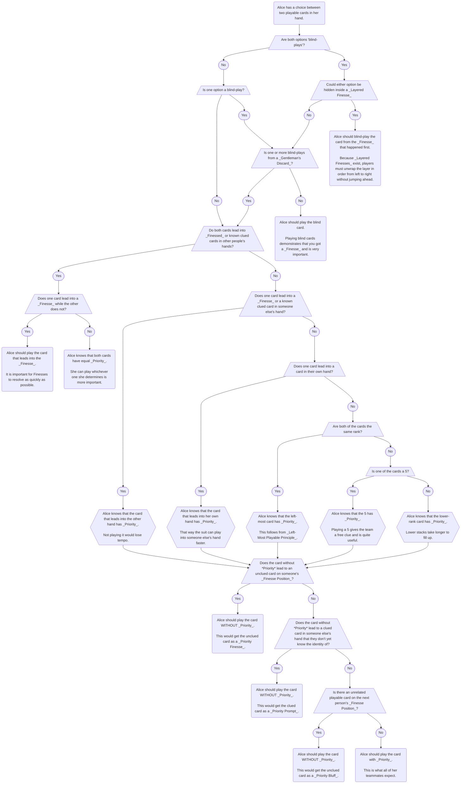

import PriorityPrompt from "./level-25/priority-prompt.yml";
import PriorityFinesse from "./level-25/priority-finesse.yml";
import PriorityBluff from "./level-25/priority-bluff.yml";
import PriorityFinesseSpecial from "./level-25/priority-finesse-special.yml";
import PriorityFinesseSpecial2 from "./level-25/priority-finesse-special-2.yml";
import PriorityIntoSomeoneElsesHand from "./level-25/priority-into-someone-elses-hand.yml";
import LoadClue from "./level-25/load-clue.yml";
import TrustFinesse from "./level-25/trust-finesse.yml";

- This level introduces _Priority_, which requires players to pay attention to the order that cards are played in.
- This can take a while to internalize, because signals from _Priority_ are easy to miss.
- Make sure that you are totally comfortable with the earlier levels before attempting to add _Priority_ to the mix.

## Special Moves

### The Priority Prompt & The Priority Finesse

- Typically, players will only have one card to play at a time. In this case, unless there is some really good clue to give, there are no decisions to be made - they just play their one playable card.
- What if a player has two or more playable cards to play? Which card should they play first?
- If one of the cards is not completely known yet (e.g. a playable 2 of unknown color), then the player might want to play that card first in order to find out exactly what it is. In general, **nothing special is triggered by players playing an unknown card.**
- On the other hand, something special **can** be triggered if a player plays a fully-known card, because they knew exactly what they were doing. Our group agrees that **playable cards should be played in a specific order**. We refer to this as _Priority_. The agreed _Priority_ is:

| Priority | Category of card                                        | Reason                                                                                                                                                                                                                                                                                                                                                                                                                       | Can Do Something Else |
| -------- | ------------------------------------------------------- | ---------------------------------------------------------------------------------------------------------------------------------------------------------------------------------------------------------------------------------------------------------------------------------------------------------------------------------------------------------------------------------------------------------------------------- | --------------------- |
| 1        | Blind-plays                                             | Demonstrating that a _Finesse_ or _Bluff_ occurred is very important.                                                                                                                                                                                                                                                                                                                                                        | ❌                    |
| 2        | Cards that lead into clued cards in someone else's hand | Otherwise, the team would lose _Tempo_.                                                                                                                                                                                                                                                                                                                                                                                      | ✔️                    |
| 3        | Cards that lead into the player's own hand              | It is bad for a suit to be "held up" on one player.                                                                                                                                                                                                                                                                                                                                                                          | ✔️                    |
| 4        | 5's                                                     | Playing a 5 gets the team a free clue.                                                                                                                                                                                                                                                                                                                                                                                       | ✔️                    |
| 5        | The lower rank card                                     | The smaller stacks are more important to fill up.                                                                                                                                                                                                                                                                                                                                                                            | ✔️                    |
| 6        | The leftmost card                                       | The leftmost card is more likely to be good.                                                                                                                                                                                                                                                                                                                                                                                 | ✔️                    |
| \*       | Unknown card                                            | Playing unknown cards helps players gain more information about their hand. Note that unknown cards do not have their own _Priority_ level because you should [apply the table to each possible identity for the unknown card](#priority-with-both-known-and-unknown-cards). (**Reminder**: playing an unknown card [almost never](#the-trust-finesse-a-priority-finesse-from-playing-an-unknown-card) triggers _Priority_.) |                       |

- If someone plays a fully-known card and the card does **not** have _Priority_, then the player must be trying to send a special message.
- Based on what card they did play, if you have any clued cards in your hand that match the next "connecting" card, it is a message that you can play it right now as a _Priority Prompt_. (This is similar to a normal _Prompt_, except instead of initiating the _Prompt_ with a clue, they initiated it with the order that they played cards.)
- For example, in a 3-player game:
  - Alice has a clued + known playable red 1 and a clued + known playable blue 2 in her hand. Bob has two clued 3s in his hand.
  - Alice plays blue 2.
  - Bob comes next. Bob knows that normally Alice had a choice and therefore were supposed to play the lowest rank card - red 1 (unless it is a blind-play, or it leads into someone's hand, or it is a 5). Alice **did not** play the card with _Priority_.
  - Bob doesn't see blue 3 in Cathy's hand. This must have been a _Priority Prompt_. Bob plays the leftmost clued 3, and it's blue 3.

<PriorityPrompt />

- Similar to a normal _Prompt_, if a _Priority Prompt_ could apply to two or more clued cards, then you should play the leftmost one.
- Similar to a normal _Prompt_, if a _Priority Prompt_ made you play the leftmost card and it was not the connecting card, then you should continuing playing clued cards until you find the connecting card.
- Alternatively, if you do not have any clued cards in your hand that connects to the card that they played, then you should play your _Finesse Position_ card as a _Priority Finesse_.
- For example, in a 3-player game:
  - Alice has a clued + known playable red 1 and a clued + known playable blue 2 in her hand.
  - Alice plays blue 2.
  - Bob comes next. Bob knows that normally, when you have a choice between two cards, you are supposed to play the lowest rank card (unless it's a blind-play, etc). Bob knows that Alice was supposed to play the red 1 instead of the blue 2. Alice **did not** play the card with _Priority_.
  - Bob sees blue 3 in Cathy's _Finesse Position_. This means that Alice in did a _Priority Finesse_ on Cathy, not on Bob. Bob does something unrelated.
  - Cathy blind-plays her _Finesse Position_ card. It is a blue 3.

<PriorityFinesse />

### The Priority Bluff

- Similar to a normal _Bluff_, it is also possible for players to perform a _Priority Bluff_.
- For example, in a 3-player game:
  - Alice has a known playable red 1 and a known playable blue 2 in her hand.
  - Alice plays blue 2.
  - Bob comes next. Bob knows that normally, when you have a choice between two cards, you are supposed to play the lowest rank card. (Unless it is a blind-play, or it leads into someone's hand, or it is a 5.) Bob does not see any blue 3's, so he knows that Alice was supposed to play the red 1 instead of the blue 2. Alice **did not** play the card with _Priority_.
  - This means that Bob must have a blue 3. Bob does not have any clued cards in his hand, so he blind-plays his _Finesse Position_ card. It is **not** the blue 3 and is instead the green 1. Bob now knows that he was _Bluffed_ and that no-one has the blue 3.

<PriorityBluff />

### The Layered Priority Finesse

- Similar to a normal _Layered Finesse_, it is also possible to initiate a _Layered Priority Finesse_ as long as the blind-playing player is not the very next person.

### The Load Clue

- First, see the section on the [Priority Prompt & The Priority Finesse](#the-priority-prompt--the-priority-finesse).
- In Hanabi, it is optimal to play cards that lead into your teammate's hands because it gains _Tempo_ and reduces bottom-deck risk. _Priority_ is optimized for the special case where the next card is on someone's _Finesse Position_. However, it is actually more common that the next card is not on _Finesse Position_. As you can imagine, a huge downside of playing with _Priority_ is that you can't play into non-_Finesse Position_ cards (or else someone would misplay).
- For this reason, we agree that if a card is visible in someone else's non-_Finesse Position_, then _Priority Finesses_ are turned off and the team is committed to give a direct clue to the next card.
- This clue is similar to a _Fix Clue_, since it fixes an impending misplay from a situation that looks like a _Priority Finesse_. But we specifically call this kind of clue a _Load Clue_ to differentiate it from a _Fix Clue_ that fixes a _Lie_ or mistake. It is a _Load Clue_ because it is loading the player who received the clue with something to do on their turn.
- For example, in a 3-player game:
  - Red 1 and blue 1 are played on the stacks.
  - Alice has a choice between playing a known red 2 or a known blue 2. The red 2 has _Priority_ because it is the leftmost card.
  - Alice plays the blue 2.
  - Bob sees that Cathy's hand is, from newest to oldest: `yellow 4, yellow 3, yellow 4, red 1, blue 3`
  - Bob sees that Cathy will think that Alice is performing a _Priority Finesse_ on the blue 3. Thus, Bob must now give a _Load Clue_ to stop the impending misplay.
  - Bob clues number 3 to Cathy.
  - Cathy is surprised - she was about to play her _Finesse Position_ card as a blue 3, but she now knows that it can't be a blue 3.
  - If this was a _Fix Clue_, Cathy might be inclined to play the card that was closest to her slot 1 (which would be the 3 on slot 2).
  - However, Cathy knows that _Load Clues_ are to be interpreted as normal _Play Clues_ instead of _Fix Clues_, so she interprets this as a normal _Chop-Focus Play Clue_ and plays blue 3 from slot 5.

<LoadClue />

- When a player receives a _Load Clue_, they are to interpret it as a normal _Play Clue_ instead of a _Fix Clue_.
- A clue is still a _Load Clue_ even if would otherwise look like a _Save Clue_. (In other words, the card promised from the _Priority_ move has to be _somewhere_.)
- _Load Clues_ are unique in that they are the only move that violates [_Information Lock Principle_](level-3.mdx#information-lock-principle). In other words, when a player realizes that they have been given a _Load Clue_, they must rewind to when the _Priority Move_ happened, delete all of their _Priority_-related notes, and then re-interpret the clue from scratch.
- If you receive a _Load Clue_, you should suspect that you might have something valuable on your chop, as this would be an excellent reason to commit the team to giving the _Load Clue_ in the first place.
- If a player has a choice between playing one card that leads nowhere and playing one card that commits the team to giving a _Load Clue_, then they are not obligated to choose one or the other - they can choose whichever one is best for the situation.

### The Paused Priority Finesse

- For the purposes of _Priority_, blind-playing a card is the most important thing to do. When players are supposed to be blind-playing a card, they are usually **not** allowed to perform a _Priority Finesse_ - they must stick to playing the blind card.
- One exception to this is if a player is in the middle of unraveling the layer of a _Layered Finesse_. Since they have already blind-played their first card in the layer, they have demonstrated that the _Finesse_ was on them, and now everyone on the team knows that the rest of the cards inside of the layer are "gotten" for sure.
- Thus, in this situation, a player can "pause" finishing up the _Layered Finesse_ and play some other clued card to perform a _Priority Finesse_. This is called a _Paused Priority Finesse_.
- Note that this only applies when the card that was blind-played was unrelated to the original _Layered Finesse_.
  - For example, if a player is finessed for both the red 1 and the red 2 and has just blind-played a green 1, then they can perform a _Priority Finesse_, because everyone on the team knows that the green 1 played as red 1 and therefore that the layer is not yet unraveled.
  - However, if a player is finessed for both the red 1 and the red 2 and has just blind-played the red 1, then they **cannot** perform a _Paused Priority Finesse_ because they haven't demonstrated to the team that they are still finessed for the red 2.

### The Trust Finesse (A Priority Finesse From Playing an Unknown Card)

- According to the _Priority_ rules, if an unknown card is played, no _Priority Finesse_ can be triggered.
- However, even though this is the case, if playing one of the cards over the other would be **extremely** suboptimal, it should still trigger a _Finesse_.
- This type of move is called a _Trust Finesse_ to distinguish it from the case where the card is globally known.
- It is also possible to perform a _Trust Prompt_, a _Trust Bluff_, and so forth.
- For example, in a 3-player game:
  - All the 1's are played on the stacks.
  - Alice has two playable cards in her hand:
    - One of the cards has a red clue on it. Since it was originally clued as a _Play Clue_, it is globally known as a red 2.
    - One of the cards has a number 2 clue on it. Since it was originally clued with a _Save Clue_, it can be any non-red 2. But it is playable because all of the 1's are already played.
  - Bob has a clued and globally known red 3 in his hand.
  - Alice knows that she is expected to play her red 2 into Bob's red 3, because that would be good teamwork.
  - Unknown from the rest of the team, Alice knows from the context of the game that her 2 must be exactly blue 2.
  - Bob has blue 3 on his _Finesse Position_.
  - Alice plays the globally unknown 2 to cause a _Trust Finesse_.

<TrustFinesse />

## Other Priority-Related Conventions

### A Priority Flowchart (for Choosing Between 2+ Playable Cards)

Priority can be confusing. Here is a flowchart that shows, in general, which card should be played when there is a choice between two cards:

### Priority with Blind-Plays

As stated above, blind-playing cards has the highest priority (because demonstrating that a _Finesse_ or _Bluff_ occurred is very important). However, cards that have an exact identity note on them do not count as "blind-plays" for the purposes of _Priority_. Specifically:

- After a _Gentleman's Discard_ or a _Baton Discard_, the other copy of the card has an exact identity note on it. Thus, it counts as "clued" for the purposes of playing into _Priority_.
- After _Elimination Notes_ have been eliminated from all but one card, the final card has an exact identity note on it. Thus, it counts as "clued" for the purposes of playing into _Priority_.

### Priority with Both Known and Unknown Cards

- To review, if a player has two playable cards, and both of them are fully-known, then they always have the ability to trigger _Priority_.
- If a player has two playable cards, and only one of them is fully-known, _Priority_ will never be triggered if they play the unknown card.
- But what if a player plays a fully-known card over an unknown card? They **can still** trigger _Priority_, but **only** if the card that was played has lower _Priority_ than **every** possibility for the unknown card.
- For example, in a 3-player game:
  - Red 2 is played on the stacks. The 1's are played on all of the other stacks.
  - Alice has a globally known red 3.
  - Alice has a 2 of unknown color. Specifically, it can be either blue 2, green 2, yellow 2, or purple 2 (from _Good Touch Principle_).
  - The rest of the team does not have any clued cards in their hands.
  - Alice knows that red 3 has lower _Priority_ than **all** of the possibilities for the 2. (All possibilities for the 2 are lower rank.)
  - Alice plays the red 3, which triggers a _Priority Finesse_ on the red 4.

<PriorityFinesseSpecial />

- For example, in a 3-player rainbow game:
  - Red 2 and rainbow 2 are played on the stacks. The 1's are played on all of the other stacks.
  - Alice has a globally known red 3.
  - Alice has a playable blue card of unknown rank. It could be either blue 2 or rainbow 3.
  - Alice knows that the red 3 has a lower _Priority_ than the blue 2 and that red 3 has a higher _Priority_ than the rainbow 3 (because the red 3 is leftmost).
  - The rest of the team does not have any clued cards in their hands.
  - Alice plays the red 3, which does not trigger a _Priority Finesse_ (because the _Priority_ of the possibilities in the superposition are mixed).

<PriorityFinesseSpecial2 />

### Situations Where Priority Does Not Apply

Priority does not always apply. Some common exceptions are listed below.

#### 1) _End-Game_

- _Priority_ is generally "turned off" in the _End-Game_, because players often need to play specific cards.
- With that said, _Priority_ can still work if a player plays a card that would be really terrible for the team otherwise.

#### 2) The 4's Priority Exception

- If a player has a known playable 5 and a known playable 4 that leads into their own hand, then according to the above _Priority_ table, the known playable 4 would have _Priority_. However, this does not make much sense, since the 5 has to be played no matter what, playing the 5 gives the team a clue back, the 4 could be distributed to someone else, and so on.
- Thus, if a player has a known playable 5 and a known playable 4 that leads into their own hand, then the 5 is said to have _Priority_.
- The _4's Priority Exception_ also applies to 3's in the rare case that there are both a 3 and a 4 and 5 of the same suit in the same hand.

#### 3) Blind-Playing Globally Known Cards

- Normally, blind-playing cards has _Priority_ over everything else.
- However, in some advanced cases, the blind-play does not need to be demonstrated to the team - everyone already has full knowledge of what is going on. In this case, players are supposed to treat the cards as clued for the purposes of finding the _Priority_. (The _Gentleman's Discard_ is the main move that this applies to.)

#### 4) "Important" Cards

- Normally, cards that are the same rank should be played from left to right.
- However, in certain situations, players can know that some **other** card is **more important** than the leftmost card. If a player plays a "more important" card, it should never trigger a "right to left" style _Priority Finesse_.
- For example, in a 3-player game:
  - In the _Early Game_, Alice clues number 2 to Bob, touching three 2's on slot 3, slot 4, and slot 5 (his chop). (This is the _2 Save_ convention.)
  - Later on in the game, all of the 1's are now played on the stacks.
  - Bob has not received any other clues since then - all of his 2's are known playable, but he has no idea what color they are.
  - Normally, Bob knows that he is supposed to play his 2's from left to right. However, he also knows that his 2 on slot 5 is the most important card out of all of them - it was the focus of the original _2 Save_ by Alice.
  - Thus, Bob plays his 2 on slot 5 first. After that, he plays the 2's from left to right like normal.

### Playing Into Someone Else's Hand

- For the purposes of playing into someone else's hand, we only consider what the very next card is, in order to keep things simple.
- For example, in a 3-player game:
  - Alice has a globally known blue 3, red 3, and red 4.
  - Bob has a globally known blue 4.
  - Cathy has a globally known red 5.
  - Here, Alice knows that when playing cards into other player's hands, she is only supposed to consider what the very next card is.
  - Thus, Alice plays the blue 3 into Bob's blue 4.

<PriorityIntoSomeoneElsesHand />

- The obvious exception to this rule is if one of the players on the team is locked. In this situation, it is better to work towards unlocking that player.
