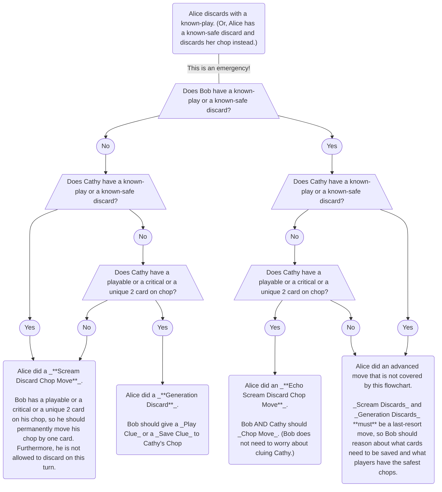

## Special Moves

### The Scream Discard Chop Move (SDCM)

- The _Chop Move_ is a tool to save multiple cards with one clue. However, sometimes you may not have a clue at all. One way to solve this situation is with a special kind of discard.
- Typically, discarding is a last resort. So, if you have a known playable card in your hand, you can send a powerful message to your teammate by discarding a card instead. This is called a _Scream Discard_. Since your teammate expected you to play, it is like screaming at them to let them know that things are very bad.
- A _Scream Discard_ does two things:
  1. The player being "screamed at" should permanently move their chop by one position.
  1. The player being "screamed at" is not allowed to discard on this turn. Instead, they must give a clue. If there are no normal _Play Clues_ or _Save Clues_ to give, then they are allowed to give "stall" clues, like a _5 Stall_. If there are no _5 Stalls_ to give, they can even just "fill-in" some information on an already-clued card (and doing this should not cause a _Finesse_).
- Players are **only allowed** to _Scream Discard_ for **cards that are playable or critical** (or a needed 2 that isn't seen anywhere else). (This follows from _Save Principle_.)
- Players are **only allowed** to _Scream Discard_ as an absolute last resort. This means _Scream Discards_ are almost always performed **while the team is at 0 clues**. (Less commonly, they can also be performed if the team is at 1 clue and the next person happens to be _Locked_.)
- Players are **not** allowed to _Scream Discard_ for cards that are _one-away-from-playable_.
- Players are **not** allowed to _Scream Discard_ if there was some other, less dangerous way to save the card. It is a "last resort" move.
- Sometimes, a player will discard with a known-playable card in their hand, but they are **not** intending a _Scream Discard_ - it is some other special situation:
  1. It is not a _Scream Discard_ if the next player **has** to generate a clue for cluing the next player after that. This is called a _Generation Discard_; see below.
  1. It is not a _Scream Discard_ when the card that the player did not play was a "blind" card from a _Finesse_ **and** the blind card could also be in the next player's _Finesse Position_.

### The Scream Discard Chop Move (With Known-Trash)

- First, see the section on the [_Scream Discard_](#the-scream-discard-chop-move-sdcm).
- Occasionally, a player will have one or more clued known-trash cards in their hand. In this situation, the player is expected to first discard their clued known-trash card(s) before discarding their chop.
- Subsequently, if a player discards their chop instead of discarding their known-trash card, it must be a signal that something is wrong. This should trigger a _Scream Discard_ in the same way that discarding chop with a known-playable card would.
- Even though this move is triggered in a separate way from a normal _Scream Discard_, we still call it a _Scream Discard_ since it is so similar.
- It is illegal for a player to discard their chop if they have both a known-playable card and a known-trash card in their hand. If a player does this, it is to be treated as a known-mistake.

### The Shout Discard Chop Move

- First, see the section on the _[Scream Discard](#the-scream-discard-chop-move-sdcm)_.
- Normally, when a player performs a _Scream Discard_, they are discarding their chop (e.g. an unknown and unclued card).
- However, if a player has both a known-playable card and a known-trash card, then discarding the known-trash card instead of playing their known-playable card can still accomplish the same thing as a _Scream Discard_. This is called a _Shout Discard_ to distinguish it from the more-ordinary case.
- In other words:
  - a _Scream Discard_ is when you send an emergency signal by discarding an unknown card when you have a known-playable card
  - a _Shout Discard_ is when you send an emergency signal by discarding a known-trash card when you have a known-playable card
- A _Shout Discard_ _Chop Moves_ the very next player in the exact way that a _Scream Discard_ does.
- A _Shout Discard_ forces the next player to **not** discard on their turn in the exact way that a _Scream Discard_ does.
- Normally, a _Scream Discard_ is only allowed to _Chop Move_ a critical card or a playable card. However, unlike a _Scream Discard_, it is permissible to use a _Shout Discard_ to _Chop Move_ any card that is desirable, even if it is not critical or playable.
- Normally, a _Scream Discard_ is only allowed if the team is at 0 clues (or if cluing the card is impossible). However, unlike a _Scream Discard_, it is permissible to use a _Shout Discard_ to _Chop Move_ regardless of the number of clues that the team has.

### The Generation Discard

- Usually, if someone discards a card instead of playing a known playable card, this would indicate a _Scream Discard Chop Move_.
- However, if playing the card (player 1) would cause the next player to discard (player 2) and the next player after that (player 3) to have a critical and/or playable card "ride" on chop, it is a very bad situation. Thus, the discard is **just** for the purposes of generating a clue so that player 2 can clue player 3.
- The _Generation Discard_ is **only** to be used as a last resort. If player 3 has something else to do (like play a card or give some obvious clue), then player 1 should just play their card and let the card "ride" on chop.

## General Principles

### A Scream Discard Flowchart

Here is a flowchart for determining whether something is a _Scream Discard Chop Move_ or a _Generation Discard_.

### Lines

- During your turn, part of figuring out the best move involves looking into the future to see what the next player will do. If they discard, will it be okay? Is there some obvious clue that they will do? And so on.
- As you get better at Hanabi, you will need to do this prediction not just for the next player, but for an entire go-around of the table. And as you really get good at Hanabi, you will need to do this for as far in the future as you can reasonably predict. (Sometimes, this means 15 moves or more in the future.)
- Similar to chess, initiating a move in which you can predict the next sequence of moves is called initiating a "line".
- In post-game reviews, we will often compare and hypothetically "play through" two different lines to see which one is better.

### The All 4's Test

- According to _Save Principle_, the team must not let any critical and/or playable cards be discarded. So part of constructing a line is figuring out whether this might happen.
- When considering a line, it is not safe to assume that a player will clue anything in your hand. You should perform the _All 4's Test_: what would everyone do if I have all useless 4's in my hand? If a critical and/or playable card would get discarded, then the line has failed the test, and it is probably a bad idea.

### Blind-Playing Chop Moved Cards

- Often times, cards are _Chop Moved_ towards the beginning of the game. Normally, once the time comes, the _Chop Moved_ card will be directly clued in order to get it to play.
- However, other times, the _Chop Moved_ card will sit there and will never be clued. As the game progresses towards the end, the player with the _Chop Moved_ card will learn more and more information about it. For example, they might accumulate a lot of negative clues on the card. Or, they might deduce that it is probably not any of the cards that are already played (which drastically reduces the possibilities towards the end of the game).
- A clever player who accumulates enough information about a _Chop Moved_ card may determine that all of the possibilities for the card are playable. In this situation, they do not have to wait for their teammates to clue the card directly - they can simply blind-play the _Chop Moved_ card and it will work, regardless of which exact card it is.
- Blind-playing cards in this manner is risky! It is fairly common for players to forgo cluing _Chop Moved_ cards directly in favor of using the other copy of the card in someone else's hand. (For example, it may be more efficient to use the non-_Chop Moved_ copy if it would be a 2-for-1 clue instead of a 1-for-1 clue.) Thus, there is always the chance that blind-playing a _Chop Moved_ card in this manner will get a strike for the team (in the case where the other copy was used or in the case where the _Chop Move_ was a mistake).
- For this reason, clever players should try to blind-play their _Chop Moved_ cards if they have a pretty good chance of being playable, but **only if the team has one or more strikes to spare**.
- Subsequently, players should **not** clue a now-useless _Chop Moved_ card to prevent a future strike. The typical strategy is to just let it be _Chop Moved_ for the rest of the game:
  - In the best case scenario, the _Chop Moved_ player will naturally figure out that the card is trash and can safely discard it. Or, alternatively, they will keep the card _Chop Moved_, but continue to discard other useless cards from their chop until the end of the game.
  - In the worst case scenario, the _Chop Moved_ player will try to blind-play the card and get a strike for the team. But this is not guaranteed, and even if they do, they will only do it if there is a strike to spare.
